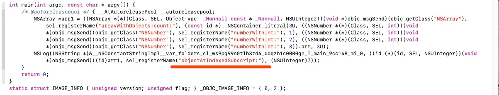

[iOS-APP-运行时防Crash工具XXShield练就](https://www.jianshu.com/p/f18876bbe2c4)
Demo - **[XXShield Star 600+](https://github.com/ValiantCat/XXShield)**

[AvoidCrash -- 远离常见的崩溃](https://www.jianshu.com/p/b7a7ae0c9243)
Demo - **[AvoidCrash Star 1200+](https://github.com/chenfanfang/AvoidCrash)**

[Baymax：网易iOS App运行时Crash自动防护实践](https://mp.weixin.qq.com/s?__biz=MzUxMzcxMzE5Ng==&mid=2247488311&amp;idx=1&amp;sn=0db090c8d4a5efafa47f00af4b3f174f&source=41#wechat_redirect)


[iOS防止崩溃机制以及底层原理](https://blog.csdn.net/goodluckwujie/article/details/84255814)

[iOS中如何防止程序crash](https://www.jianshu.com/p/81cf5dd74286)

Demo - [LSSafeProtector Star 500+](https://github.com/lsmakethebest/LSSafeProtector)


[JJException Star 800+](https://github.com/jezzmemo/JJException)


[iOS 降低 NSArray Crash 风险](https://www.jianshu.com/p/794d42de0aaf)


[**微信团队分享：iOS版微信是如何防止特殊字符导致的炸群、APP崩溃的？**](http://www.52im.net/thread-1449-1-1.html)


[iOS中类簇的使用](https://juejin.im/entry/5bd955fe6fb9a022433c38aa/)


[Baymax：网易iOS App运行时Crash自动防护实践](https://mp.weixin.qq.com/s?__biz=MzUxMzcxMzE5Ng==&mid=2247488311&idx=1&sn=0db090c8d4a5efafa47f00af4b3f174f&source=41#wechat_redirect)


集合类崩溃

KVC崩溃 

-- [iOS 开发：『Crash 防护系统』（三）KVC 防护](https://bujige.net/blog/iOS-YSCDefender-03.html?utm_source=tuicool&utm_medium=referral)

KVO崩溃


## 一、[NSArray](https://developer.apple.com/documentation/foundation/nsarray?language=objc)

### 1.1、找到NSArray崩溃方法有哪些？？

#### 1.1.1、测试NSArray方法

```
//===========
// 创建数组
//===========
    // 崩溃 -[__NSPlaceholderArray initWithObjects:count:]: attempt to insert nil object from objects[0]
    NSString *string = nil;
    NSArray *arr1 = @[@"1",@"2",string];

    NSArray *temp = nil;
    NSArray *arr2 = [NSArray arrayWithArray:temp];
    
    // 崩溃 -[__NSPlaceholderArray initWithObjects:count:]: attempt to insert nil object from objects[0]
    NSArray *arr3 = [NSArray arrayWithObject:nil];
    
    NSArray *arr4 = [NSArray arrayWithObjects:nil];
    
    NSString *strings[3];
    strings[0] = @"First";
    strings[1] = nil;
    strings[2] = @"Third";
    NSArray *arr5 = [NSArray arrayWithObjects:strings count:3];
```


```
//===========
// 初始化数组
//===========
    NSArray *arr6 = [[NSArray alloc] init];
    
    NSArray *arr7 = [[NSArray alloc] initWithArray:nil];
    
    NSArray *arr8 = [[NSArray alloc] initWithArray:nil copyItems:YES];
    
    NSArray *arr9 = [[NSArray alloc] initWithObjects:@"2",@"3", nil];
    
    NSString *strings[3];
    strings[0] = @"First";
    strings[1] = nil;
    strings[2] = @"Third";
    NSArray *arr10 = [[NSArray alloc] initWithObjects:strings count:3];
```


```
//===========
// Querying an Array
//===========
    NSArray *arr11 = @[@"1", @"2"];
    
    [arr11 containsObject:nil];
    
    arr11.count;
    
    // - getObjects: range:   不常用
    NSArray *mArray = @[@"1",@"2",@"3",@"4",@"5",@"6"];
    id *objects;
    NSRange range = NSMakeRange(2, 4);
    objects = malloc(sizeof(id) * range.length);
    [mArray getObjects:objects range:range];
    for (i = 0; i < range.length; i++) {
        NSLog(@"objects: %@", objects[i]);
    }
    free(objects);
    
    NSArray *arr12 = nil;
    id a = arr12.firstObject;
    id b = arr12.lastObject;
    
    // 崩溃 -[__NSArrayI objectAtIndex:]: index 3 beyond bounds [0 .. 1]
    [arr11 objectAtIndex:3];

    // 崩溃 -[__NSArrayI objectAtIndexedSubscript:]: index 3 beyond bounds [0 .. 1]
    [arr11 objectAtIndexedSubscript:3];
     
    // 崩溃 -[NSArray objectsAtIndexes:]: index 9 in index set beyond bounds [0 .. 3]
    NSIndexSet *se = [NSIndexSet indexSetWithIndex:9];
//或   NSIndexSet *se = [NSIndexSet indexSetWithIndexesInRange:NSMakeRange(2, 9)];
    NSArray *test = [arr11 objectsAtIndexes:se];
    
    // - objectEnumerator
    // - reverseObjectEnumerator
    // 返回一个枚举器对象，该对象允许您以 正序/逆序 访问数组中的每个对象。
    NSEnumerator *enumerator = [arr11 objectEnumerator];
    id anObject;
    while (anObject = [enumerator nextObject]) {
        // code to act on each element as it is returned
        NSLog(@"%@", anObject);
    }
    
    NSEnumerator *reverseEnumerator = [arr11 reverseObjectEnumerator];
    id anreverseObject;
    while (anreverseObject = [reverseEnumerator nextObject]) {
        // code to act on each element as it is returned
        NSLog(@"%@", anreverseObject);
    }
```


#### 1.1.2、NSArray崩溃方法总结

```
@[];
+ arrayWithObject:
+ arrayWithObjects: count:
- initWithObjects: count:
arr[10];
- objectAtIndex:
- objectAtIndexedSubscript:
- objectsAtIndexes:
- getObjects: range:
```


### 1.2、`@[];` 底层如何创建

> clang -rewrite-objc main.m
>
> **结论：经过`clang`，可以发现`@[]`这种方式创建的数组是通过发送消息给`NSArray`执行`arrayWithObjects:count:`这个方法来创建的数组。**

```
int main(int argc, const char * argv[]) {
    @autoreleasepool {
        NSString *str11 = nil;
        NSArray *arr11 = @[@"1",@"2",str11];
    }
    return 0;
}
```

如下图：


### 1.3、`array[10];`底层调用

> **结论：经过`clang`，可以发现`array[10]`这种方式创建的数组是通过发送消息给`NSArray`执行`objectAtIndexedSubscript:`这个方法来创建的数组。**

```
int main(int argc, const char * argv[]) {
    @autoreleasepool {
        NSArray *arr1 = @[@1, @2, @3];
        NSLog(@"%@", arr1[7]);
    }
    return 0;
}
```

如下图：




### 1.4、NSArray类簇

[从NSArray看类簇](http://www.cocoachina.com/articles/10696)

[类簇，从NSArray说起](https://www.aopod.com/2017/02/24/class-clusters/)

http://www.manongjc.com/article/56380.html

https://blog.csdn.net/likui1989/article/details/79867449

```
// 类继承关系
// __NSArrayI                 继承于 NSArray
// __NSSingleObjectArrayI     继承于 NSArray
// __NSArray0                 继承于 NSArray
// __NSFrozenArrayM           继承于 NSArray
// __NSArrayM                 继承于 NSMutableArray
// __NSCFArray                继承于 NSMutableArray
// NSMutableArray             继承于 NSArray
// NSArray                    继承于 NSObject


Class __NSPlaceholderArray = NSClassFromString(@"__NSPlaceholderArray");
Class __NSArray0 = NSClassFromString(@"__NSArray0");
Class __NSSingleObjectArrayI = NSClassFromString(@"__NSSingleObjectArrayI");
Class __NSArrayI = NSClassFromString(@"__NSArrayI");
Class __NSFrozenArrayM = NSClassFromString(@"__NSFrozenArrayM");  // 不知道如何触发
  
/** 解释
	__NSPlaceholderArray   // [NSArray alloc]; alloc后所得到的类
	__NSArray0             // 当init为一个空数组后，变成了__NSArray0
	__NSSingleObjectArrayI // 如果有且仅有一个元素，那么为__NSSingleObjectArrayI
	__NSArrayI             // 如果数组大于一个元素，那么为__NSArrayI
 */
  
// 验证
NSArray *placeholder = [NSArray alloc];                     // __NSPlaceholderArray
NSArray *arr1 = [placeholder init];                         // __NSArray0
NSArray *arr2 = [placeholder initWithObjects:@0, nil];      // __NSSingleObjectArrayI
NSArray *arr3 = [placeholder initWithObjects:@0, @1, nil];  // __NSArrayI

__NSFrozenArrayM    NSMutableArray用copy修饰之后，在使用addObjectsFromArray方法时崩溃
```


## 二、[NSMutableArray](https://developer.apple.com/documentation/foundation/nsmutablearray?language=objc)

### 2.1、找到NSMutableArray崩溃方法有哪些？？

#### 2.1.1、测试NSMutableArray方法

```
//===========
// 0.NSMutableArray 继承 NSArray 方法
//===========
		// 崩溃 -[__NSPlaceholderArray initWithObjects:count:]: attempt to insert nil object from objects[0]
    NSMutableArray *mArr30 = [NSMutableArray arrayWithObject:nil];
    
    // 崩溃 -[__NSPlaceholderArray initWithObjects:count:]: attempt to insert nil object from objects[1]
    NSString *strings[3];
    strings[0] = @"First";
    strings[1] = nil;
    strings[2] = @"Third";
    NSMutableArray *mArr31 = [NSMutableArray arrayWithObjects:strings count:3];
    
    // 崩溃 -[__NSPlaceholderArray initWithObjects:count:]: attempt to insert nil object from objects[1]
    NSString *strings1[3];
    strings1[0] = @"First";
    strings1[1] = nil;
    strings1[2] = @"Third";
    NSMutableArray *mArr32 = [[NSMutableArray alloc] initWithObjects:strings1 count:3];
    
    
    NSMutableArray *mArr0 = [NSMutableArray arrayWithArray:@[@"1",@"2"]];
    // 崩溃 -[__NSArrayM objectAtIndexedSubscript:]: index 3 beyond bounds [0 .. 1]
    mArr0[3];
    
    // 崩溃 -[__NSArrayM objectAtIndex:]: index 3 beyond bounds [0 .. 1]
    [mArr0 objectAtIndex:3];
    
    // 崩溃 -[__NSArrayM objectAtIndexedSubscript:]: index 3 beyond bounds [0 .. 1]
    [mArr0 objectAtIndexedSubscript:3];
    
    // 崩溃 -[NSArray objectsAtIndexes:]: index 10 in index set beyond bounds [0 .. 1]
    NSIndexSet *se = [NSIndexSet indexSetWithIndexesInRange:NSMakeRange(2, 9)];
    NSArray *test = [mArr0 objectsAtIndexes:se];
    
    // 崩溃 -[__NSArrayM getObjects:range:]: range {0, 11} extends beyond bounds [0 .. 1]
    NSRange range0 = NSMakeRange(0, 11);
    __unsafe_unretained id cArray[range0.length];
    [mArr0 getObjects:cArray range:range0];
    
```


```
//===========
// 1.Creating and Initializing a Mutable Array
//===========
    NSMutableArray *mArr1 = [NSMutableArray arrayWithCapacity:0];  // NSUInteger   -1 崩溃
    
    NSMutableArray *mArr2 = [NSMutableArray arrayWithContentsOfFile:nil];
    
    NSMutableArray *mArr3 = [NSMutableArray arrayWithContentsOfURL:[NSURL URLWithString:nil]];
    
    NSMutableArray *mArr4 = [[NSMutableArray alloc] init];
    
    NSMutableArray *mArr5 = [[NSMutableArray alloc] initWithCapacity:0];

    NSMutableArray *mArr6 = [[NSMutableArray alloc] initWithContentsOfFile:nil];

    NSMutableArray *mArr7 = [[NSMutableArray alloc] initWithContentsOfURL:nil];
```


```
//===========
// 2.Adding Objects
//===========
    NSMutableArray *mArr8 = [[NSMutableArray alloc] init];
    // 崩溃 -[__NSArrayM insertObject:atIndex:]: object cannot be nil
    [mArr8 addObject:nil];
    
    NSArray *arr1 = nil;
    [mArr8 addObjectsFromArray:arr1];

    // 崩溃 -[__NSArrayM insertObject:atIndex:]: object cannot be nil
    [mArr8 insertObject:nil atIndex:7];
    // 崩溃 -[__NSArrayM insertObject:atIndex:]: index 7 beyond bounds for empty array
    [mArr8 insertObject:@"1" atIndex:7];
    
    // 崩溃 -[NSMutableArray insertObjects:atIndexes:]: index 3 in index set beyond bounds [0 .. 2]'
    // 1. 序号要小于等于mArr8最大值
    NSArray *array = [NSArray arrayWithObjects:@"q",@"d",@"e", nil];  // 2.插入的数组可以为nil
    NSRange range = NSMakeRange(1, [array count]);
    NSIndexSet *indexSet = [NSIndexSet indexSetWithIndexesInRange:range];
    [mArr8 insertObjects:array atIndexes:indexSet];
```


```
//===========
// 3.Removing Objects
//===========
    NSMutableArray *mArr10 = [[NSMutableArray alloc] init];

    [mArr10 removeAllObjects];

    [mArr10 removeLastObject];

    [mArr10 removeObject:@"1"];
    [mArr10 removeObject:nil];

    // 崩溃 -[__NSArrayM removeObjectsInRange:]: range {1, 2} extends beyond bounds for empty array
    [mArr10 removeObjectsInRange:NSMakeRange(1, 2)];

    // 崩溃 -[__NSArrayM removeObjectsInRange:]: range {2, 1} extends beyond bounds for empty array
    [mArr10 removeObjectAtIndex:2];
    
    // 崩溃 -[NSMutableArray removeObjectsAtIndexes:]: index 4 in index set beyond bounds for empty array
    NSRange range1 = NSMakeRange(1, 4);
    NSIndexSet *indexSet1 = [NSIndexSet indexSetWithIndexesInRange:range1];
    [mArr10 removeObjectsAtIndexes:indexSet1];
    
    
    [mArr10 removeObjectIdenticalTo:@"1"];

    // 崩溃  -[NSMutableArray removeObjectIdenticalTo:inRange:]: range {2, 4} extends beyond bounds for empty array
    [mArr10 removeObjectIdenticalTo:@"1" inRange:NSMakeRange(2, 4)];

    [mArr10 removeObjectsInArray:@[@"1",@"2"]];
    [mArr10 removeObjectsInArray:nil];

    // 崩溃 -[__NSArrayM removeObjectsInRange:]: range {1, 3} extends beyond bounds for empty array
    [mArr10 removeObjectsInRange:NSMakeRange(1, 3)];
```


```
//===========
// 4.Replacing Objects
//===========
    NSMutableArray *mArr11 = [[NSMutableArray alloc] init];

    // 崩溃 -[__NSArrayM replaceObjectAtIndex:withObject:]: object cannot be nil
    [mArr11 replaceObjectAtIndex:2 withObject:nil];
    // 崩溃 -[__NSArrayM replaceObjectAtIndex:withObject:]: index 2 beyond bounds for empty array
    [mArr11 replaceObjectAtIndex:2 withObject:@"2"];

    // 崩溃 -[__NSArrayM setObject:atIndexedSubscript:]: object cannot be nil
    [mArr11 setObject:nil atIndexedSubscript:2];
     // 崩溃 -[__NSArrayM setObject:atIndexedSubscript:]: index 2 beyond bounds for empty array
    [mArr11 setObject:@"1" atIndexedSubscript:2];

    NSRange range2 = NSMakeRange(1, 4);
    NSIndexSet *indexSet2 = [NSIndexSet indexSetWithIndexesInRange:range2];
    // 崩溃 -[NSMutableArray replaceObjectsAtIndexes:withObjects:]: index 4 in index set beyond bounds for empty array
    [mArr11 replaceObjectsAtIndexes:indexSet2 withObjects:nil];
    // 崩溃 -[NSMutableArray replaceObjectsAtIndexes:withObjects:]: index set cannot be nil
    [mArr11 replaceObjectsAtIndexes:nil withObjects:@[@"1"]];
    
    // 崩溃 -[NSMutableArray replaceObjectsInRange:withObjectsFromArray:]: range {1, 3} extends beyond bounds for empty array
    [mArr11 replaceObjectsInRange:NSMakeRange(1, 3) withObjectsFromArray:nil];
    NSMutableArray *mArr12 = [NSMutableArray arrayWithArray:@[@"a",@"b",@"c"]];
    [mArr12 replaceObjectsInRange:NSMakeRange(0, 2) withObjectsFromArray:nil];
    NSMutableArray *mArr13 = [NSMutableArray arrayWithArray:@[@"a",@"b",@"c"]];
    [mArr13 replaceObjectsInRange:NSMakeRange(0, 2) withObjectsFromArray:@[@"1",@"2",@"3",@"3",@"3"]];

    // 要判断两个range是否越界
    // 崩溃 -[NSMutableArray replaceObjectsInRange:withObjectsFromArray:range:]: range {0, 3} extends beyond bounds for empty array
    NSMutableArray *mArr14 = [NSMutableArray arrayWithArray:@[@"a",@"b",@"c"]];
    [mArr14 replaceObjectsInRange:NSMakeRange(0, 3) withObjectsFromArray:@[@"1"] range:NSMakeRange(0, 1)]; 
    
    NSMutableArray *mArr15 = [[NSMutableArray alloc] init];
    [mArr15 setArray:nil];
    [mArr15 setArray:@[@"1"]];
```


#### 2.1.2、NSMutableArray崩溃方法总结

```
//===========
// NSMutableArray 继承 NSArray，所以也继承了一些崩溃方法
//===========
    @[];
    + arrayWithObject:
    + arrayWithObjects: count:
    - initWithObjects: count:
    arr[10];
    - objectAtIndex:
    - objectAtIndexedSubscript:
    - objectsAtIndexes:
    - getObjects: range:
    
//===========
// 2.Adding Objects
//===========
    - addObject:
    - insertObject: atIndex:
    - insertObjects: atIndexes:
    
//===========
// 3.Removing Objects
//===========
    - removeObject: InRange:
    - removeObjectAtIndex:
    - removeObjectsAtIndexes:
    - removeObjectIdenticalTo: inRange:
    - removeObjectsInRange: 
    
//===========
// 4.Replacing Objects
//===========
    - replaceObjectAtIndex: withObject:
    - setObject: atIndexedSubscript:
    - replaceObjectsAtIndexes: withObjects:
    - replaceObjectsInRange: withObjectsFromArray: 
		- replaceObjectsInRange: withObjectsFromArray: range:
```


## 三、[NSDictionary](https://developer.apple.com/library/prerelease/ios/documentation/Cocoa/Reference/Foundation/Classes/NSDictionary_Class/index.html)

### 3.1、NSDictionary类簇

```
// 类继承关系
// __NSDictionaryI              继承于 NSDictionary
// __NSSingleEntryDictionaryI   继承于 NSDictionary
// __NSDictionary0              继承于 NSDictionary
// __NSFrozenDictionaryM        继承于 NSDictionary
// __NSDictionaryM              继承于 NSMutableDictionary
// __NSCFDictionary             继承于 NSMutableDictionary
// NSMutableDictionary          继承于 NSDictionary
// NSDictionary                 继承于 NSObject
```


