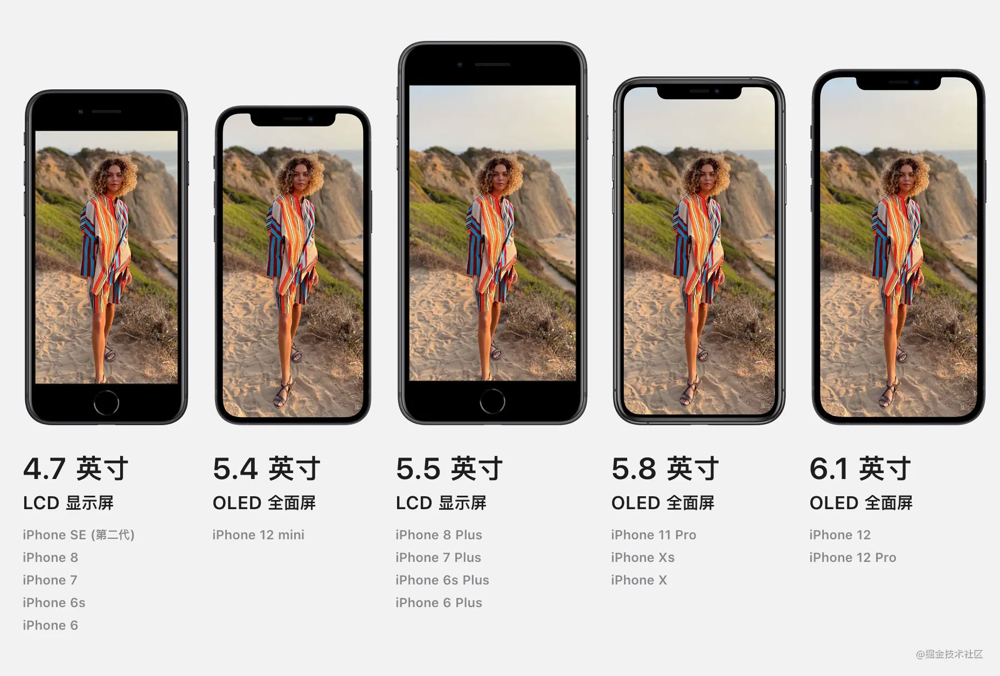
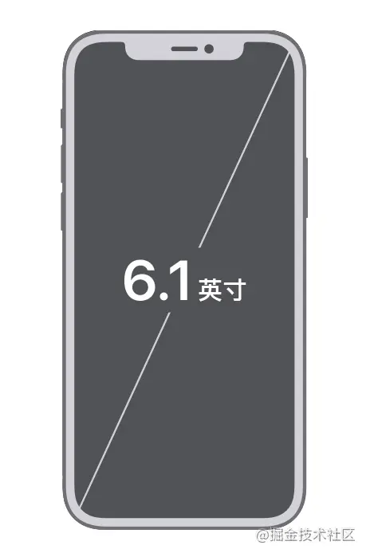
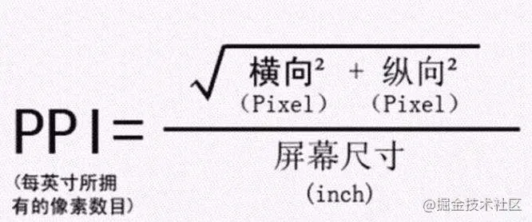

https://blog.csdn.net/Ever69/article/details/120230952

[flutter_screenutil](https://pub.dev/packages/flutter_screenutil)

[屏幕尺寸](https://juejin.cn/post/6992595716820434981)

## 屏幕尺寸

> ​		屏幕尺寸大小是用户非常关键的一个指标。如上所示，苹果官网在最明显的位置标明了各个机型的屏幕尺寸。屏幕尺寸一般用屏幕对角线的物理长度表示，单位为英寸。所以获取屏幕尺寸最直接的方式就是用尺子来量屏幕的对角线长度。

注：英寸是一个绝对的物理单位，1英寸（inch）=2.54厘米（cm）。

## 分辨率&物理像素

## PPI - 像素密度

Pixels Per Inch（PPI）也叫像素密度，所表示的是每英寸所拥有的像素数量，PPI值越高，画面的细节就会越丰富。
