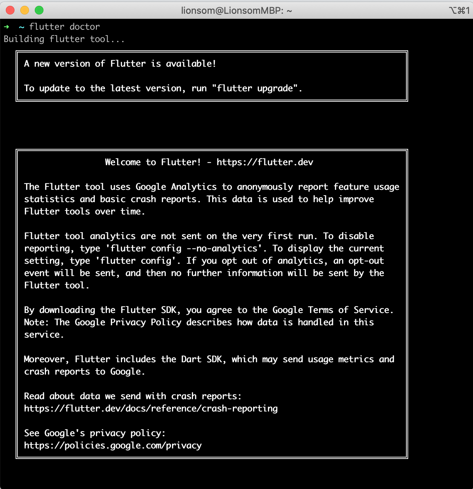
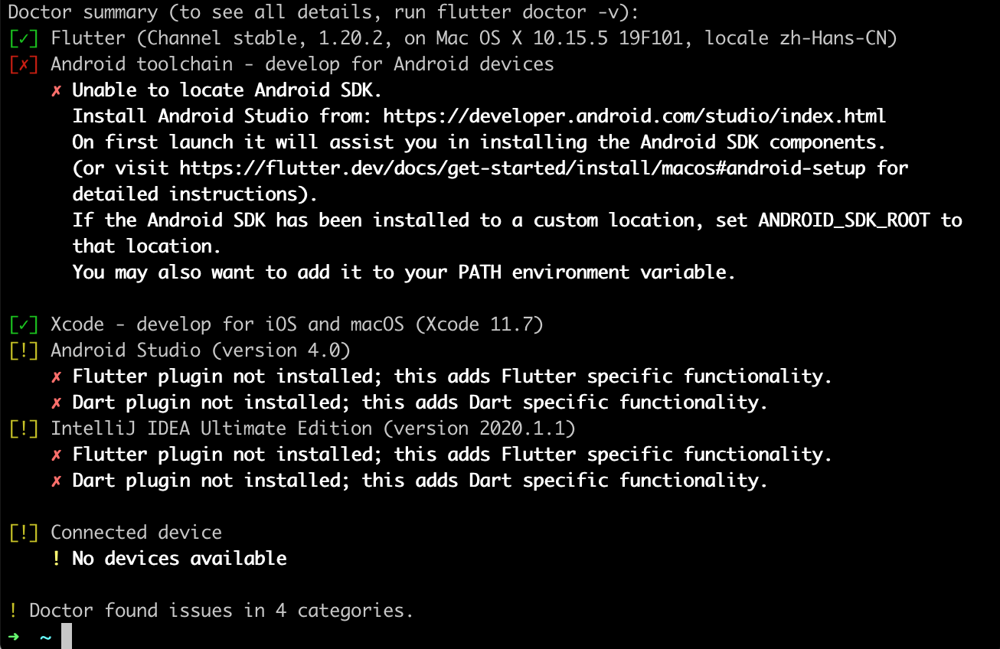
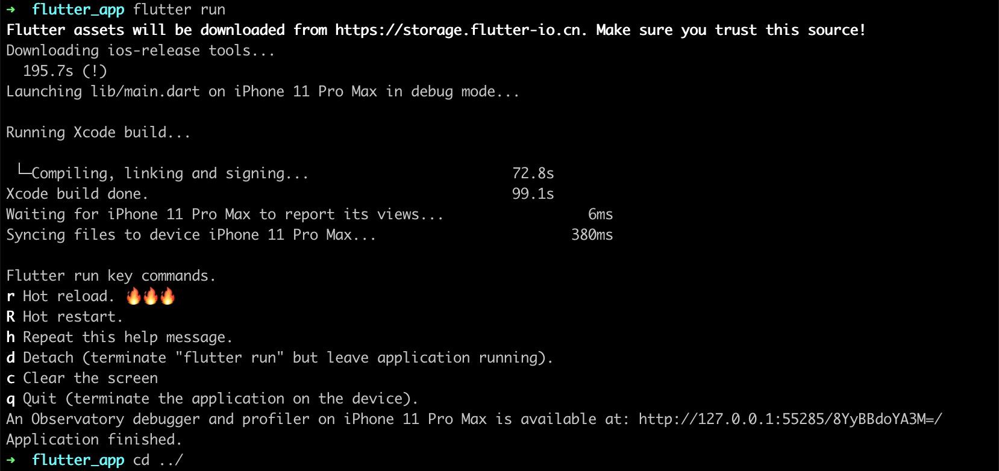
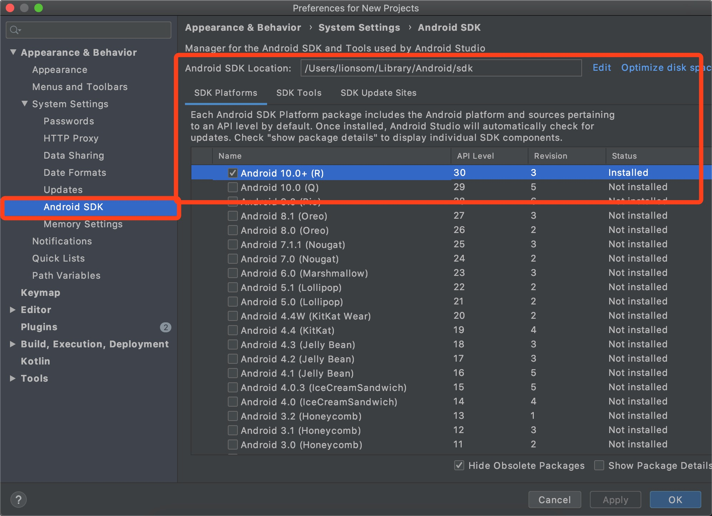
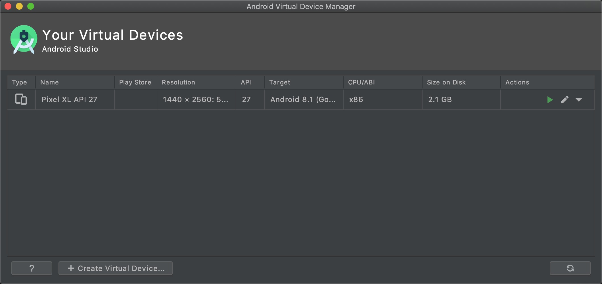

# 网站

[https://flutter.dev](https://flutter.dev/)

[Flutter SDK releases](https://flutter.dev/docs/development/tools/sdk/releases)

[Flutter SDK releases in Github](https://github.com/flutter/flutter/releases)


[Flutter中文网](https://flutterchina.club/)

[Flutter中文社区](https://flutter.cn/)

[【书籍】Flutter实战](https://book.flutterchina.club/)


# 一、[在macOS上搭建Flutter开发环境](https://flutterchina.club/setup-macos/)

## 1、系统要求

要安装并运行Flutter，您的开发环境必须满足以下最低要求:

- **操作系统**: macOS (64-bit)
- **磁盘空间**: 700 MB (不包括Xcode或Android Studio的磁盘空间）
- 工具 : Flutter 依赖下面这些命令行工具.
  - `bash`, `mkdir`, `rm`, `git`, `curl`, `unzip`, `which`

## 2、使用镜像（翻墙忽略此步）

由于在国内访问Flutter有时可能会受到限制，Flutter官方为中国开发者搭建了临时镜像，大家可以将如下环境变量加入到用户环境变量中：

```
export PUB_HOSTED_URL=https://pub.flutter-io.cn
export FLUTTER_STORAGE_BASE_URL=https://storage.flutter-io.cn
```

**注意：** 此镜像为临时镜像，并不能保证一直可用，读者可以参考详情请参考 [Using Flutter in China](https://github.com/flutter/flutter/wiki/Using-Flutter-in-China) 以获得有关镜像服务器的最新动态。

## 3、Flutter SDK 获取

* 去flutter官网下载其最新可用的安装包，[转到下载页](https://flutter.io/sdk-archive/#macos) 。

  将文件解压到目标路径, 比如:

  ```
  $ cd ~/development
  $ unzip ~/Downloads/flutter_macos_1.20.2-stable.zip
  ```

* 读者也可以去Flutter github项目下去下载安装包，[转到下载页](https://github.com/flutter/flutter/releases) 。

* 拉取github代码：[Flutter Github](https://github.com/flutter/flutter.git)

  ```
  $ git clone https://github.com/flutter/flutter.git
  
  // 拉取完成后，查看当前分支
  $ git branch  /  git branch -a 
  
  // 将远程stable分支拉取到本地
  $ git checkout -b stable origin/stable
  
  // 本地分支切换
  $ git checkout stable
  ```

* 添加`flutter`相关工具到path中：

  ```
  $ vim .zshrc
  
  // add by linx for flutter
  export PATH=`pwd`/flutter/bin:$PATH
  
  $ source .zshrc
  $ which flutter
  ```

#### Flutter SDK 分支

Flutter SDK有多个分支，如beta、dev、master、stable，其中stable分支为稳定分支（日后有新的稳定版本发布后可能也会有新的稳定分支，如1.0.0），dev和master为开发分支，安装flutter后，你可以运行`flutter channel`查看所有分支，如笔者本地运行后，结果如下：

```
Flutter channels:
  beta
  dev
* master
```

带"*"号的分支即你本地的Flutter SDK 跟踪的分支，要切换分支，可以使用`flutter channel beta` 或 `flutter channel master`，Flutter官方建议跟踪稳定分支，但你也可以跟踪`master`分支，这样可以查看最新的变化，但这样稳定性要低的多。

```
$ flutter channel beta    
// 等同于git 切换分支
$ git checkout stable
```


## 4、升级Flutter

要更新现有版本的Flutter，请参阅[升级Flutter](https://flutterchina.club/upgrading/)。

#### 升级Flutter SDK和依赖包

要升级flutter sdk，只需一句命令：

```shell
flutter upgrade
```

该命令会同时更新Flutter SDK和你的flutter项目依赖包。如果你只想更新项目依赖包（不包括Flutter SDK），可以使用如下命令：

- `flutter packages get`获取项目所有的依赖包。
- `flutter packages upgrade` 获取项目所有依赖包的最新版本。


## 5、运行 flutter doctor

运行以下命令查看是否需要安装其它依赖项来完成安装：

```
$ flutter doctor
```

该命令检查您的环境并在终端窗口中显示报告。Dart SDK已经在捆绑在Flutter里了，没有必要单独安装Dart。


### 【注意】

> 第一次运行flutter指令，会安装Dart SDK。
>
> 但卡在了 `Building flutter tool...` ，解决办法：添加了国内镜像，再运行即可。







# 二、iOS设置

## 1、安装Xcode

* AppStore即可

* 安装命令行工具：

  ```xcode-select --install
  ➜  xcode-select --install
  ```

## 2、iOS模拟器运行

### 第一步：打开模拟器

```
➜  open -a Simulator
```

### 第二步：查看可用模拟器

```
➜  ~ flutter emulators
Waiting for another flutter command to release the startup lock...
1 available emulator:

apple_ios_simulator • iOS Simulator • Apple • ios

To run an emulator, run 'flutter emulators --launch <emulator id>'.
To create a new emulator, run 'flutter emulators --create [--name xyz]'.

You can find more information on managing emulators at the links below:
  https://developer.android.com/studio/run/managing-avds
  https://developer.android.com/studio/command-line/avdmanager
```

### 第三步：命令行创建项目

* 创建 `flutter create my_first`

```
➜  AndroidStudioProjects flutter create my_first
Creating project my_first...
  my_first/ios/Runner.xcworkspace/contents.xcworkspacedata (created)
  my_first/ios/Runner.xcodeproj/xcshareddata/xcschemes/Runner.xcscheme (created)
  ......(省略)......
  my_first/.idea/workspace.xml (created)
Running "flutter pub get" in my_first...                            1.4s
Wrote 71 files.

All done!
[✓] Flutter: is fully installed. (Channel stable, 1.20.2, on Mac OS X 10.15.5 19F101, locale zh-Hans-CN)
[✓] Android toolchain - develop for Android devices: is fully installed. (Android SDK version 30.0.2)
[✓] Xcode - develop for iOS and macOS: is fully installed. (Xcode 11.7)
[✓] Android Studio: is fully installed. (version 4.0)
[!] IntelliJ IDEA Ultimate Edition: is partially installed; more components are available. (version 2020.1.1)
[✓] Connected device: is fully installed. (1 available)

Run "flutter doctor" for information about installing additional components.

In order to run your application, type:

  $ cd my_first
  $ flutter run

Your application code is in my_first/lib/main.dart.
```

###  第四步：运行 `flutter run` 

> **【提示】第一次运行模拟器，会非常慢！！！因为要安装一些必备的工具！**




## 3、iOS真机运行

要将您的Flutter应用安装到iOS真机设备，您需要一些额外的工具和一个Apple帐户，您还需要在Xcode中进行设置。

1. 安装 [homebrew](http://brew.sh/) （如果已经安装了brew,跳过此步骤）.

2. 打开终端并运行这些命令来安装用于将Flutter应用安装到iOS设备的工具

   ```commandline
   brew update
   brew install --HEAD libimobiledevice
   brew install ideviceinstaller ios-deploy cocoapods
   pod setup
   ```

如果这些命令中的任何一个失败并出现错误，请运行brew doctor并按照说明解决问题.

1. 遵循Xcode签名流程来配置您的项目:
   1. 在你Flutter项目目录中通过 `open ios/Runner.xcworkspace` 打开默认的Xcode workspace.
   2. 在Xcode中，选择导航面板左侧中的`Runner`项目
   3. 配置证书（iOS开发都懂）

2. 运行启动您的应用程序 `flutter run`.


# 三、Android设置

## 1、安装Android SDK

1. 下载并安装 [Android Studio](https://developer.android.com/studio/index.html)
2. 启动Android Studio，然后执行“Android Studio安装向导”。这将安装最新的Android SDK，Android SDK平台工具和Android SDK构建工具，这是Flutter为Android开发时所必需的。




### Android license status unknown.

```
[!] Android toolchain - develop for Android devices (Android SDK version 29.0.3)
    ✗ Android license status unknown.
      Try re-installing or updating your Android SDK Manager.
      See https://developer.android.com/studio/#downloads or visit visit https://flutter.dev/docs/get-started/install/macos#android-setup for detailed instructions.
```


暂未找到原因


## 2、安装插件

* `Flutter`插件： 支持Flutter开发工作流 (运行、调试、热重载等).
* `Dart`插件： 提供代码分析 (输入代码时进行验证、代码补全等).

```
启动Android Studio.
打开插件首选项 (Preferences>Plugins on macOS, File>Settings>Plugins on Windows & Linux).
选择 Browse repositories…, 选择 Flutter 插件并点击 install.
重启Android Studio后插件生效.
```


## 3、Android模拟器运行

### 第一步：创建Android模拟器



### 第二步：查看可用模拟器

```
➜  flutter emulators
```

### 第三步：命令行创建项目

```
➜  flutter create my_first
```

### 第四步：运行 `flutter run` 

```
  $ cd my_demo_01
  $ flutter run
```

> **【提示】第一次运行模拟器，会非常慢！！！因为要安装一些必备的工具！**


## 4、Android真机运行

没有真机，暂时不测！

