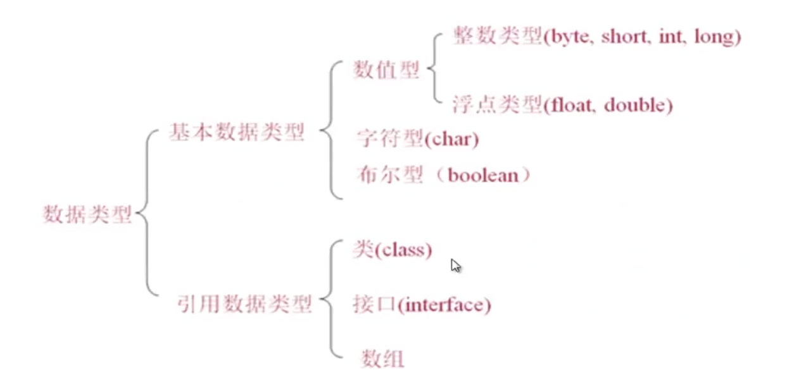
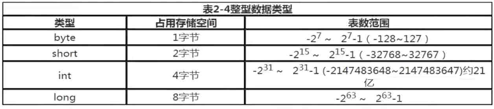
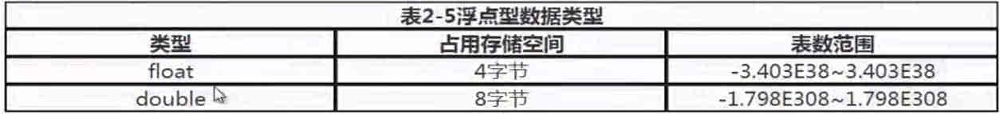
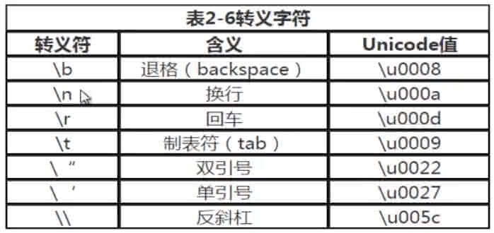
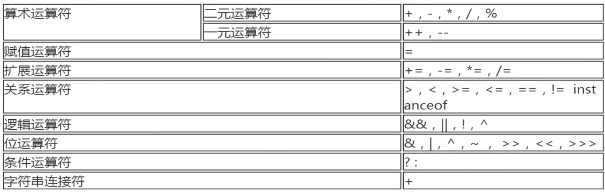
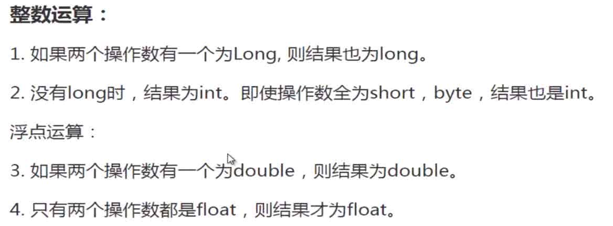
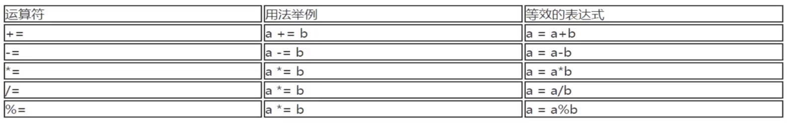
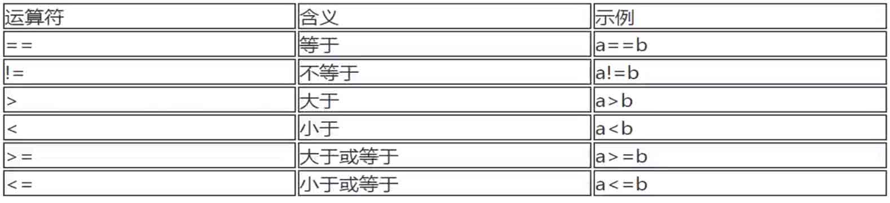
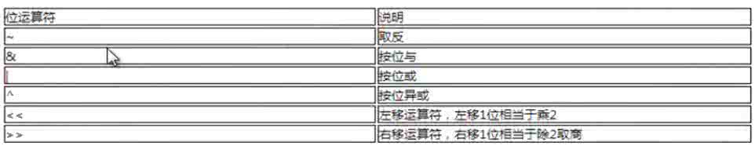
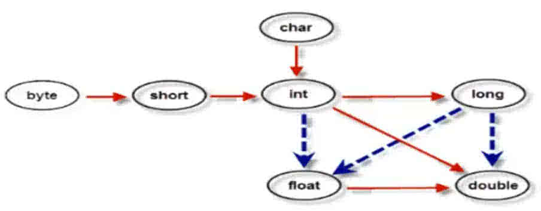

# Java 简介

Java是由Sun Microsystems公司于1995年5月推出的Java面向对象程序设计语言和Java平台的总称。由James Gosling和同事们共同研发，并在1995年正式推出。

Java分为三个体系：

- JavaSE（J2SE）（Java2 Platform Standard Edition，java平台标准版）
- JavaEE(J2EE)(Java 2 Platform,Enterprise Edition，java平台企业版)
- JavaME(J2ME)(Java 2 Platform Micro Edition，java平台微型版)。

2005年6月，JavaOne大会召开，SUN公司公开Java SE 6。此时，Java的各种版本已经更名以取消其中的数字"2"：J2EE更名为Java EE, J2SE更名为Java SE，J2ME更名为Java ME。


## Java应用运行机制

计算机高级语言主要有『编译型』和『解释型』，Java语言是这两种的结合。

``` 
源文件(*.java) -> Java编译器(javac) -> 字节码文件(*.class) -> JRE[类装载器 -> 字节码校验 -> 解释器] -> 系统平台
```


## JVM、JRE、JDK

JVM（Java Virtual Mechine）：Java虚拟机。

JRE（Java Runtime Environment）：Java运行环境，包含：Java虚拟机、库函数、运行Java程序必须的文件。

JDK（Java Development Kit）：Java开发工具包，包含JRE、编译器、调试器等用于程序开发的文件。

* 如果只要运行Java程序，只需要JRE即可。
* 如果开发Java程序，就需要安装JDK。


## 跨平台

> 因为有了虚拟机，来适配不同的平台。

```
																					  JVM for Unix
源文件(*.java) -> 字节码文件(*.class) ------> JVM for Windows
																					  JVM for Other
```


## JDK安装

Oracle官网：https://www.oracle.com/java/technologies/javase-jdk8-downloads.html

```
// 查看JDK版本
$ ➜ java -version
java version "1.8.0_191"
Java(TM) SE Runtime Environment (build 1.8.0_191-b12)
Java HotSpot(TM) 64-Bit Server VM (build 25.191-b12, mixed mode)

// 查看JDK安装版本 & 路径
$ ➜ /usr/libexec/java_home -V
Matching Java Virtual Machines (1):
    1.8.0_191, x86_64:	"Java SE 8"	/Library/Java/JavaVirtualMachines/jdk1.8.0_191.jdk/Contents/Home

/Library/Java/JavaVirtualMachines/jdk1.8.0_191.jdk/Contents/Home
```


## JDK环境变量

```objectivec
JAVA_HOME       配置JDK安装路径
CLASSPAHT       配置类库文件位置
PATH            配置JDK命令文件位置
  
// 具体路径
export JAVA_HOME=/Library/Java/JavaVirtualMachines/jdk1.8.0_191.jdk/Contents/Home
  
export CLASSPAHT=.:$JAVA_HOME/lib/dt.jar:$JAVA_HOME/lib/tools.jar

export PATH=$JAVA_HOME/bin:$PATH:
```

用 `source .bash_profile` 使配置生效，输入 `echo $JAVA_HOME` 显示刚才配置的路径。

```
➜  ~ echo $JAVA_HOME 
/Library/Java/JavaVirtualMachines/jdk1.8.0_191.jdk/Contents/Home
```

**遇到问题： `echo $JAVA_HOME` 不生效**

oh-my-zsh的配置文件为`.zshrc`，而默认shell（bash）的配置文件为`.bash_profile` 。

* 方法一：在.zshrc中添加环境变量，`source.zshrc` 使Zsh配置文件生效。

* 方法二：在.bash_profile添加环境变量，在.zshrc中添加代码：`source ~/.bash_profile`，再运行`source.zshrc` 使Zsh配置文件生效。


## 第一个Java程序

```
public class Welcome {
	public static void main(String[] args) {
		System.out.println("hello world");
	}
}
class test {
}

// 注意点
1.类名与文本名称必须一致：Welcome.java
2.javac Welcome.java 生成 Welcome.class、test.class
3.运行 java Welcome
4.一个源文件可以对应多个类，但只允许一个public类；
5.main方法是入口；
```


# 基本概念

## 注释

```
// 单行注释

/**/  批量注释

/** 
 *  文档注释
 *
 */
```


## 标识符

【注意】：Java采用Unicode字符集，而不是ASCII码，所以命名参数可以使用中文。

```
int 变量A = 10;    // 正确
```


## 变量的本质

变量本质上就是代表一个『可操作的空间』，我们操作这个空间存储的数据。


## 变量分类

```
public class BallGame {

    int A; 			// 成员变量，从属于对象，自动初始化。
    
    static int B;  // 静态变量，从属于类。
    
    class test {
    		int C;   // 局部变量，必须初始化。
    }
}
```

|          | 简介                                               | 生命周期                                       | 注意点                                                 |
| -------- | -------------------------------------------------- | ---------------------------------------------- | ------------------------------------------------------ |
| 局部变量 | 方法内或语句块内定义的变量。                       | 生命周期从声明开始至方法结束或语句块执行完毕。 | **必须要初始化**                                       |
| 成员变量 | 也叫**实例变量**，是在方法外部、类内部定义的变量。 | 从属于对象，伴随对象始终。                     | 成员变量自动初始化，例如：int默认0，boolean默认false。 |
| 静态变量 | 也叫**类变量**，使用static定义。                   | 从属于类，伴随类始终，从类加载到卸载。         |                                                        |


## 常量

```
public class BallGame {
		int age = 10;
		String name = "Tom";   // "Tom"为常量，name为变量，仍可赋值，name = "Jack";
		
		final String NAME = "Tom";  // 此处NAME称为 **符号常量**，不可修改。
}
```


## 基本数据类型

> * 基本数据类型：三大类八小类
>
>   byte = 1字节 = 8bit
>
>   short = 1字节 = 8bit
>
>   int = 4字节 = 32bit
>
>   long = 8字节 = 64bit
>
>   float = 4字节 = 32bit
>
>   double = 8字节 = 64bit
>
>   char = 2字节 = 16bit
>
>   boolean = 1bit
>
> * 引用数据类型：4字节 = 32bit，引用对象。




## 整型



### Java整型常用表示形式

> Java语言的整型默认是int类型，后面加L/l变成long类型。

```
public static void main(String[] args) {
        int a = 15;
        int b = 0b1101; // 以0b开头的是二进制
        int c = 015;		// 以0开头的是八进制
        int d = 0x15; 	// 以0x开头的是十六进制

        System.out.println(a);
        System.out.println(b);
        System.out.println(c);
        System.out.println(d);
        
        byte age = 30;
        short age1 = 30000;
        int age2 = 2000000;
        long age3 = 4000L;		// ** 整形 **
}

// 输出
15
13
13
21
```


## 浮点型



### Java浮点型两种表示形式

* 十进制数：3.14、0.214
* 科学计数法：314e2、314E2、314E-2

```
double f1 = 314e2;		// = 314*10^2 = 31400
double f2 = 314E2;		// = 314*10^2 = 31400 
double f3 = 314E-2;		// = 314*10^-2 = 3.14
```

> Java语言的浮点型默认是double类型，后面加F/f变成float类型。

```
float f4 = 3.14F;		// 后面加F/f，变成float类型
double f5 = 3.14;
```

### 浮点数运算

> 使用java.math包下面有两个类：**BigInteger**和**BigDecimal**。
>
> * BigInteger：实现了任意精度的整数运算；
> * BigDecimal：实现了任意精度的浮点数运算；

```
// 浮点数运算错误方法
double A = 1.1 / 10.0;		// 0.11000000000000001
double B = 0.11;					// 0.11
if (A==B) {
    System.out.println("A==B");
} else {
    System.out.println("A!=B");    // 输出
}

// 浮点数运算正确方法
BigDecimal bd = BigDecimal.valueOf(1.0F);
bd = bd.subtract(BigDecimal.valueOf(0.1F));  // bd - 0.1
bd = bd.subtract(BigDecimal.valueOf(0.1F));
bd = bd.subtract(BigDecimal.valueOf(0.1F));
bd = bd.subtract(BigDecimal.valueOf(0.1F));
bd = bd.subtract(BigDecimal.valueOf(0.1F));
System.out.println(bd);																// 0.5
System.out.println(1.0F - 0.1F - 0.1F - 0.1F - 0.1F - 0.1F);	// 0.5000000000000001

// 结论：浮点数计算不精确，需要使用BigDecimal类进行浮点数运算。
```


## 字符型

> char类型用来表示在Unicode编码中的字符。Unicode占2个字节，允许有65526个字符。

```
// 举例
char cA = 'T';
char cV = '林';
char cC = '\u0061';	// = a, 字符型的十六进制值表示，十六进制从'\u0000' - '\uFFFF'
```

### 转义字符



```
System.out.println('a'+'b');   // 195，原因：+号类型转换，将char转为数字

System.out.println(""+'a'+'b');  // ab

System.out.println(""+'a'+ '\n' +'b');
a
b
```


## 布尔类型

> boolean类型占 1 bit，不可以用0、1代替。
>
> * true
> * false


## 运算符



### 算数运算符

> 加+、减-、乘*、除/、取余%，需要两个数，故称为二元运算符。
>
> ++、-- 属于一元运算符。

#### 二元运算符规则



### 赋值运算符



### 关系运算符

> 用来比较运行，结果只有ture、false。



### 逻辑运算符

> 用来操作boolean值，且结果也为boolean值


### 位运算符

> 对数字进行位运算。数在计算机中以二进制存储。



### 字符串连接符

```
String a = "3";
int b = 4;
int c = 5;
System.out.println(a+b+c);	// 345
System.out.println(b+c+a);	// 93
```

### 运算符优先级


## 类型转换

### 自动类型转换

> 自动类型转换是指容量小的数据类型可以自动转为容量大的数据类型。
>
> 如下图：实线表示无数据丢失的自动类型转换，虚线表示转换时可能精度的损失。




```
int a = 123;
short A = a;		// 合法

int b = 123456
short B = b;		// 非法，超过范围。
```

### 强制类型转换

```
double x = 3.99;
int nx = (int)x;   // = 3，非四舍五入，而是舍弃

char c = 'a';
int d = c + 1;
System.out.println(d1);				// = 98
System.out.println((char)d1);	// = b
```

### 常见错误

####溢出

```
int money = 1000000000;
int year = 30;
int total = money * year;   // -64771072 溢出

long total1 = money * year;	// -64771072 溢出
// 原因：默认是int，因此结果会转成int，再转成long，此时数据已经出错。

long total2 = money * (long)year;	// 30000000000
// 正确，将一个因子转为long，将表达式的结果提升为long，再赋值就OK了。
```


## 获取键盘

```
// 导入Scanner包
import java.util.Scanner;

public class scanner {
		public static void main(String[] args){
        Scanner scanner = new Scanner(System.in);
        System.out.println("AAAA = ");
        String name = scanner.nextLine();
        System.out.println(name);
    }
}
```


## 控制语句

> 简单，忽略。


### 带标签的continue和break

> 类似于goto关键字，可以跳到指定代码。

```
// 输出 100 - 150 之间所有的质数
// 这里我们使用标签continue跳转到外部循环。

public class testLabelContinue {
		public static void main(String[] args) {
				outer: for(int i = 100; i < 150; i++) {
						for(int j = 2; j < i/2; j++) {
								if(i%j == 0) {
										continue outer;
								}
						}
						system.out.print(i);
				}
		}
}
```


## 语句块

> 语句块 { }，一般用来限制局部变量的作用域。


## 方法

### 简单使用

* 方法声明格式

  ```
  [修饰词1，修饰词2，...] 返回值类型 方法名(形式参数列表) {
  		Java语句......
  }
  ```

* 简单使用

  ```
  public class Method {
      public static void main(String[] args) {
          // 通过对象调用普通方法
          Method m = new Method();
          m.printString();
          m.add(1,2);
          int c = m.addArgs(2,3) + 100;
          System.out.println(c);
      }
  
      void printString() {
          System.out.println("adf");
      }
  
      void add(int a, int b) {
          System.out.println(a+b);
      }
  
      int addArgs(int a, int b) {
          System.out.println(a+b);
          return a+b;
      }
  }
  ```

### 方法重载

> 方法名相同，形式参数不同，构成方法重载。
>
> 他们是完全不同的两个方法。

```
public class Method {
    public static void main(String[] args) {
        // 方法前加上 public static 就可以直接使用了。
        add(1,2);
        add(1,2,3);
    }

    public static void add(int a, int b) {
        System.out.println(a+b);
    }
    
    public static void add(int a, int b, int c) {
        System.out.println(a+b+c);
    }
}
```


### 方法递归

> 优点：程序简单
>
> 缺点：递归调用占用大量堆栈，内存消耗大，调用层次越多，耗时越多

```
public class Recursion {
    public static void main(String[] args){
        // 获取1970至今的时间，毫秒
        long d1 = System.currentTimeMillis();
        // 递归阶乘，%d %s接参数，%n换行同\n
        System.out.printf("%d阶乘结果为：%s%n",10,factorial(10));
        long d2 = System.currentTimeMillis();
        System.out.printf("阶乘耗时：%d%n",d2 - d1);
				
				// 普通循环阶乘
				factorialLoop(10);
    }

    // 递归阶乘，1*2*3*4....*n
    static long factorial(int n) {
        if (n == 1) {
            return 1;
        } else {
            return n * factorial(n-1);
        }
    }
		
		// 循环阶乘
    static long factorialLoop(int n) {
        long d3 = System.currentTimeMillis();
        long result = n;
        while (n > 1) {
            result *= n-1;
            n--;
        }
        long d4 = System.currentTimeMillis();
        System.out.printf("%d循环结果为：%s%n",10,result);
        System.out.printf("循环耗时：%d%n",d4 - d3);
        return result;
    }
}

===============================
10阶乘结果为：3628800
阶乘耗时：35
10循环结果为：3628800
循环耗时：0
```


