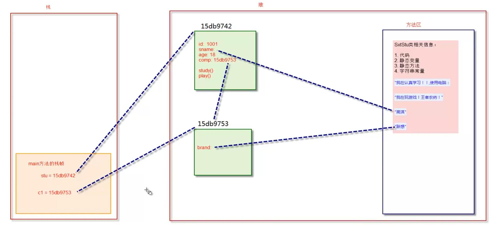
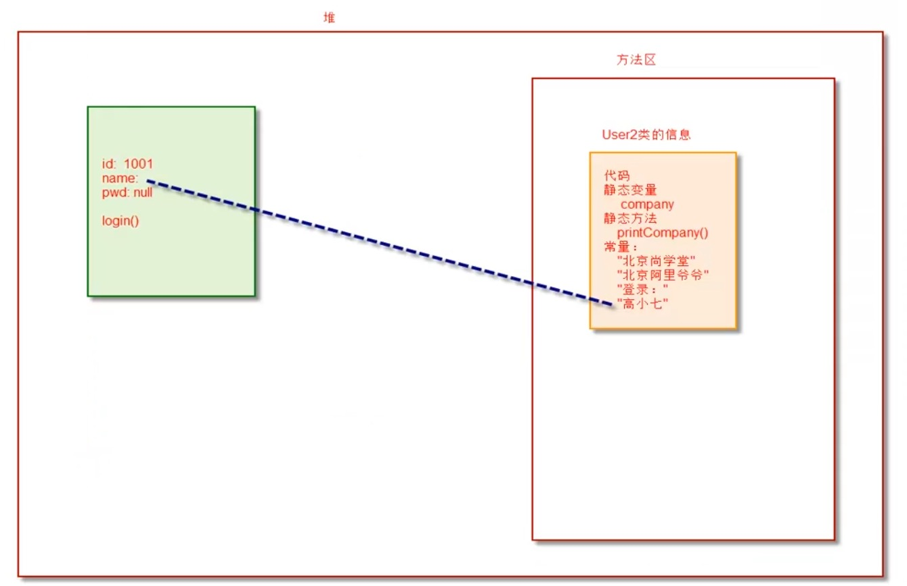
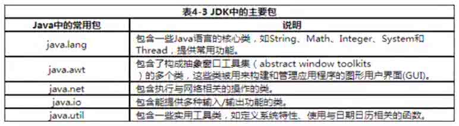

# 面向过程 VS 面向对象

面向过程：1->2->3->4，一步一步的执行，解决简单问题可以使用面向过程。

面向对象：复杂的问题，不可能一步步执行，需要把面向过程抽象成类，进行封装。

解决复杂问题：宏观上需要面向对象进行把控，微观上仍然是面向过程。


# 类与对象

类：class

对象：object、instance实例，是一个意思。


# 一个基础的类

> 属性（field，也叫做成员变量）
>
> 【注意】：一个.java文件可以有多个类，但只有一个public类。

```
public class FirstClass {
    int id;
    String name;
    int age;
    // 类
    Computer comp;

    void study(){
        System.out.println("我在学习！"+comp.brand);
    }

    void play(){
        System.out.println("我在玩耍！");
    }

    // 构造方法。用于创建这个类的对象，无参的构造方法可以由系统自动创建。
    FirstClass() {

    }

    // 程序执行的入口，必须要有
    public static void main(String[] args){
        FirstClass stu = new FirstClass();
        stu.id = 12;
        stu.name = "lucy";
        stu.age = 30;
        stu.play();

        Computer computer = new Computer();
        computer.brand = "Apple Mac";
        stu.comp = computer;

        stu.study();
    }

}


class Computer{
    String brand;  // 品牌
}
```


# 内存分析

> Java虚拟机的内存可以分为三个区域：
>
> * 栈stack
> * 堆heap
> * 方法区method area / 静态区 static：它也在堆中。


【思考】为什么说方法区/静态区在堆上？

[stackOverflow-Where are static methods and static variables stored in Java?](https://stackoverflow.com/questions/8387989/where-are-static-methods-and-static-variables-stored-in-java)

[Presenting the Permanent Generation](https://blogs.oracle.com/jonthecollector/presenting-the-permanent-generation)


## 栈

>栈特点：
>
>1. 栈描述的是方法执行的内存模型。每个方法执行都会创建一个栈帧（存储局部变量、操作数、方法出口等）；
>2. JVM为每个线程创建一个栈，用于存放该线程执行方法的信息（实际参数、局部变量）；
>3. 栈属于线程私有，不能实现线程共享；
>4. 栈的存储特性是『先进后出，后进先出』；
>5. 栈是由系统自动分配，速度快；
>6. 栈是一个连续的内存空间。


## 堆

> 堆特点：
>
> 1. 堆用于存储创建好的对象和数组（数组也是对象）；
> 2. JVM只有一个堆，被所有线程共享；
> 3. 堆是一个不连续的内存空间，分配灵活，速度慢。


## 方法区（静态区）

> 特点：
>
> 1. JVM只有一个方法区，被所有线程共享；
> 2. 方法区实际也是堆，只是用于存储类和常量相关信息；
> 3. 用来存放程序中用于不变的或唯一的内容（类信息、class对象、静态变量、字符串常量等）。


## 分析上面代码

### 代码编译过程

```
// 理论操作
源文件(*.java) -> Java编译器(javac) -> 字节码文件(*.class) -> JRE[类装载器 -> 字节码校验 -> 解释器] -> 系统平台

// 实际操作
javac FirstClass.java	// 对源文件进行编译，生成字节码文件
java FirstClass				// 执行字节码文件
```


【第一步】：java FirstClass

执行java开始创建内存空间，运行FirstClass则将该类的源码导入到内存的方法区中。

【第二步】：找程序入口main方法并调用，static修饰符，说明main是静态方法。

当调用main方法时，会在栈区分配一个栈帧。

### 内存分析图




# 构造方法-Constructor

> 1. 通过new关键字调用！！；
> 2. 构造器虽然有返回值，但不能自定义返回值类型（返回值类型肯定是本类），不能使用return返回某个值，但可以直接return；
> 3. 如果我们没有自定义构造器，则编译器会自动定义一个无参的构造函数。如果已定义，则编辑器不会自动添加！**（例如下面代码，已经自定义了构造器，如果Point p = new Point();错误）**
> 4. 构造器的方法名必须和类名一致。
> 5. 构造方法的第一句总是super()。
> 6. 继承关系中，先执行父类，再执行子类。

```
class Point {
		double x,y;
		
		// 构造方法
		public Point(double x, double _y) {
        super();			// 构造方法的第一句总是super()方法
				this.x = x; 	// this表示创建好的对象
				y = _y;
		}
		
		// 重载构造方法
		public Point(double _x) {
				x = _x;
		}

		// 计算两个点距离
		public double getDistance(Point p) {
				return Math.sqrt((x - p.x) * (y - p.y));
		}
}

public class TestConstructor {
		public static void main(String[] args) {
				Point p = new Point(3.0, 4.0);
				Point origin = new Point(0.0, 0.0);
				
				double Length = p.getDistance(origin);
				System.out.println(Length);
		}
}
```


# this

## 对象创建过程

1. 分配对象空间，并将对象的成员变量初始化为0或null；
2. 指向属性值的显式初始化；
3. 执行构造方法；
4. 返回对象的地址给相关变量。

## this的本质

> this的本质就是『创建好的对象的地址』。由于在构造方法之前，对象已经创建，因此也可以在构造方法中使用this代表『当前对象』。

## this简单用法

> 1. 成员变量与局部变量同名，通过this来区分（this.name = name）；
> 2. 方法调用，加上this.play() 等价于 play()，所以可加可不加；
> 3. 在构造器中调用另一个构造器，必须使用this，且必须放在第一行；
> 4. 在static方法中不能使用this。原因：static存储在方法区，方法区只是用于存储类和常量相关信息，所以没有对象，使用this找不到对象。

```
class Point {
		double x,y,z;
		
		// 构造方法
		public Point(double x, double y) {
				x = x; 		// 错误
				this.x = x;		// 规则一：成员变量与局部变量同名，通过this来区分
				this.y = y;
		}
		
		public Point(double x, double y, double z) {
				this(x, y);   // 规则三：构造方法中调用另一个构造方法，this指的是构造方法，且放在第一行。
				
				z = z; 		// 错误
				this.z = z;				
		}
		
		void play() {
				System.out.println("Play")
		}
		
		void study {
				play();
				this.play();	// 规则二：方法调用，加上this.play() 等价于 play()，所以可加可不加；
		}
		
		static void studyS(){
        this.play();	// 规则四：在static方法中不能使用this
    }
}
```


# static关键字

> static声明的成员变量叫做静态成员变量，也称为类变量，类变量的生命周期与类相同，在整个程序执行期间有效。
>
> 有如下特点：
>
> 1. 为该类公用变量，属于类，被该类的所有实例共享，在类被加载时显式初始化；
> 2. 对于该类的所有对象来说，static成员变量只有一份，被该类所有对象共享；
> 3. 一般使用『类名.类属性/方法』来调用，可以通过对象引用访问静态成员；
> 4. 在static方法中不可直接访问非static变量与方法。
>
> 
>
> static修饰的变量和方法属于类；普通的变量和方法属于对象。


```
public class User {
    int id;
    String name;
    String pwd;

    static String company = "北京尚学堂";

    public User(int id, String name){
        this.id = id;
        this.name = name;
    }

    public void login(){
        System.out.println("登录"+name);
        
        System.out.println(companye);	// 正确，普通方法可以访问静态变量
        printCompany();			// 正确，普通方法可以访问静态方法
    }

    public static void printCompany(){
        login();		// 错误，规则四：在static方法中不可直接访问非static变量与方法。
        System.out.println(this.name); // 错误，规则四：在static方法中不可直接访问非static变量与方法。
        System.out.println(company); 	 // 正确
    }

    public static void main(String[] args){
        User u = new User(101, "高小七");
        u.login();
        System.out.println(u.company);	// 规则一：被所有实例共享
        
        printCompany();			// 正确，因为mian方法也在方法区，可以访问到方法区的内容
        User.printCompany();					// 规则三：可以用类名.变量/方法调用
        User.company = "背景阿里爷爷";
        User.printCompany();
        
        User u1 = new User(101, "高小七");
        System.out.println(u1.company);    // 规则二：对于该类的所有对象来说，static成员变量只有一份
    }
}
```

> 总结：类信息无法访问对象信息，对象信息可以访问类信息。




# 垃圾回收机制 - GC

> GC - Garbage Collection

## 回收过程

1. 发现无用对象；
2. 释放无用对象占用的内存空间；

## 垃圾回收相关算法

1. 引用计数法

2. 引用可达法

## 常见内存泄露场景

1. 创建大量无用对象；
2. 静态集合类的使用；
3. 各种连接对象未关闭（IO流对象、数据库连接对象、网络连接对象等）；
4. 监听器的使用


# 静态初始化块

> 构造方法用于对象的初始化。
>
> 静态初始化块用于类的初始化，在静态初始化块中不能直接访问非static成员。

**【注意】**

1. 在继承关系中，先执行父类，再执行子类；
2. 构造方法也一样。

```
public class StaticBlock {
    int id;
    String name;
    String pwd;
    static String company;

    static {
        System.out.println("执行类初始化工作");
        company = "北京尚学堂";
        printCompany();
    }

    public static void printCompany(){
        System.out.println(company);
    }

    public static void main(String[] args){
        StaticBlock sb = null;
    }
}
```


# Java参数传值机制

> Java中，方法中所有的参数都是『值传递』，也就是传递值的副本。

* 基本数据类型参数的传值

  > 传递的值是副本，副本改变不会影响原件。

* 引用类型参数的传值

  > 传递的是值的副本，但是引用类型指向的是『对象的地址』，因此，副本与原件指向是同一个『对象地址』。


# Java包机制

> 包机制是Java中管理类的重要手段。包对于类，相当于文件夹对于文件的作用。
>
> 1. 解决开发中大量类同名的问题；
> 2. 实现对类的有效管理；


## Java主要包

* java.lang：是核心包，无需导入也可使用。




# import

* 同包的类可直接使用。

* 跨包的类需要导入

  ```
  package com.oop;
  
  import com.linx.test; // 导入具体类
  import com.linx.*;		// 导入全部类
  
  public class testPackage {
  
      // 程序执行的入口，必须要有
      public static void main(String[] args) {
  
          test1 t1 = new test1();  // 同包类
  
          com.linx.test t = new com.linx.test();  // 跨包类
      }
  }
  ```

**【特殊情况】：两个包中同名类，建议如下写：**

```
com.linx.test t = new com.linx.test();
```


## 静态导入（>= JDK1.5）

> import static XXX  导入包中所有静态变量与方法。

```
import java.lang;
import static java.lang.Math.PI;  // 导入包中静态变量PI
import static java.lang.Math.*;		// 导入包中所有静态变量与方法

...
		System.out.println(Math.PI);
		System.out.println(PI);
...
```


