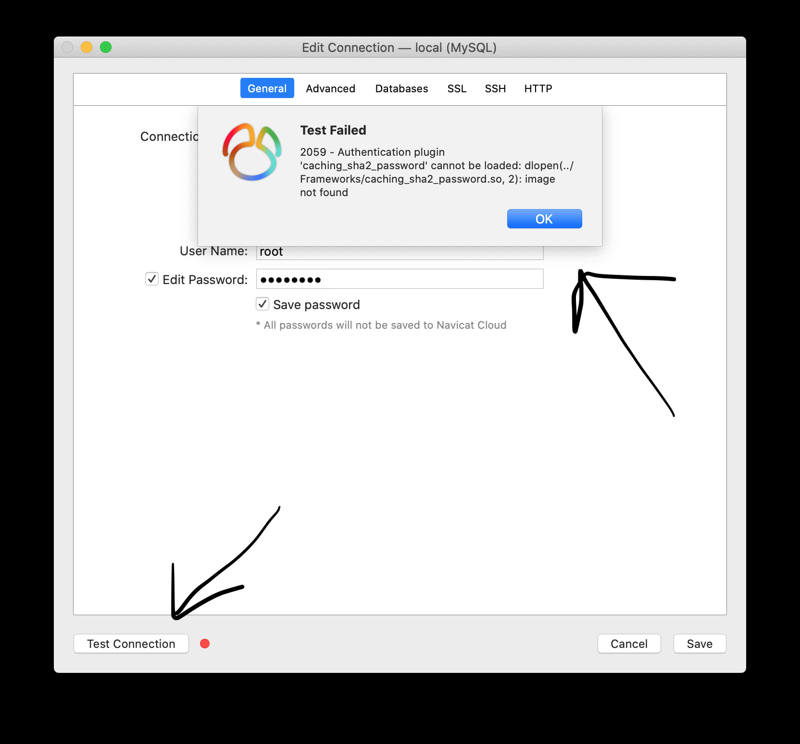
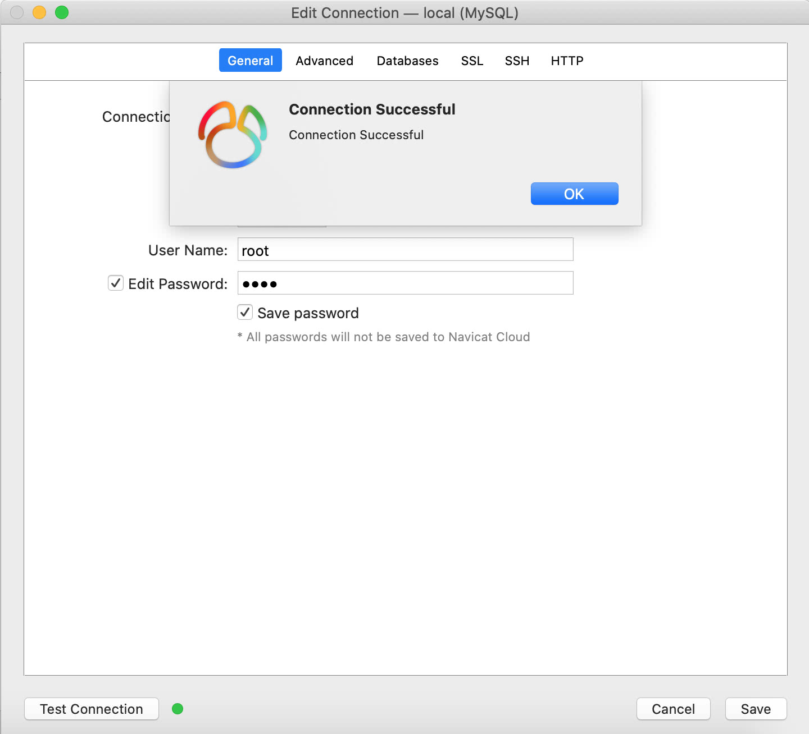

# brew安装mysql

## 一、流程概览

1. 安装mysql

   ```mysql
   ➜ brew install mysql
   ```

2. 登录mysql

   ```mysql
   ➜ mysql.server start
   ```

3. 修改密码及基础配置

   ```mysql
   ➜ mysql_secure_installation
   ```


## 二、终端实操

```mysql
// 安装mysql
➜ XiOS git:(**master)** ✗ brew install mysql
Updating Homebrew...
==> Auto-updated Homebrew!
Updated 1 tap (homebrew/core).
==> New Formulae
duckdb                  graphql-cli
==> Updated Formulae
awscli           i2p            opencc
bat            i2pd            paket
bmake           jenkins          passenger
botan           jenv            pdnsrec
catch2           just            phoronix-test-suite
fades           kakoune          pspg
folly           macvim           singular
freeswitch         mdcat           sourcedocs
game-music-emu       mill            sphinx-doc
gh             minizip2          tfenv
git-absorb         mutt            twarc
grafana          nginx           ucloud
helmsman          ngt            velero
hyperfine         node-build         zola
hyperscan         node@12          zookeeper

==> Downloading https://homebrew.bintray.com/bottles/openssl%401.1-1.1.1g.catali
######################################################################## 100.0%
==> Downloading https://homebrew.bintray.com/bottles/protobuf-3.12.1.catalina.bo
==> Downloading from https://akamai.bintray.com/6b/6b13b089c2754bb9df99f2621ea0f
######################################################################## 100.0%
==> Downloading https://homebrew.bintray.com/bottles/mysql-8.0.19_1.catalina.bot
==> Downloading from https://akamai.bintray.com/e5/e5a5455d254260e9ca9821cb9c5e9
######################################################################## 100.0%

==> Installing dependencies for mysql: openssl@1.1 and protobuf
==> Installing mysql dependency: openssl@1.1
==> Pouring openssl@1.1-1.1.1g.catalina.bottle.tar.gz
==> Caveats

A CA file has been bootstrapped using certificates from the system
keychain. To add additional certificates, place .pem files in
 /usr/local/etc/openssl@1.1/certs

and run
 /usr/local/opt/openssl@1.1/bin/c_rehash

openssl@1.1 is keg-only, which means it was not symlinked into /usr/local,
because macOS provides LibreSSL.

If you need to have openssl@1.1 first in your PATH run:
 echo 'export PATH="/usr/local/opt/openssl@1.1/bin:$PATH"' >> ~/.zshrc

For compilers to find openssl@1.1 you may need to set:
 export LDFLAGS="-L/usr/local/opt/openssl@1.1/lib"
 export CPPFLAGS="-I/usr/local/opt/openssl@1.1/include"

For pkg-config to find openssl@1.1 you may need to set:
 export PKG_CONFIG_PATH="/usr/local/opt/openssl@1.1/lib/pkgconfig"

==> Summary
🍺 /usr/local/Cellar/openssl@1.1/1.1.1g: 8,059 files, 18MB
==> Installing mysql dependency: protobuf
==> Pouring protobuf-3.12.1.catalina.bottle.tar.gz
🍺 /usr/local/Cellar/protobuf/3.12.1: 270 files, 19.8MB
==> Installing mysql
==> Pouring mysql-8.0.19_1.catalina.bottle.tar.gz
==> /usr/local/Cellar/mysql/8.0.19_1/bin/mysqld --initialize-insecure --user=lio
==> Caveats

We've installed your MySQL database without a root password. To secure it run:
  mysql_secure_installation

MySQL is configured to only allow connections from localhost by default

To connect run:
  mysql -uroot

To have launchd start mysql now and restart at login:
 brew services start mysql

Or, if you don't want/need a background service you can just run:
 mysql.server start

==> Summary
🍺 /usr/local/Cellar/mysql/8.0.19_1: 286 files, 288.8MB
==> Caveats
==> openssl@1.1
A CA file has been bootstrapped using certificates from the system
keychain. To add additional certificates, place .pem files in
 /usr/local/etc/openssl@1.1/certs

and run
 /usr/local/opt/openssl@1.1/bin/c_rehash

openssl@1.1 is keg-only, which means it was not symlinked into /usr/local,
because macOS provides LibreSSL.

If you need to have openssl@1.1 first in your PATH run:
 echo 'export PATH="/usr/local/opt/openssl@1.1/bin:$PATH"' >> ~/.zshrc

For compilers to find openssl@1.1 you may need to set:
 export LDFLAGS="-L/usr/local/opt/openssl@1.1/lib"
 export CPPFLAGS="-I/usr/local/opt/openssl@1.1/include"

For pkg-config to find openssl@1.1 you may need to set:

 export PKG_CONFIG_PATH="/usr/local/opt/openssl@1.1/lib/pkgconfig"

==> mysql
We've installed your MySQL database without a root password. To secure it run:
  mysql_secure_installation

MySQL is configured to only allow connections from localhost by default

To connect run:
  mysql -uroot

To have launchd start mysql now and restart at login:
 brew services start mysql

Or, if you don't want/need a background service you can just run:
 mysql.server start


// 启动mysql
➜ XiOS git:(**master)** ✗ mysql.server start
Starting MySQL
.. SUCCESS! 

// 修改密码
➜ XiOS git:(**master)** ✗ mysql_secure_installation

Securing the MySQL server deployment.

Connecting to MySQL using a blank password.

VALIDATE PASSWORD COMPONENT can be used to test passwords
and improve security. It checks the strength of password
and allows the users to set only those passwords which are
secure enough. Would you like to setup VALIDATE PASSWORD component?

// 是否查看密码验证策略
Press y|Y for Yes, any other key for No: Y

There are three levels of password validation policy:
LOW  Length >= 8
MEDIUM Length >= 8, numeric, mixed case, and special characters
STRONG Length >= 8, numeric, mixed case, special characters and dictionary         file

// 这里提示选一个密码强度等级
Please enter 0 = LOW, 1 = MEDIUM and 2 = STRONG: 0
Please set the password for root here.

New password: 
Re-enter new password: 

Estimated strength of the password: 25 

Do you wish to continue with the password provided?(Press y|Y for Yes, any other key for No) : Y

// 由于我输入密码：123456，并未达到其最低密码标准 >= 8
 ... Failed! Error: Your password does not satisfy the current policy requirements

New password: 
Re-enter new password: 

Estimated strength of the password: 50 

// 您希望继续使用提供的密码吗？再次确认使用输入的密码。
Do you wish to continue with the password provided?(Press y|Y for Yes, any other key for No) : Y


By default, a MySQL installation has an anonymous user,
allowing anyone to log into MySQL without having to have
a user account created for them. This is intended only for
testing, and to make the installation go a bit smoother.
You should remove them before moving into a production
environment.

// 是否移除默认无密码用户
Remove anonymous users? (Press y|Y for Yes, any other key for No) : Y
Success.


Normally, root should only be allowed to connect from
'localhost'. This ensures that someone cannot guess at
the root password from the network.

// 是否禁止远程root登录，我选的是不禁止 N。
Disallow root login remotely? (Press y|Y for Yes, any other key for No) : N
 ... skipping.


By default, MySQL comes with a database named 'test' that
anyone can access. This is also intended only for testing,
and should be removed before moving into a production
environment.

// 是否删除默认自带的test数据库
Remove test database and access to it? (Press y|Y for Yes, any other key for No) : Y
 - Dropping test database...
Success.
 - Removing privileges on test database...
Success.


Reloading the privilege tables will ensure that all changes
made so far will take effect immediately.

// 是否立刻重新加载特权表
Reload privilege tables now? (Press y|Y for Yes, any other key for No) : Y
Success.


All done! 
```


## 三、终端使用MySQL

### 3.0、查看版本 & 环境变量

```mysql
➜  ~ mysql --version
mysql  Ver 8.0.19 for osx10.15 on x86_64 (Homebrew)
```

若找不到mysql命令，则

1. 进入MySQL安装目录运行；
2. 添加环境变量；


### 3.1、开启、停止、重启MySQL服务

```mysql
// 开启
➜  ~ mysql.server start
Starting MySQL
. SUCCESS!
 
// 停止
➜  ~ mysql.server stop
Shutting down MySQL
. SUCCESS!

// 重启【推荐】：先停止，再开启
➜  ~ mysql.server restart
Shutting down MySQL
.. SUCCESS!
Starting MySQL
. SUCCESS!
```


### 3.2、登录/退出MySQL

```mysql
➜  ~ mysql -u root -p
Enter password:
Welcome to the MySQL monitor.  Commands end with ; or \g.
Your MySQL connection id is 8
Server version: 8.0.19 Homebrew

Copyright (c) 2000, 2020, Oracle and/or its affiliates. All rights reserved.

Oracle is a registered trademark of Oracle Corporation and/or its
affiliates. Other names may be trademarks of their respective
owners.

Type 'help;' or '\h' for help. Type '\c' to clear the current input statement.

mysql> \q					// 退出方式一
Bye

mysql> exit				// 退出方式二
Bye

mysql> quit				// 退出方式三
Bye
```


### 3.3、进入MySQL查看帮助

```mysql
mysql> \?				// 查看mysql帮助方式一

mysql> \h				// 查看mysql帮助方式二

mysql> \help		// 查看mysql帮助方式三

For information about MySQL products and services, visit:
   http://www.mysql.com/
For developer information, including the MySQL Reference Manual, visit:
   http://dev.mysql.com/
To buy MySQL Enterprise support, training, or other products, visit:
   https://shop.mysql.com/

List of all MySQL commands:
Note that all text commands must be first on line and end with ';'
?         (\?) Synonym for `help'.
clear     (\c) Clear the current input statement.
connect   (\r) Reconnect to the server. Optional arguments are db and host.
delimiter (\d) Set statement delimiter.
edit      (\e) Edit command with $EDITOR.
ego       (\G) Send command to mysql server, display result vertically.
exit      (\q) Exit mysql. Same as quit.
go        (\g) Send command to mysql server.
help      (\h) Display this help.
nopager   (\n) Disable pager, print to stdout.
notee     (\t) Don't write into outfile.
pager     (\P) Set PAGER [to_pager]. Print the query results via PAGER.
print     (\p) Print current command.
prompt    (\R) Change your mysql prompt.
quit      (\q) Quit mysql.
rehash    (\#) Rebuild completion hash.
source    (\.) Execute an SQL script file. Takes a file name as an argument.
status    (\s) Get status information from the server.
system    (\!) Execute a system shell command.
tee       (\T) Set outfile [to_outfile]. Append everything into given outfile.
use       (\u) Use another database. Takes database name as argument.
charset   (\C) Switch to another charset. Might be needed for processing binlog with multi-byte charsets.
warnings  (\W) Show warnings after every statement.
nowarning (\w) Don't show warnings after every statement.
resetconnection(\x) Clean session context.

For server side help, type 'help contents'
```


## 四、数据库操作

### 4.1、查看数据库

```mysql
mysql> show databases;
+--------------------+
| Database           |
+--------------------+
| information_schema |
| mysql              |
| performance_schema |
| sys                |
+--------------------+
4 rows in set (0.00 sec)
```


### 4.2、创建数据库

```mysql
mysql> create database LX_DB;
Query OK, 1 row affected (0.00 sec)

// 查看是否存在
mysql> show databases;
+--------------------+
| Database           |
+--------------------+
| information_schema |
| LX_DB              |
| mysql              |
| performance_schema |
| sys                |
+--------------------+
5 rows in set (0.00 sec)
```


###4.3、删除数据库 

```mysql
mysql> drop database LX_DB;
Query OK, 0 rows affected (0.01 sec)

// 查看是否已经删除
mysql> show databases;
+--------------------+
| Database           |
+--------------------+
| information_schema |
| mysql              |
| performance_schema |
| sys                |
+--------------------+
4 rows in set (0.00 sec)
```


### 4.4、使用数据库

```mysql
mysql> use LX_DB;
Database changed
```


## 五、表操作

### 5.1、创建表

```mysql
mysql> create table firstTable(personId int, name varchar(20));
Query OK, 0 rows affected (0.01 sec)
```


### 5.2、查看所有表

```mysql
mysql> show tables;
+-----------------+
| Tables_in_lx_db |
+-----------------+
| firstTable      |
+-----------------+
1 row in set (0.00 sec)
```


### 5.3、查看表的结构

```mysql
mysql> desc firstTable;
+----------+-------------+------+-----+---------+-------+
| Field    | Type        | Null | Key | Default | Extra |
+----------+-------------+------+-----+---------+-------+
| personId | int         | YES  |     | NULL    |       |
| name     | varchar(20) | YES  |     | NULL    |       |
+----------+-------------+------+-----+---------+-------+
2 rows in set (0.00 sec)
```


### 5.4、删除表

```mysql
mysql> drop table firstTable;
Query OK, 0 rows affected (0.01 sec)
```


### 5.5、复制表

> create table 新表名 like 被复制的表名;

```mysql
mysql> create table secondTable like firstTable;
Query OK, 0 rows affected (0.01 sec)

// 查看，复制成功
mysql> show tables;
+-----------------+
| Tables_in_lx_db |
+-----------------+
| firstTable      |
| secondTable     |
+-----------------+
2 rows in set (0.00 sec)
```


### 5.6、表添加新列

> alter table 表名 add 字段名称 字段类型;

```mysql
mysql> alter table firstTable add age int;
Query OK, 0 rows affected (0.01 sec)
Records: 0  Duplicates: 0  Warnings: 0

// 查看表结构
mysql> desc firstTable;
+----------+-------------+------+-----+---------+-------+
| Field    | Type        | Null | Key | Default | Extra |
+----------+-------------+------+-----+---------+-------+
| personId | int         | YES  |     | NULL    |       |
| name     | varchar(20) | YES  |     | NULL    |       |
| age      | int         | YES  |     | NULL    |       |
+----------+-------------+------+-----+---------+-------+
3 rows in set (0.00 sec)
```


## 六、数据操作

### 6.1、查询数据

> select * from 表名;		 // 查询全部
>
> select * from 表名 where age = 35; 		// 条件查询

```mysql
mysql> select * from firstTable;
+----------+---------+------+
| personId | name    | age  |
+----------+---------+------+
|       20 | lionson | NULL |
+----------+---------+------+
1 row in set (0.00 sec)


mysql> select * from firstTable where personId = 20;
+----------+---------+------+
| personId | name    | age  |
+----------+---------+------+
|       20 | lionson | NULL |
+----------+---------+------+
1 row in set (0.00 sec)
```


### 6.2、插入数据

> insert into 表明 (字段1, 字段2....) values (值1,值2....);

```mysql
mysql> insert into firstTable (personId, name) values (20,"lionson");
Query OK, 1 row affected (0.00 sec)
```


### 6.3、删除数据

> delete from 表名 where age = 24;

```mysql
mysql> delete from firstTable where age = 24;
Query OK, 1 row affected (0.00 sec)

// 查看数据是否被删除
mysql> select * from firstTable;
Empty set (0.00 sec)
```

### 6.4、更改数据

> update 表名 set name = "Lucy", age = 24 where personId = 20;

```mysql
mysql> update firstTable set name = "Lucy", age = 24 where personId = 20;
Query OK, 1 row affected (0.00 sec)
Rows matched: 1  Changed: 1  Warnings: 0

// 查看表数据
mysql> select * from firstTable;
+----------+------+------+
| personId | name | age  |
+----------+------+------+
|       20 | Lucy |   24 |
+----------+------+------+
1 row in set (0.00 sec)
```


## 七、数据库用户操作

### 1、查看用户列表

查看用户并没有直接的SQL语句，而是进入 **mysql数据库的user表**（这个mysql库和user表都是一开始就有的），直接用 select * from user；

```mysql
// 查看用户列表中信息
mysql> SELECT User, Host, plugin FROM mysql.user;
+------------------+-----------+-----------------------+
| User             | Host      | plugin                |
+------------------+-----------+-----------------------+
| mysql.infoschema | localhost | caching_sha2_password |
| mysql.session    | localhost | caching_sha2_password |
| mysql.sys        | localhost | caching_sha2_password |
| root             | localhost | mysql_native_password |
+------------------+-----------+-----------------------+
4 rows in set (0.00 sec)
```

或，切换到mysql数据库

```mysql
// 1.切换到mysql数据库
mysql> use mysql;
Reading table information for completion of table and column names
You can turn off this feature to get a quicker startup with -A

Database changed

// 2.查看user表中user字段
mysql> select user from user;
+------------------+
| user             |
+------------------+
| mysql.infoschema |
| mysql.session    |
| mysql.sys        |
| root             |
+------------------+
4 rows in set (0.00 sec)
```

### 2、创建新用户

> CREATE USER <name> IDENTIFIED BY <password>;

```mysql
mysql> create user linx identified by '1111';
ERROR 1819 (HY000): Your password does not satisfy the current policy requirements
```

若遇到密码校验不通过，则查看 【十、查看密码校验 & 修改密码校验】

```mysql
// 再次查看mysql数据库中user表
mysql> select user from mysql.user;
+------------------+
| user             |
+------------------+
| linx             |
| mysql.infoschema |
| mysql.session    |
| mysql.sys        |
| root             |
+------------------+
5 rows in set (0.00 sec)
```

### 3、更改用户名

> RENAME USER <oldname> to <newname>;

```mysql
mysql> rename user linx to linxiang;
Query OK, 0 rows affected (0.00 sec)

// 再次查看，修改成功！
mysql> select user from mysql.user;
+------------------+
| user             |
+------------------+
| linxiang         |
| mysql.infoschema |
| mysql.session    |
| mysql.sys        |
| root             |
+------------------+
5 rows in set (0.00 sec)
```

### 4、删除用户

> DROP USER <name>;

```mysql
mysql> drop user linxiang;
Query OK, 0 rows affected (0.00 sec)

// 再次查看，删除成功！！
mysql> select user from mysql.user;
+------------------+
| user             |
+------------------+
| mysql.infoschema |
| mysql.session    |
| mysql.sys        |
| root             |
+------------------+
4 rows in set (0.00 sec)
```

### 5、更改密码

* 方法一【失败】：SET PASSWORD

```mysql
mysql> set password for linx = password('1234');
ERROR 1064 (42000): You have an error in your SQL syntax; check the manual that corresponds to your MySQL server version for the right syntax to use near 'password('1234')' at line 1
```

* 方法二【成功】：ALTER USER

```mysql
// Root修改root密码
mysql> ALTER USER 'root'@'localhost' IDENTIFIED BY '1111';
Query OK, 0 rows affected (0.01 sec)

// Root修改linx用户密码
mysql> ALTER USER 'linx'@'%' IDENTIFIED by '1234';
Query OK, 0 rows affected (0.01 sec)
```

### 6、查看用户权限

> SHOW GRANTS FOR <name>;

```mysql
mysql> show grants for linx;
+----------------------------------+
| Grants for linx@%                |
+----------------------------------+
| GRANT USAGE ON *.* TO `linx`@`%` |
+----------------------------------+
1 row in set (0.00 sec)
```

### 7、设置用户权限

> GRANT <操作: SELECT, INSERT,UPDATE, ALL> ON <database . tablename> TO <name>;

```mysql
mysql> Grant select on LX_DB.first to linx;
ERROR 1146 (42S02): Table 'lx_db.first' doesn't exist
mysql> Grant select on LX_DB.firstTable to linx;
Query OK, 0 rows affected (0.01 sec)

// 再次查看权限，设置成功！
mysql> show grants for linx;
+----------------------------------------------------+
| Grants for linx@%                                  |
+----------------------------------------------------+
| GRANT USAGE ON *.* TO `linx`@`%`                   |
| GRANT SELECT ON `lx_db`.`firsttable` TO `linx`@`%` |
+----------------------------------------------------+
2 rows in set (0.00 sec)
```

### 8、移除用户权限

> REVOKE <操作: SELECT, INSERT,UPDATE, ALL> ON <database . tablename> FROM <name>;

```mysql
// 移除数据库所有表权限，失败！因为刚刚只有firstTable表权限，并无全部表权限。
mysql> revoke select on lx_db.* from linx;
ERROR 1141 (42000): There is no such grant defined for user 'linx' on host '%'
// 移除lx_db数据库中firsttable表权限。
mysql> revoke select on lx_db.firsttable from linx;
Query OK, 0 rows affected (0.01 sec)

// 再次查看，移除成功
mysql> show grants for linx;
+----------------------------------+
| Grants for linx@%                |
+----------------------------------+
| GRANT USAGE ON *.* TO `linx`@`%` |
+----------------------------------+
1 row in set (0.00 sec)
```


## 八、查看密码策略 & 修改密码策略和Authentication Plugin

```mysql
// root进入数据库
➜ mysql -u root -p 	
```

### 1、查看密码策略

```mysql
mysql> SHOW VARIABLES LIKE 'validate_password%';
+--------------------------------------+--------+
| Variable_name                        | Value  |
+--------------------------------------+--------+
| validate_password.check_user_name    | ON     |
| validate_password.dictionary_file    |        |
| validate_password.length             | 8      |
| validate_password.mixed_case_count   | 1      |
| validate_password.number_count       | 1      |
| validate_password.policy             | MEDIUM |
| validate_password.special_char_count | 1      |
+--------------------------------------+--------+
7 rows in set (0.01 sec)
```

### 2、修改密码策略

>  将 `validate_password.policy ` 改为LOW，`validate_password.length` 改为4

```mysql
mysql> set global validate_password.policy=0;		// 设置密码策略，LOW
Query OK, 0 rows affected (0.00 sec)

mysql> set global validate_password.length=4;  // 设置密码长度
Query OK, 0 rows affected (0.00 sec)

mysql> FLUSH PRIVILEGES;				// 使更新的权限表加载到内存中
Query OK, 0 rows affected (0.00 sec)

// 查看是否修改成功
mysql> SHOW VARIABLES LIKE 'validate_password%';
+--------------------------------------+-------+
| Variable_name                        | Value |
+--------------------------------------+-------+
| validate_password.check_user_name    | ON    |
| validate_password.dictionary_file    |       |
| validate_password.length             | 4     |
| validate_password.mixed_case_count   | 1     |
| validate_password.number_count       | 1     |
| validate_password.policy             | LOW   |
| validate_password.special_char_count | 1     |
+--------------------------------------+-------+
7 rows in set (0.00 sec)
```

### 3、修改密码规则中的Authentication Plugin

> 小于mysql8版本：Authentication Plugin = mysql_native_password
>
> 大于mysql8版本：Authentication Plugin = caching_sha2_password
>
> 
>
> 所以这里修改Authentication Plugin，改为：mysql_native_password （小于mysql8版本）

```mysql
// 修改密码规则，同时必须修改密码，若不加『BY '123456'』，则默认密码为空。
mysql> ALTER USER 'root'@'localhost' IDENTIFIED WITH mysql_native_password BY '123456';
Query OK, 0 rows affected (0.00 sec)

mysql> FLUSH PRIVILEGES;				// 使更新的权限表加载到内存中
Query OK, 0 rows affected (0.00 sec)

// 查看用户列表中信息
mysql> SELECT User, Host,plugin FROM mysql.user;
+------------------+-----------+-----------------------+
| User             | Host      | plugin                |
+------------------+-----------+-----------------------+
| mysql.infoschema | localhost | caching_sha2_password |
| mysql.session    | localhost | caching_sha2_password |
| mysql.sys        | localhost | caching_sha2_password |
| root             | localhost | mysql_native_password |
+------------------+-----------+-----------------------+
4 rows in set (0.00 sec)
```


## 九、查看MySQL相关参数

### 1、通过查看datadir系统变量来查看数据目录

> show variables like 'datadir';		// 直接搜索datadir
>
> show variables like '%dir%';		 // 模糊搜索dir


```mysql
mysql> show variables like 'datadir';
+---------------+-----------------------+
| Variable_name | Value                 |
+---------------+-----------------------+
| datadir       | /usr/local/var/mysql/ |
+---------------+-----------------------+
1 row in set (0.01 sec)
```


```mysql
mysql> show variables like '%dir%';
+-----------------------------------------+--------------------------------------------------------+
| Variable_name                           | Value                                                  |
+-----------------------------------------+--------------------------------------------------------+
| basedir                                 | /usr/local/Cellar/mysql/8.0.19_1/                      |
| binlog_direct_non_transactional_updates | OFF                                                    |
| character_sets_dir                      | /usr/local/Cellar/mysql/8.0.19_1/share/mysql/charsets/ |
| datadir                                 | /usr/local/var/mysql/                                  |
| innodb_data_home_dir                    |                                                        |
| innodb_directories                      |                                                        |
| innodb_log_group_home_dir               | ./                                                     |
| innodb_max_dirty_pages_pct              | 90.000000                                              |
| innodb_max_dirty_pages_pct_lwm          | 10.000000                                              |
| innodb_redo_log_archive_dirs            |                                                        |
| innodb_temp_tablespaces_dir             | ./#innodb_temp/                                        |
| innodb_tmpdir                           |                                                        |
| innodb_undo_directory                   | ./                                                     |
| lc_messages_dir                         | /usr/local/Cellar/mysql/8.0.19_1/share/mysql/          |
| plugin_dir                              | /usr/local/Cellar/mysql/8.0.19_1/lib/plugin/           |
| slave_load_tmpdir                       | /var/folders/45/t26gth1x3rq_z1r0b3z00h8r0000gp/T/      |
| tmpdir                                  | /var/folders/45/t26gth1x3rq_z1r0b3z00h8r0000gp/T/      |
+-----------------------------------------+--------------------------------------------------------+
17 rows in set (0.01 sec)
```


### 2、查看MySQL端口号

```mysql
mysql> show global variables like 'port';
+---------------+-------+
| Variable_name | Value |
+---------------+-------+
| port          | 3306  |
+---------------+-------+
1 row in set (0.01 sec)
```


## 十、Navicat Premium

### 1、【现象】Navicat连接MySQL失败 - 加密类型更改

[stackoverflow - 解决方案](https://stackoverflow.com/questions/50169576/mysql-8-0-11-error-connect-to-caching-sha2-password-the-specified-module-could-n)



### 2、【原因】

发现这个错误出现的原因是在mysql8之前的版本中加密规则为 **mysql_native_password**，而在mysql8以后的加密规则为 **caching_sha2_password**。

### 3、【解决步骤】

- 查看【八、查看密码策略 & 修改密码策略和Authentication Plugin】

### 4、【成功】




