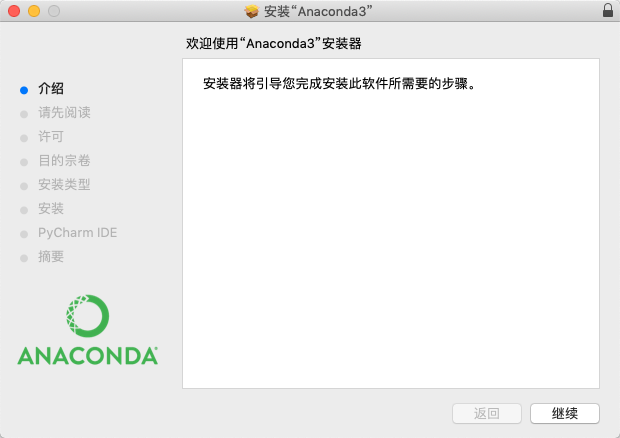

[Anaconda介绍、安装及使用教程](https://zhuanlan.zhihu.com/p/32925500)


### 一、Anaconda安装

[Anaconda官网下载](https://www.anaconda.com/distribution/)





### 二、验证

终端输入conda命令，识别失败！！

```
➜ ~ conda --version
zsh: command not found: conda
```


**解决**

1. 终端打开配置

```undefined
➜ vi ~/.zshrc

.zshrc是什么 ：The individual per-interactive-shell startup file
简单来说它是linux文件夹的一个配置文件，这个文件主要保存个人的一些个性化设置，比如命名别名、路径等。
```

2. 在.zshrc最后添加Anaconda的路径

```
# add by linx for Anaconda 2020.01
export PATH=/opt/anaconda3/bin:$PATH
```

3. 让修改的文件立刻生效

```bash
➜ ~ source ~/.zshrc
```

4. **重启终端**后执行conda命令

```
➜ ~ conda --version
conda 4.7.12
```

5. Python被替换

```
➜ ~ python --version
Python 3.7.4
➜ ~ which python
/opt/anaconda3/bin/python
```


### 三、基本命令


```
环境管理命令
创建新的python环境：$ conda create --name myenv
并且还可以指定python的版本：$ conda create -n myenv python=3.7
创建新环境并指定包含的库：$ conda create -n myenv scipy
并且还可以指定库的版本：$ conda create -n myenv scipy=0.15.0
复制环境：$ conda create --name myclone --clone myenv
查看是不是复制成功了：$ conda info --envs
激活、进入某个环境：$ source activate myenv
退出环境：$ conda deactivate / $ source deactivate
删除环境：$ conda remove --name myenv --all
查看当前的环境列表$ conda info --envs / $ conda env list

包/库管理命令
查看conda版本：$ conda --version
更新conda版本：$ conda update conda / anaconda
查看都安装了那些依赖库：$ conda list
更新所有库 $ conda update --all
查看某个环境下安装的库：$ conda list -n myenv
查找包：$ conda search <package>
安装包：$ conda install <package>
安装到指定环境：$ conda install -n myenv <package>
更新包：$ conda update <package>
删除包：$ conda remove <package>
```


### 四、概念

#### 4.1、pip

pip 是一个现代的，通用的 [Python](https://baike.baidu.com/item/Python) 包管理工具。提供了对 Python 包的查找、下载、安装、卸载的功能。

属于python的一部分。
pip可执行文件在：C:\Python27\Scripts中


#### 4.2、brew

brew 全称Homebrew，是Mac OSX上的软件包管理工具。


### 4.3、apt-get

apt-get是debian(Ubuntu)才有的包管理器。


#### 4.4、yum

yum是fedora有的包管理器。