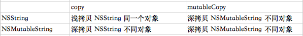

iOS面试整理

## 目录
* [一、iOS基础部分](#一)
	* [1.1、iOS内存机制](#1.1)
		* [1.1.1、简述OC内存管理机制](#1.1.1)
    	* [1.1.2、对MRC和ARC的理解，什么是ARC？ARC基本原理？ARC是为了解决什么问题诞生的？ARC不足的地方？](#1.1.2)
    	* [1.1.3、与retain配对使用的方法是dealloc还是release，为什么？需要与alloc配对使用的方法是dealloc还是release，为什么？](#1.1.3)
    	* [1.1.4、为什么说Objective-C是一门动态的语言？iOS的动态性？](#1.1.4)
    	
		* [1.1.5、ARC情况下，编译的时候，系统是怎么添加相关内存管理的代码](#1.4)
		* [1.、对于Objective-C，你认为它最大的优点和最大的不足是什么？对于不足之处，现在有没有可用的方法绕过这些不足来实现需求。如果可以的话，你有没有考虑或者实践过重新实现OC的一些功能，如果有，具体会如何做？]()
	
	* [1.2、@property属性](#1.2)
		* [1.2.1、@property 的本质是什么？ivar、getter、setter 是如何生成并添加到这个类中的？](#1.2.1)
		* [1.2.2、@synthesize 和 @dynamic 分别有什么作用？](#1.2.2)
    	* [1.2.3、如何自己重写 setter / getter?](#1.2.3)
		* [1.2.4、@property中有哪些属性关键字？默认的关键字是什么？](#1.2.4)
		* [1.2.4.1、属性关键字 readwrite，readonly，assign，retain，copy，nonatomic 、atomic、strong、weak、unsafe_unretained 各是什么作用，在哪种情况下用？](#1.2.4.1)
   		* [1.2.5、写一个 setter 方法用于完成 `@property (nonatomic, retain) NSString *name;`，写一个 setter 方法用于完成 `@property (nonatomic, copy) NSString *name;`](#1.2.5)
		* [1.2.6、什么情况使用 weak 关键字？相比 assign 有什么不同？](#1.2.6)
		* [1.2.7、为什么assign不推荐用于修饰对象？](#1.2.7)
		* [1.2.7.1、什么是空指针、野指针？如何产生野指针？](#1.2.7.1)
		* [1.2.7.2、野指针的定位](#1.2.7.2)
		* [1.2.8、为什么我们常见的delegate属性都用是assign而不是retain/strong？](#1.2.8)
		* [1.2.8.1、为什么很多内置类如UITableViewControl的delegate属性都是assign而不是retain？请举例](#1.2.8.1)
		* [1.2.8.2、delegate的内存管理属性是weak还是assign？](#1.2.8.2)
		* [1.2.9、怎么用 copy 关键字？block用copy修饰吗？可以用其他修饰符吗？](#1.2.9)
		* [1.2.10、用@property声明的 NSString / NSArray / NSDictionary 经常使用 copy 关键字，为什么？如果改用strong关键字，可能造成什么问题？](#1.2.10)
   		* [1.2.11、这个写法会出什么问题：`@property (copy) NSMutableArray *arr;`](#1.2.11)
   		* [1.2.12、如何让自己的类用 copy 修饰符？](#1.2.12)
   		* [1.2.13、对于深拷贝和浅拷贝的理解，系统对象 NSString/NSMutableString/NSArray/NSMutableArray 的 copy 与 mutableCopy 方法](#1.2.13) 
   		* [1.2.14、类变量的 @public，@protected，@private，@package 声明各有什么含义？](#1.2.14)
   		
    
	* [1.3、autoreleasePool](#1.3)
		* [1.3.1、谈谈你对autoreleasePool自动释放池的理解，自动释放池的原理](#1.17)
		* [1.3.2、autoreleasePool自动释放池在 MRC和ARC 下的区别](#1.17)
		* [1.、不⼿动指定autoreleasepool的前提下，⼀个autorealese对象在什么时刻释放？]()
		* [1.3.3、多层自动释放池嵌套的对象在哪一层释放]()
		* [1.3.4、autoreleasePool自动释放池的应用场景]()
		* [1.3.5、autorelease对象在什么时机会被调用release]()
		* [1.3.6、方法里有局部对象， 出了方法后会立即释放吗]()

	* [1.4、iOS中的方法](#1.4)   
		* [1.4.1、+(void)load; +(void)initialize；区别？有什么用处？initialize方法如何调用,以及调用时机](#1.4.1)
		* [1.、谈谈instancetype和id的异同？id 声明的对象有什么特性？id和NSObject＊的区别？]()
		* [1.、UIView和CALayer是啥关系？]()
		* [1.、isKindOfClass和isMemberOfClass的区别？]()
		* [1.、frame 和 bounds 有什么不同？frame 和 bounds 分别是用来做什么的？frame和bound 一定都相等么？如果有不等的情况，请举例说明]()
		* [1.、loadView是干嘛用的？viewWillLayoutSubView你总是知道的]()
		* [1.、imageName和mageWithContextOfFile的区别?哪个性能高]()
		* [1.、drawRect与layout]()

* [1.5、iOS编程中一些基础]()    
    * [1.、数据持久化存储方案有哪些？]()
    * [1.、沙盒的目录结构是怎样的？各自一般用于什么场合？]()
    * [1.、介绍下内存的几大区域？内存中的栈和堆的区别是什么？那些数据在栈上，哪些在堆上？]()
    * [1.、#import跟 #include 有什么区别，@class呢，#import<> 跟 #import””有什么区别？]()
    * [1.、#define和const定义的变量，有什么区别？]()
    * [1.、static有什么作⽤?]()   
    * [1.、iOS逆向传值的几种方法整理]()
    * [1.、浅谈iOS开发中方法延迟执行的几种方式]()
    * [1.、怎样实现一个singleton的类？单例的好处与坏处？如何释放一个单例类？]()
    * [1.1、如何令⾃⼰所写的对象具有拷⻉功能?]()
    * [1.、如何重写类方法]()
    * [1.、什么是谓词？谓词过滤]()
    * [1.、NSString存储类型]()
    * [1.、NSCache与可变集合有几点不同]()
    * [1.、UITableView的重用机制]()
    * [1.、请用简单的代码展示@protocol的定义及实现.]()
    * [1.、协议是什么?有什么作用?]()
    * [1.、简述NotificationCenter、KVC、KVO、Delegate？并说明它们之间的区别？]()
    
* [1.6、iOS中一些机制和原理]()   
    * [1.、简单介绍下APNS]()
    * [1.、谈谈事件响应链，如何响应view之外的事件]()
    * [1.、事件传递链，页面上一个按钮，按钮和它的superView有一样的action,为什么只执行button的action?]()
    * [1.、iOS里面的手势是如何实现的?]()
    * [1.、main()之前的过程有哪些？]()
    * [1.、简单说一下APP的启动过程,从main文件开始说起。]()
    * [1.、UIViewController的生命周期， 应用的生命周期]()
    
* [1.7、其他]()    
	* [1.3、iOS中nil 、Nil、 NULL 、NSNull，你真的了解吗？]() 
    * [1.、c++引用和指针区别]()
    * [1.、静态库的原理是什么？你有没有⾃⼰写过静态编译库，遇到了哪些问题？]()
    * [1.、描述一个你遇到过的retain cycle例子。如何避免retain cycle]()
    * [1.、计时器有哪些？NSTimer创建后，会在哪个线程运行？如何让计时器调用一个类方法？]()
    * [1.、你是否接触过OC中的反射机制？简单聊一下概念和使用，反射函数？]()
    * [1.、使用CADisplayLink、NSTimer有什么注意点？]()
```

* [二、Runtime](#%E4%BA%8C)

  * [1.6、消息发送]()

    * [1.、谈谈消息转发机制实现]()
    * [1.、空指针，野指针，僵尸对象]()
    * [1.、objc在向⼀个对象发送消息时，发⽣了什么？]()
    * [1.、Objc中向一个nil对象发送消息会怎样]()
    * [1.、objc在向⼀个野指针发送消息时，发⽣了什么？]()
    * [1.、为什么其他语言里叫函数调用， objective c里则是给对象发消息（或者谈下对runtime的理解）]()
	* [2.1、什么是 Runtime？Runtime实现的机制是什么？](#2.1)
	* [2.2、message send如果寻找不到相应的对象，会如何进行后续处理 ？](#2.2)
	* [2.、Runtime如何通过selector找到对应的IMP地址]()
	* [2.、一个objc对象的isa的指针指向什么？有什么作用？]()
	* [2.、isa、Class介绍]()
	* [2.、消息发送与转发]()
	* [2.、runtime如何使用]()
	* [2.、_objc_msgForward 函数是做什么的，直接调用它将会发生什么？]()
	* [2.、你使用过Objective-C的运行时编程（Runtime Programming）么？如果使用过，你用它做了什么？]()
	* [2.、对于语句 `NSString *obj =[[NSData alloc] init]; `obj在编译时和运行时分别是什么类型的对象?]()
	
* [三、Runloop](#三)
	* [3.、什么是 RunLoop？Runloop内部实现逻辑？](#3.)
	* [3.、Runloop是来做什么的？Runloop和线程有什么关系？主线程默认开启了Runloop
么？⼦线程呢？](#3.)
	* [3.、RunLoop 有几个model，分别是什么？mode作用？](#3.)
	* [3.、以 `+ scheduledTimerWithTimeInterval...` 的⽅式触发的timer，在滑动⻚⾯上的
列表时，timer会暂定回调，为什么？如何解决？](#3.)
	* [3.、Runloop和线程的关系？](#3.)
	* [3.、](#3.)

* [四、KVC & KVO](#四)
	* [4.、KVC的底层实现？应用在哪些场景？](#4.)
	* [4.、KVO的底层实现？应用在哪些场景？](#4.)
	* [4.、iOS用什么方式实现对一个对象的KVO？(KVO的本质是什么？)](#4.)
	* [4.、如何⼿动触发⼀个value的KVO](#4.)
	* [4.、如何手动触发KVO？](#4.)
	* [4.、直接修改成员变量会触发KVO么？](#4.)
	* [4.、通过KVC修改属性会触发KVO么？](#4.)
	* [4.、KVC的赋值和取值过程是怎样的？原理是什么？](#4.)
	* [4.、如何访问并修改一个类的私有属性？](#4.)
	* [4.、NSNotification和KVO的区别和用法是什么？什么时候应该使用NSNotification，什么时候应该使用KVO？它们的实现上有什么区别吗？如果用protocol和delegate（或者delegate的Array）来实现类似的功能可能吗？如果可能，会有什么潜在的问题？如果不能，为什么？](#4.)
	* [4.、](#4.)
	* [4.、](#4.)

* [五、多线程](#五)
	* [5.、iOS多线程有哪几种实现方法？](#5.)
	* [5.、GCD执行原理？](#5.)
	* [5.、GCD中有哪些队列？分别是并行还是串行？](#5.)
	* [5.、GCD里面有哪几种Queue？你自己建立过串行queue吗？背后的线程模型是什么样的？](#5.)
	* [5.、GCD的queue，main queue中执行的代码，一定是在main thread么？](#5.)
	* [5.、NSOperationQueue有哪些使用方式](#5.)
	* [5.、GCD 与 NSOperation 的区别](#5.)
	* [5.、OC中创建线程的方法是什么？如果在主线程中执行代码，方法是什么？](#5.)
	* [5.、有 A B C D 四个任务，他们分别工作在不同的线程中，使得 A B C 完成之后D 任务才能执行，有哪些方式？](#5.)
	* [5.、线程间怎么通信?](#5.)
	* [5.、多线程种类有哪些？想要一个界面延缓显示，用NSOpration应该怎么做？](#5.)
	* [5.、线程安全：有一个数组，多方读写，容易出现什么问题，应该怎么解决？](#5.)
	* [5.、线程安全的处理手段有哪些？ 1.加锁 2.同步执行]()
	* [5.、串行／异步  并行／并发 的概念和区别？](#5.)
	* [5.、OC你了解的锁有哪些？在你回答基础上进行二次提问；](#5.)
	* [5.、追问一：自旋和互斥对比？](#5.)
	* [5.、追问二：使用以上锁需要注意哪些？](#5.)
	* [5.、追问三：用C/OC/C++，任选其一，实现自旋或互斥？口述即可！](#5.)
	* [5.、](#5.)
	* [5.、](#5.)
	
	
* [六、核心动画块 & 绘图](#六)
	* [6.、YYAsyncLayer如何异步绘制？]()
	* [6.、什么是 OpenGL、Quartz 2D？]()
	* [6.、是否使用过CoreText或者CoreImage等？如果使用过，请谈谈你使用CoreText或者CoreImage的体验。]()
	* [6.、UIView如何需要重新绘制整个界面,需要调用什么方法?]()
	* [6.、UlView的setNeedsDisplay和setNeedsLayout方法]()
	* [6.、layoutSubViews & drawRects](https://www.jianshu.com/p/17eb5e095dd7)
	* [6.、如何绘制UIView?]()
	* [6.、使用drawRect有什么影响？]()
	* [6.、Core开头的系列的内容。是否使用过CoreAnimation和CoreGraphics。UI框架和CA，CG框架的联系是什么？分别用CA和CG做过些什么动画或者图像上的内容。（有需要的话还可以涉及Quartz的一些内容）]()
	* [6.、]()
	* [6.、]()
	
	
* [七、Block]()
	* [7.、什么是block？block的原理是怎样的？本质是什么？]()
	* [7.、谈谈你对block和delegate的理解？使用block和使用delegate完成委托模式有什么优点？]()
	* [7.、block的注意点]()
	* [7.、block在ARC中和传统的MRC中的行为和用法有没有什么区别，需要注意些什么？]()
	* [7.、block引用变量]()
	* [7.、__block的作用是什么？有什么使用注意点？]()
	* [7.、block 内部为什么不能修改局部变量,需要加__block]()
	* [7.、__block在ARC和MRC下含义一样吗？]()
	* [7.、__block和__weak修饰符的区别？]()
	* [7.、什么时候block会出现循环引用，如何解决？]()
	* [7.、block中的weak self，是任何时候都需要加的么？]()
	* [7.、使⽤系统的某些block api（如UIView的block版本写动画时），是否也考虑引⽤
循环问题？]()
	* [7.、block在修改NSMutableArray，需不需要添加__block？]()
	* [7.、block的属性修饰词为什么是copy？使用block有哪些使用注意？]()
	* [7.、GCD跟Block使用需要注意什么?]()
	* [7.、]()
	* [7.、]()

* [八、Category、Extension]()
	* [8.、Category的实现原理]()
	* [8.、分别描述类别（categories）和延展（extensions）是什么？以及两者的区别？]()
	* [8.、谈谈category和extension区别，系统如何底层实现category]()
	* [8.、category中能不能使用声明属性？为什么？如果能，怎么实现？]()
	* [8.、Category能否添加成员变量？如果可以，如何给Category添加成员变量？]()
	* [8.、为什么Category只能为对象添加方法，却不能添加成员变量？]()
	* [8.、Category（类别）、Extension（扩展）和继承的区别]()
	* [8.、Category的使用场合是什么？]()
	* [8.、Category中有load方法吗？load方法是什么时候调用的？load 方法能继承吗？]()
	* [8.、]()
	* [8.、]()

* [九、网络]()	
	* [9.、画一下网络五层协议，分别说说各层都做了什么事情？tcp在哪一层？]()
	* [9.、什么是 TCP / UDP？TCP和UDP的区别是什么？]()
	* [9.、ICMP报文类型有几种，作用在网络中的哪一层]()
	* [9.、画一下tcp的建立连接和断开连接的过程，并说说标志位(ACK, ASN,FIN)的作用]()
	* [9.、HTTP协议中 POST 方法和 GET 方法有那些区别?]()
	* [9.、https 与 http 的区别， 画一下https通信的示意图，非对称加密和对称加密加密的对象分别是什么]()
	* [9.、百度搜索iOS，具体细节是什么？也就是http的全过程]()
	* [9.、如何处理多个网络请求并发的情况]()
	* [9.、在网络请求中如何提高性能]()
	* [9.、在网络请求中如何保证安全性]()
	* [9.、如何自己实现GET缓存?]()
	* [9.、Http协议30x的错误是什么]()
	* [9.、NSURLSession在什么情况下回存在循环引用的问题,怎么解决?]()
	* [9.、]()
	* [9.、]()

* [十、架构]()	
	* [10.、谈谈对MVC的理解，画出MVC各层的关系]()
	* [10.、MVC、MVVM架构，MVC 和 MVVM 的区别？]()
	* [10.、什么是MVVM？主要目的是什么？优点有哪些？]()
	* [10.、设计模式是什么？ 你知道哪些设计模式，并简要叙述？]()
	* [10.、哪些类不适合使用单例模式？即使他们在周期中只会出现一次。]()
	* [10.、用伪代码写一个线程安全的单例模式]()
	* [10.、如何架构一个APP]()
	* [10.、]()
	* [10.、]()
	
* [十一、数据结构]()
	* [11.、堆、栈、队列的区别]()
	* [11.、数组和链表的区别]()
	* [11.、链表的结构]()
	* [11.、实现一个栈的结构，先进后出的 / 模拟栈操作]()
	* [11.、链表翻转 / 就地反序单向链表]()
	* [11.、怎么判断链表有环？]()
	* [11.、二叉树的概念，时间复杂度多少？]()
	* [11.、二叉树的前序、中序、后序遍历？]()
	* [11.、二分查找 θ(logn)]()
	* [11.、冒泡排序 θ(n^2)]()
	* [11.、快速排序 θ(nlogn)]()
	* [11.、不用中间变量,用两种方法交换A和B的值]()
	* [11.、求最大公约数]()
	* [11.、100数的数组求Top10 / 1亿个数求Top10]()
	* [11.、A、B两个int数组，得到A数组中B数组不包含的元素]()
	* [11.、]()
	* [11.、]()

	
* [三、调试](#三)

1. BAD_ACCESS在什么情况下出现？
1. lldb（gdb）常用的控制台调试命令？

* [十二、数据库](#三)
	* [12.、用过coredata或者sqlite吗？读写是分线程的吗？遇到过死锁没？咋解决的？]()
	* [12.、SQL语句问题：inner join、left join、right join的区别是什么？]()
	* [12.、说一下数据库的ACID，事务 和 范式]()
	* [12.、范式是什么，具体讲解一下]()
	* [12.、了解过CDN吗]()
	* [12.、数据库选择原因（realm 、coreData、FMDB、Sqlite）]()
	* [12.、数据库做过哪些优化]()
	* [12.、]()
	* [12.、]()

* [十三、项目中的应用简述](#三)
	* [12.、讲述一次在这个APP中，用户触发了一个事件，引起了一个服务请求，然后获取服务端返回，并且更新前端界面的过程。请说的详细一点，比如数据经过了哪些类的处理，每一次传递时的格式是怎么样的？]()
	* [12.、麻烦你设计个简单的图片内存缓存器（移除策略是一定要说的）]()
	* [12.、在自己的项目中有遇到了什么棘手的问题吗？怎么解决的？]()
	* [12.、描述下IM系统如何保证消息不丢]()
	* [12.、IM数据库如何设计表]()
	* [12.、有了解过检测循环引用的检测工具吗？如果让你来做一个检测工具，你会怎么做]()
	* [12.、简单描述一下客户端的缓存机制?]()
	* [12.、项目中如何进行调试和测试]()
	* [12.、]()

* [十四、经典三方库](#三)
	* [14.、SDWebImage里面给UIImageView加载图片的逻辑是什么样的？（把UIImageView放到UITableViewCell里面问更赞）]()
	* [12.、bugly的卡顿监控原理]()
	* [12.、]()
	* [12.、]()


* [十五、性能优化]()
	* [12.、讲讲你用Instrument优化动画性能的经历吧]()
	* [12.、优化你是从哪几方面着手？从UI优化说起，然后到内存优化、APP启动优化、包体量优化、网络请求优化等等]()
	* [12.、retain cycle有哪些？如何避免retain cycle？]()
	* [12、什么是内存泄漏？]()
	* [12.、开发项目时你是怎么检查内存泄露？]()
	* [12.、如何高性能的给 UIImageView 加个圆角?]()
	* [12.、列表卡顿的原因可能有哪些？如何去优化UITableVIew？]()
	* [12.、如何对定位和分析项⽬中影响性能的地⽅？以及如何进⾏性能优化？]()
	* [12.、如何对iOS设备进行性能测试？]()
	* [12.、]()
	* [12.、]()


* [十三、查看代码](#三)

1. 代码纠错

```
@implementation Son : Father
- (id)init {
   if (self = [super init]) {
       NSLog(@"%@", NSStringFromClass([self class])); // Son
       NSLog(@"%@", NSStringFromClass([super class])); // Son
   }
   return self;
}
@end
// 解析：
self 是类的隐藏参数，指向当前调用方法的这个类的实例。
super是一个Magic Keyword，它本质是一个编译器标示符，和self是指向的同一个消息接收者。
不同的是：super会告诉编译器，调用class这个方法时，要去父类的方法，而不是本类里的。
上面的例子不管调用[self class]还是[super class]，接受消息的对象都是当前 Son *obj 这个对象。
```

1. 写一个完整的代理，包括声明、实现

```
// 创建
@protocol MyDelagate
@required
-(void)eat:(NSString *)foodName; 
@optional
-(void)run;
@end

//  声明 .h
@interface person: NSObject<MyDelagate>

@end

//  实现 .m
@implementation person
- (void)eat:(NSString *)foodName { 
   NSLog(@"吃:%@!", foodName);
} 
- (void)run {
   NSLog(@"run!");
}

@end
```

1. 以下代码运行结果如何？

```
- (void)viewDidLoad {
    [super viewDidLoad];
    NSLog(@"1");
    dispatch_sync(dispatch_get_main_queue(), ^{
        NSLog(@"2");
    });
    NSLog(@"3");
}
// 只输出：1。（主线程死锁）
```


1.请用简单的代码展示@protocol的定义及实现.

```
#warning代理第一步:声明协议

@protocol MarryMe

-(void)makeMoney;

@end

#warning代理第二步:声明代理

@property(nonatomic,assign)id myDeleget;

.m文件中

#warning代理第三步:代理人执行协议方法

[self.myDeleget makeMoney];

代理人.m文件中

#warning代理第四步:签订协议

@interface Boy : NSObject

Girl *girl = [[Girl alloc] init];

#warning代理第五步:成为代理人

girl.myDeleget = self;

[girl getMessage:message];

#warning协议代理第六步:实现协议方法

-(void)makeMoney{

NSLog(@"aaa");

}
```


===========
----------
--------------
--------------

---------------
--------------

---------------
--------------

---------------
--------------

---------------
--------------

---------------
--------------

---------------
--------------

---------------
--------------

---------------
--------------

---------------

---------------
    
    
2019年，经历几次失败、成功的面试经历，回头把iOS面试相关的知识进行一个回顾和总结吧。

<h1 id="一">一、iOS基础部分</h1>

<h2 id="1.1">1.1、iOS内存机制</h2>

<h3 id="1.1.1">1.1.1、简述OC内存管理机制</h3>

* 内存管理规则

|Objective-C对象的动作 | Objective-C对象的方法|
|----|----|
|1. 创建一个对象并获取它的所有权 | alloc/new/copy/mutableCopy (RC = 1) |
|2. 获取对象的所有权|retain (RC + 1)|
|3. 放弃对象的所有权|release (RC - 1)|
|4. 释放对象|dealloc (RC = 0 ，此时会调用该方法)|

OC使用了一种叫做引用计数的机制来管理内存中的对象。OC中每个对象都对应着他们自己的引用计数，引用计数可以理解为一个整数计数器，系统判断对象要不要回收的唯一依据就是`RC ?= 0`。

当使用alloc方法创建对象的时候，此时 RC=1；当retain这个对象时，此时RC+1=2；由于调用alloc/retain一次，所以需要release这个对象两次，此时RC=0；而当RC=0时，系统会自动调用dealloc方法释放对象。

* 内存管理方法分为：

	* 手动引用计数MRC(Manual Reference Counting)：从OS X Lion和iOS 5开始，不再需要程序员手动调用retain和release方法来管理Objective-C对象的内存

	* 自动引用计数ARC(Automatic Reference Counting)：它让编译器来代替程序员来自动加入retain和release方法来持有和放弃对象的所有权。
􏱃􏱄􏴫􏰞􏳫􏴬􏴀􏴭􏱄􏱷􏲮􏰈􏳹􏱨􏳠􏲆􏲇􏱇􏱈􏱢􏰈􏱤􏱥


在MRC中会引起引用计数变化的关键字有：alloc，retain，copy，release，autorelease。（strong关键字只用于ARC，作用等同于retain）

* 内存管理之属性关键字
	* 1、原子操作相关： atomic(默认，线程操作安全)、nonatomic
	* 2、内存管理相关：assign、weak、copy、strong(默认)、unsafe_unretained
	* 3、读写操作：readwrite(默认，表示既有getter方法，也有setter方法)、readonly(表示只有getter方法)


* 内存管理相关：assign、weak、copy、strong(默认)、unsafe_unretained
	* assign “设置方法” 只会针对“纯量类型”（scalar type， CGFloat或NSInteger等）的简单赋值操作
	* retain(MRC)/strong(ARC) “拥有关系” 为这种属性设置新值时，设置方法先保留新值，并释放旧值，然后再将新值设置上去
	* weak “非拥有关系” 为这种属性设置新值时，设置方法既不保留新值，也不释放旧值。此特质同assign类似，然而属性所指的对象遭到摧毁时，属性也会被清空(nil out)
	* unsafe_unretained 此特质的语义和assign相同，但是它适用于“对象类型”（object type），该特质表达一种“非拥有关系”（“不保留”，unretained），当目标对象遭到摧毁时，属性值不会自动清空（“不安全”，unsafe），这一点与weak有区别
	* copy 此特质所表达的所属关系与strong类似。然而设置方法并不保留新值，而是将其“拷贝”（copy）。当属性类型为NSString *时，经常使用此特质来保护其封装性，因为传递给设置方法的新值可能指向一个NSMutableString类的实例，而NSMutableString是NSString的子类，表示一种可以修改的其值的字符串，此时若是不拷贝字符串，那么设置完属性之后，字符串的值就可能会在对象不知情的情况下被修改。


* 在ARC环境中，id类型和对象类型与c语言类型不同，它的类型上必须附加 **所有权修饰符ownership qualifiers** 其中一个来修饰：

```
__strong(默认，如果不指定其他，编译器就默认加入)
__weak
__unsafe_unretained
__autoreleasing
```

* 属性与所有权修饰符的对应关系

| 属性声明的属性 Property modifier | 所有权修饰符 Ownership qualifier|
|----|----|
|strong|__strong|
|retain|__strong|
|copy|__strong|
|weak|__weak|
|assign|`__unsafe_unretained`|
|unsafe_unretained|`__unsafe_unretained`|


* __strong

a.默认情况下，修饰符为__strong

```
	id obj = [[NSObject alloc] init];
	id __strong obj = [[NSObject alloc] init];
```

b.自己生成并持有的对象情况下__strong的使用

```
{
    // 自己生成并持有对象
    id __strong obj = [[NSObject alloc] init]; // 对象A
    // obj为强引用，持有对象A
}
// obj的作用域结束了，所以obj释放自己持有的对象A
// 对象A不被持有了，就废弃对象A
```

c.不是自己生成并持有的对象情况下__strong的使用


https://cloud.tencent.com/developer/article/1397994


<h3 id="1.1.2">1.1.2、对MRC和ARC的理解，什么是ARC？ARC基本原理？ARC是为了解决什么问题诞生的？ARC不足的地方？</h3>

* Objective-c中提供了两种内存管理机制 
	* MRC（Manual Reference Counting）：手动引用计数
		
		> 需要程序员手动调用 retain、release、autorelease 这些方法来控制对象的引用计数，这种情况下开发者需要花费大量的精力来进行内存管理，并且很容易出现 release 一个已经释放的对象而导致程序崩溃。
		>
		>	* retain 增加对象的引用计数。
		>	* release 降低对象引用计数，引用计数为0的时候，释放对象。
		>	* autorelease 在当前的auto release pool结束后，降低对象引用计数。
		 
	* ARC（Automatic Reference Counting）：自动引用计数
		> 对于 MRC 环境出现的问题，ARC 自动引用计数，则是由编译器智能的帮我们在合理的地方隐式地添加  retain、release、autorelease  方法（PS：这里不是简单插入这几个方法，而是插入它们对应的底层方法，一定程度上的优化执行效率）。ARC 使得内存管理更加轻松。


* ARC基本原理

当我们编译源码的时候，编译器会分析源码中每个对象的生命周期，然后基于这些对象的生命周期，来添加相应的引用计数操作代码。所以，ARC 是工作在编译期的一种技术方案。

* ARC是为了解决什么问题诞生的？

ARC诞生肯定是MRC有着缺陷！

MRC缺陷一：当我们要释放一个堆内存时，首先要确定指向这个堆空间的指针都被release了。（避免提前释放，也就是很容易出现 release 一个已经释放的对象而导致程序崩溃。）

MRC缺陷二：释放指针指向的堆空间，首先要确定哪些指针指向同一个堆，这些指针只能释放一次。（MRC下即谁创建，谁释放，避免重复释放）

MRC缺陷三：模块化操作时，对象可能被多个模块创建和使用，不能确定最后由谁去释放。

MRC缺陷四：多线程操作时，不确定哪个线程最后使用完毕

ARC优势一：这一机制使得开发者无需键入 retain 和 release , 这不仅能够降低程序崩溃和内存泄露的风险, 而且可以减少开发者的工作量, 能够大幅度提升程序的 流畅性 和 可预测性. 

* ARC不足的地方？

ARC不足一：ARC 不适用于 Core Foundation 框架中, 仍然需要手动管理内存.

ARC不足二：不能释放循环引用的对象（这里也不算是 ARC 不足，这个是引用计数机制本身的缺点）


<h3 id="1.1.3">1.1.3、与retain配对使用的方法是dealloc还是release，为什么？需要与alloc配对使用的方法是dealloc还是release，为什么？</h3>


|Objective-C对象的动作 | Objective-C对象的方法|
|----|----|
|1. 创建一个对象并获取它的所有权 | alloc/new/copy/mutableCopy (RC = 1) |
|2. 获取对象的所有权|retain (RC + 1)|
|3. 放弃对象的所有权|release (RC - 1)|
|4. 释放对象|dealloc (RC = 0 ，此时会调用该方法)|


<h3 id="1.1.4">1.1.4、为什么说Objective-C是一门动态的语言？iOS的动态性？</h3>

**为什么说Objective-C是一门动态的语言？**

静态、动态是相对的，这里动态语言指的是不需要在编译时确定所有的东西，在运行时还可以动态的添加变量、方法和类。

Objective-C 可以通过Runtime 这个运行时机制，在运行时动态的添加变量、方法、类等，所以说Objective-C 是一门动态的语言。

**iOS的动态性？**

* 动态类型：
 
即运行时再决定对象的类型。简单说就是id类型，任何对象都可以被id指针所指，只有在运行时才能决定是什么类型。

* 动态绑定：

基于动态类型，在某个实例对象被确定后，其类型便被确定了。该对象对应的属性和响应的消息也被完全确定，这就是动态绑定。

* 动态加载:

所谓动态加载就是我们做开发的时候icon图片的时候在Retina设备上要多添加一个张@2x的图片,当设备更换的时候,图片也会自动的替换。


<h2 id="1.2">1.2、@property属性</h2>


<h3 id="1.2.1">1.2.1、@property 的本质是什么？ivar、getter、setter 是如何生成并添加到这个类中的？</h3>

**@property 的本质是什么？**

> @property的本质 = ivar (实例变量) + getter (取方法) + setter （存方法）


**ivar、getter、setter 是如何生成并添加到这个类中的？**

“自动合成”( autosynthesis) : 完成属性定义后，编译器会自动编写访问这些属性所需的方法，此过程叫做“自动合成”(autosynthesis)。

iOS5之前，在苹果使用GCC编译器时候，属性的使用方式是：也就是手动声明实例变量

```
***.h***
@interface ViewController : UIViewController
{
    //属性的实例变量
    NSString *myTitle;
}
//编译器遇到@property会自动声明对应的setter/getter
@property (copy, nonatomic) NSString *myTitle;
@end

***.m***
// 编译器遇到@synthesize会自动实现setter/getter方法
// 编译器遇到@synthesize回去访问myTitle的同名变量，如果没找到就报错。
@synthesize myTitle;
```

iOS5之后，现在，苹果将默认编译器从 GCC转换为LLVM(low level virtual machine)，从此 **不再需要为属性声明实例变量** 了。如果LLVM发现一个没有匹配实例变量的属性，**它将自动创建一个以下划线开头的实例变量**。

```
***.h***
@interface ViewController : UIViewController
// 编译器遇到@property会自动声明对应的setter/getter
@property (copy, nonatomic) NSString *myTitle;
@end
```

不隐藏代码，全部显示如下：

```
**.h**
#import <UIKit/UIKit.h>

@interface ViewController : UIViewController
{
/*
***被隐藏的代码：***
1.这个默认是@synthesize myTitle = _myTitle;生成的
2.所以如果我们手动设置@synthesize myTitle，那么我们编译器
  生成的变量就是NSString *myTitle,相当于@synthesize myTitle = myTitle,
  如果设置@synthesize myTitle = youTitle，那么编译器生成的变量就是NSString *youTitle了
  这要注意。
*/
    NSString *_myTitle;
}
@property (copy, nonatomic) NSString *myTitle;

//***被隐藏的代码***
//编译器遇到@property会自动声明setter/getter方法
- (void)setMyTitle:(NSString *)myTitle;
- (NSString *)myTitle;
@end

**.m**
/*
***被隐藏的代码***
1.@synthesize关键字会自动实现setter/getter的方法
2.@synthesize myTitle = _myTitle指明了属性myTitle的实例变量是_myTitle,setter/getter操作的对象就是_myTitle.
*/
@synthesize myTitle = _myTitle;

- (void)viewDidLoad {
    [super viewDidLoad];
    _myTitle = @"123";
}

//***被隐藏的代码***
// 由关键字@synthesize自动实现
- (NSString *)myTitle{
    return _myTitle;
}

- (void)setMyTitle:(NSString *)myTitle{
    _myTitle = myTitle;
}
```

> 代码说明：
> 
> 1.编译器遇到关键字@property，自动声明setter/getter方法。
> 
> 2.编译器遇到@synthesize,自动实现setter/getter方法。 注：Xcode 现在会默认自动添加 @synthesize 关键字。
> 
> 3.@synthesize myTitle = _myTitle;为属性myTitle生成了一个实例变量_myTitle，所以我们对属性的操作self.myTitle实质上都是在操作_myTitle变量。


<h3 id="1.2.2">1.2.2、@synthesize 和 @dynamic 分别有什么作用？</h3>

1、@property有两个对应的词，一个是 @synthesize，一个是 @dynamic。如果 @synthesize和 @dynamic都没写，那么默认的就是@syntheszie var = _var;

2、@synthesize 的语义是如果你没有手动实现 setter 方法和 getter 方法，那么编译器会自动为你加上这两个方法。

3、@dynamic 告诉编译器：属性的 setter 与 getter 方法由用户自己实现，不自动生成。（当然对于 readonly 的属性只需提供 getter 即可）。假如一个属性被声明为 @dynamic var，然后你没有提供 @setter方法和 @getter 方法，编译的时候没问题，但是当程序运行到 instance.var = someVar，由于缺 setter 方法会导致程序崩溃；或者当运行到 someVar = var 时，由于缺 getter 方法同样会导致崩溃。编译时没问题，运行时才执行相应的方法，这就是所谓的动态绑定。


<h3 id="1.2.3">1.2.3、如何自己重写 setter / getter？</h3>

我们会发现，当我们同时重写setter/getter时会报错，为什么呢？这是因为当我们同时重写setter/getter时，编译器自动添加的代码@synthesize myTitle = _myTitle;失效，就不会自动为我们生成实例变量_myTitle了，setter/getter操作的对象就不存在了。所以我们要加上@synthesize myTitle = _myTitle;,手动指定setter/getter要操作的实例对象是_myTitle。

```
***.h***
@interface Study_PropertyVC : UIViewController

@property (copy, nonatomic) NSString *myTitle;

// 重写setter getter
-(NSString *)myTitle;
-(void)setMyTitle:(NSString *)myTitle;

***.m***
@implementation Study_PropertyVC
/*
  @synthesize必须重写
 */
@synthesize myTitle = _newtitle;

// 重写setter getter
- (NSString *)myTitle{
    return _newtitle;
}

- (void)setMyTitle:(NSString *)myTitle{
    _newtitle = myTitle;
}
```

<h3 id="1.2.4">1.2.4、@property中有哪些属性关键字？默认的关键字是什么？</h3>

**@property中有哪些属性关键字？**

* 1、原子操作相关： atomic(默认，线程操作安全)、nonatomic
* 2、读写操作：readwrite(默认，表示既有getter方法，也有setter方法)、readonly(表示只有getter方法)
* 3、内存管理相关：assign、weak、copy、strong(默认)、unsafe_unretained
	* assign “设置方法” 只会针对“纯量类型”（scalar type， CGFloat或NSInteger等）的简单赋值操作
	* retain(MRC)/strong(ARC) “拥有关系” 为这种属性设置新值时，设置方法先保留新值，并释放旧值，然后再将新值设置上去
	* weak “非拥有关系” 为这种属性设置新值时，设置方法既不保留新值，也不释放旧值。此特质同assign类似，然而属性所指的对象遭到摧毁时，属性也会被清空(nil out)
	* unsafe_unretained 此特质的语义和assign相同，但是它适用于“对象类型”（object type），该特质表达一种“非拥有关系”（“不保留”，unretained），当目标对象遭到摧毁时，属性值不会自动清空（“不安全”，unsafe），这一点与weak有区别
	* copy 此特质所表达的所属关系与strong类似。然而设置方法并不保留新值，而是将其“拷贝”（copy）。当属性类型为NSString *时，经常使用此特质来保护其封装性，因为传递给设置方法的新值可能指向一个NSMutableString类的实例，而NSMutableString是NSString的子类，表示一种可以修改的其值的字符串，此时若是不拷贝字符串，那么设置完属性之后，字符串的值就可能会在对象不知情的情况下被修改。

**默认的关键字是什么？**

1.对应基本数据类型默认关键字是

```atomic,readwrite,assign```

2.对于普通的 Objective-C 对象

```atomic,readwrite,strong```


<h3 id="1.2.4.1">1.2.4.1、属性关键字 readwrite，readonly，assign，retain，copy，nonatomic 、atomic、strong、weak、unsafe_unretained 各是什么作用，在哪种情况下用？</h3>

同上一题目，语言要重新组织


<h3 id="1.2.5">1.2.5、写一个 setter 方法用于完成 `@property (nonatomic, retain) NSString *name;`，写一个 setter 方法用于完成 `@property (nonatomic, copy) NSString *name;`</h3>

```
@property (nonatomic, retain) NSString *name;

- (void)setName:(NSString *)name {
	[str retain];
	[_name release];
	_name = str;
}

@property(nonatomic, copy) NSString *name;

- (void)setName:(NSString *)name {
	id t = [str copy];
	[_name release];
	_name = t;
}
```


<h3 id="1.2.6">1.2.6、什么情况使用 weak 关键字？相比 assign 有什么不同？</h3>

**什么情况使用 weak 关键字？**

* 在 ARC 中，在有可能出现循环引用的时候，往往要通过让其中一端使用 weak 来解决，比如: delegate、block。

* 自身已经对它强引用一次了，没有必再强引用一次使用weak解决。例如：自定义IBOutlet控件属性

**相比 assign 有什么不同？**

* weak 此特质表明该属性定义了一种“非拥有关系” (nonowning relationship)。为这种属性设置新值时，设置方法既不保留新值，也不释放旧值。此特质同assign类似，然而在属性所指的对象遭到摧毁时，属性值也会清空(nil out)，而 assign 属性不会清空。 
* assign的“设置方法”只会执行针对“纯量类型” (scalar type，例如 CGFloat 或 NSlnteger 等)的简单赋值操作。
* assign可以修饰对象(但不推荐)和基本数据类型都可以,但是只是简单地进行赋值操作而已，而 weak 必须用于OC对象。

<h3 id="1.2.7">1.2.7、为什么assign不推荐用于修饰对象？</h3>

**assign可以用来修饰OC对象，但是不推荐！！！**

首先我们需要明确，对象的内存一般被分配到堆上，基本数据类型和oc数据类型的内存一般被分配在栈上。

如果用assign修饰对象，它的所有权修饰符是 __unsafe_unretained, 当对象被释放后，指针的地址还是存在的，也就是说指针并没有被置为nil，从而造成了野指针。因为对象是分配在堆上的，堆上的内存由程序员分配释放。而因为指针没有被置为nil,如果后续的内存分配中，刚好分配到了这块内存，就会造成崩溃。

而assign修饰基本数据类型或oc数据类型，因为基本数据类型是分配在栈上的，由系统分配和释放，所以不会造成野指针。

<h3 id="1.2.7.1">1.2.7.1、什么是空指针、野指针？如何产生野指针？</h3>

[【Objective-C】09-空指针和野指针](https://www.cnblogs.com/mjios/archive/2013/04/22/3034788.html)

* 空指针：
 
	1> 没有存储任何内存地址的指针就称为空指针(NULL指针)

	2> 空指针就是被赋值为0的指针，在没有被具体初始化之前，其值为0。

	```
		Student *s1 = NULL;
		Student *s2 = nil;
	```

* 野指针：

	"野指针"不是NULL指针，是指向"垃圾"内存（不可用内存）的指针。野指针是非常危险的。向野指针发送消息会导致崩溃。野指针错误形式在Xcode中通常表现为：Thread 1：EXC_BAD_ACCESS，因为你访问了一块已经不属于你的内存。

* 野指针，有指向，而空指针无指向，为NULL


**问：如何产生野指针？**

示例一：

assign可以用来修饰OC对象，会造成野指针。
unsafe_unretained声明一个弱引用，但不会自动置为nil，可能会出现野指针。


示例二：

自定义Student类，在main函数中添加下列代码

```
1 Student *stu = [[Student alloc] init];
2 
3 [stu setAge:10];
4 
5 [stu release];
6 
7 [stu setAge:10];
```

运行程序，你会发现`[stu setAge:10];`报错了，是个野指针错误！

**分析一下报错原因**

1> 执行完第1行代码后，内存中有个指针变量stu，指向了Student对象
`Student *stu = [[Student alloc] init];`


假设Student对象的地址为0xff43，指针变量stu的地址为0xee45，stu中存储的是Student对象的地址0xff43。即指针变量stu指向了这个Student对象。

2> 接下来是第3行代码: `[stu setAge:10];`

这行代码的意思是：给stu所指向的Student对象发送一条setAge:消息，即调用这个Student对象的setAge:方法。目前来说，这个Student对象仍存在于内存中，所以这句代码没有任何问题。

3> 接下来是第5行代码: `[stu release];`

这行代码的意思是：给stu指向的Student对象发送一条release消息。在这里，Student对象接收到release消息后，会马上被销毁，所占用的内存会被回收。


Student对象被销毁了，地址为0xff43的内存就变成了"垃圾内存"，然而，指针变量stu仍然指向这一块内存，这时候，stu就称为了**野指针！**

4> 最后执行了第7行代码: `[stu setAge:10];`

这句代码的意思仍然是： 给stu所指向的Student对象发送一条setAge:消息。但是在执行完第5行代码后，Student对象已经被销毁了，它所占用的内存已经是垃圾内存，如果你还去访问这一块内存，那就会报野指针错误。这块内存已经不可用了，也不属于你了，你还去访问它，肯定是不合法的。所以，这行代码报错了！

5> 如果修改下代码： 

```
1 Student *stu = [[Student alloc] init];
2 
3 [stu setAge:10];
4 
5 [stu release];
6 
7 stu = nil;   // stu变成了空指针，stu就不再指向任何内存了
8 
9 [stu setAge:10];
```
 
 
 
因为stu是个空指针，没有指向任何对象，因此第9行的setAge:消息是发不出去的，不会造成任何影响。当然，肯定也不会报错。

<h3 id="1.2.7.2">1.2.7.2、野指针的定位</h3>

[iOS野指针定位总结](https://www.jianshu.com/p/8aba0ee41cd7)

[iOS 通向野指针的必经之路](https://www.jianshu.com/p/a9014c4f379d)


<h3 id="1.2.8">1.2.8、为什么我们常见的delegate属性都用是assign而不是retain/strong？</h3>

在 Delegate 关系中防止强引用循环。在 ARC 特性下，通常我们应该设置 Delegate 属性为 weak 的。
```@property (nonatomic, weak) id<UITableViewDelegate> delegate;```

但是这里有一个疑问，我们常用到的 UITableView 的 delegate 属性是这样定义的： `@property (nonatomic, assign) id<UITableViewDelegate> delegate;`，为什么用的修饰符是 assign 而不是 weak？其实这个 assign 在 ARC 中意义等同于所有权修饰符 `__unsafe_unretained`，它是为了在 ARC 特性下兼容 iOS4 及更低版本来实现弱引用机制。一般情况下，你应该尽量使用 weak。


<h3 id="1.2.8.1">1.2.8.1、为什么很多内置类如UITableViewControl的delegate属性都是assign而不是retain？请举例</h3>

我们常见的delegate往往是assign方式的属性而不是retain方式的属性，赋值不会增加引用计数，就是为了防止delegation两端产生不必要的循环引用。如果一个UITableViewController对象a通过retain获取了UITableView对象b的所有权，这个UITableView对象b的delegate又是a，如果这个delegate是retain方式的，那基本上就没有机会释放这两个对象了。如果是retain会引起循环引用。


<h3 id="1.2.8.2">1.2.8.2、delegate的内存管理属性是weak还是assign？</h3>

[delegate的内存管理属性是weak还是assign？](https://www.jianshu.com/p/ccc31e92c664)


<h3 id="1.2.9">1.2.9、怎么用 copy 关键字？block用copy修饰吗？可以用其他修饰符吗？</h3>

* NSString、NSArray、NSDictionary等等经常使用copy关键字，是因为他们有对应的可变类型：NSMutableString、NSMutableArray、NSMutableDictionary，为确保对象中的属性值不会无意间变动，应该在设置新属性值时拷贝一份，保护其封装性
* block也经常使用copy关键字
	* block 使用 copy 是从 MRC 遗留下来的“传统”,在 MRC 中,方法内部的 block 是在栈区的,使用 copy 可以把它放到堆区.
	* 在ARC中写不写都行：对于 block 使用 copy 还是 strong 效果是一样的，但是建议写上copy，因为这样显示告知调用者“编译器会自动对 block 进行了 copy 操作”


<h3 id="1.2.10">1.2.10、用@property声明的 NSString / NSArray / NSDictionary 经常使用 copy 关键字，为什么？如果改用strong关键字，可能造成什么问题？</h3>

**用@property声明的 NSString / NSArray / NSDictionary 经常使用 copy 关键字，为什么？**

copy 的语义是将对象拷贝一份给新的引用，通过新的引用对它的修改不影响原来那个被拷贝的对象。

NSString、NSArray、NSDictionary 等等经常使用 copy 关键字，是因为他们有对应的可变类型：NSMutableString、NSMutableArray、NSMutableDictionary。

使用 copy 无论给我传入是一个可变对象还是不可对象，我本身持有的就是一个不可变的副本。

```
-(void)string_Copy {
    NSMutableString *mutableStr = [NSMutableString stringWithFormat:@"123"];
    self.str2 = mutableStr;
    [mutableStr appendString:@"456"];
    
    NSLog(@"**推荐** NSString copy修饰词 : 此时string和copystring的内存地址都是不同的，修改一个，互不影响");
    NSLog(@"%@ == %p", self.str2, self.str2);
    NSLog(@"%@ == %p", mutableStr, mutableStr);
}

-(void)array_Copy {
    NSMutableArray *mutableArray = [NSMutableArray array];
    [mutableArray addObject:@"1"];
    
    self.arr2 = mutableArray;
   	 
    NSLog(@"**** NSArray Copy修饰词 : 此时内存地址都是不同的，修改一个，互不影响");
    NSLog(@"修改前 == %@ == %p", self.arr2, self.arr2);
    NSLog(@"修改前 == %@ == %p", mutableArray, mutableArray);
    
    [mutableArray addObject:@"2"];
    
    NSLog(@"修改后 == %@ == %p", self.arr2, self.arr2);
    NSLog(@"修改后 == %@ == %p", mutableArray, mutableArray);
}
```

**如果改用strong关键字，可能造成什么问题？**

如果我们使用是 strong ,那么这个属性就有可能指向一个可变对象,如果这个可变对象在外部被修改了,那么会影响该属性。

```
-(void)string_Strong {
    NSMutableString *mutableStr = [NSMutableString stringWithFormat:@"123"];
    self.str1 = mutableStr;
    [mutableStr appendString:@"456"];
    
    NSLog(@"NSString Strong修饰词 : 此时string和copystring的内存地址都是一样的，修改一个，两个就同时被修改");
    NSLog(@"%@ == %p", self.str1, self.str1);
    NSLog(@"%@ == %p", mutableStr, mutableStr);
}

-(void)array_Strong {
    NSMutableArray *mutableArray = [NSMutableArray array];
    
    [mutableArray addObject:@"1"];
    
    self.arr1 = [NSArray array];
    self.arr1 = mutableArray;
    
    NSLog(@"**** NSArray Strong修饰词 : 此时内存地址都是一样的，修改一个，两个就同时被修改");
    NSLog(@"修改前 == %@ == %p", self.arr1, self.arr1);
    NSLog(@"修改前 == %@ == %p", mutableArray, mutableArray);
    
    [mutableArray addObject:@"2"];

    NSLog(@"修改后 == %@ == %p", self.arr1, self.arr1);
    NSLog(@"修改后 == %@ == %p", mutableArray, mutableArray);
}
```


<h3 id="1.2.11">1.2.11、这个写法会出什么问题：`@property (copy) NSMutableArray *arr;`</h3>

1.atomic 属性会影响性能；

2.由于copy复制了一个不可变的NSArray对象，如果对arr进行添加、删除、修改数组内部元素的时候，程序找不到对应的方法而崩溃；


<h3 id="1.2.12">1.2.12、如何让自己的类用 copy 修饰符？</h3>

1、需要声明该类遵从NSCopying 或 NSMutableCopying协议；

2、实现NSCopying协议，该协议只有一个方法：`-(id)copyWithZone:(NSZone *)zone;`

**拓展**

copy：不可变拷贝,遵循NSCopying协议，需要对应实现copyWithZone方法；

mutableCopy：可变拷贝，遵循NSMutableCopying协议，需要对应实现mutableCopyWithZone:方法；


<h3 id="1.2.13">1.2.13、对于深拷贝和浅拷贝的理解，系统对象 NSString/NSMutableString/NSArray/NSMutableArray 的 copy 与 mutableCopy 方法</h3>

浅复制：指针拷贝，源对象和副本指向的是同一个对象
对象的引用计数器+1，其实相当于做了一次retain操作

深复制：内容拷贝，源对象和副本指向的是不同的两个对象
源对象引用计数器不变，副本计数器设置为1


> **非集合类 NSString/NSMutableString**
> 
> * [immutableObject copy]   // 浅复制
> * [immutableObject mutableCopy]   // 深复制
> * [mutableObject copy]        // 深复制
> * [mutableObject mutableCopy]  // 深复制



> **集合类 NSArray/NSMutableArray**
> 
> * [immutableObject copy]  // 浅复制
> * [immutableObject mutableCopy]  // 单层深复制
> * [mutableObject copy]  // 单层深复制
> * [mutableObject mutableCopy]  // 单层深复制


<h3 id="1.2.14">1.2.14、类变量的 @public，@protected，@private，@package 声明各有什么含义？</h3>

上面的几个声明表明类成员的作用域:

@private 作用范围只能在自身类（外界既不可访问，又不能继承）；

@protected(默认) 作用范围在自身类和子类（外界不可访问，但是可以继承）；

@public 作用范围最大，可以在任何地方被访问（外界即可访问，又可以继承）；

@package 作用范围只能在框架内，框架之外不能访问，也就是说本包内可以使用，跨包就不行。


<h2 id="1.3">1.3、autoreleasePool</h2>

<h3 id="1.3.1">1.3.1、关键字autorelease与所有权修饰符__autorelease与autoreleasepool的关系？</h3>


* [1.3、autoreleasePool]() 
		* [1.3.1、谈谈你对autoreleasePool自动释放池的理解，自动释放池的原理](#1.17)
		* [1.3.2、autoreleasePool自动释放池在 MRC和ARC 下的区别](#1.17)
		* [1.、不⼿动指定autoreleasepool的前提下，⼀个autorealese对象在什么时刻释放？]()
		* [1.3.3、多层自动释放池嵌套的对象在哪一层释放]()
		* [1.3.4、autoreleasePool自动释放池的应用场景]()
		* [1.3.5、autorelease对象在什么时机会被调用release]()
		* [1.3.6、方法里有局部对象， 出了方法后会立即释放吗]()


<h2 id="1.4">1.4、iOS中的方法</h2>


<h3 id="1.4.1">1.4.1、+(void)load; +(void)initialize；区别？有什么用处？initialize方法如何调用,以及调用时机 </h3>

[Apple官网 -- load](https://developer.apple.com/documentation/objectivec/nsobject/1418815-load?language=objc)

[Apple官网 -- initialize](https://developer.apple.com/documentation/objectivec/nsobject/1418639-initialize?language=objc)

https://www.jianshu.com/p/9368ce9bb8f9
https://blog.csdn.net/ZCLengendary/article/details/83548463

load方法常用来method swizzle，initialize常常用于初始化全局变量和静态变量.

||+(void)load|+(void)initialize|
|----|----|----|
|执行时机	| 在程序运行后立即执行	| 在类的方法第一次被调时执行|


## <h2 id="1.4">1.4、#define和 const定义的常量，有什么区别？</h3>


|| #define | const |
|----|----|----|
| 编译时刻 | 宏是预编译 | const是编译阶段 |
| 编译检查 | 宏不做检查，不会报编译错误，只是替换 | const会编译检查，会报编译错误 |
| 内存分配 | 系统不为宏分配内存 | 系统为const的常量分配内存 |
| 优劣势 | 1、宏能定义一些函数 `#define MAX(a,b) ((a)>(b)?(a):(b))` <br> 2、使用大量宏，容易造成编译时间久，每次都需要重新替换。 | const不能定义函数 |


| 作用 |  | 1.const仅仅用来修饰右边的变量（基本数据变量p，指针变量*p）<br> 2.被const修饰的变量是只读的。|
| 使用场景 || 1、定义只读全局变量（NSString * const str  = @"123";）；<br> 2、|


**#define 注意边缘效应：**

define N 2 + 3 // 这样定义

int a = N / 2; // 预想结果应该是2， 但结果却是3

原因在于在预处理阶段，编译器将a=N/2处理成了a=2+3/2；


## <h2 id="1.4">1.4、static、extern有什么作⽤?</h3>


　（1）extern修饰的全局变量默认是有外部链接的，作用域是整个工程，在一个文件内定义的全局变量，在另一个文件中，通过external全局变量的声明，就可以使用全局变量。

　（2）static修饰的全局静态变量，作用域是声明此变量所在的文件。
　　
　　

## <h2 id="1.4">1.4、#import跟 #include 有什么区别，@class呢，#import<> 跟 #import””有什么区别？</h3>


**#import 跟 #include 有什么区别？**

1、#import 是 Objective-C 导入头文件的关键字；
2、#include 是 C/C++导入头文件的关键字；
3、使用#import 头文件会自动只导入一次，不会重复导入，相当于#include 和#pragmaonce；
4、使用#include容易引起的重复引用问题，即classA引用了classC，classB也引用了classC，而当classD同时引用classA，classB的时候就会报重复引用的错误。

**@class**

1、@class主要是用于声明一个类，告诉编译器它后面的名字是一个类的名字，而这个类的定义实现暂时不知道的；
2、也是因为在@class仅仅只是声明一个类，所以在后面的实现文件里面是需要去#import这个类，这时候才包含了这个被引用的类的所有信息。

**#import <> 跟 #import ””有什么区别？**

1、#import<>用来包含系统的头文件；
2、#import””用来包含用户头文件。


## <h2 id="1.4">1.4、介绍下内存的几大区域？内存中的栈和堆的区别是什么？哪些数据在栈上，哪些在堆上？</h3>

**介绍下内存的几大区域？**

1.栈区(stack) 由编译器自动分配并释放，存放函数的参数值，局部变量等。栈是系统数据结构，对应线程/进程是唯一的。优点是快速高效，缺点时有限制，数据不灵活。［先进后出］由编译器自动分配释放

2.堆区(heap) 由程序员分配和释放，如果程序员不释放，程序结束时，可能会由操作系统回收 ，比如在ios 中 alloc 都是存放在堆中。一般由程序员分配释放，若程序员不释放，程序结束时可能由OS回收

3.全局区(静态区) (static) 全局变量和静态变量的存储是放在一起的，初始化的全局变量和静态变量存放在一块区域，未初始化的全局变量和静态变量在相邻的另一块区域，程序结束后由系统释放。
注意：全局区又可分为未初始化全局区：.bss段 和 初始化全局区：data段。

4.文字常量区 存放常量字符串，程序结束后由系统释放程序结束释放。

5.代码区 存放函数的二进制代码


**内存中的栈和堆的区别是什么？**

||栈区|堆区|
|----|----|----|
|管理方式|由编译器自动管理|申请和释放工作有程序员控制，容易产生memory Leak|
|分配方式|由编译器自动管理分配|堆都是动态分配|
|分配效率|高|低|
|申请大小|栈是向低地址扩展的数据结构，是一块连续的内存区域，大小固定|堆是向高地址扩展的数据结构，是不连续的内存区域。这是由于系统是用链表来存储的空闲内存地址的，自然是不连续的，而链表的遍历方向是由低地址向高地址。|
|碎片的问题|栈是先进后出的队列，一一对应，不会出现浪费|频繁的new/delete势必会造成内存空间的不连续，从而造成大量的碎片，使程序效率降低|


**哪些数据在栈上，哪些在堆上？**

```
int a = 10;   // 全局初始化区
char *p;    // 全局未初始化区
 
main {
   int b;   // 栈区
   char s[] = "abc";   // 栈区
   char *p1;   // 栈区
   char *p2 = "123456";   // 123456 在常量区，p2在栈上
   static int c = 0;   // 全局(静态)初始化区
    
   w1 = (char *)malloc(10);
   w2 = (char *)malloc(20);   // 分配得来的10和20字节的区域就在堆区。
}
```


## <h2 id="1.4">1.4、iOS中数据持久化存储方案有哪些？各自使用场景？</h3>

**iOS中数据持久化存储方案有哪些？**

KeyChain 钥匙串

NSUserDefault 偏好设置

Archive 归档序列化存储

plist 属性列表文件

file 文件写入沙盒存储

DB 本地数据库，包括：SQLite、FMDB、CoreData

**各自使用场景？优缺点？**

KeyChain 钥匙串：程序常见的敏感数据通常有密码，秘钥

NSUserDefault：专门用来保存应用程序的配置信息的，一般不要在偏好设置中保存其他数据。

Archive 归档序列化存储：使用对模型对象进行归档的技术可以轻松将复杂的对象写入文件，然后再从中读取它们。

plist：它适用于少量且数据基本不怎么改变的情况。

file文件写入沙盒存储：一般持久化一些文件，比如图片，音频，视频等，文件沙盒存储主要存储非机密数据。

DB 本地数据库：适合储存大规模数据，管理方便，不过操作稍微复杂一些。

**优缺点？**


## <h2 id="1.4">1.4、沙盒的目录结构是怎样的？各自一般用于什么场合？</h3>

沙盒结构：

1). Application：存放程序源文件，上架前经过数字签名，上架后不可修改。

2). Documents：常用目录，iCloud备份目录，存放数据。（这里不能存缓存文件，否则上架不被通过）

3). Library：

Caches：存放体积大又不需要备份的数据。(常用的缓存路径)

Preference：设置目录，iCloud会备份设置信息。

4). tmp：存放临时文件，不会被备份，而且这个文件下的数据有可能随时被清除的可能。


## <h2 id="1.4">1.4、简单说一下APP的启动过程,从main文件开始说起。</h2>

有storyboard的情况下：

main函数
UIApplicationMain

创建UIApplication对象
创建UIApplication的delegate对象


根据Info.plist获得最主要storyboard的文件名，加载最主要的storyboard（有storyboard）

创建UIWindow
创建和设置UIWindow的rootViewController
显示窗口


无storyboard情况下：

main函数
UIApplicationMain

创建UIApplication对象
创建UIApplication的delegate对象


delegate对象开始处理（监听）系统事件（没有storyboard）

程序启动完毕的时候，就会调用代理的application：didFinishLaunchingWithOptions：方法
在application：didFinishLaunchingWithOptions：中创建UIWindow
创建和设置UIWindow的rootViewController
显示窗口

## <h2 id="1.4">1.4、谈谈消息转发机制实现</h2>

[iOS Runtime详解](https://www.jianshu.com/p/6ebda3cd8052)

当对象收到无法解读的消息时，就会启动“消息转发”机制。

动态方法解析 resolveInstanceMethod

备用接收者 forwardingTargetForSelector

完整消息转发 methodSignatureForSelector  forwardInvocation


## <h2 id="1.4">1.4、objc在向⼀个对象发送消息时，发⽣了什么？</h2>


objc在向一个对象发送消息时，runtime库会根据对象的isa指针找到该对象实际所属的类，然后在该类中的方法列表以及其父类方法列表中寻找方法运行，然后在发送消息的时候，objc_msgSend方法不会返回值，所谓的返回内容都是具体调用时执行的。

根据对象的isa指针找到该对象所属的类，去obj的对应的类中找方法

1.首先，在相应操作的对象中的缓存方法列表中找调用的方法，如果找到，转向相应实现并执行。

2.如果没找到，在相应操作的对象中的方法列表中找调用的方法，如果找到，转向相应实现执行

3.如果没找到，去父类指针所指向的对象中执行1，2.

4.以此类推，如果一直到根类还没找到，转向拦截调用，走消息转发机制。

5.如果没有重写拦截调用的方法，程序报错。


## <h2 id="1.4">1.4、Objc中向一个nil对象发送消息会怎样</h2>

如果向一个nil对象发送消息，首先在寻找对象的isa指针时就是0地址返回了，所以不会出现任何错误。也不会崩溃。


## <h2 id="1.4">1.4、为什么其他语言里叫函数调用， objective c里则是给对象发消息（或者谈下对runtime的理解）</h2>


C语言：调用函数的语言在声明完函数后,如果没有实现函数,程序是无法编译通过的。

OC：程序是可以编译通过的,但是会有一个黄色的警告。只有当程序运行之后才会出现崩溃。

消息传递和调用函数对于程序员来说最大的区别就在于源代码编译的过程中是否能够编译通过.
解释消息传递机制的原理就要用到OC语言中的运行时系统(Runtime)了.


## <h2 id="1.4">1.4、为什么要用重用机制?UITableView的重用机制</h2>
	* [1.、UITableView的重用机制，]()


**为什么要用重用机制?**
众所周知，UITableView是可以滚动的一个控件，当UITableView回滚时，如果不用重用机制会重复初始化原来已初始化的cell，所以用重用机制会节省性能，避免出现一些因为网络因素而造成的卡顿现象。

**UITableView重用机制的原理**

重用机制主要用到了一个可变数组visiableCells和一个可变的字典类型reusableTableCells,其中visiableCells用来存储当前UITableView显示的cell，reusableTableCells用来存储已经用'identify'缓存的cell。当UITableView滚动的时候，会先在reusableTableCells中根据identify找是否有有已经缓存的cell，如果有直接用，没有再去初始化。


## <h2 id="1.4">1.4、iOS逆向传值的几种方法整理</h2>


第一种：代理传值

第二种：通知传值

第三种：单例传值

第四种：block传值

第五种：extern传值

第六种：KVO传值

第七种：NSUserDefaults


## <h2 id="1.4">1.4、你是否接触过OC中的反射机制？简单聊一下概念和使用</h2>

> JAVA反射机制是在运行状态中，对于任意一个类，都能够知道这个类的所有属性和方法；对于任意一个对象，都能够调用它的任意方法和属性；这种动态获取信息以及动态调用对象方法的功能称为java语言的反射机制。

```
1). class反射
    通过类名的字符串形式实例化对象。
        Class class = NSClassFromString(@"student"); 
        Student *stu = [[class alloc] init];
    将类名变为字符串。
        Class class =[Student class];
        NSString *className = NSStringFromClass(class);
        
2). SEL的反射
    通过方法的字符串形式实例化方法。
        SEL selector = NSSelectorFromString(@"setName");  
        [stu performSelector:selector withObject:@"Mike"];
    将方法变成字符串。
        NSStringFromSelector(@selector*(setName:));
```


## <h2 id="1.3">1.3、iOS中nil 、Nil、 NULL 、NSNull，你真的了解吗？</h3>

* **nil**

nil是指向OC中对象的空指针。

```
示例代码：
 NSString *someString = nil;
 NSURL *someURL = nil;
 id someObject = nil;
 if (anotherObject == nil)     // do something
```

* **Nil**

定义一个空的类

```
示例代码：　　
 Class someClass = Nil;　
 Class anotherClass = [NSString class];
```

* **NULL**

NULL可以用在C语言的各种指针上。

```
示例代码：
 int *pointerToInt = NULL;　　　　
 char *pointerToChar = NULL;　　
 struct TreeNode *rootNode = NULL;
```

* **NSNull**

NSNull是一个类，它定义了一个单例对象用于表示集合对象的空值

NSNull是用于表示空值对象的类。

NSNull经常用于NSArray、NSDictionary等，因为它们不能存储nil值，所以使用NSNull来代替nil。

```
//错误写法：nil为数组结束标志，所以此时该数组的count=2，所以数组不能存储nil值。
NSArray *array = [[NSArray array]initWithObjects:@"1",@"2",nil,@"4", nil];
//正确写法：[NSNull null]通常可以作为数组的占位符。
NSArray *array = [[NSArray array]initWithObjects:@"1",@"2",[NSNull null],@"4", nil];

NSMutableDictionary *dict = [NSMutableDictionary dictionary];
//错误写法，会出现编译错误。
[dict setObject:nil forKey:@"key"]; 
//正确写法
[dict setObject:[NSNull null] forKey:@"key"];
```


<h1 id="二">二、Runtime </h1>


[iOS Runtime详解](https://www.jianshu.com/p/6ebda3cd8052)

## <h2 id="1.4">1.4、Runtime如何通过selector找到对应的IMP地址</h2>


## <h2 id="1.4">1.4、你使用过Objective-C的运行时编程（Runtime Programming）么？如果使用过，你用它做了什么？</h2>


1、方法交换：替换NSArray类避免崩溃；替换NSURL解决中文字符问题；利用 runtime 一键改变字体;UIButton同时点击&&重复点击规避;

2、使用Runtime获取变量以及属性：归档解档

```
// runtime中获取某类的所有变量(属性变量以及实例变量)API：
Ivar *class_copyIvarList(Class cls, unsigned int *outCount)

// 获取某类的所有属性变量API：
objc_property_t *class_copyPropertyList(Class cls, unsigned int *outCount)
```


3、用runtime解耦取消依赖：

```
+ (UIViewController *)BookDetailComponent_viewController:(NSString *)bookId {
   Class cls = NSClassFromString(@"BookDetailComponent");
   return [cls performSelector:NSSelectorFromString(@"detailViewController:") withObject:@{@"bookId":bookId}];
}
```

4、KVO实现

Apple 使用了 isa-swizzling 来实现 KVO 。当观察对象A时，KVO机制动态创建一个新的名为：NSKVONotifying_A的新类，该类继承自对象A的本类，且 KVO 为 NSKVONotifying_A 重写观察属性的 setter 方法，setter 方法会负责在调用原 setter 方法之前和之后，通知所有观察对象属性值的更改情况。

在这个过程，被观察对象的 isa 指针从指向原来的 A 类，被KVO 机制修改为指向系统新创建的子类NSKVONotifying_A 类，来实现当前类属性值改变的监听；
所以当我们从应用层面上看来，完全没有意识到有新的类出现，这是系统“隐瞒”了对 KVO 的底层实现过程，让我们误以为还是原来的类。但是此时如果我们创建一个新的名为“NSKVONotifying_A”的类，就会发现系统运行到注册 KVO 的那段代码时程序就崩溃，因为系统在注册监听的时候动态创建了名为 NSKVONotifying_A 的中间类，并指向这个中间类了。


## <h2 id="1.4">1.4、对于语句NSString *obj =[[NSData alloc] init]; obj在编译时和运行时分别是什么类型的对象?</h2>

编译时是NSString的类型;运行时是NSData类型的对象。

原因如下：
首先，声明 NSString *obj 是告诉编译器，obj是一个指向某个Objective-C对象的指针。因为不管指向的是什么类型的对象，一个指针所占的内存空间都是固定的，所以这里声明成任何类型的对象，最终生成的可执行代码都是没有区别的。这里限定了NSString只不过是告诉编译器，请把obj当做一个NSString来检查，如果后面调用了非NSString的方法，会产生警告。

接着，你创建了一个NSData对象，然后把这个对象所在的内存地址保存在obj里。那么运行时，obj指向的内存空间就是一个NSData对象。你可以把obj当做一个NSData对象来用。


* [二、Runtime](#二)
	* [2.1、什么是 Runtime？Runtime实现的机制是什么？](#2.1)
	* [2.2、message send如果寻找不到相应的对象，会如何进行后续处理 ？](#2.2)
	* [2.、Runtime如何通过selector找到对应的IMP地址]()
	* [2.、一个objc对象的isa的指针指向什么？有什么作用？]()
	* [2.、isa、Class介绍]()
	* [2.、消息发送与转发]()
	* [2.、runtime如何使用]()
	* [2.、_objc_msgForward 函数是做什么的，直接调用它将会发生什么？]()
	* [2.、你使用过Objective-C的运行时编程（Runtime Programming）么？如果使用过，你用它做了什么？]()
	* [2.、对于语句NSString *obj =[[NSData alloc] init]; obj在编译时和运行时分别是什么类型的对象?]()


<h1 id="三">三、Runloop</h1>

[iOS 多线程：『RunLoop』详尽总结](https://www.jianshu.com/p/d260d18dd551)

## <h2 id="3.1">3.1、什么是 RunLoop？Runloop内部实现逻辑？</h2>

**什么是 RunLoop？**

Run loops是线程相关的的基础框架的一部分。一个run loop就是一个事件处理的循环，用来不停的调度工作以及处理输入事件。其实内部就是do－while循环，这个循环内部不断地处理各种任务（比 如Source，Timer，Observer）。使用run loop的目的是让你的线程在有工作的时候忙于工作，而没工作的时候处于休眠状态。


## <h2 id="3.1">3.1、RunLoop 有几个model，分别是什么？mode作用？</h2>

系统默认注册了5个Mode:

（1）kCFRunLoopDefaultMode: App的默认 Mode，通常主线程是在这个 Mode 下运行的。

（2）UITrackingRunLoopMode: 界面跟踪 Mode，用于 ScrollView 追踪触摸滑动，保证界面滑动时不受其他 Mode 影响。

（3）UIInitializationRunLoopMode: 在刚启动 App 时第进入的第一个 Mode，启动完成后就不再使用。

（4）GSEventReceiveRunLoopMode: 接受系统事件的内部 Mode，通常用不到。

（5）kCFRunLoopCommonModes: 这是一个占位的 Mode，没有实际作用。


## <h2 id="3.1">3.1、Runloop和线程有什么关系？主线程默认开启了Runloop么？⼦线程呢？</h2>

**Runloop和线程有什么关系？**

RunLoop 和线程是息息相关的，我们知道线程的作用是用来执行特定的一个或多个任务，在默认情况下，线程执行完之后就会退出，就不能再执行任务了。这时我们就需要采用一种方式来让线程能够不断地处理任务，并不退出。所以，我们就有了 RunLoop。

1、一条线程对应一个RunLoop对象，每条线程都有唯一一个与之对应的 RunLoop 对象。

2、RunLoop 并不保证线程安全。我们只能在当前线程内部操作当前线程的 

3、RunLoop 对象，而不能在当前线程内部去操作其他线程的 RunLoop 对象方法。

4、RunLoop 对象在第一次获取 RunLoop 时创建，销毁则是在线程结束的时候。

5、主线程的 RunLoop 对象系统自动帮助我们创建好了（原理如 1.3 所示），而子线程的 RunLoop对象需要我们主动创建和维护。


**⼦线程呢？**

子线程的 RunLoop 需要手动启动;
每次RunLoop启动时,只能指定其中一个 Mode,这个Mode被称作 CurrentMode,

如果需要切换 Mode,只能退出 Loop,再重新指定一个 Mode 进入,这样做主要是为了隔离不同 Mode 中的 Source、Timer、Observer,让其互不影响 


## <h2 id="3.1">3.1、当NSTimer `+scheduledTimerWithTimeInterval...` 的⽅式触发的timer，在滑动⻚⾯上的列表时，timer会暂定回调，为什么？如何解决？</h2>

```
	// 定义一个定时器，约定两秒之后调用self的run方法
    NSTimer *timer = [NSTimer timerWithTimeInterval:2.0 target:self selector:@selector(run) userInfo:nil repeats:YES];

    // 将定时器添加到当前RunLoop的NSDefaultRunLoopMode下
    [[NSRunLoop currentRunLoop] addTimer:timer forMode:NSDefaultRunLoopMode];
```


**在滑动⻚⾯上的列表时，timer会暂定回调，为什么？**

当我们不做任何操作的时候，RunLoop处于NSDefaultRunLoopMode下。

而当我们拖动Text View的时候，RunLoop就结束NSDefaultRunLoopMode，切换到了UITrackingRunLoopMode模式下，这个模式下没有添加NSTimer，所以我们的NSTimer就不工作了。

但当我们松开鼠标的时候，RunLoop就结束UITrackingRunLoopMode模式，又切换回NSDefaultRunLoopMode模式，所以NSTimer就又开始正常工作了。

当我们尝试 `[[NSRunLoop currentRunLoop] addTimer:timer forMode:UITrackingRunLoopMode];`，也就是将定时器添加到当前RunLoop的UITrackingRunLoopMode下，你就会发现定时器只会在拖动Text View的模式下工作，而不做操作的时候定时器就不工作。

**如何解决？**

这就用到了我们之前说过的伪模式（kCFRunLoopCommonModes），这其实不是一种真实的模式，而是一种标记模式，意思就是可以在打上Common Modes标记的模式下运行。

那么哪些模式被标记上了Common Modes呢？
NSDefaultRunLoopMode 和 UITrackingRunLoopMode。

所以我们只要我们将NSTimer添加到当前RunLoop的kCFRunLoopCommonModes（Foundation框架下为NSRunLoopCommonModes）下，我们就可以让NSTimer在不做操作和拖动Text View两种情况下愉快的正常工作了。

具体做法就是讲添加语句改为`[[NSRunLoop currentRunLoop] addTimer:timer forMode:NSRunLoopCommonModes];`


**NSTimer方法 `scheduledTimerWithTimeInterval 与 timerWithTimeInterval` 拓展**

既然讲到了NSTimer，这里顺便讲下NSTimer中的scheduledTimerWithTimeInterval方法和RunLoop的关系。添加下面的代码：

```
[NSTimer scheduledTimerWithTimeInterval:2.0 target:self selector:@selector(run) userInfo:nil repeats:YES];
```

这句代码调用了scheduledTimer返回的定时器，NSTimer会自动被加入到了RunLoop的NSDefaultRunLoopMode模式下。这句代码相当于下面两句代码：

```
NSTimer *timer = [NSTimer timerWithTimeInterval:2.0 target:self selector:@selector(run) userInfo:nil repeats:YES];
[[NSRunLoop currentRunLoop] addTimer:timer forMode:NSDefaultRunLoopMode];
```


## <h2 id="3.1">3.1、RunLoop 在项目中的应用？</h2>

1、NSTimer的使用 （参考上面）

2、ImageView推迟显示

当界面中含有UITableView，而且每个UITableViewCell里边都有图片。这时候当我们滚动UITableView的时候，如果有一堆的图片需要显示，那么可能会出现卡顿的现象。


解决方案1. 监听UIScrollView的滚动

因为UITableView继承自UIScrollView，所以我们可以通过监听UIScrollView的滚动，实现UIScrollView相关delegate即可。

解决方案2. 利用PerformSelector设置当前线程的RunLoop的运行模式
利用performSelector方法为UIImageView调用setImage:方法，并利用inModes将其设置为RunLoop下NSDefaultRunLoopMode运行模式。代码如下：

```
[self.imageView performSelector:@selector(setImage:) withObject:[UIImage imageNamed:@"tupian"] afterDelay:4.0 inModes:NSDefaultRunLoopMode];
```

3、后台常驻线程（很常用）

我们在开发应用程序的过程中，如果后台操作特别频繁，经常会在子线程做一些耗时操作（下载文件、后台播放音乐等），我们最好能让这条线程永远常驻内存。


* [三、Runloop](#三)
	* [3.、什么是 RunLoop？Runloop内部实现逻辑？](#3.)
	* [3.、Runloop是来做什么的？Runloop和线程有什么关系？主线程默认开启了Runloop么？⼦线程呢？](#3.)
	* [3.、RunLoop 有几个model，分别是什么？mode作用？](#3.)
	* [3.、以 `+ scheduledTimerWithTimeInterval...` 的⽅式触发的timer，在滑动⻚⾯上的
列表时，timer会暂定回调，为什么？如何解决？](#3.)
	* [3.、](#3.)

	
	
	
<h1 id="四">四、KVC & KVO</h1>


## <h2 id="4.1">4.1、KVC的底层实现？应用在哪些场景？</h2>


**KVC的底层实现？**

```
当一个对象调用setValue:forKey: 方法时,方法内部会做以下操作:
 1.判断有没有指定key的set方法,如果有set方法,就会调用set方法,给该属性赋值
 2.如果没有set方法,判断有没有跟key值相同且带有下划线的成员属性(_key).如果有,直接给该成员属性进行赋值
 3.如果没有成员属性_key,判断有没有跟key相同名称的属性.如果有,直接给该属性进行赋值
 4.如果都没有,就会调用 valueforUndefinedKey 和setValue:forUndefinedKey:方法
```

**应用在哪些场景？**

赋值

取值

字典转模型


## <h2 id="4.1">4.1、KVO的底层实现？应用在哪些场景？</h2>

**KVO的底层实现？**

```
(1)KVO 是基于 runtime 机制实现的
(2)当一个对象(假设是person对象,对应的类为 JLperson)的属性值age发生改变时,系统会自动生成一个继承自JLperson的类NSKVONotifying_JLPerson,在这个类的 setAge 方法里面调用
    [super setAge:age];
    [self willChangeValueForKey:@"age"];
    [self didChangeValueForKey:@"age"];
 三个方法,而后面两个方法内部会主动调用
 -(void)observeValueForKeyPath:(NSString *)keyPath ofObject:(id)object change:(NSDictionary<NSString *,id> *)change context:(void *)context方法,在该方法中可以拿到属性改变前后的值.
```

**应用在哪些场景？**

作用:能够监听某个对象属性值的改变


## <h2 id="4.1">4.1、直接修改成员变量会触发KVO么？</h2>

不会触发KVO


## <h2 id="4.1">4.1、通过KVC修改属性会触发KVO么？</h2>

会触发KVO

## <h2 id="4.1">4.1、如何手动触发KVO？</h2>

手动调用willChangeValueForKey:和didChangeValueForKey:


	
* [四、KVC & KVO](#四)
	* [4.、KVC的底层实现？应用在哪些场景？](#4.)
	* [4.、KVO的底层实现？应用在哪些场景？](#4.)
	* [4.、iOS用什么方式实现对一个对象的KVO？(KVO的本质是什么？)](#4.)
	* [4.、如何⼿动触发⼀个value的KVO](#4.)
	* [4.、如何手动触发KVO？](#4.)
	* [4.、直接修改成员变量会触发KVO么？](#4.)
	* [4.、通过KVC修改属性会触发KVO么？](#4.)
	* [4.、KVC的赋值和取值过程是怎样的？原理是什么？](#4.)
	* [4.、如何访问并修改一个类的私有属性？](#4.)
	* [4.、NSNotification和KVO的区别和用法是什么？什么时候应该使用NSNotification，什么时候应该使用KVO？它们的实现上有什么区别吗？如果用protocol和delegate（或者delegate的Array）来实现类似的功能可能吗？如果可能，会有什么潜在的问题？如果不能，为什么？](#4.)


**问：什么是内存泄漏？**

[内存泄漏（Memory Leak）](https://baike.baidu.com/item/内存泄漏/6181425?fr=aladdin)是指程序中己动态分配的堆内存由于某种原因程序 **未释放或无法释放，造成系统内存的浪费**，导致程序运行速度减慢甚至系统崩溃等严重后果。


