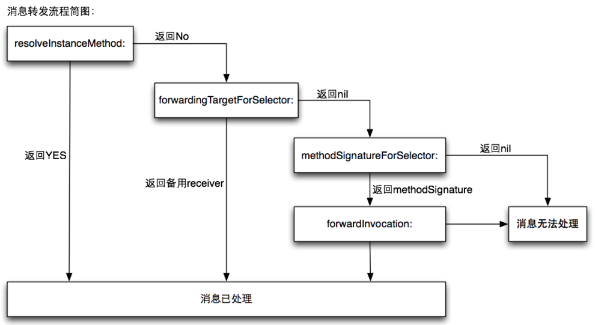

## 目录

[ffff](https://twitter.com/intent/tweet?text=让%20BAT%20的%20Offer%20不再难拿%20»&hashtags=&url=https://bestswifter.com/bat-interview/)


# 一、[Objective-C基础](https://github.com/lionsom/iOS-/blob/master/Objective-C基础.md)

* [1.1、iOS内存机制](#1.1)
	* [1.1.1、简述OC内存管理机制](#1.1.1)
	* [1.1.2、对MRC和ARC的理解，什么是ARC？ARC基本原理？ARC是为了解决什么问题诞生的？ARC不足的地方？](#1.1.2)
	* [1.1.3、ObjC中，与alloc语义相反的方法是dealloc还是release？需要与alloc配对使用的方法是dealloc还是release，为什么？与retain语义相反的方法是dealloc还是release，为什么？与retain配对使用的方法是dealloc还是release，为什么？](#1.1.3)
	* [1.1.4、为什么说Objective-C是一门动态的语言？iOS的动态性？](#1.1.4)
	* [1.1.5、[未完成]ARC情况下，编译的时候，系统是怎么添加相关内存管理的代码](#1.1.5)
	
	
* [1.2、@property属性](#1.2)
	* [1.2.1、@property 的本质是什么？ivar、getter、setter 是如何生成并添加到这个类中的？](#1.2.1)
	* [1.2.2、@synthesize 和 @dynamic 分别有什么作用？](#1.2.2)
	* [1.2.3、如何自己重写 setter / getter?](#1.2.3)
	* [1.2.4、@property中有哪些属性关键字？默认的关键字是什么？](#1.2.4)
	* [1.2.4.1、属性关键字 readwrite，readonly，assign，retain，copy，nonatomic 、atomic、strong、weak、unsafe_unretained 各是什么作用，在哪种情况下用？](#1.2.4.1)
	* [1.2.5、写一个 setter 方法用于完成 `@property (nonatomic, retain) NSString *name;`，写一个 setter 方法用于完成 `@property (nonatomic, copy) NSString *name;`](#1.2.5)
	* [1.2.6、什么情况使用 weak 关键字？相比 assign 有什么不同？](#1.2.6)
	* [1.2.6.1、对象回收时 weak 指针自动被置为 nil 是如何实现的？](#1.2.6.1)
	* [1.2.7、为什么assign不推荐用于修饰对象？](#1.2.7)
	* [1.2.7.1、什么是空指针、野指针？如何产生野指针？](#1.2.7.1)
	* [1.2.7.2、野指针的定位](#1.2.7.2)
	* [1.2.8、为什么我们常见的delegate属性都用是assign而不是retain/strong？](#1.2.8)
	* [1.2.8.1、为什么很多内置类如UITableViewControl的delegate属性都是assign而不是retain？请举例](#1.2.8.1)
	* [1.2.8.2、delegate的内存管理属性是weak还是assign？](#1.2.8.2)
	* [1.2.9、怎么用 copy 关键字？block用copy修饰吗？可以用其他修饰符吗？](#1.2.9)
	* [1.2.10、用@property声明的 NSString / NSArray / NSDictionary 经常使用 copy 关键字，为什么？如果改用strong关键字，可能造成什么问题？](#1.2.10)
	* [1.2.11、这个写法会出什么问题：`@property (copy) NSMutableArray *arr;`](#1.2.11)
	* [1.2.12、如何让自己的类用 copy 修饰符？](#1.2.12)
	* [1.2.13、对于深拷贝和浅拷贝的理解，系统对象 NSString/NSMutableString/NSArray/NSMutableArray 的 copy 与 mutableCopy 方法](#1.2.13) 
	* [1.2.14、类变量的 @public，@protected，@private，@package 声明各有什么含义？](#1.2.14)
   		
   		
* [1.3、autorelease/autoreleasePool](#1.3) -- 未完结
	* [1.3.1、一个 autorealese 对象在什么时刻释放](#1.3.1)
	* [1.3.2、方法里有局部对象， 出了方法后会立即释放吗？](#1.3.2)
	* [1.3.3、Autorelease原理](#1.3.3)
	* [1.3.4、Autorelease在类方法中的使用](#1.3.4)
	* [1.3.5、谈谈你对autoreleasePool自动释放池的理解，自动释放池的原理](#1.3.5)
	* [1.3.6、方法里有局部对象， 出了方法后会立即释放吗](#1.3.6)
	* [1.3.7、autoreleasePool自动释放池在 MRC和ARC 下的区别？](#1.3.7)
	* [1.3.8、多层自动释放池嵌套的对象在哪一层释放？](#1.3.8)
	* [1.3.9、autoreleasePool自动释放池的应用场景](#1.3.9)


* [1.4、iOS中的方法比较](#1.4)   
	* [1.4.1、+(void)load; +(void)initialize；区别？有什么用处？initialize方法如何调用,以及调用时机](#1.4.1)
	* [1.4.2、谈谈instancetype和id的异同？id和NSObject＊的区别？id 声明的对象有什么特性？](#1.4.2)
	* [1.4.3、UIView和CALayer是啥关系？](#1.4.3)
	* [1.4.4、isKindOfClass和isMemberOfClass的区别？](#1.4.4)
	* [1.4.5、frame 和 bounds 有什么不同？frame 和 bounds 分别是用来做什么的？frame 和 bound 一定都相等么？如果有不等的情况，请举例说明](#1.4.5)
	* [1.4.6、imageName 和 imageWithContextOfFile 的区别？哪个性能高？](#1.4.6)
	* [1.4.7、layoutSubview 和 drawRect 比较？使用drawRect有什么影响？](#1.4.7)
	* [1.4.8、loadView是干嘛用的？viewWillLayoutSubView你总是知道的](#1.4.8)


* [1.5、iOS编程中一些基础](#1.5)    
	* [1.5.1、iOS中数据持久化存储方案有哪些？各自使用场景？](#1.5.1)
	* [1.5.2、沙盒的目录结构是怎样的？各自一般用于什么场合？](#1.5.2)
	* [1.5.3、介绍下内存的几大区域？内存中的栈和堆的区别是什么？那些数据在栈上，哪些在堆上？](#1.5.3)
	* [1.5.4、#import跟 #include 有什么区别，@class呢，#import<> 跟 #import””有什么区别？](#1.5.4)
	* [1.5.5、#define和const定义的变量，有什么区别？](#1.5.5)
	* [1.5.6、static、extern有什么作⽤?](#1.5.6)   
	* [1.5.7、NSString存储类型](#1.5.7)
	* [1.5.7.1、判断两个NSString的字面量是否相同，为什么要用isEqualToString来判断，而不能用==或isEqual来判断呢？](#1.5.7.1)
	* [1.5.8、NSCache与可变集合有几点不同](#1.5.8)
	* [1.5.9、什么是谓词？谓词的简单使用？](#1.5.9)
	* [1.5.10、iOS逆向传值的几种方法整理](#1.5.10)
	* [1.5.11、浅谈iOS开发中方法延迟执行的几种方式](#1.5.11)
	* [1.5.11.1、计时器有哪些？NSTimer创建后，会在哪个线程运行？如何让计时器调用一个类方法？](#1.5.11.1)
	* [1.5.11.2、使用CADisplayLink、NSTimer有什么注意点？](#1.5.11.2)
	* [1.5.12、怎样实现一个singleton的类？如何释放一个单例类？单例的好处与坏处？](#1.5.12)
	* [1.5.13、如何令⾃⼰所写的对象具有拷⻉功能？](#1.5.13)
	* [1.5.14、如何重写类的方法？](#1.5.14)
	* [1.5.15、协议是什么？有什么作用？](#1.5.15)
	* [1.5.16、请用简单的代码展示@protocol的定义及实现](#1.5.16)
	* [1.5.17、简述NotificationCenter、KVC、KVO、Delegate？并说明它们之间的区别？](#1.5.17)
	* [1.5.18、dealloc什么时候调用？[super dealloc]何时调用？ARC下dealloc过程？](#1.5.18)
	* [1.5.19、iOS中nil 、Nil、 NULL 、NSNull介绍](#1.5.19)
    
* [1.6、iOS中一些机制和原理](#1.6)   
	* [1.6.1、简单说一下APP的生命周期](#1.6.1)
	* [1.6.2、简单说一下APP的启动过程,从main文件开始说起](#1.6.2)
	* [1.6.3、简单说一下UIViewController的生命周期](#1.6.3)
	* [1.6.4、简单说一下UIView的生命周期](#1.6.4)
	* [1.6.5、谈谈事件响应链，如何响应view之外的事件](#1.6.5)
	* [1.6.6、事件传递链，页面上一个按钮，按钮和它的superView有一样的action,为什么只执行button的action？](#1.6.6)
	* [1.6.7、iOS里面的手势是如何实现的?](#1.6.7)
	* [1.6.8、简单介绍下APNS](#1.6.8)
	* [1.6.9、UITableView的重用机制](#1.6.9)
 	* [1.6.10、静态库和动态库介绍？](#1.6.10)
 	* [1.6.11、静态库的原理是什么？你有没有⾃⼰写过静态编译库，遇到了哪些问题？](#1.6.11)
 	* [1.6.12、你是否接触过OC中的反射机制？简单聊一下概念和使用？](#1.6.12)

* [1.7、其他](#1.7)    
	* [1.7.1、C++引用和指针区别](#1.7.1)
	* [1.7.2、对于Objective-C，你认为它最大的优点和最大的不足是什么？对于不足之处，现在有没有可用的方法绕过这些不足来实现需求。如果可以的话，你有没有考虑或者实践过重新实现OC的一些功能，如果有，具体会如何做？](#1.7.2)
	

* [二、Runtime](#二)
	* [2.1、什么是 Runtime？Runtime实现的机制是什么？](#2.1)
	* [2.、Runtime如何通过selector找到对应的IMP地址]()
	* [2.、一个objc对象的isa的指针指向什么？有什么作用？]()
	* [2.、isa与IMP区别]()
	* [2.、isa、Class介绍]()
	* [2.、消息发送与转发]()
	* [2.、runtime如何使用]()
	* [2.、_objc_msgForward 函数是做什么的，直接调用它将会发生什么？]()
	* [2.、你使用过Objective-C的运行时编程（Runtime Programming）么？如果使用过，你用它做了什么？]()
	* [2.、对于语句 `NSString *obj =[[NSData alloc] init]; `obj在编译时和运行时分别是什么类型的对象?]()
	* [2.、runtime使用场景？]()
   * [1.6、消息发送]()
		* [1.、谈谈消息转发机制实现]()
		* [1.、空指针，野指针，僵尸对象]()
		* [2.2、message send如果寻找不到相应的对象，会如何进行后续处理 ？](#2.2)
    	* [1.、objc在向⼀个对象发送消息时，发⽣了什么？]()
   	 	* [1.、Objc中向一个nil对象发送消息会怎样]()
    	* [1.、objc在向⼀个野指针发送消息时，发⽣了什么？]()
    	* [1.、为什么其他语言里叫函数调用， objective c里则是给对象发消息（或者谈下对runtime的理解）]()
	
	
	
* [三、Runloop](#三)
	* [3.、什么是 RunLoop？Runloop内部实现逻辑？](#3.)
	* [3.、Runloop是来做什么的？Runloop和线程有什么关系？主线程默认开启了Runloop
么？⼦线程呢？](#3.)
	* [3.、RunLoop 有几个model，分别是什么？mode作用？](#3.)
	* [3.、以 `+ scheduledTimerWithTimeInterval...` 的⽅式触发的timer，在滑动⻚⾯上的
列表时，timer会暂定回调，为什么？如何解决？](#3.)
	* [3.、Runloop和线程的关系？](#3.)
	* [3.、](#3.)

* [四、KVC & KVO](#四)
	* [4.、KVC的底层实现？应用在哪些场景？](#4.)
	* [4.、KVO的底层实现？应用在哪些场景？](#4.)
	* [4.、iOS用什么方式实现对一个对象的KVO？(KVO的本质是什么？)](#4.)
	* [4.、如何⼿动触发⼀个value的KVO](#4.)
	* [4.、如何手动触发KVO？](#4.)
	* [4.、直接修改成员变量会触发KVO么？](#4.)
	* [4.、通过KVC修改属性会触发KVO么？](#4.)
	* [4.、KVC的赋值和取值过程是怎样的？原理是什么？](#4.)
	* [4.、如何访问并修改一个类的私有属性？](#4.)
	* [4.、NSNotification和KVO的区别和用法是什么？什么时候应该使用NSNotification，什么时候应该使用KVO？它们的实现上有什么区别吗？如果用protocol和delegate（或者delegate的Array）来实现类似的功能可能吗？如果可能，会有什么潜在的问题？如果不能，为什么？](#4.)
	* [4.、](#4.)
	* [4.、](#4.)

* [五、多线程](#五)
	* [5.、iOS多线程有哪几种实现方法？](#5.)
	* [5.、GCD执行原理？](#5.)
	* [5.、GCD中有哪些队列？分别是并行还是串行？](#5.)
	* [5.、GCD里面有哪几种Queue？你自己建立过串行queue吗？背后的线程模型是什么样的？](#5.)
	* [5.、GCD的queue，main queue中执行的代码，一定是在main thread么？](#5.)
	* [5.、NSOperationQueue有哪些使用方式](#5.)
	* [5.、GCD 与 NSOperation 的区别](#5.)
	* [5.、OC中创建线程的方法是什么？如果在主线程中执行代码，方法是什么？](#5.)
	* [5.、有 A B C D 四个任务，他们分别工作在不同的线程中，使得 A B C 完成之后D 任务才能执行，有哪些方式？](#5.)
	* [5.、线程间怎么通信?](#5.)
	* [5.、多线程种类有哪些？想要一个界面延缓显示，用NSOpration应该怎么做？](#5.)
	* [5.、线程安全：有一个数组，多方读写，容易出现什么问题，应该怎么解决？](#5.)
	* [5.、线程安全的处理手段有哪些？ 1.加锁 2.同步执行]()
	* [5.、串行／异步  并行／并发 的概念和区别？](#5.)
	* [5.、OC你了解的锁有哪些？在你回答基础上进行二次提问；](#5.)
	* [5.、追问一：自旋和互斥对比？](#5.)
	* [5.、追问二：使用以上锁需要注意哪些？](#5.)
	* [5.、追问三：用C/OC/C++，任选其一，实现自旋或互斥？口述即可！](#5.)
	* [5.、](#5.)
	* [5.、](#5.)
	
	
* [六、核心动画块 & 绘图](#六)
	* [6.、YYAsyncLayer如何异步绘制？]()
	* [6.、什么是 OpenGL、Quartz 2D？]()
	* [6.、是否使用过CoreText或者CoreImage等？如果使用过，请谈谈你使用CoreText或者CoreImage的体验。]()
	* [6.、UIView如何需要重新绘制整个界面,需要调用什么方法?]()
	* [6.、UlView的setNeedsDisplay和setNeedsLayout方法]()
	* [6.、layoutSubViews & drawRects](https://www.jianshu.com/p/17eb5e095dd7)
	* [6.、如何绘制UIView?]()
	* [6.、使用drawRect有什么影响？]()
	* [6.、Core开头的系列的内容。是否使用过CoreAnimation和CoreGraphics。UI框架和CA，CG框架的联系是什么？分别用CA和CG做过些什么动画或者图像上的内容。（有需要的话还可以涉及Quartz的一些内容）]()
	* [6.、]()
	* [6.、]()
	
	
* [七、Block]()
	* [7.、什么是block？block的原理是怎样的？本质是什么？]()
	* [7.、谈谈你对block和delegate的理解？使用block和使用delegate完成委托模式有什么优点？]()
	* [7.、block的注意点]()
	* [7.、block在ARC中和传统的MRC中的行为和用法有没有什么区别，需要注意些什么？]()
	* [7.、block引用变量]()
	* [7.、__block的作用是什么？有什么使用注意点？]()
	* [7.、block 内部为什么不能修改局部变量,需要加__block]()
	* [7.、__block在ARC和MRC下含义一样吗？]()
	* [7.、__block和__weak修饰符的区别？]()
	* [7.、什么时候block会出现循环引用，如何解决？]()
	* [7.、block中的weak self，是任何时候都需要加的么？]()
	* [7.、使⽤系统的某些block api（如UIView的block版本写动画时），是否也考虑引⽤
循环问题？]()
	* [7.、block在修改NSMutableArray，需不需要添加__block？]()
	* [7.、block的属性修饰词为什么是copy？使用block有哪些使用注意？]()
	* [7.、GCD跟Block使用需要注意什么?]()
	* [7.、]()
	* [7.、]()

* [八、Category、Extension]()
	* [8.、Category的实现原理]()
	* [8.、分别描述类别（categories）和延展（extensions）是什么？以及两者的区别？]()
	* [8.、谈谈category和extension区别，系统如何底层实现category]()
	* [8.、category中能不能使用声明属性？为什么？如果能，怎么实现？]()
	* [8.、Category能否添加成员变量？如果可以，如何给Category添加成员变量？]()
	* [8.、为什么Category只能为对象添加方法，却不能添加成员变量？]()
	* [8.、Category（类别）、Extension（扩展）和继承的区别]()
	* [8.、Category的使用场合是什么？]()
	* [8.、Category中有load方法吗？load方法是什么时候调用的？load 方法能继承吗？]()
	* [8.、]()
	* [8.、]()

* [九、网络]()	
	* [9.、画一下网络五层协议，分别说说各层都做了什么事情？tcp在哪一层？]()
	* [9.、什么是 TCP / UDP？TCP和UDP的区别是什么？]()
	* [9.、ICMP报文类型有几种，作用在网络中的哪一层]()
	* [9.、画一下tcp的建立连接和断开连接的过程，并说说标志位(ACK, ASN,FIN)的作用]()
	* [9.、HTTP协议中 POST 方法和 GET 方法有那些区别?]()
	* [9.、https 与 http 的区别， 画一下https通信的示意图，非对称加密和对称加密加密的对象分别是什么]()
	* [9.、百度搜索iOS，具体细节是什么？也就是http的全过程]()
	* [9.、如何处理多个网络请求并发的情况]()
	* [9.、在网络请求中如何提高性能]()
	* [9.、在网络请求中如何保证安全性]()
	* [9.、如何自己实现GET缓存?]()
	* [9.、Http协议30x的错误是什么]()
	* [9.、NSURLSession在什么情况下回存在循环引用的问题,怎么解决?]()
	* [9.、]()
	* [9.、]()

* [十、架构]()	
	* [10.、谈谈对MVC的理解，画出MVC各层的关系]()
	* [10.、MVC、MVVM架构，MVC 和 MVVM 的区别？]()
	* [10.、什么是MVVM？主要目的是什么？优点有哪些？]()
	* [10.、设计模式是什么？ 你知道哪些设计模式，并简要叙述？]()
	* [10.、哪些类不适合使用单例模式？即使他们在周期中只会出现一次。]()
	* [10.、用伪代码写一个线程安全的单例模式]()
	* [10.、如何架构一个APP]()
	* [10.、]()
	* [10.、]()
	
* [十一、数据结构]()
	* [11.、堆、栈、队列的区别]()
	* [11.、数组和链表的区别]()
	* [11.、链表的结构]()
	* [11.、实现一个栈的结构，先进后出的 / 模拟栈操作]()
	* [11.、链表翻转 / 就地反序单向链表]()
	* [11.、怎么判断链表有环？]()
	* [11.、二叉树的概念，时间复杂度多少？]()
	* [11.、二叉树的前序、中序、后序遍历？]()
	* [11.、二分查找 θ(logn)]()
	* [11.、冒泡排序 θ(n^2)]()
	* [11.、快速排序 θ(nlogn)]()
	* [11.、不用中间变量,用两种方法交换A和B的值]()
	* [11.、求最大公约数]()
	* [11.、100数的数组求Top10 / 1亿个数求Top10]()
	* [11.、A、B两个int数组，得到A数组中B数组不包含的元素]()
	* [11.、]()
	* [11.、]()

	
* [三、调试](#三)

1. BAD_ACCESS在什么情况下出现？
1. lldb（gdb）常用的控制台调试命令？

* [十二、数据库](#三)
	* [12.、用过coredata或者sqlite吗？读写是分线程的吗？遇到过死锁没？咋解决的？]()
	* [12.、SQL语句问题：inner join、left join、right join的区别是什么？]()
	* [12.、说一下数据库的ACID，事务 和 范式]()
	* [12.、范式是什么，具体讲解一下]()
	* [12.、了解过CDN吗]()
	* [12.、数据库选择原因（realm 、coreData、FMDB、Sqlite）]()
	* [12.、数据库做过哪些优化]()
	* [12.、]()
	* [12.、]()

* [十三、项目中的应用简述](#三)
	* [12.、讲述一次在这个APP中，用户触发了一个事件，引起了一个服务请求，然后获取服务端返回，并且更新前端界面的过程。请说的详细一点，比如数据经过了哪些类的处理，每一次传递时的格式是怎么样的？]()
	* [12.、麻烦你设计个简单的图片内存缓存器（移除策略是一定要说的）]()
	* [12.、在自己的项目中有遇到了什么棘手的问题吗？怎么解决的？]()
	* [12.、描述下IM系统如何保证消息不丢]()
	* [12.、IM数据库如何设计表]()
	* [12.、有了解过检测循环引用的检测工具吗？如果让你来做一个检测工具，你会怎么做]()
	* [12.、简单描述一下客户端的缓存机制?]()
	* [12.、项目中如何进行调试和测试]()
	* [12.、]()

* [十四、经典三方库](#三)
	* [14.、SDWebImage里面给UIImageView加载图片的逻辑是什么样的？（把UIImageView放到UITableViewCell里面问更赞）]()
	* [12.、bugly的卡顿监控原理]()
	* [12.、]()
	* [12.、]()


* [十五、性能优化]()
	* [12.、讲讲你用Instrument优化动画性能的经历吧]()
	* [12.、优化你是从哪几方面着手？从UI优化说起，然后到内存优化、APP启动优化、包体量优化、网络请求优化等等]()
	* [12.、retain cycle有哪些？如何避免retain cycle？]()
	* [12、什么是内存泄漏？]()
	* [12.、开发项目时你是怎么检查内存泄露？]()
	* [12.、如何高性能的给 UIImageView 加个圆角?]()
	* [12.、列表卡顿的原因可能有哪些？如何去优化UITableVIew？]()
	* [12.、如何对定位和分析项⽬中影响性能的地⽅？以及如何进⾏性能优化？]()
	* [12.、如何对iOS设备进行性能测试？]()
	* [12.、]()
	* [12.、]()


* [十三、查看代码](#三)

1. 代码纠错

```
@implementation Son : Father
- (id)init {
   if (self = [super init]) {
       NSLog(@"%@", NSStringFromClass([self class])); // Son
       NSLog(@"%@", NSStringFromClass([super class])); // Son
   }
   return self;
}
@end
// 解析：
self 是类的隐藏参数，指向当前调用方法的这个类的实例。
super是一个Magic Keyword，它本质是一个编译器标示符，和self是指向的同一个消息接收者。
不同的是：super会告诉编译器，调用class这个方法时，要去父类的方法，而不是本类里的。
上面的例子不管调用[self class]还是[super class]，接受消息的对象都是当前 Son *obj 这个对象。
```

1. 写一个完整的代理，包括声明、实现

```
// 创建
@protocol MyDelagate
@required
-(void)eat:(NSString *)foodName; 
@optional
-(void)run;
@end

//  声明 .h
@interface person: NSObject<MyDelagate>

@end

//  实现 .m
@implementation person
- (void)eat:(NSString *)foodName { 
   NSLog(@"吃:%@!", foodName);
} 
- (void)run {
   NSLog(@"run!");
}

@end
```

1. 以下代码运行结果如何？

```
- (void)viewDidLoad {
    [super viewDidLoad];
    NSLog(@"1");
    dispatch_sync(dispatch_get_main_queue(), ^{
        NSLog(@"2");
    });
    NSLog(@"3");
}
// 只输出：1。（主线程死锁）
```


===========
----------
--------------
--------------

---------------
--------------

---------------
--------------

---------------
--------------

---------------
--------------

---------------
--------------

---------------
--------------

---------------
--------------

---------------
--------------

---------------

---------------


## <h2 id="1.4">1.4、谈谈消息转发机制实现</h2>

[iOS Runtime详解](https://www.jianshu.com/p/6ebda3cd8052)

当对象收到无法解读的消息时，就会启动“消息转发”机制。

动态方法解析 resolveInstanceMethod

备用接收者 forwardingTargetForSelector

完整消息转发 methodSignatureForSelector  forwardInvocation




## <h2 id="1.4">1.4、objc在向⼀个对象发送消息时，发⽣了什么？</h2>


objc在向一个对象发送消息时，runtime库会根据对象的isa指针找到该对象实际所属的类，然后在该类中的方法列表以及其父类方法列表中寻找方法运行，然后在发送消息的时候，objc_msgSend方法不会返回值，所谓的返回内容都是具体调用时执行的。

根据对象的isa指针找到该对象所属的类，去obj的对应的类中找方法

1.首先，在相应操作的对象中的缓存方法列表中找调用的方法，如果找到，转向相应实现并执行。

2.如果没找到，在相应操作的对象中的方法列表中找调用的方法，如果找到，转向相应实现执行

3.如果没找到，去父类指针所指向的对象中执行1，2.

4.以此类推，如果一直到根类还没找到，转向拦截调用，走消息转发机制。

5.如果没有重写拦截调用的方法，程序报错。


## <h2 id="1.4">1.4、Objc中向一个nil对象发送消息会怎样</h2>

如果向一个nil对象发送消息，首先在寻找对象的isa指针时就是0地址返回了，所以不会出现任何错误。也不会崩溃。


## <h2 id="1.4">1.4、为什么其他语言里叫函数调用， objective c里则是给对象发消息（或者谈下对runtime的理解）</h2>


C语言：调用函数的语言在声明完函数后,如果没有实现函数,程序是无法编译通过的。

OC：程序是可以编译通过的,但是会有一个黄色的警告。只有当程序运行之后才会出现崩溃。

消息传递和调用函数对于程序员来说最大的区别就在于源代码编译的过程中是否能够编译通过.
解释消息传递机制的原理就要用到OC语言中的运行时系统(Runtime)了.


## <h2 id="1.3">1.3、iOS中nil 、Nil、 NULL 、NSNull，你真的了解吗？</h3>

* **nil**

nil是指向OC中对象的空指针。

```
示例代码：
 NSString *someString = nil;
 NSURL *someURL = nil;
 id someObject = nil;
 if (anotherObject == nil)     // do something
```

* **Nil**

定义一个空的类

```
示例代码：　　
 Class someClass = Nil;　
 Class anotherClass = [NSString class];
```

* **NULL**

NULL可以用在C语言的各种指针上。

```
示例代码：
 int *pointerToInt = NULL;　　　　
 char *pointerToChar = NULL;　　
 struct TreeNode *rootNode = NULL;
```

* **NSNull**

NSNull是一个类，它定义了一个单例对象用于表示集合对象的空值

NSNull是用于表示空值对象的类。

NSNull经常用于NSArray、NSDictionary等，因为它们不能存储nil值，所以使用NSNull来代替nil。

```
//错误写法：nil为数组结束标志，所以此时该数组的count=2，所以数组不能存储nil值。
NSArray *array = [[NSArray array]initWithObjects:@"1",@"2",nil,@"4", nil];
//正确写法：[NSNull null]通常可以作为数组的占位符。
NSArray *array = [[NSArray array]initWithObjects:@"1",@"2",[NSNull null],@"4", nil];

NSMutableDictionary *dict = [NSMutableDictionary dictionary];
//错误写法，会出现编译错误。
[dict setObject:nil forKey:@"key"]; 
//正确写法
[dict setObject:[NSNull null] forKey:@"key"];
```


<h2 id="二">二、Runtime </h2>


[iOS Runtime详解](https://www.jianshu.com/p/6ebda3cd8052)

<h2 id="2.1">2.1、什么是 Runtime？Runtime实现的机制是什么？</h2>

**问：什么是 Runtime？**

1. runtime是一套比较底层的纯C语言API, 属于1个C语言库, 包含了很多底层的C语言API;

2. 平时编写的OC代码, 在程序运行过程中, 其实最终都是转成了runtime的C语言代码, runtime算是OC的幕后工作者;

3. Objective-C 扩展了 C 语言，并加入了面向对象特性和 Smalltalk 式的消息传递机制。而这个扩展的核心是一个用 C 和 编译语言 写的 Runtime 库。它是 Objective-C 面向对象和动态机制的基石。


<h2 id="1.4">1.4、Runtime如何通过selector找到对应的IMP地址</h2>


## <h2 id="1.4">1.4、你使用过Objective-C的运行时编程（Runtime Programming）么？如果使用过，你用它做了什么？</h2>


* 关联对象(Objective-C Associated Objects)给分类增加属性
* 方法魔法(Method Swizzling)方法添加和替换和KVO实现
* 消息转发(热更新)解决Bug(JSPatch)
* 实现NSCoding的自动归档和自动解档
* 实现字典和模型的自动转换(MJExtension)

作者：jackyshan
鏈接：https://www.jianshu.com/p/6ebda3cd8052
來源：簡書
簡書著作權歸作者所有，任何形式的轉載都請聯繫作者獲得授權並註明出處。


1、方法交换：替换NSArray类避免崩溃；替换NSURL解决中文字符问题；利用 runtime 一键改变字体;UIButton同时点击&&重复点击规避;

2、使用Runtime获取变量以及属性：归档解档

```
// runtime中获取某类的所有变量(属性变量以及实例变量)API：
Ivar *class_copyIvarList(Class cls, unsigned int *outCount)

// 获取某类的所有属性变量API：
objc_property_t *class_copyPropertyList(Class cls, unsigned int *outCount)
```


3、用runtime解耦取消依赖：

```
+ (UIViewController *)BookDetailComponent_viewController:(NSString *)bookId {
   Class cls = NSClassFromString(@"BookDetailComponent");
   return [cls performSelector:NSSelectorFromString(@"detailViewController:") withObject:@{@"bookId":bookId}];
}
```

4、KVO实现

Apple 使用了 isa-swizzling 来实现 KVO 。当观察对象A时，KVO机制动态创建一个新的名为：NSKVONotifying_A的新类，该类继承自对象A的本类，且 KVO 为 NSKVONotifying_A 重写观察属性的 setter 方法，setter 方法会负责在调用原 setter 方法之前和之后，通知所有观察对象属性值的更改情况。

在这个过程，被观察对象的 isa 指针从指向原来的 A 类，被KVO 机制修改为指向系统新创建的子类NSKVONotifying_A 类，来实现当前类属性值改变的监听；
所以当我们从应用层面上看来，完全没有意识到有新的类出现，这是系统“隐瞒”了对 KVO 的底层实现过程，让我们误以为还是原来的类。但是此时如果我们创建一个新的名为“NSKVONotifying_A”的类，就会发现系统运行到注册 KVO 的那段代码时程序就崩溃，因为系统在注册监听的时候动态创建了名为 NSKVONotifying_A 的中间类，并指向这个中间类了。


## <h2 id="1.4">1.4、对于语句NSString *obj =[[NSData alloc] init]; obj在编译时和运行时分别是什么类型的对象?</h2>

编译时是NSString的类型;运行时是NSData类型的对象。

原因如下：
首先，声明 NSString *obj 是告诉编译器，obj是一个指向某个Objective-C对象的指针。因为不管指向的是什么类型的对象，一个指针所占的内存空间都是固定的，所以这里声明成任何类型的对象，最终生成的可执行代码都是没有区别的。这里限定了NSString只不过是告诉编译器，请把obj当做一个NSString来检查，如果后面调用了非NSString的方法，会产生警告。

接着，你创建了一个NSData对象，然后把这个对象所在的内存地址保存在obj里。那么运行时，obj指向的内存空间就是一个NSData对象。你可以把obj当做一个NSData对象来用。


* [二、Runtime](#二)
	* [2.1、什么是 Runtime？Runtime实现的机制是什么？](#2.1)
	* [2.2、message send如果寻找不到相应的对象，会如何进行后续处理 ？](#2.2)
	* [2.、Runtime如何通过selector找到对应的IMP地址]()
	* [2.、一个objc对象的isa的指针指向什么？有什么作用？]()
	* [2.、isa、Class介绍]()
	* [2.、消息发送与转发]()
	* [2.、runtime如何使用]()
	* [2.、_objc_msgForward 函数是做什么的，直接调用它将会发生什么？]()
	* [2.、你使用过Objective-C的运行时编程（Runtime Programming）么？如果使用过，你用它做了什么？]()
	* [2.、对于语句NSString *obj =[[NSData alloc] init]; obj在编译时和运行时分别是什么类型的对象?]()


<h1 id="三">三、Runloop</h1>

[iOS 多线程：『RunLoop』详尽总结](https://www.jianshu.com/p/d260d18dd551)

## <h2 id="3.1">3.1、什么是 RunLoop？Runloop内部实现逻辑？</h2>

**什么是 RunLoop？**

Run loops是线程相关的的基础框架的一部分。一个run loop就是一个事件处理的循环，用来不停的调度工作以及处理输入事件。其实内部就是do－while循环，这个循环内部不断地处理各种任务（比 如Source，Timer，Observer）。使用run loop的目的是让你的线程在有工作的时候忙于工作，而没工作的时候处于休眠状态。


## <h2 id="3.1">3.1、RunLoop 有几个model，分别是什么？mode作用？</h2>

系统默认注册了5个Mode:

（1）kCFRunLoopDefaultMode: App的默认 Mode，通常主线程是在这个 Mode 下运行的。

（2）UITrackingRunLoopMode: 界面跟踪 Mode，用于 ScrollView 追踪触摸滑动，保证界面滑动时不受其他 Mode 影响。

（3）UIInitializationRunLoopMode: 在刚启动 App 时第进入的第一个 Mode，启动完成后就不再使用。

（4）GSEventReceiveRunLoopMode: 接受系统事件的内部 Mode，通常用不到。

（5）kCFRunLoopCommonModes: 这是一个占位的 Mode，没有实际作用。


## <h2 id="3.1">3.1、Runloop和线程有什么关系？主线程默认开启了Runloop么？⼦线程呢？</h2>

**Runloop和线程有什么关系？**

RunLoop 和线程是息息相关的，我们知道线程的作用是用来执行特定的一个或多个任务，在默认情况下，线程执行完之后就会退出，就不能再执行任务了。这时我们就需要采用一种方式来让线程能够不断地处理任务，并不退出。所以，我们就有了 RunLoop。

1、一条线程对应一个RunLoop对象，每条线程都有唯一一个与之对应的 RunLoop 对象。

2、RunLoop 并不保证线程安全。我们只能在当前线程内部操作当前线程的 

3、RunLoop 对象，而不能在当前线程内部去操作其他线程的 RunLoop 对象方法。

4、RunLoop 对象在第一次获取 RunLoop 时创建，销毁则是在线程结束的时候。

5、主线程的 RunLoop 对象系统自动帮助我们创建好了（原理如 1.3 所示），而子线程的 RunLoop对象需要我们主动创建和维护。


**⼦线程呢？**

子线程的 RunLoop 需要手动启动;
每次RunLoop启动时,只能指定其中一个 Mode,这个Mode被称作 CurrentMode,

如果需要切换 Mode,只能退出 Loop,再重新指定一个 Mode 进入,这样做主要是为了隔离不同 Mode 中的 Source、Timer、Observer,让其互不影响 


## <h2 id="3.1">3.1、当NSTimer `+scheduledTimerWithTimeInterval...` 的⽅式触发的timer，在滑动⻚⾯上的列表时，timer会暂定回调，为什么？如何解决？</h2>

```
	// 定义一个定时器，约定两秒之后调用self的run方法
    NSTimer *timer = [NSTimer timerWithTimeInterval:2.0 target:self selector:@selector(run) userInfo:nil repeats:YES];

    // 将定时器添加到当前RunLoop的NSDefaultRunLoopMode下
    [[NSRunLoop currentRunLoop] addTimer:timer forMode:NSDefaultRunLoopMode];
```


**问：在滑动⻚⾯上的列表时，timer会暂定回调，为什么？**

当我们不做任何操作的时候，RunLoop处于NSDefaultRunLoopMode下。

而当我们拖动Text View的时候，RunLoop就结束NSDefaultRunLoopMode，切换到了UITrackingRunLoopMode模式下，这个模式下没有添加NSTimer，所以我们的NSTimer就不工作了。

但当我们松开鼠标的时候，RunLoop就结束UITrackingRunLoopMode模式，又切换回NSDefaultRunLoopMode模式，所以NSTimer就又开始正常工作了。

当我们尝试 `[[NSRunLoop currentRunLoop] addTimer:timer forMode:UITrackingRunLoopMode];`，也就是将定时器添加到当前RunLoop的UITrackingRunLoopMode下，你就会发现定时器只会在拖动Text View的模式下工作，而不做操作的时候定时器就不工作。

**如何解决？**

这就用到了我们之前说过的伪模式（kCFRunLoopCommonModes），这其实不是一种真实的模式，而是一种标记模式，意思就是可以在打上Common Modes标记的模式下运行。

那么哪些模式被标记上了Common Modes呢？
NSDefaultRunLoopMode 和 UITrackingRunLoopMode。

所以我们只要我们将NSTimer添加到当前RunLoop的kCFRunLoopCommonModes（Foundation框架下为NSRunLoopCommonModes）下，我们就可以让NSTimer在不做操作和拖动Text View两种情况下愉快的正常工作了。

具体做法就是讲添加语句改为`[[NSRunLoop currentRunLoop] addTimer:timer forMode:NSRunLoopCommonModes];`


**NSTimer方法 `scheduledTimerWithTimeInterval 与 timerWithTimeInterval` 拓展**

既然讲到了NSTimer，这里顺便讲下NSTimer中的scheduledTimerWithTimeInterval方法和RunLoop的关系。添加下面的代码：

```
[NSTimer scheduledTimerWithTimeInterval:2.0 target:self selector:@selector(run) userInfo:nil repeats:YES];
```

这句代码调用了scheduledTimer返回的定时器，NSTimer会自动被加入到了RunLoop的NSDefaultRunLoopMode模式下。这句代码相当于下面两句代码：

```
NSTimer *timer = [NSTimer timerWithTimeInterval:2.0 target:self selector:@selector(run) userInfo:nil repeats:YES];
[[NSRunLoop currentRunLoop] addTimer:timer forMode:NSDefaultRunLoopMode];
```


## <h2 id="3.1">3.1、RunLoop 在项目中的应用？</h2>

1、NSTimer的使用 （参考上面）

2、ImageView推迟显示

当界面中含有UITableView，而且每个UITableViewCell里边都有图片。这时候当我们滚动UITableView的时候，如果有一堆的图片需要显示，那么可能会出现卡顿的现象。


解决方案1. 监听UIScrollView的滚动

因为UITableView继承自UIScrollView，所以我们可以通过监听UIScrollView的滚动，实现UIScrollView相关delegate即可。

解决方案2. 利用PerformSelector设置当前线程的RunLoop的运行模式
利用performSelector方法为UIImageView调用setImage:方法，并利用inModes将其设置为RunLoop下NSDefaultRunLoopMode运行模式。代码如下：

```
[self.imageView performSelector:@selector(setImage:) withObject:[UIImage imageNamed:@"tupian"] afterDelay:4.0 inModes:NSDefaultRunLoopMode];
```

3、后台常驻线程（很常用）

我们在开发应用程序的过程中，如果后台操作特别频繁，经常会在子线程做一些耗时操作（下载文件、后台播放音乐等），我们最好能让这条线程永远常驻内存。


* [三、Runloop](#三)
	* [3.、什么是 RunLoop？Runloop内部实现逻辑？](#3.)
	* [3.、Runloop是来做什么的？Runloop和线程有什么关系？主线程默认开启了Runloop么？⼦线程呢？](#3.)
	* [3.、RunLoop 有几个model，分别是什么？mode作用？](#3.)
	* [3.、以 `+ scheduledTimerWithTimeInterval...` 的⽅式触发的timer，在滑动⻚⾯上的
列表时，timer会暂定回调，为什么？如何解决？](#3.)
	* [3.、](#3.)

	
	
	
<h1 id="四">四、KVC & KVO</h1>

[iOS窥探KVO底层实现原理篇](https://www.jianshu.com/p/0aa83ac521ba)


## <h2 id="4.1">4.1、KVC的底层实现？应用在哪些场景？</h2>


**KVC的底层实现？**

```
当一个对象调用setValue:forKey: 方法时,方法内部会做以下操作:
 1.判断有没有指定key的set方法,如果有set方法,就会调用set方法,给该属性赋值
 2.如果没有set方法,判断有没有跟key值相同且带有下划线的成员属性(_key).如果有,直接给该成员属性进行赋值
 3.如果没有成员属性_key,判断有没有跟key相同名称的属性.如果有,直接给该属性进行赋值
 4.如果都没有,就会调用 valueforUndefinedKey 和setValue:forUndefinedKey:方法
```

**应用在哪些场景？**

赋值

取值

字典转模型


## <h2 id="4.1">4.1、KVO的底层实现？应用在哪些场景？</h2>

**KVO的底层实现？**

```
(1)KVO 是基于 runtime 机制实现的
(2)当一个对象(假设是person对象,对应的类为 JLperson)的属性值age发生改变时,系统会自动生成一个继承自JLperson的类NSKVONotifying_JLPerson,在这个类的 setAge 方法里面调用
    [super setAge:age];
    [self willChangeValueForKey:@"age"];
    [self didChangeValueForKey:@"age"];
 三个方法,而后面两个方法内部会主动调用
 -(void)observeValueForKeyPath:(NSString *)keyPath ofObject:(id)object change:(NSDictionary<NSString *,id> *)change context:(void *)context方法,在该方法中可以拿到属性改变前后的值.
```

继续探究 NSKVONotifying_Person 子类 重写 setName 都做了什么?
其实 setName 方法内部 是调用了 Foundation 的_NSSetObjectValueAndNotify 函数 ,在_NSSetObjectValueAndNotify 内部

1. 首先会调用 willChangeValueForKey
2. 然后给 name 属性赋值
3. 最后调用 didChangeValueForKey
4. 最后调用 observer 的 observeValueForKeyPath 去告诉监听器属性值发生了改变 .


**应用在哪些场景？**

作用:能够监听某个对象属性值的改变


## <h2 id="4.1">4.1、直接修改成员变量会触发KVO么？通过KVC修改属性会触发KVO么？如何手动触发KVO？</h2>

KVC 对属性赋值时候 是会在这个类里边 去查找 _age  isAge setAge setIsAge 等方法的 ,最终会调用属性的 setter 方法 ,那么如果添加了 KVO 还是会被触发的 .
相反 设置成员变量  _age 由于不会触发 setter 方法 ,因此不会去触发 KVO 相关的代码 .

**问：直接修改成员变量会触发KVO么？**

不会触发KVO

**问：通过KVC修改属性会触发KVO么？** 

会触发KVO

**问：如何手动触发KVO？**

手动调用willChangeValueForKey:和didChangeValueForKey:


	
* [四、KVC & KVO](#四)
	* [4.、KVC的底层实现？应用在哪些场景？](#4.)
	* [4.、KVO的底层实现？应用在哪些场景？](#4.)
	* [4.、iOS用什么方式实现对一个对象的KVO？(KVO的本质是什么？)](#4.)
	* [4.、如何⼿动触发⼀个value的KVO](#4.)
	* [4.、如何手动触发KVO？](#4.)
	* [4.、直接修改成员变量会触发KVO么？](#4.)
	* [4.、通过KVC修改属性会触发KVO么？](#4.)
	* [4.、KVC的赋值和取值过程是怎样的？原理是什么？](#4.)
	* [4.、如何访问并修改一个类的私有属性？](#4.)
	* [4.、NSNotification和KVO的区别和用法是什么？什么时候应该使用NSNotification，什么时候应该使用KVO？它们的实现上有什么区别吗？如果用protocol和delegate（或者delegate的Array）来实现类似的功能可能吗？如果可能，会有什么潜在的问题？如果不能，为什么？](#4.)


**问：什么是内存泄漏？**

[内存泄漏（Memory Leak）](https://baike.baidu.com/item/内存泄漏/6181425?fr=aladdin)是指程序中己动态分配的堆内存由于某种原因程序 **未释放或无法释放，造成系统内存的浪费**，导致程序运行速度减慢甚至系统崩溃等严重后果。


