# 一、正则表达式入门

**正则表达式（regular expression）**是处理文本的工具，用来完成 **搜索** 与 **替换** 操作。


**正则表达式语言构造出来的字符串就是正则表达式。**


【正则表达式 - 应用】

* 搜索

* 替换


# 二、匹配单个字符

## 2.1、匹配纯文本

* Ben是一个正则表达式，用来匹配文本中的Ben
* 有多个匹配结果
* 字母大小写

## 2.2、匹配任意字符 .

> .字符 可以匹配任何 **单个字符、字母、数字，甚至是.字符本身**。

```
【文本】
sales.xls
sales1.xls
orders.xls

【正则表达式】
sales.

【结果】
sales.
sales1
```

> 在同一个正则表达式中允许出现多个 **.字符** ，可以连续出现，也可以隔着出现。

```
【文本】
sales.xls
sales1.xls
orders.xls

【正则表达式】
.a..

【结果】
sale
sale
```

## 2.3、匹配特殊字符 \

> .字符在正则表达式中有特殊的含义，如果我们只想匹配.字符本身，而不是它在正则表达式中的特殊含义？？
>
> 【解决】
>
> 必须在 .字符前加上 **\字符** 来对它进行转义。**\字符** 是一个元字符 （meta character）。

```
【文本】
sales.xls
sales1.xls
orders.xls

【正则表达式】
es\.

【结果】
es.
```


# 三、匹配一组字符

## 3.1、匹配多个字符中的一个 []

> 元字符 [和] 定义一个字符集合，集合中任意一个字符匹配文本。
>
> 【注意】：字符大小写

```
【文本】
es.
eS.
Es.
ES.

【正则表达式】
[Ee][Ss]\.

【结果】
es.
eS.
Es.
ES.
```


## 3.2、字符集合区间 -

> 如下情况，用到字符区间0123456789，所以这里提供了 **-连字符**，它也是 **元字符**。

```
【文本】
1s.
2S.
3s.
4S.

【正则表达式】
[0123456789][Ss]\.
【优化】
[0-9][Ss]\.

【结果】
1s.
2S.
3s.
4S.


【重要】
一个字符集合可以有多个字符区间。

【正则表达式】
[0-9][A-Za-z0-9]\.

等价于
[0123456789][ABC...XYZabc...xyz012...789]\.

【结果】
1s.
2S.
3s.
4S.
```

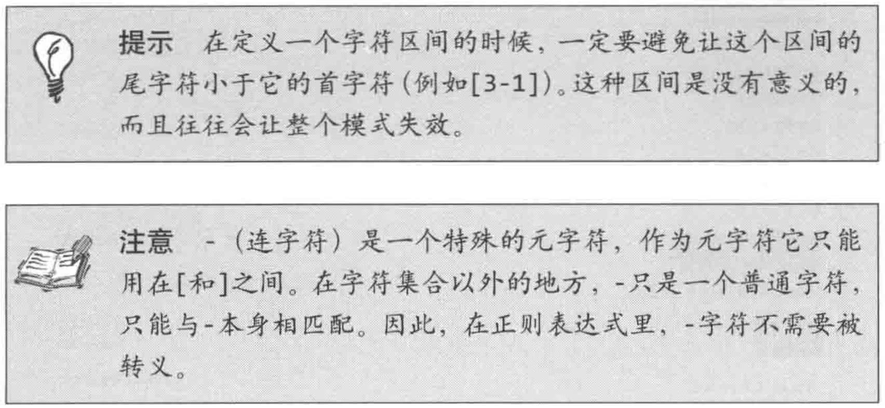


## 3.3、取非匹配 ^

>  **^字符** 为 元字符，对集合进行取非匹配。

```
【文本】
es1.
eS2.
Es.
ES.

【正则表达式】
[0-9]\.

【结果】
1.
2.

【正则表达式】
[^0-9]\.

【结果】
s.
S.
```


# 四、元字符

## 4.1、对特殊字符转义 \

【同 2.3】

## 4.2、匹配空白字符

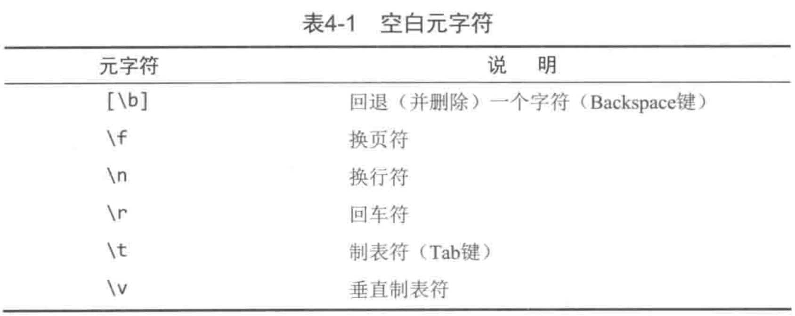

```
【文本】
es1.
eS2.
Es.
ES.

【正则表达式】
-- Mac --
\n
-- Windows --
\r\n

【结果】
匹配到3处
```

## 4.3、匹配特定的字符类别

### 4.3.1、匹配『数字』与『非数字』

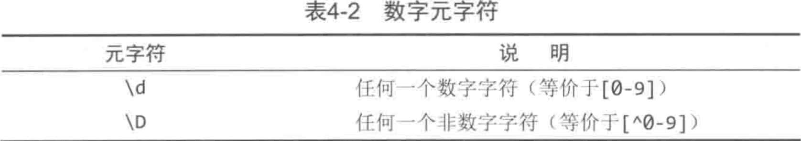

```
【文本】
es1.
eS2.
Es.
ES.

【正则表达式】
[Ss]\d

【结果】
s1
S2


【正则表达式】
[Ss]\D

【结果】
s.
S.
```

### 4.3.2、匹配『字母和数字』与『非字母和数字』

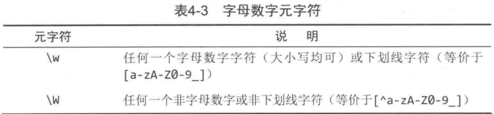

```
【文本】
es1.
eS2.
Es.
ES.

【正则表达式】
\w\.

【结果】
1.
2.
s.
S.


【文本】
es1.
eS2.
####.

【正则表达式】
\W\W\.

【结果】
##.
```

### 4.3.3、匹配『空白字符』与『非空白字符』

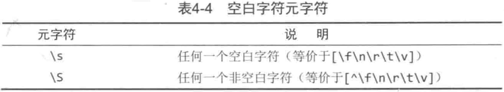

```
【文本】
abc
123

【正则表达式】
\s

【结果】
共匹配到1处


【正则表达式】
\S

【结果】
共找到 6 处匹配：
a
b
c
1
2
3
```

### 4.3.4、匹配十六进制或八进制数值


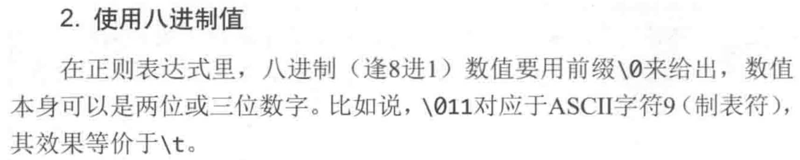


## 4.4、使用POSIX字符类

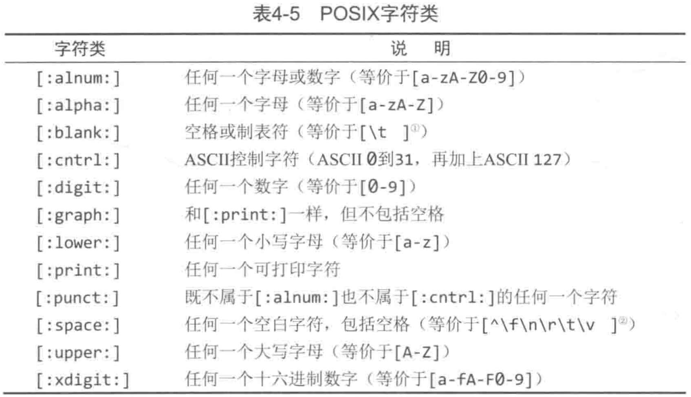

```
【文本】
abc123

【正则表达式】
[:alpha:]

【结果】
a
```


# 五、重复匹配

## 5.1、有多少个匹配


### 5.1.1、匹配1个或多个字符 +

> 若想匹配一个 **字符或字符集合** 重复多次，则在 **字符或字符集合** 后面加上 **+字符**，

```
【文本】
aaabbbccc123

【正则表达式】
c+\d+

【结果】
ccc123
```

### 5.1.2、匹配零个或多个字符 *

> 若想配合一个可有可无的字符，可以使用 *** 元字符**。

```
【文本】
ccccc123
ccccc@@@

【正则表达式】
c+\d*

【结果】
ccccc123
ccccc
```

### 5.1.3、匹配零个或1个字符 ？

> **? 元字符** 只能匹配一个 **字符或字符集合** 出现零次或1次。

```
【文本】
ccccc123

【正则表达式】
c?\d

【结果】
c1
2
3
```


## 5.2、匹配的重复次数

### 5.2.1、精确匹配次数 {n}

> **{3}元字符** 表示前一个 **字符或字符集合** 必须 **连续重复出现** 三次才算一次匹配。

```
【文本】
ccc123cc

【正则表达式】
c{3}

【结果】
ccc
```

### 5.2.2、匹配次数区间 {m, n}

```
【文本】
ccc123cc

【正则表达式】
c{2,4}

【结果】
ccc
cc
```

### 5.2.3、匹配『至少匹配次数』{m,}

```
【文本】
ccc123cc456c

【正则表达式】
c{2,}

【结果】
ccc
cc
```


## 5.3、『贪婪型』与『懒惰型』元字符


```
【文本】
<html>1234</html>  <html>abcd</html>

【正则表达式】
<html>.*</html>

【结果】
共找到 1 处匹配：
<html>1234</html>  <html>abcd</html>


【正则表达式】
<html>.*?</html>

【结果】
共找到 2 处匹配：
<html>1234</html>
<html>abcd</html>
```

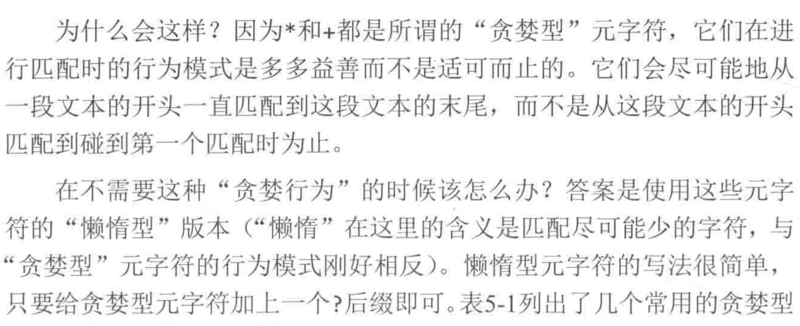

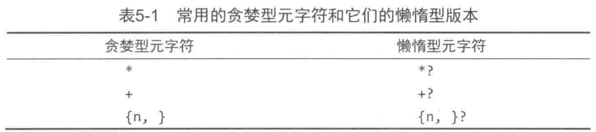


# 六、位置匹配

## 6.1、边界

```
【文本】
cat dcately

【正则表达式】
cat

【结果】：若cat替换dog，发现不是我们想要的
共找到 2 处匹配：
cat
cat
```


## 6.2、单词边界

> **边界限定符\b** 来指定 **单词边界**。（b是英文boundary边界的首字母）
>
> **\b 用来匹配一个单词的开始或结尾**。
>
> **\B 用来匹配非单词边界**。

```
【文本】
cat dcately

【正则表达式】
\bcat\b

【结果】
共找到 1 处匹配：
cat

【文本】
cater dcately

【正则表达式】
\bcat\B

【结果】
共找到 1 处匹配：
cat
```

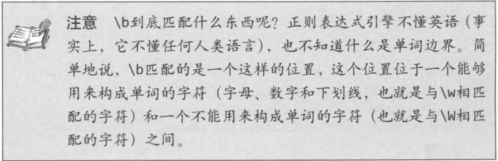


## 6.3、字符串边界

> **^元字符** 用来定义字符串的开头；
>
> **$元字符** 用来定义字符串的结尾。

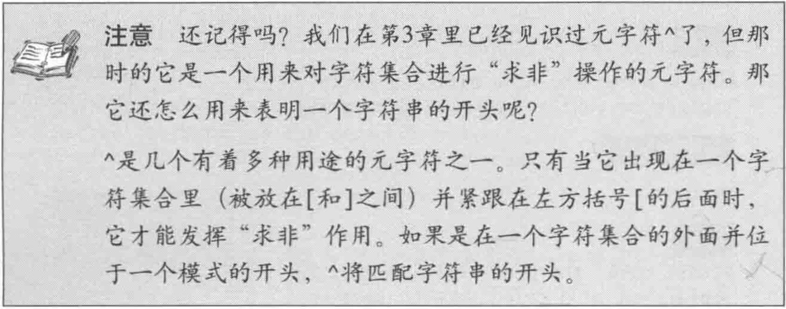

```
【文本】
cater dcately

【正则表达式】
^ca.*

【结果】
共找到 1 处匹配：
cater dcately


【正则表达式】
.*y$

【结果】
共找到 1 处匹配：
cater dcately
```


## 6.4、分行匹配模式 ?m


# 七、使用子表达式

> 子表达式作用：
>
> 1. 把一组字符编组为一个字符集合；
> 2. 定义回朔引用。（第八章）

## 7.1、什么是子表达式

```
【文本】
abbc123abbbabbbbc

【正则表达式】
ab{2,3}					// 表示b匹配2-3次，而不是ab匹配2-3次

【结果】
共找到 3 处匹配：
abb
abbb
abbb
```


## 7.2、子表达式 ()

```
【文本】
abbc123abbbabbbbc

【正则表达式】
(ab){2,3}					// 表示ab匹配2-3次

【结果】
共找到 3 处匹配：
ab
ab
ab
```


## 7.3、子表达式嵌套

> ( (ab){2,3} ) ccc


# [未读] 八、会朔引用：前后一致匹配


## 8.3、大小写转换

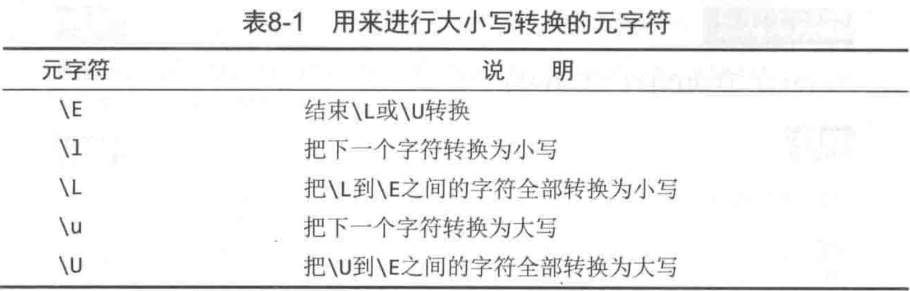


# [未读] 九、前后查找

> 正则作用：
>
> 1. 匹配文本；
> 2. 标记文本位置；


## 9.1、前后查找


# [未读] 十、嵌入条件


