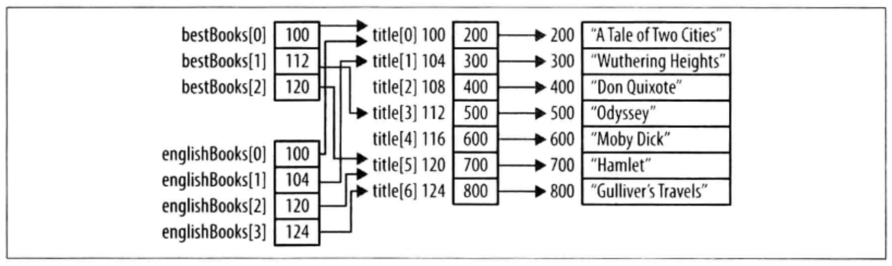

```
int num;
int *pi;
// 注解
星号将变量声明为指针。*是一个重载过的符号，因为它也用在乘法和解引指针上。
```


```
const int *pci;

// 阅读
1. pci是一个变量；
2. pci是一个指针变量；
3. pci是一个指向整数的指针变量；
4. pci是一个指向整数常量的指针变量
```


地址操作符（&） ：返回操作数的地址。

```
// 我们可以用&操作符来初始化pi指针
int num = 10;
int *pi = &num;
```


间接引用操作符（*）：返回指针变量指向的值，一般称为解引指针。

```
int num = 101;
int *pi = &num;
print("%p", *pi);

// 同样，也可以对指针指向的变量赋值
*pi = 102;
```


多层间接引用

```
// 1.创建一个数组
char *titles[] = {"AAA","BBB","CCC"};

// 2.声明两个数组
char **bestBook[2];
char **englishBook[1];

// 3.对这两个数组赋值
bestBook[0] = &titles[0];
bestBook[1] = &titles[1];
englishBook[0] = &titles[2];

// 这里的bestBook为指向指针的指针，有时候成为双重指针。
// 好处：例如上述，若titles指针指向的内容需要更改，只需要更改titles的指针即可，无需修改另外两个数组。
// 缺点：间接引用没有层级限制，使用层级过多会让人迷惑，难以维护。
```




指针与常量

```
0.指向非常量的指针
int num;
int *pi = &num;


1.指向常量的指针
int num = 100;
const int limit = 500;
int *pi; // 指向整数
const int *pci;		// 指向整数常量
pi = &num;
pci = &limit;

// 若
pci = &num;   ?????   合法，声明只是限制我们不能通过指针来修改引用的值。
*pci = 200;		?????   错误，指针认为自己指向整数常量，所以不允许用指针修改这个数。


2.指向非常量的常量指针
// 声明一个指向非常量的常量指针，这意味着指针不可变，但它指向的内容可以改变。
// cpi 必须被初始化指向非常量变量；
// cpi 不能被修改；
// cpi 指向的数据可以被修改；
int num;
int * const pci = &num;

// 若
const int limit = 200;
int * const pci = &limit;		?????  警告，指向常量，无法修改指向的数据。


3.指向常量的常量指针（极少用到）
// 指针不能修改，它指向的内容也不能通过指针来修改。
const int limit = 200;
const int * const cpci = &limit;


4.指向"指向常量的常量指针"的指针（极少）
// 指向常量的指针也可以有多层间接引用。
const int limit = 200;
cosnt int * const cpci = &limit;
const int * const * pcpci = &cpci;
```


