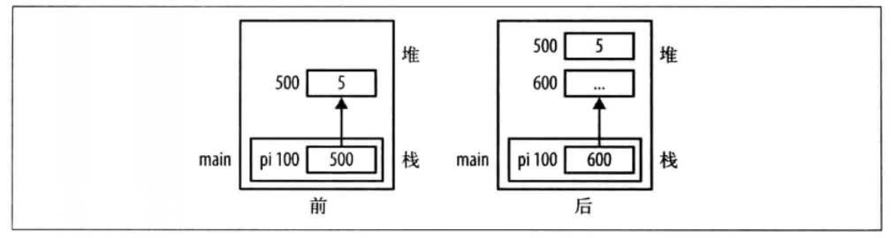
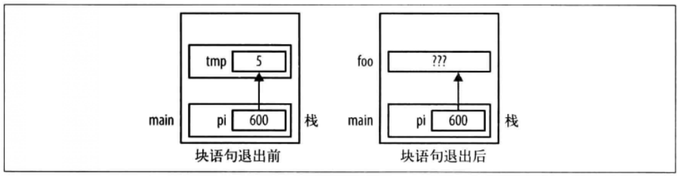

## 一、认识指针

### 指针声明

```
int num;
int *pi;
// 注解
星号将变量声明为指针。*是一个重载过的符号，因为它也用在乘法和解引指针上。
```

### 阅读指针

```
const int *pci;

// 阅读
1. pci是一个变量；
2. pci是一个指针变量；
3. pci是一个指向整数的指针变量；
4. pci是一个指向整数常量的指针变量
```

### null

```
#define NULL		((void *) 0) 

.....
```

### 指针操作符号

1、地址操作符（&） ：返回操作数的地址。

```
// 我们可以用&操作符来初始化pi指针
int num = 10;
int *pi = &num;
```

2、间接引用操作符（*）：返回指针变量指向的值，一般称为 **解引指针**。

```
int num = 101;
int *pi = &num;
print("%p", *pi);

// 同样，也可以对指针指向的变量赋值
*pi = 102;
```

3、多层间接引用

```
// 1.创建一个数组
char *titles[] = {"AAA","BBB","CCC"};

// 2.声明两个数组
char **bestBook[2];
char **englishBook[1];

// 3.对这两个数组赋值
bestBook[0] = &titles[0];
bestBook[1] = &titles[1];
englishBook[0] = &titles[2];

// 这里的bestBook为指向指针的指针，有时候成为双重指针。
// 好处：例如上述，若titles指针指向的内容需要更改，只需要更改titles的指针即可，无需修改另外两个数组。
// 缺点：间接引用没有层级限制，使用层级过多会让人迷惑，难以维护。
```


### 指针与常量

```
0.指向非常量的指针
int num;
int *pi = &num;


1.指向常量的指针
int num = 100;
const int limit = 500;
int *pi; // 指向整数
const int *pci;		// 指向整数常量
pi = &num;
pci = &limit;

// 若
pci = &num;   ?????   合法，声明只是限制我们不能通过指针来修改引用的值。
*pci = 200;		?????   错误，指针认为自己指向整数常量，所以不允许用指针修改这个数。


2.指向非常量的常量指针
// 声明一个指向非常量的常量指针，这意味着指针不可变，但它指向的内容可以改变。
// cpi 必须被初始化指向非常量变量；
// cpi 不能被修改；
// cpi 指向的数据可以被修改；
int num;
int * const pci = &num;

// 若
const int limit = 200;
int * const pci = &limit;		?????  警告，指向常量，无法修改指向的数据。


3.指向常量的常量指针（极少用到）
// 指针不能修改，它指向的内容也不能通过指针来修改。
const int limit = 200;
const int * const cpci = &limit;


4.指向"指向常量的常量指针"的指针（极少）
// 指向常量的指针也可以有多层间接引用。
const int limit = 200;
cosnt int * const cpci = &limit;
const int * const * pcpci = &cpci;
```


## 二、C的动态内存管理

### 2.1、动态内存分配

```
int *pi = (int *)malloc(sizeof(int));
*pi = 5;
free(pi);

// malloc函数的参数指定要分配的字节数。如果成功，它会返回从堆上分配的内存的指针；如果失败，则返回空指针。
```


### 2.2、内存泄露

> 如果不再使用已分配的内存却没有将其释放，就会发生内存泄露。可能有如下场景：
>
> 1.丢失内存地址；
>
> 2.应该调用free函数却没有调用（有时也称为隐式泄露）。
>
> 内存泄露导致无法回收内存并重复使用，导致堆的可用内存越来越少。最后导致程序崩溃，极端下系统崩溃。

#### 1、丢失内存地址

```
int *pi = (int *)malloc(sizeof(int));
*pi = 5;
.....
pi = (int *)malloc(sizeof(int));

// 此时500地址没有释放，且程序中没有地方持有这个地址，从而导致内存泄露。
```



#### 2、隐式内存泄露

如果程序应该释放内存而未释放，也会发生内存泄露。如果不释放，我们不需要的对象就会一直在堆上，这类问题一般是程序员的疏忽。

### 2.3、内存管理函数

#### 1.malloc

```
// 从堆上分配内存。
void *malloc(size_t);
```

#### 2.calloc

```
// 从堆上分配内存，并清零。
void *calloc(size_t numElements, size_t elementSize);
```

#### 3.realloc

```
// 在之前分配内存的基础上，将内存重新分配为更大或更小的部分。
void *realloc(void *ptr, size_t size);
```

#### 4.free

```
// 将内存返还给堆
void *free(void *ptr);
```

### 2.4、迷途指针

> 内存已经释放，而指针还在引用原始内存，这样的指针称为**迷途指针**。
>
> 迷途指针没有指向有效对象，也称为**过早释放**。
>
> 问题：
>
> 1、如果访问内存，则行为不可预期；
>
> 2、如果内存不可访问，则是**段错误**；
>
> 3、潜在的安全隐患；

#### 迷途指针举例

```
例子一：
int *pi = (int *)malloc(sizeof(int));
*pi = 5;
free(pi);

*pi = 10;  // 释放后，仍对其进行操作，结果不可预期。
```

```
例子二：
int *p1 = (int *)malloc(sizeof(int));
*p1 = 5;
...
int *p2;
p2 = p1;
...
free(p1);
...
*p2 = 10;  // p1已经释放，p2仍对齐进行操作，结果不可预期。
```


```
例子三：
int *pi;
...
{
	int temp = 5;
	pi = &temp;
}
// 这里pi变成迷途指针。temp被分配在栈帧上，退出块语句时会退出栈
foo()
// 所以此时pi可能指向一块被其他（例如foo()函数）覆盖的内存区域。
```



#### 处理迷途指针 P49

