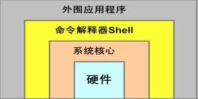

[Shell脚本：Linux Shell脚本学习指南](http://c.biancheng.net/shell/)

[菜鸟教程 - Shell教程](https://www.runoob.com/linux/linux-shell.html)

[Linux入门 - Shell脚本是什么](http://c.biancheng.net/view/932.html)

[Linux chmod命令](https://www.runoob.com/linux/linux-comm-chmod.html)


## 一、Shell是什么




>  **Shell 是一个应用程序，它连接了用户和 Linux 内核，让用户能够更加高效、安全、低成本地使用 Linux 内核，这就是 Shell 的本质。**

​		

​		**shell其实是一个命令解释器**，由于安全、复杂、繁琐等原因，用户不能直接接触内核（也没有必要），需要另外再开发一个程序，让用户直接使用这个程序；该程序的作用就是接收用户的操作（点击图标、输入命令），并进行简单的处理，然后再传递给内核，这样用户就能间接地使用操作系统内核了。你看，在用户和内核之间增加一层“代理”，既能简化用户的操作，又能保障内核的安全，何乐不为呢？在Linux下，这个命令行程序叫做 **Shell**。

​		Shell 本身并不是内核的一部分，它只是站在内核的基础上编写的一个应用程序，它和 QQ、迅雷、Firefox 等其它软件没有什么区别。然而 Shell 也有着它的特殊性，就是开机立马启动，并呈现在用户面前；用户通过 Shell 来使用 Linux，不启动 Shell 的话，用户就没办法使用 Linux。


* 交互的方式：从键盘输入命令，通过/bin/bash的解析，可以立即得到Shell的回应

```
[root@clsn ~]# ls            
anaconda-ks.cfg  
```

* 非交互的方式：如果我们的命令或者应用程序不在命令行直接执行，而是通过一个程序文件来执行时，这个程序就被称之为shell脚本，通过文件执行脚本的方式称之为**非交互方式**

```
[root@clsn ~]# ./firstShell.sh
```


### 拓展：命令行提示符

```
[mozhiyan@localhost ~]$

- []是提示符的分隔符号，没有特殊含义。
- mozhiyan表示当前登录的用户，我现在使用的是 mozhiyan 用户登录。
- @是分隔符号，没有特殊含义。
- localhost表示当前系统的简写主机名（完整主机名是 localhost.localdomain）。
- ~代表用户当前所在的目录为主目录（home 目录）。如果用户当前位于主目录下的 bin 目录中，那么这里显示的就是- bin。
- $是命令提示符。Linux 用这个符号标识登录的用户权限等级：如果是超级用户（root 用户），提示符就是#；如果是普通用户，提示符就是$。
```


## 二、Shell 是一种脚本语言

任何代码最终都要被“翻译”成二进制的形式才能在计算机中执行。

有的编程语言，如 C/C++、Pascal、[Go语言](http://c.biancheng.net/golang/)、汇编等，必须在程序运行之前将所有代码都翻译成二进制形式，也就是生成可执行文件，用户拿到的是最终生成的可执行文件，看不到源码。

这个过程叫做**<u>编译（Compile）</u>**，这样的编程语言叫做**<u>编译型语言</u>**，完成编译过程的软件叫做<u>**编译器（Compiler）**</u>。


而有的编程语言，如 Shell、JavaScript、Python、PHP等，需要一边执行一边翻译，不会生成任何可执行文件，用户必须拿到源码才能运行程序。程序运行后会即时翻译，翻译完一部分执行一部分，不用等到所有代码都翻译完。

这个过程叫做**<u>解释</u>**，这样的编程语言叫做**<u>解释型语言或者脚本语言（Script）</u>**，完成解释过程的软件叫做**<u>解释器</u>**。


编译型语言的优点是执行速度快、对硬件要求低、保密性好，适合开发操作系统、大型应用程序、数据库等。

脚本语言的优点是使用灵活、部署容易、跨平台性好，非常适合 Web 开发以及小工具的制作。

Shell 就是一种脚本语言，我们编写完源码后不用编译，直接运行源码即可。


## 三、Shell的分类  

[Shell脚本是什么 - Shell的分类](http://c.biancheng.net/view/932.html)


|Shell种类全称|缩写|概要|
|:--:|:--:|:--|
|Bourne Shell|sh|**sh 是 UNIX 上的标准 shell**，很多 UNIX 版本都配有 sh。sh 是第一个流行的 Shell。由 AT&T 公司的 Steve Bourne开发，为了纪念他，就用他的名字命名了。|
|Boume Again|Bash|Bash 由 GNU 组织开发，保持了对 sh shell 的兼容性，是各种 Linux 发行版 **默认配置的 shell**。 |
|C Shell|csh|C Shell 是广为流行的 Shell 变种。**C Shell 主要在 BSD 版的 UNIX 系统中使用**，发明者是柏克莱大学的 Bill Joy。C Shell 因为其语法和 C 语言类似而得名，这也使得 UNIX 的系统工程师在学习 C Shell 时感到相当方便。|
|TC Shell|tcsh|**tcsh 是 csh 的增强版**，加入了命令补全功能，提供了更加强大的语法支持。|
|Z Shell|zsh|Zsh属于Shell中的一种，但比Bash好用，而且完全兼容Bash，拥有及其丰富的插件。|


```
➜  ~ bash -version
GNU bash, version 3.2.57(1)-release (x86_64-apple-darwin18)
Copyright (C) 2007 Free Software Foundation, Inc.
```


##  四、查看系统中的shell

### 4.1、查看系统中的shell

```
➜  ~ cat /etc/shells 
/bin/bash
/bin/csh
/bin/ksh
/bin/sh
/bin/tcsh
/bin/zsh
```

### 4.2、查看默认shell

```
➜  ~ echo $SHELL
/bin/zsh
```

### 4.3、修改系统默认shell

当前默认为zsh，改为bash

```
➜  ~ chsh -s /bin/bash
Changing shell for qiyeyun.
Password for qiyeyun: 
```

**输入密码，重启Terminal，完成。**

### 4.4、切换shell

```
// 默认shell
➜  ~ echo $SHELL
/bin/zsh

// 切换bash
➜  ~ bash
bash-3.2$ 

// 返回默认shell
➜  ~ bash
bash-3.2$ exit
exit
➜  ~ 
```

### 4.5、查看zsh/bash版本

```
➜  ~ zsh --version
zsh 5.3 (x86_64-apple-darwin18.0)
➜  ~ bash -version
GNU bash, version 3.2.57(1)-release (x86_64-apple-darwin18)
Copyright (C) 2007 Free Software Foundation, Inc.
```


## 五、Hello World

### 5.1、编写hello world脚本

```
➜  ~ vim helloworld.sh

// 在文本写入
#!/bin/bash
echo "Hello World!!!"

// :wq 保存
```

### 5.2、执行报错，添加权限

#### 1.执行报错

```
➜  ~ ./helloworld.sh
permission denied: ./helloworld.sh         // 错误提示，没有权限执行
```

#### 2.添加权限 - [Linux chmod命令](https://www.runoob.com/linux/linux-comm-chmod.html)

```
➜  ~ chmod abc file
```

其中a,b,c各为一个数字，分别表示**<u>User、Group、及Other</u>**的权限。

> **r=4，w=2，x=1**
>
> * 若要rwx属性则4+2+1=7；
> * 若要rw-属性则4+2=6；
> * 若要r-x属性则4+1=5。

#### 3.再次执行脚本

```
➜  ~ chmod 777 helloworld.sh 
➜  ~ ./helloworld.sh 
Hello World!!!
```

### 5.3、执行脚本的几种方式

####  1. 直接使用 Bash 去解释脚本中的内容

```
➜  ~ bash helloworld.sh 
Hello World!!!
```

#### 2. 绝对路径/相对路径执行

```
➜  ~ /Users/github/Shell学习/helloworld.sh 
Hello World!!!
➜  ~ ./helloworld.sh 
Hello World!!!
```

#### 3. source命令 等同于 .

```
➜  ~ source helloworld.sh 
Hello World!!!
➜  ~ . helloworld.sh 
Hello World!!!
```

#### 4. 将脚本加入系统命令

[macOS/Linux 环境变量设置](https://zhuanlan.zhihu.com/p/25976099)

Shell 脚本是否可以像 Linux 系统命令一样，不用指定路径，直接运行呢？当然是可以的，不过需要进行环境变量的配置。

```
====== 测试在bash环境下，而不是zsh下 ======
1、打开环境变量文件
$ open ./.bash_profile

2、在.bash_profile文件中加入shell脚本的路径， 注意：是目录，不需要文件
# add by linxiang 2019.08.07 for shell script
export PATH=/Users/qiyeyun/Downloads:$PATH

3、执行命令立即加载生效
$ source ./.bash_profile

4、查看PATH
$ echo $PATH
/Users/qiyeyun/Downloads:/usr/local/bin:/usr/bin:/bin:/usr/sbin:/sbin:/Applications/Wireshark.app/Contents/MacOS:/Users/qiyeyun/.rvm/bin

5、脚本能在任意目录下用啦
$ helloworld.sh 
Hello World!!!
```

#### 5. 拓展:(source与.命令)

source命令（从 C Shell 而来）是bash shell的内置命令。

. 命令 就是个点符号（从Bourne Shell而来）是source的另一名称。


## 六、执行方式 bash、 "." 、"./" 、source比较

新建一个 test.sh

```
#!/bin/bash

# PPID父进程 ，当前进程为$$
echo PID is $$
echo Parent PID is $PPID
```

开启全部权限

```
$ chmod 777 test.sh
```

### 6.1、是否创建子shell

分别用不同方式执行

```
$ echo $$
2163
$ bash test.sh 
PID is 2253
Parent PID is 2163
$ ./test.sh 
PID is 2254
Parent PID is 2163
$ /Users/qiyeyun/github/iOS-/Shell学习/test.sh
PID is 2258
Parent PID is 2163
$ source test.sh 
PID is 2163
Parent PID is 2162
$ . test.sh 
PID is 2163
Parent PID is 2162
```

> 结论：
>
> 1. bash和"./"命令都是打开一个子shell来读取并执行FileName中命令;
> 2. source是与"."类似，是在当前工作环境中执行，配置文件就是影响当前的工作环境，这种情况下用source；

### 6.2、关闭执行权限

将执行权限全部关闭

```
$ chmod 666 test.sh
```

再一次执行

```
$ bash test.sh 
PID is 2234
Parent PID is 2163
$ ./test.sh
-bash: ./test.sh: Permission denied
$ /Users/qiyeyun/github/iOS-/Shell学习/test.sh 
-bash: /Users/qiyeyun/github/iOS-/Shell学习/test.sh: Permission denied
$ source test.sh 
PID is 2163
Parent PID is 2162
$ . test.sh 
PID is 2163
Parent PID is 2162
```

> 结论：
>
> 1. "./"（相对/绝对路径）执行需要执行权限；

### 6.3、表格

|      执行方式       | 无执行权限是否可执行 | 是否打开子shell |
| :-----------------: | :------------------: | :-------------: |
|        bash         |        可执行        |   打开子shell   |
| ./（相对/绝对路径） |       无法执行       |   打开子shell   |
|     source / .      |        可执行        |  当前shell环境  |


