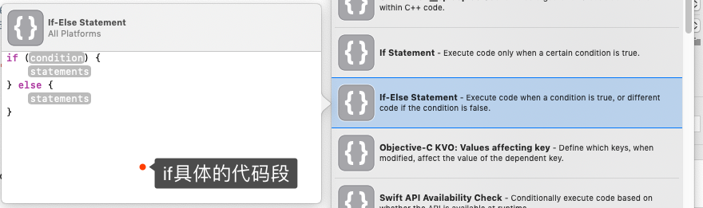
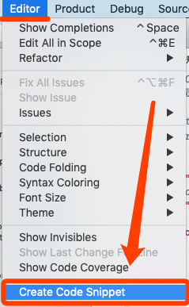
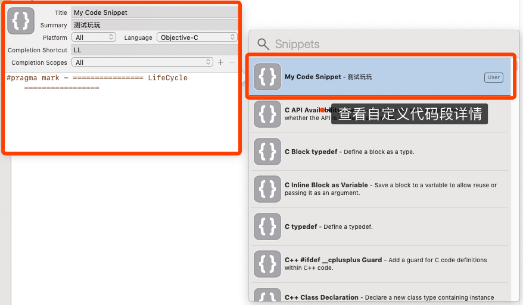
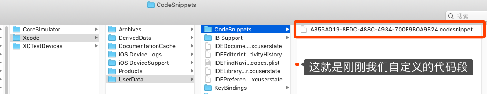

# Xcode Code Snippets 


## 一、什么是代码段

### 1.1、系统自带代码段

在代码中输入 `if` 语句，Xcode会自动弹出 `if` 相关的提示，这就是**系统自带的代码段**。


### 1.2、查看Xcode中代码段的位置：


### 1.3、查看if代码段详情




## 二、如何自定义代码段

### 2.1、创建自己的代码段




### 2.2、设置代码段




### 2.3、调用自定义代码段

可以从下图看出，输入"LL"，自动提示我们自定义的代码段：


### 2.4、物理路径

**Xcode 的 Code Snippets 文件存放于 `~/Library/Developer/Xcode/UserData/CodeSnippets` 目录**

```
// 打开终端，前往目录，打开目录
$ cd ~/Library/Developer/Xcode/UserData/CodeSnippets
$ open .
```



### 2.5、查看/修改 `.codesnippet` 文件

**我们会发现与我们配置的一致，同样我们也可以在这里进行自定义代码段的修改。**

**（注意：若修改，则需要重启Xcode才会生效）**


## 三、代码段三方库推荐

### 3.1、Github地址

 [QMUI_iOS_CodeSnippets](https://github.com/QMUI/QMUI_iOS_CodeSnippets)

### 3.2、导入三方 `.codesnippet` 文件

Xcode 的 Code Snippets 文件存放于 `~/Library/Developer/Xcode/UserData/CodeSnippets` 目录，只要直接把 `*.codesnippets` 文件放到这个目录下（若没有则自己创建），重启 Xcode 即可生效。


### 3.3、重启Xcode，查看代码段


### 3.4、调用


