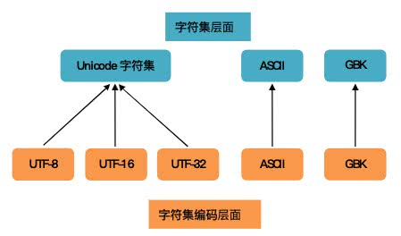

## 字符集、字符编码历史

### 知识点：

1. 全角、半角？

2. GB2312  -->  GBK  --->  GB18030
3. 


作者：盛世唐朝
链接：https://www.zhihu.com/question/23374078/answer/69732605
来源：知乎
著作权归作者所有。商业转载请联系作者获得授权，非商业转载请注明出处。


很久很久以前，有一群人，他们决定用8个可以开合的晶体管来组合成不同的状态，以表示世界上的万物。他们看到8个开关状态是好的，于是他们把这称为”**字节**“。再后来，他们又做了一些可以处理这些字节的机器，机器开动了，可以用字节来组合出很多状态，状态开始变来变去。他们看到这样是好的，于是它们就这机器称为”**计算机**“。


开始计算机只在美国用。八位的字节一共可以组合出256(2的8次方)种不同的状态。 
他们把其中的编号从0开始的32种状态分别规定了特殊的用途，一但终端、打印机遇上约定好的这些字节被传过来时，就要做一些约定的动作：

遇上0×10, 终端就换行；

遇上0×07, 终端就向人们嘟嘟叫；

遇上0x1b, 打印机就打印反白的字，或者终端就用彩色显示字母。

他们看到这样很好，于是就把这些0×20以下的字节状态称为”控制码”。他们又把所有的空 
格、标点符号、数字、大小写字母分别用连续的字节状态表示，一直编到了第127号，这样计算机就可以用不同字节来存储英语的文字了。大家看到这样，都感觉
 很好，于是大家都把这个方案叫做 **ANSI** 的”Ascii”编码（American Standard Code for Information Interchange，美国信息互换标准代码）。当时世界上所有的计算机都用同样的**ASCII**方案来保存英文文字。


后来，就像建造巴比伦塔一样，世界各地都开始使用计算机，但是很多国家用的不是英文，他们的字母里有许多是ASCII里没有的，为了可以在计算机保存他们的文字，他们决定采用 
127号之后的空位来表示这些新的字母、符号，还加入了很多画表格时需要用下到的横线、竖线、交叉等形状，一直把序号编到了最后一个状态255。从128 到255这一页的字符集被称”**扩展字符集**“。从此之后，贪婪的人类再没有新的状态可以用了，美帝国主义可能没有想到还有第三世界国家的人们也希望可以用到计算机吧！


等中国人们得到计算机时，已经没有可以利用的字节状态来表示汉字，况且有6000多个常用汉字需要保存呢。但是这难不倒智慧的中国人民，我们不客气地把那些127号之后的奇异符号们直接取消掉, 规定：一个小于127的字符的意义与原来相同，但两个大于127的字符连在一起时，就表示一个汉字，前面的一个字节（他称之为高字节）从0xA1用到0xF7，后面一个字节（低字节）从0xA1到0xFE，这样我们就可以组合出大约7000多个简体汉字了。在这些编码里，我们还把数学符号、罗马希腊的字母、日文的假名们都编进去了，连在 ASCII 里本来就有的数字、标点、字母都统统重新编了两个字节长的编码，这就是常说的”全角”字符，而原来在127号以下的那些就叫”半角”字符了。中国人民看到这样很不错，于是就把这种汉字方案叫做 “**GB2312**“。GB2312 是对 ASCII 的中文扩展。


但是中国的汉字太多了，我们很快就就发现有许多人的人名没有办法在这里打出来，特别是某些很会麻烦别人的国家领导人。于是我们不得不继续把GB2312 没有用到的码位找出来老实不客气地用上。后来还是不够用，于是干脆不再要求低字节一定是127号之后的内码，只要第一个字节是大于127就固定表示这是一个汉字的开始，不管后面跟的是不是扩展字
符集里的内容。结果扩展之后的编码方案被称为 **GBK** 标准，GBK包括了GB2312 的所有内容，同时又增加了近20000个新的汉字（包括繁体字）和符号。 后来少数民族也要用电脑了，于是我们再扩展，又加了几千个新的少数民族的字，GBK扩成了 **GB18030**。从此之后，中华民族的文化就可以在计算机时代中传承了。 中国的程序员们看到这一系列汉字编码的标准是好的，于是通称他们叫做 “**DBCS**“（Double Byte Charecter Set 双字节字符集）。在DBCS系列标准里，最大的特点是两字节长的汉字字符和一字节长的英文字符并存于同一套编码方案里，因此他们写的程序为了支持中文处理，必须要注意字串里的每一个字节的值，如果这个值是大于127的，那么就认为一个双字节字符集里的字符出现了。那时候凡是受过加持，会编程的计算机僧侣们都要每天念下面这个咒语数百遍： “一个汉字算两个英文字符！一个汉字算两个英文字符……”


因为当时各个国家都像中国这样搞出一套自己的编码标准，结果互相之间谁也不懂谁的编码，谁也不支持别人的编码，连大陆和台湾这样只相隔了150海里，使用着同一种语言的兄弟地区，也分别采用了不同的 DBCS 编码方案——当时的中国人想让电脑显示汉字，就必须装上一个”汉字系统”，专门用来处理汉字的显示、输入的问题，像是那个台湾的愚昧封建人士写的算命程序就必须加装另一套支持 BIG5 编码的什么”倚天汉字系统”才可以用，装错了字符系统，显示就会乱了套！这怎么办？而且世界民族之林中还有那些一时用不上电脑的穷苦人民，他们的文字又怎么办？ 真是计算机的巴比伦塔命题啊！


正在这时，大天使加百列及时出现了——一个叫 **ISO**（国际标谁化组织）的国际组织决定着手解决这个问题。他们采用的方法很简单：废了所有的地区性编码方案，重新搞一个包括了地球上所有文化、所有字母和符号 的编码！他们打算叫它”Universal Multiple-Octet Coded Character Set”，简称 **UCS**, 俗称 “**unicode**“。


unicode开始制订时，计算机的存储器容量极大地发展了，空间再也不成为问题了。于是 ISO 
就直接规定必须用两个字节，也就是16位来统一表示所有的字符，对于ASCII里的那些“半角”字符，unicode包持其原编码不变，只是将其长度由原来的8位扩展为16位，而其他文化和语言的字符则全部重新统一编码。由于”半角”英文符号只需要用到低8位，所以其高8位永远是0，因此这种大气的方案在保存英文文本时会多浪费一倍的空间。


这时候，从旧社会里走过来的程序员开始发现一个奇怪的现象：他们的 *strlen* 函数靠不住了，一个汉字不再是相当于两个字符了，而是一个！是的，从unicode开始，无论是半角的英文字母，还是全角的汉字，它们都是统一的”**一个字符**“！同时，也都是统一的”**两个字节**“，请注意”字符”和”字节”两个术语的不同，“**字节**”是一个8位的物理存贮单元，而“**字符**”则是一个文化相关的符号。在unicode中，一个字符就是两个字节。一个汉字算两个英文字符的时代已经快过去了。


unicode同样也不完美，这里就有两个的问题，一个是，如何才能区别unicode和ascii？计算机怎么知道三个字节表示一个符号，而不是分别表示三个符号呢？第二个问题是，我们已经知道，英文字母只用一个字节表示就够了，如果unicode统一规定，每个符号用三个或四个字节表示，那么每个英文字母前都必然有二到三个字节是0，这对于存储空间来说是极大的浪费，文本文件的大小会因此大出二三倍，这是难以接受的。


unicode在很长一段时间内无法推广，直到互联网的出现，为解决unicode如何在网络上传输的问题，于是面向传输的众多 **UTF**（UCS Transfer Format）标准出现了，顾名思义，**UTF-8**就是每次8个位传输数据，而**UTF-16**就是每次16个位。UTF-8就是在互联网上使用最广的一种unicode的实现方式，这是为传输而设计的编码，并使编码无国界，这样就可以显示全世界上所有文化的字符了。UTF-8最大的一个特点，就是它是一种变长的编码方式。它可以使用1~4个字节表示一个符号，根据不同的符号而变化字节长度，当字符在ASCII码的范围时，就用一个字节表示，保留了ASCII字符一个字节的编码做为它的一部分，注意的是unicode一个中文字符占2个字节，而UTF-8一个中文字符占3个字节）。从unicode到utf-8并不是直接的对应，而是要过一些算法和规则来转换。


Unicode符号范围         |   UTF-8编码方式

(十六进制)                    |  （二进制）
—————————————————————–
0000 0000-0000 007F | 0xxxxxxx

0000 0080-0000 07FF | 110xxxxx 10xxxxxx

0000 0800-0000 FFFF | 1110xxxx 10xxxxxx 10xxxxxx

0001 0000-0010 FFFF | 11110xxx 10xxxxxx 10xxxxxx 10xxxxxx


中文字符集


Unicode


UTF-8


 

### 一、ASCII码

#### 20.1、ASCII码简介

[ASCII](https://zh.wikipedia.org/wiki/ASCII)编码：**American Standard Code for information Interchange（美国信息交换标准码）**，是基于**拉丁字母**的一套电脑[编码](https://baike.baidu.com/item/编码/80092)系统，主要用于显示现代 *英语*，而其扩展版本[EASCII](https://zh.wikipedia.org/wiki/EASCII)则可以部分支持其他[西欧](https://zh.wikipedia.org/wiki/西欧)[语言](https://zh.wikipedia.org/wiki/语言)，并等同于国际标准[ISO/IEC 646](https://zh.wikipedia.org/wiki/ISO/IEC_646)。ASCII第一次以规范标准的类型发表是在1967年，最后一次更新则是在1986年，到目前为止共定义了128个字符 。


#### 20.2、ASCII码组成与存储

​		ASCII码是7位编码，它的二进制取值范围：`0000000 ~ 1111111` ，对应十六进制为：`00h ~ 7Fh`，一共规定了128个字符的编码，ASCII码虽然是7位，但存储依旧是8位存储。只占用了一个字节的后面7位，最前面的一位统一规定为`0`。


标准的ASCII至今为止共定义了128个字符，其中33个不可显示字符，95个可现实字符。比如空格`SPACE`是32（二进制`00100000`），大写的字母`A`是65（二进制`01000001`）


| Bin(二进制) | Oct(八进制) | Dec(十进制) | Hex(十六进制) | 缩写/字符                   | 解释         |
| ----------- | ----------- | ----------- | ------------- | --------------------------- | ------------ |
| 0000 0000   | 00          | 0           | 0x00          | NUL(null)                   | 空字符       |
| 0000 0001   | 01          | 1           | 0x01          | SOH(start of headline)      | 标题开始     |
| 0000 0010   | 02          | 2           | 0x02          | STX (start of text)         | 正文开始     |
| 0000 0011   | 03          | 3           | 0x03          | ETX (end of text)           | 正文结束     |
| 0000 0100   | 04          | 4           | 0x04          | EOT (end of transmission)   | 传输结束     |
| 0000 0101   | 05          | 5           | 0x05          | ENQ (enquiry)               | 请求         |
| 0000 0110   | 06          | 6           | 0x06          | ACK (acknowledge)           | 收到通知     |
| 0000 0111   | 07          | 7           | 0x07          | BEL (bell)                  | 响铃         |
| 0000 1000   | 010         | 8           | 0x08          | BS (backspace)              | 退格         |
| 0000 1001   | 011         | 9           | 0x09          | HT (horizontal tab)         | 水平制表符   |
| 0000 1010   | 012         | 10          | 0x0A          | LF (NL line feed, new line) | 换行键       |
| 0000 1011   | 013         | 11          | 0x0B          | VT (vertical tab)           | 垂直制表符   |
| 0000 1100   | 014         | 12          | 0x0C          | FF (NP form feed, new page) | 换页键       |
| 0000 1101   | 015         | 13          | 0x0D          | CR (carriage return)        | 回车键       |
| 0000 1110   | 016         | 14          | 0x0E          | SO (shift out)              | 不用切换     |
| 0000 1111   | 017         | 15          | 0x0F          | SI (shift in)               | 启用切换     |
| 0001 0000   | 020         | 16          | 0x10          | DLE (data link escape)      | 数据链路转义 |
| 0001 0001   | 021         | 17          | 0x11          | DC1 (device control 1)      | 设备控制1    |
| 0001 0010   | 022         | 18          | 0x12          | DC2 (device control 2)      | 设备控制2    |
| 0001 0011   | 023         | 19          | 0x13          | DC3 (device control 3)      | 设备控制3    |
| 0001 0100   | 024         | 20          | 0x14          | DC4 (device control 4)      | 设备控制4    |
| 0001 0101   | 025         | 21          | 0x15          | NAK (negative acknowledge)  | 拒绝接收     |
| 0001 0110   | 026         | 22          | 0x16          | SYN (synchronous idle)      | 同步空闲     |
| 0001 0111   | 027         | 23          | 0x17          | ETB (end of trans. block)   | 结束传输块   |
| 0001 1000   | 030         | 24          | 0x18          | CAN (cancel)                | 取消         |
| 0001 1001   | 031         | 25          | 0x19          | EM (end of medium)          | 媒介结束     |
| 0001 1010   | 032         | 26          | 0x1A          | SUB (substitute)            | 代替         |
| 0001 1011   | 033         | 27          | 0x1B          | ESC (escape)                | 换码(溢出)   |
| 0001 1100   | 034         | 28          | 0x1C          | FS (file separator)         | 文件分隔符   |
| 0001 1101   | 035         | 29          | 0x1D          | GS (group separator)        | 分组符       |
| 0001 1110   | 036         | 30          | 0x1E          | RS (record separator)       | 记录分隔符   |
| 0001 1111   | 037         | 31          | 0x1F          | US (unit separator)         | 单元分隔符   |
| 0010 0000   | 040         | 32          | 0x20          | (space)                     | 空格         |
| 0010 0001   | 041         | 33          | 0x21          | !                           | 叹号         |
| 0010 0010   | 042         | 34          | 0x22          | "                           | 双引号       |
| 0010 0011   | 043         | 35          | 0x23          | #                           | 井号         |
| 0010 0100   | 044         | 36          | 0x24          | $                           | 美元符       |
| 0010 0101   | 045         | 37          | 0x25          | %                           | 百分号       |
| 0010 0110   | 046         | 38          | 0x26          | &                           | 和号         |
| 0010 0111   | 047         | 39          | 0x27          | '                           | 闭单引号     |
| 0010 1000   | 050         | 40          | 0x28          | (                           | 开括号       |
| 0010 1001   | 051         | 41          | 0x29          | )                           | 闭括号       |
| 0010 1010   | 052         | 42          | 0x2A          | *                           | 星号         |
| 0010 1011   | 053         | 43          | 0x2B          | +                           | 加号         |
| 0010 1100   | 054         | 44          | 0x2C          | ,                           | 逗号         |
| 0010 1101   | 055         | 45          | 0x2D          | -                           | 减号/破折号  |
| 0010 1110   | 056         | 46          | 0x2E          | .                           | 句号         |
| 0010 1111   | 057         | 47          | 0x2F          | /                           | 斜杠         |
| 0011 0000   | 060         | 48          | 0x30          | 0                           | 字符0        |
| 0011 0001   | 061         | 49          | 0x31          | 1                           | 字符1        |
| 0011 0010   | 062         | 50          | 0x32          | 2                           | 字符2        |
| 0011 0011   | 063         | 51          | 0x33          | 3                           | 字符3        |
| 0011 0100   | 064         | 52          | 0x34          | 4                           | 字符4        |
| 0011 0101   | 065         | 53          | 0x35          | 5                           | 字符5        |
| 0011 0110   | 066         | 54          | 0x36          | 6                           | 字符6        |
| 0011 0111   | 067         | 55          | 0x37          | 7                           | 字符7        |
| 0011 1000   | 070         | 56          | 0x38          | 8                           | 字符8        |
| 0011 1001   | 071         | 57          | 0x39          | 9                           | 字符9        |
| 0011 1010   | 072         | 58          | 0x3A          | :                           | 冒号         |
| 0011 1011   | 073         | 59          | 0x3B          | ;                           | 分号         |
| 0011 1100   | 074         | 60          | 0x3C          | <                           | 小于         |
| 0011 1101   | 075         | 61          | 0x3D          | =                           | 等号         |
| 0011 1110   | 076         | 62          | 0x3E          | >                           | 大于         |
| 0011 1111   | 077         | 63          | 0x3F          | ?                           | 问号         |
| 0100 0000   | 0100        | 64          | 0x40          | @                           | 电子邮件符号 |
| 0100 0001   | 0101        | 65          | 0x41          | A                           | 大写字母A    |
| 0100 0010   | 0102        | 66          | 0x42          | B                           | 大写字母B    |
| 0100 0011   | 0103        | 67          | 0x43          | C                           | 大写字母C    |
| 0100 0100   | 0104        | 68          | 0x44          | D                           | 大写字母D    |
| 0100 0101   | 0105        | 69          | 0x45          | E                           | 大写字母E    |
| 0100 0110   | 0106        | 70          | 0x46          | F                           | 大写字母F    |
| 0100 0111   | 0107        | 71          | 0x47          | G                           | 大写字母G    |
| 0100 1000   | 0110        | 72          | 0x48          | H                           | 大写字母H    |
| 0100 1001   | 0111        | 73          | 0x49          | I                           | 大写字母I    |
| 01001010    | 0112        | 74          | 0x4A          | J                           | 大写字母J    |
| 0100 1011   | 0113        | 75          | 0x4B          | K                           | 大写字母K    |
| 0100 1100   | 0114        | 76          | 0x4C          | L                           | 大写字母L    |
| 0100 1101   | 0115        | 77          | 0x4D          | M                           | 大写字母M    |
| 0100 1110   | 0116        | 78          | 0x4E          | N                           | 大写字母N    |
| 0100 1111   | 0117        | 79          | 0x4F          | O                           | 大写字母O    |
| 0101 0000   | 0120        | 80          | 0x50          | P                           | 大写字母P    |
| 0101 0001   | 0121        | 81          | 0x51          | Q                           | 大写字母Q    |
| 0101 0010   | 0122        | 82          | 0x52          | R                           | 大写字母R    |
| 0101 0011   | 0123        | 83          | 0x53          | S                           | 大写字母S    |
| 0101 0100   | 0124        | 84          | 0x54          | T                           | 大写字母T    |
| 0101 0101   | 0125        | 85          | 0x55          | U                           | 大写字母U    |
| 0101 0110   | 0126        | 86          | 0x56          | V                           | 大写字母V    |
| 0101 0111   | 0127        | 87          | 0x57          | W                           | 大写字母W    |
| 0101 1000   | 0130        | 88          | 0x58          | X                           | 大写字母X    |
| 0101 1001   | 0131        | 89          | 0x59          | Y                           | 大写字母Y    |
| 0101 1010   | 0132        | 90          | 0x5A          | Z                           | 大写字母Z    |
| 0101 1011   | 0133        | 91          | 0x5B          | [                           | 开方括号     |
| 0101 1100   | 0134        | 92          | 0x5C          | \                           | 反斜杠       |
| 0101 1101   | 0135        | 93          | 0x5D          | ]                           | 闭方括号     |
| 0101 1110   | 0136        | 94          | 0x5E          | ^                           | 脱字符       |
| 0101 1111   | 0137        | 95          | 0x5F          | _                           | 下划线       |
| 0110 0000   | 0140        | 96          | 0x60          | `                           | 开单引号     |
| 0110 0001   | 0141        | 97          | 0x61          | a                           | 小写字母a    |
| 0110 0010   | 0142        | 98          | 0x62          | b                           | 小写字母b    |
| 0110 0011   | 0143        | 99          | 0x63          | c                           | 小写字母c    |
| 0110 0100   | 0144        | 100         | 0x64          | d                           | 小写字母d    |
| 0110 0101   | 0145        | 101         | 0x65          | e                           | 小写字母e    |
| 0110 0110   | 0146        | 102         | 0x66          | f                           | 小写字母f    |
| 0110 0111   | 0147        | 103         | 0x67          | g                           | 小写字母g    |
| 0110 1000   | 0150        | 104         | 0x68          | h                           | 小写字母h    |
| 0110 1001   | 0151        | 105         | 0x69          | i                           | 小写字母i    |
| 0110 1010   | 0152        | 106         | 0x6A          | j                           | 小写字母j    |
| 0110 1011   | 0153        | 107         | 0x6B          | k                           | 小写字母k    |
| 0110 1100   | 0154        | 108         | 0x6C          | l                           | 小写字母l    |
| 0110 1101   | 0155        | 109         | 0x6D          | m                           | 小写字母m    |
| 0110 1110   | 0156        | 110         | 0x6E          | n                           | 小写字母n    |
| 0110 1111   | 0157        | 111         | 0x6F          | o                           | 小写字母o    |
| 0111 0000   | 0160        | 112         | 0x70          | p                           | 小写字母p    |
| 0111 0001   | 0161        | 113         | 0x71          | q                           | 小写字母q    |
| 0111 0010   | 0162        | 114         | 0x72          | r                           | 小写字母r    |
| 0111 0011   | 0163        | 115         | 0x73          | s                           | 小写字母s    |
| 0111 0100   | 0164        | 116         | 0x74          | t                           | 小写字母t    |
| 0111 0101   | 0165        | 117         | 0x75          | u                           | 小写字母u    |
| 0111 0110   | 0166        | 118         | 0x76          | v                           | 小写字母v    |
| 0111 0111   | 0167        | 119         | 0x77          | w                           | 小写字母w    |
| 0111 1000   | 0170        | 120         | 0x78          | x                           | 小写字母x    |
| 0111 1001   | 0171        | 121         | 0x79          | y                           | 小写字母y    |
| 0111 1010   | 0172        | 122         | 0x7A          | z                           | 小写字母z    |
| 0111 1011   | 0173        | 123         | 0x7B          | {                           | 开花括号     |
| 0111 1100   | 0174        | 124         | 0x7C          | \|                          | 垂线         |
| 0111 1101   | 0175        | 125         | 0x7D          | }                           | 闭花括号     |
| 0111 1110   | 0176        | 126         | 0x7E          | ~                           | 波浪号       |
| 0111 1111   | 0177        | 127         | 0x7F          | DEL (delete)                | 删除         |


#### 20.3、ASCII码的优、缺点

**优点：**

* 使用ASCII码进行编码，比较节省空间；

**缺点：**

* ASCII码太少，很多文字都无法表示；


​		它的问题就蕴含在它的全称中——American Standard Code for information Interchange，它是太美国化了！

​		在英语中，用128个符号编码便可以表示所有，但是用来表示其他语言，128个符号是不够的。比如，在[法语](https://baike.baidu.com/item/法语/660115)中，字母上方有注音符号，它就无法用 ASCII 码表示。于是，一些欧洲国家就决定，利用字节中闲置的最高位编入新的符号。比如，法语中的é的编码为130（二进制10000010）。这样一来，这些欧洲国家使用的编码体系，可以表示最多256个符号，例如：其扩展版本[EASCII](https://zh.wikipedia.org/wiki/EASCII)则可以部分支持其他西欧语言。

​		对于象形文字，那更是无法进行表示的。所以自1988年起，几大著名的计算机公司合作研究出替代ASCII码的编码系统——Unicode（统一化字符编码标准、万国码），Unicode采用16位编码，每一个字符需要2个字节，它的范围`0000h ~ FFFFh`，总共可以表示65536个不同字符。Unicode编码并不是从零开始，而且收录了很多全世界的标准，比如：前128个字符（`0000h~007Fh`）与ASCII码一致。

​		同样，Unicode也改变了字符与存储空间之间的关系，从"单字符，单字节"到"单字符，双字节"，从而导致使用ASCII存储一本书为1M，使用Unicode编码则为2M。为了编码系统兼容，Unicode在存储空间上付出了代价。


### 中文字符集介绍

- 中国人民通过对 ASCII 编码的中文扩充改造，产生了 GB2312 编码，可以表示6000多个常用汉字。
- 汉字实在是太多了，包括繁体和各种字符，于是产生了 GBK 编码，它包括了 GB2312 中的编码，同时扩充了很多。
- 中国是个多民族国家，各个民族几乎都有自己独立的语言系统，为了表示那些字符，继续把 GBK 编码扩充为 GB18030 编码。
- 每个国家都像中国一样，把自己的语言编码，于是出现了各种各样的编码，如果你不安装相应的编码，就无法解释相应编码想表达的内容。
- 终于，有个叫 ISO 的组织看不下去了。他们一起创造了一种编码 UNICODE ，这种编码非常大，大到可以容纳世界上任何一个文字和标志。所以只要电脑上有 UNICODE 这种编码系统，无论是全球哪种文字，只需要保存文件的时候，保存成 UNICODE 编码就可以被其他电脑正常解释。
- UNICODE 在网络传输中，出现了两个标准 UTF-8 和 UTF-16，分别每次传输 8个位和 16个位。于是就会有人产生疑问，UTF-8 既然能保存那么多文字、符号，为什么国内还有这么多使用 GBK 等编码的人？因为 UTF-8 等编码体积比较大，占电脑空间比较多，如果面向的使用人群绝大部分都是中国人，用 GBK 等编码也可以。


### 二、Unicode

[Unicode官网--What is Unicode?](http://www.unicode.org/standard/WhatIsUnicode.html)


> <meta http-equiv="Content-Type" content="text/html; charset=utf-8">


### 三、字符集与字符集编码

- charset 是 character set 的简写，即**字符集**。
- encoding 是 charset encoding 的简写，即**字符集编码**，简称**编码**。



从这里可以很清楚地看到：

1. 编码是依赖于字符集的，就像代码中的接口实现依赖于接口一样；
2. 一个字符集可以有多个编码实现，就像一个接口可以有多个实现类一样。


**具体例子及规范用法**

可以简单看两个例子，一个自于 html 文件，用的是 charset：

```
<meta http-equiv="content-type" content="text/html;charset=utf-8">
```

另一个来自于 xml 文件，用的是 encoding：

```
<?xml version="1.0" encoding="UTF-8"?>
```

哪一种用法更规范呢？显然是后者，它更加准确地区分了字符集与编码的概念。

> “charset=utf-8”容易让人误解为存在一种叫“UTF-8”的字符集，但实际上，无论是 UTF-8，UTF-16 还是 UTF-32 都是对同一种字符集的不同编码实现而已。


### 四、Unicode 的编码方式和实现方式

**Unicode应用的统一码版本对应于 [UCS-2](https://zh.wikipedia.org/wiki/UCS-2)，使用 16 位的编码空间。也就是每个字符占用 2 个字节。**


ISO（国际标谁化组织）就直接规定必须用两个字节，也就是16位来统一表示所有的字符，对于ASCII里的那些“半角”字符，Unicode包持其原编码不变，只是将其长度由原来的8位扩展为16位，而其他文化和语言的字符则全部重新统一编码。由于”半角”英文符号只需要用到低8位，所以其高8位永远是0，因此这种大气的方案在保存英文文本时会多浪费一倍的空间。


最一开始的时候，Unicode不仅是字符集 也是编码方式，他们是一一对应的关系。

Unicode在很长一段时间内无法推广，直到互联网的出现，为解决unicode如何在网络上传输的问题，于是面向传输的众多 **UTF**（UCS Transfer Format）标准出现了


后来 Unicode 只是一个符号集，它只规定了符号的二进制代码，却没有规定这个二进制代码应该如何存储。

Unicode 的实现方式不同于编码方式。一个字符的 Unicode 编码是确定的。但是在实际传输过程中，由于不同系统平台的设计不一定一致，以及出于节省空间的目的，对 Unicode 编码的实现方式有所不同。Unicode 的实现方式称为 **Unicode转换格式**（Unicode Transformation Format，简称为 UTF）。


UTF-8

UTF-16

UTF-32


#### Unicode缺点

unicode同样也不完美，这里就有两个的问题，一个是，如何才能区别unicode和ascii？计算机怎么知道三个字节表示一个符号，而不是分别表示三个符号呢？第二个问题是，我们已经知道，英文字母只用一个字节表示就够了，如果unicode统一规定，每个符号用三个或四个字节表示，那么每个英文字母前都必然有二到三个字节是0，这对于存储空间来说是极大的浪费，文本文件的大小会因此大出二三倍，这是难以接受的。


### Unicode字符平面映射


### 五、几种编码格式简介

- ASCII 码

学过计算机的人都知道 ASCII 码，总共有 128 个，用一个字节的低 7 位表示，0~31 是控制字符如换行回车删除等；32~126 是打印字符，可以通过键盘输入并且能够显示出来。

- ISO-8859-1

128 个字符显然是不够用的，于是 ISO 组织在 ASCII 码基础上又制定了一些列标准用来扩展 ASCII 编码，它们是 ISO-8859-1~ISO-8859-15，其中 ISO-8859-1 涵盖了大多数西欧语言字符，所有应用的最广泛。ISO-8859-1 仍然是单字节编码，它总共能表示 256 个字符。

- GB2312

它的全称是《信息交换用汉字编码字符集 基本集》，它是双字节编码，总的编码范围是 A1-F7，其中从 A1-A9 是符号区，总共包含 682 个符号，从 B0-F7 是汉字区，包含 6763 个汉字。

- GBK

全称叫《汉字内码扩展规范》，是国家技术监督局为 windows95 所制定的新的汉字内码规范，它的出现是为了扩展 GB2312，加入更多的汉字，它的编码范围是 8140~FEFE（去掉 XX7F）总共有 23940 个码位，它能表示 21003 个汉字，它的编码是和 GB2312 兼容的，也就是说用 GB2312 编码的汉字可以用 GBK 来解码，并且不会有乱码。

- GB18030

全称是《信息交换用汉字编码字符集》，是我国的强制标准，它可能是单字节、双字节或者四字节编码，它的编码与 GB2312 编码兼容，这个虽然是国家标准，但是实际应用系统中使用的并不广泛。

- UTF-16

说到 UTF 必须要提到 Unicode（Universal Code 统一码），ISO 试图想创建一个全新的超语言字典，世界上所有的语言都可以通过这本字典来相互翻译。可想而知这个字典是多么的复杂，关于 Unicode 的详细规范可以参考相应文档。Unicode 是 Java 和 XML 的基础，下面详细介绍 Unicode 在计算机中的存储形式。

UTF-16 具体定义了 Unicode 字符在计算机中存取方法。UTF-16 用两个字节来表示 Unicode 转化格式，这个是定长的表示方法，不论什么字符都可以用两个字节表示，两个字节是 16 个 bit，所以叫 UTF-16。UTF-16 表示字符非常方便，每两个字节表示一个字符，这个在字符串操作时就大大简化了操作，这也是 Java 以 UTF-16 作为内存的字符存储格式的一个很重要的原因。

- UTF-8

UTF-16 统一采用两个字节表示一个字符，虽然在表示上非常简单方便，但是也有其缺点，有很大一部分字符用一个字节就可以表示的现在要两个字节表示，存储空间放大了一倍，在现在的网络带宽还非常有限的今天，这样会增大网络传输的流量，而且也没必要。而 UTF-8 采用了一种变长技术，每个编码区域有不同的字码长度。不同类型的字符可以是由 1~4 个字节组成。


#### UTF-8 有以下编码规则，规则主要分为两部分：

1. 如果Unicode码小于等于127，即ASCII码。则仍使用ASCII的编码格式，最高位为0，其余7位表示0-127。

2. 如果，Unicode码大于127，以大端表示。然后从低位开始，每次取6位，加上高位的10，组成一个字节，直到不足6位。假设前面一共组成了n个字节，那么把前n+1位都标记为1，其余位标记为0。然后加上不足的6位，组成UTF-8编码的头部字节。最后把这些字节从低位到高位，拼成一串编码。

   例如：如果一个字节，以 11 开头，连续的 1 的个数暗示这个字符的字节数，例如：110xxxxx 代表它是双字节 UTF-8 字符的首字节。如果一个字节，以 10 开始，表示它不是首字节，需要向前查找才能得到当前字符的首字节。

   

#### UTF-8举例

ASCII码中的 A ：1000001 = 65

Unicode 中的 A ：&#65   \u0041

`&#`、`&#x`、`\u` 都可以用来表示一串 unicode 编码。

UTF-8中的A ：

| 字符 | ASCII码二进制 | ASCII码十进制 | Unicode编号 | Unicode编码二进制   | Unicode编码十进制 |
| ---- | ------------- | ------------- | ----------- | ------------------- | ----------------- |
| A    | 100 0001      | 65            | U+0041      | 0000 0000 0100 0001 | 65                |
| 严   | 无            | 无            | 4E25        | 0100 1110 0010 0101 |                   |


#### UTF-8转换 https://home.unicode.org/

UTF-8 顾名思义，是一套以 8 位为一个编码单位的可变长编码。会将一个码位编码为 1 到 4 个字节：

```text
U+ 0000 ~ U+  007F: 0XXXXXXX
U+ 0080 ~ U+  07FF: 110XXXXX 10XXXXXX
U+ 0800 ~ U+  FFFF: 1110XXXX 10XXXXXX 10XXXXXX
U+10000 ~ U+10FFFF: 11110XXX 10XXXXXX 10XXXXXX 10XXXXXX
```

根据上表中的编码规则，之前的「知」字的码位 U+77E5 属于第三行的范围：

```text
       7    7    E    5    
		0111 0111 1110 0101    二进制的 77E5
--------------------------
		0111   011111   100101 二进制的 77E5
1110XXXX 10XXXXXX 10XXXXXX 模版（上表第三行）
11100111 10011111 10100101 代入模版
   E   7    9   F    A   5
```

这就是将 U+77E5 按照 UTF-8 编码为字节序列 E79FA5 的过程。反之亦然。


###  七、URL编码


### 参考文档

[ASCII wiki](https://zh.wikipedia.org/wiki/ASCII)

[Unicode wiki](https://zh.wikipedia.org/wiki/Unicode)

[Unicode字符平面映射]([https://zh.wikipedia.org/wiki/Unicode%E5%AD%97%E7%AC%A6%E5%B9%B3%E9%9D%A2%E6%98%A0%E5%B0%84](https://zh.wikipedia.org/wiki/Unicode字符平面映射))

[unicode查询官网](https://home.unicode.org/)

[unicode汉字对应表](http://www.chi2ko.com/tool/CJK.htm)

[字符编码笔记：ASCII，Unicode 和 UTF-8](http://www.ruanyifeng.com/blog/2007/10/ascii_unicode_and_utf-8.html)

[字符集与编码（一）——charset vs encoding](https://xiaogd.net/字符集与编码（一）-charset-vs-encoding/)


[网页编码就是那点事](http://www.qianxingzhem.com/post-1499.html)

[unicode,ansi,utf-8,unicode big endian编码的区别](https://wenku.baidu.com/view/cb9fe505cc17552707220865.html)


[深入分析 Java 中的中文编码问题](https://www.ibm.com/developerworks/cn/java/j-lo-chinesecoding/)