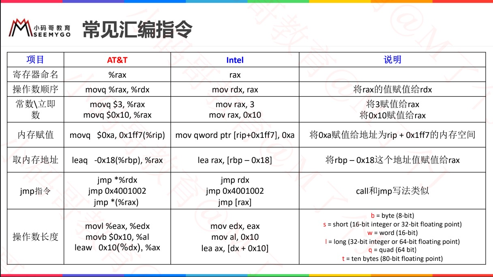
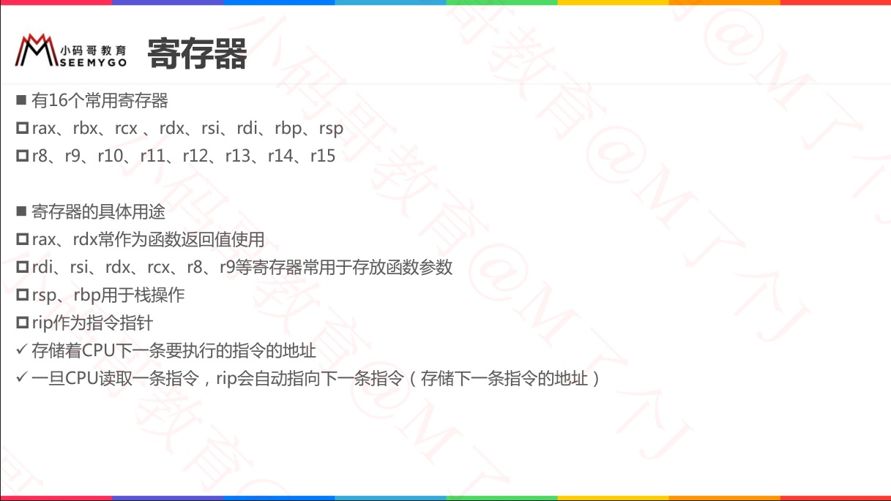
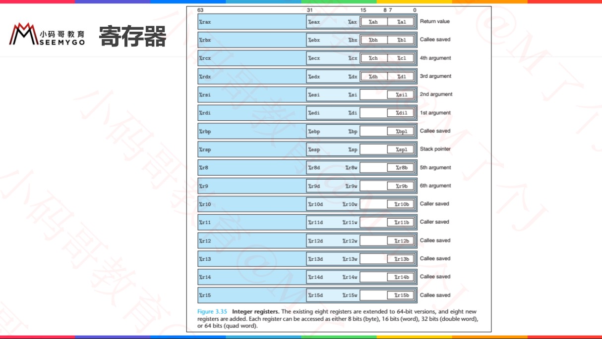
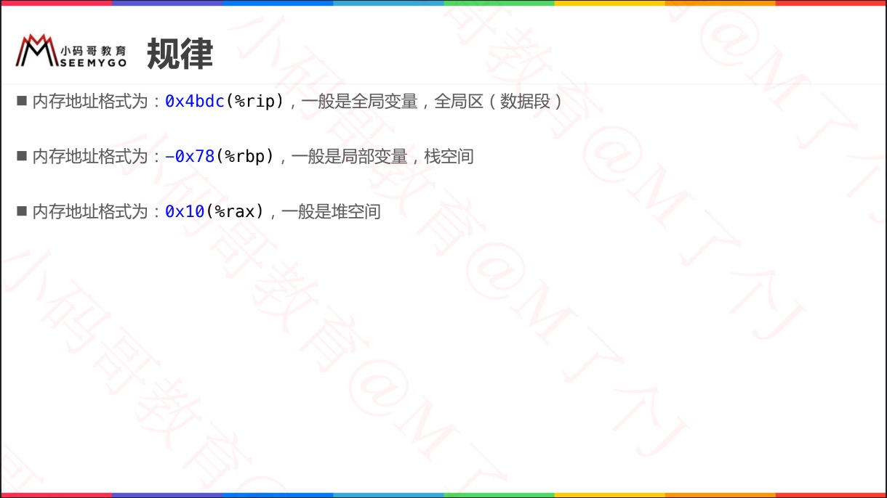
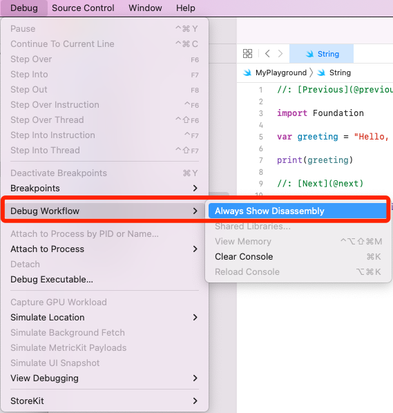
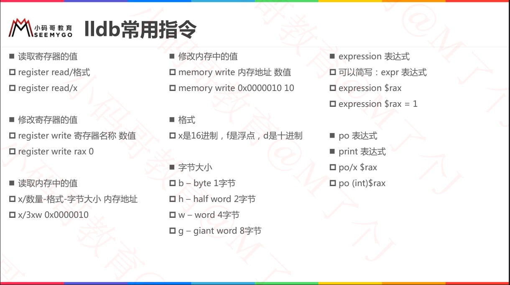
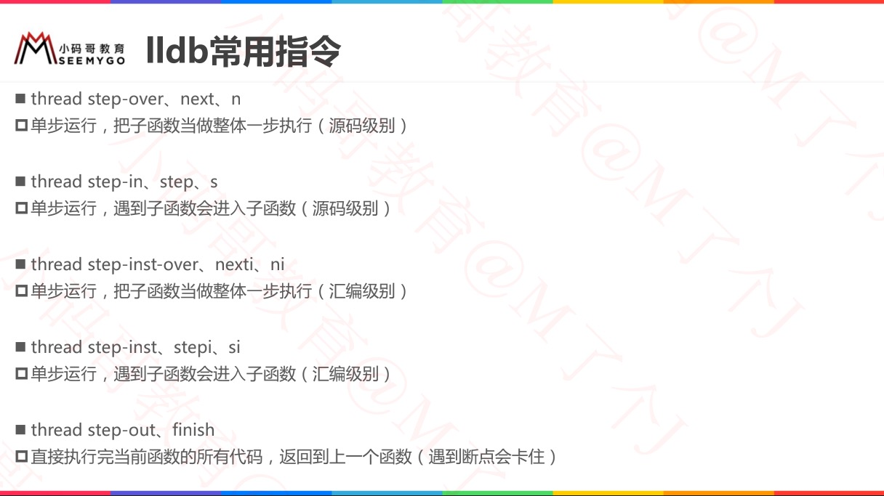

# 后续笔记相关内存探索目录一览

[04枚举 - 枚举变量的内存布局]()

[06结构体与类 - 结构体与类的内存分析]()

[07闭包 - 内存分析]()

[012泛型 - 泛型本质]()

[013String与Array - 内存分析]()


# 基本知识

## 汇编基础、指令




## 寄存器






## 地址识别




# 日常开发

## Xcode调试配置

* Xcode 断点调试，取消直接进入到汇编语言界面处理




## 打印对象内存地址

```swift
let str = "1234"
let address = String(format: "%p", str)
print(address)
```

```swift
// 打印变量指针  方式一
var x = 42
var y = 3.14
var z = "foo"
var obj = NSObject()

withUnsafePointer(to: &x) {ptr in print(ptr)}
withUnsafePointer(to: &y) {ptr in print(ptr)}
withUnsafePointer(to: &z) {ptr in print(ptr)}
withUnsafePointer(to: &obj) {ptr in print(ptr)}
```

```swift
// 打印变量指针  方式二
var x = 42
var y = 3.14
var z = "foo"
var obj = NSObject()

func printPointer<T>(ptr: UnsafePointer<T>) {
    print(ptr)
}

printPointer(ptr: &x)
printPointer(ptr: &y)
printPointer(ptr: &z)
printPointer(ptr: &obj)
```


## MemoryLayout 查看内存大小


## LLDB

```swift
(lldb) register read rax
     rax = 0x00007ffeefbff230

(lldb) x/4xg 0x00007ffeefbff230
0x7ffeefbff230: 0x00007fff88a83d98 0x0000000000000000
0x7ffeefbff240: 0x00007ffeefbff270 0x0000000100505350
```






