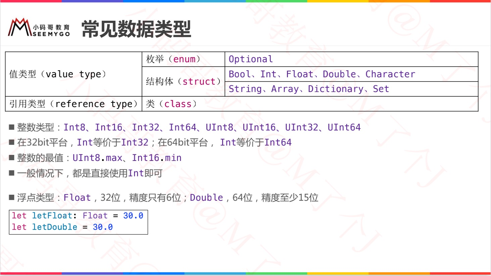
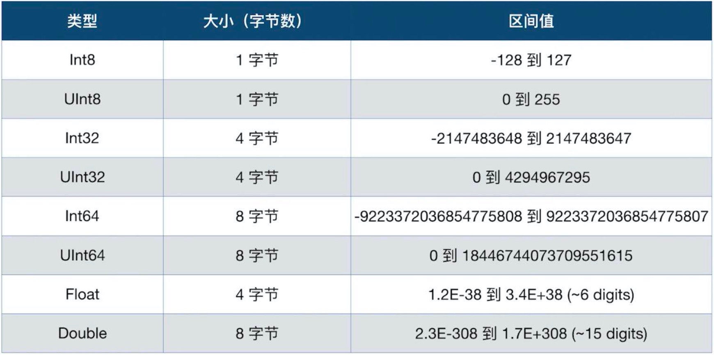

# 一、基本数据类型

## 1. 整型：Int / UInt

> Int 拥有与当前平台原生字相同长度
>
> Int8、Int32、Int64
>
> UInt8、UInt32、UInt64

```swift
// 整数与浮点数添0或_增加可读性：

let A = 100_123
let B = 111_222
Log("AFSD = \(A + B)")
// AFSD = 211345
```

## 2. 浮点型：Float / Double

> Float 32位浮点数
>
> Double【推荐】 64位浮点数

## 3. 布尔型值：Bool

> 1、true / false
>
> 2、Swift类型安全机制会阻止用一个非布尔量代替Bool

```swift
//【ERROR】
if i==1 {
		print(i)
}
```

## 4. 字符串：String

> 字符串是字符的序列集合

### OC length VS Swift count

原来在 Objc 中读取 NSString 长度使用的是 .length，length返回的是基于 UTF-16 的长度。而在 Swift 中读取 String 的长度，通常使用的是 count，而 count 本身返回的是 characters.count，只是 Unicode 字符个数。这两者的区别在纯文本中看不出来，但是包含 Emoji 的时候就十分明显了。

举个例子：“😆😆😆😆😆😆”，用 Objc 的 length 读取返回的是12，而用 Swift 的 count 读取返回的是6，这在做一些富文本插入操作时，得到的结果绝不会是你想要的。

不过不用担心，Swift 有专门的 utf16.count 来对应 NSString 的 .length，在使用的时候只需要 string.utf16.count就可以得到与 Objc 中 length 相同的结果。但是这么长显然太繁琐了是不是，用 extension 解决掉：

```swift
extension String {
    var length: Int {
        return self.utf16.count
    }
}

// 使用
let emoji = “😆😆😆😆😆😆”
emoji.length // return 12
```


## 5. 字符：Character


## 6. 元祖：Tuples

> 1. tuple可以把多个值合并成一个复合型的值；
> 2. tuple值可以是任何类型，不必是同一类型；

```swift
// 空元祖
var a = ()
print(a)  // ()

var b = (1)
print(b)  // 1

var c:(Int, String, Array) = (11, "123", [1,2,3])
print(c)  // (11, "123", [1, 2, 3])

let error = (404, "找不到服务")
print(error.0)  // 440
print(error.1)  // 找不到服务
```

**可以指定名称**

```swift
let error = (errorCode: 404, errorMessage: "找不到服务")
print(error.errorCode)
print(error.errorMessage)
```

**tuple修改**

> 1. `var tuple`为可变元祖，`let tuple`为不可变元祖；
>
> 2. 不管是可变、不可变元祖，元祖创建后就不能增加、删除元素；
> 3. 可变元祖可以对元素进行修改，但不能改变其类型；
> 4. any类型可以改为任何类型；

```swift
var error: (Any, String)
error.0 = 12
error.1 = "fuck you"

error.1 = "hello"
```

**tuple分解**

> 1. 将tuple的内容分解成单独的变量或常量；
> 2. 如果只需要元祖一部分，不需要的数据可以用（_）代替；

```swift
let error(1, "没有权限", "infomation")
let (errorCode, errorMessage, _) = error
print(errorCode)
print(errorMessage)
```

**实战 - tuple作为函数返回值**

```swift
func write(content: String) -> (errorCode: Int, errorMessage: String) {
		return (500, "服务器异常")
}

let error = write(content: "哈哈")
print(error)

// (errorCode: 500, errorMessage: "服务器异常")
```


## 7. 可选类型：Optional

[详情 - 05可选项](./05可选项.md)


# 二、类型分类、字面量、取值范围





# 三、集合类型

## 1. Array

https://www.cnswift.org/collection-types#spl-2


### Array 与 NSArray

```swift
// 声明一个Array数组
let stringArray: Array<String> = ["10", "20","30","40","50"]

// 声明一个NSArray数组
let stringNSArray: NSArray = ["10", "20","30","40","50"]

// 声明一个NSArray数组，转化为Array数组
let stringNSArray: NSArray = ["10", "20","30","40","50"]
let stringArray:[String] = stringNSArray as! [String]

// 声明一个Array数组，转化为NSArray
let stringArray: Array<String> = ["10", "20","30","40","50"]
let stringNSArray: NSArray = stringArray
```


## 2. Dictionary

https://www.cnswift.org/collection-types#spl-18

## 3. Set

https://www.cnswift.org/collection-types#1


# 四、类型别名+类型转换

* 类型别名：`typealias dog = Int`
* 类型转换：`类型()` 和 `?? 语法`

```swift
typealias AA = Int
let a: AA = 20


var a = 10
print("A = \(a)")
print("A = " + String(a) + String(true) + String(1.5))

var b = 'hello'
print(Int(b)) 			// nil
print(Int(b) ?? 10)     // 10
print(Int(b)!) 			// 崩溃

var c = "12"
print(Int(c))  // Optional(12)
print(Int(c)!) // 12

// 精度问题
print(Int(100.6666))  // 100
print(Float(10.123456789)) // 10.123457 末尾六位
print(Double(10.123456789123456789)) // 10.123456789123457 末尾十六位
```


# ============分割线=============


# 一、字符串：String

## 1. 初始化空串

> 1. 字面量
> 2. 初始化器语法
> 3. isEmpty 检测是否为空

```
var str = ""
var str1 = String()

if str.isEmpty {
		// empty
}
```


## 2. 字面量

> Swift会为str常量推断出类型为String

```
let str = "abc"
```

**1. 多行字面量**

> 多行字符串字面量用三个引号

```
let longStr = """
adsadadaajadsjkjkadsjkdask 
akjdsasdkjlasdkjdask
lajklkjdsakjasdkjaskjadskjasdkjda"""
```

**2. 字符串中特殊字符**

> 1. 转义字符：\0（空字符）、 \n（换行符）、\r（回车符）、\t（制表符）；
> 2. Unicode：\u{n}，n为1-8为的十六进制字符且可用的 Unicode 位码。；

```
let str = "\"dsaadsasdf\"ddfaskfkf"
let unicodeStr = "\u{24} \u{1F496}"
```

**3. 扩展字符串分隔符 - Swift5新增 **

> 1. 在字符串字面量中放置扩展字符串分隔符，让字符串中包含的特殊字符不生效；
> 2. 若想让特殊字符生效，转义字符中添加相同数量的#；

```
let str = #"Line 1 \n Line 2"#
// Line 1 \n Line 2

let str1 = #"Line 1 \#n Line 2"#
// Line 1
// Line 2

let str1 = ###"Line 1 \###n Line 2"###
// Line 1
// Line 2
```


## 3. 字符串可变性

> var 指定的可修改；
>
> let 指定的不可修改；
>
> 对比OC中的（NSString 和 NSMutableString）

```swift
var variableString = "Horse"
variableString += " and carriage"
// variableString 现在为 "Horse and carriage"

let constantString = "Highlander"
constantString += " and another Highlander"
// 这会报告一个编译错误（compile-time error） - 常量字符串不可以被修改。
```


## 4. 字符串是值类型

> 1. 在 Swift 中 `String` 类型是*值类型*。
> 2. 如果你创建了一个新的字符串，那么当其进行常量、变量赋值操作，或在函数/方法中传递时，会进行值拷贝。
> 3. 在实际编译时，Swift 编译器会优化字符串的使用，使实际的复制只发生在绝对必要的情况下，这意味着你将字符串作为值类型的同时可以获得极高的性能。


## 5. 使用字符

> 1. for-in 循环获取字符串中的字符；
> 2. 可以创建 字符 常量/变量；
> 3. 字符 数组 可以转成 字符串

```swift
for character in "Dog!🐶" {
    print(character)
}
// D
// o
// g
// !
// 🐶

let exclamationMark: Character = "!"

let catCharacters: [Character] = ["C", "a", "t", "!", "🐱"]
let catString = String(catCharacters)
print(catString)
// 打印输出：“Cat!🐱”
```


## 6. 字符串拼接

> 1. 加运算符 + 
> 2. 加赋值运算符 +=
> 3. String类型append()方法

```swift
let string1 = "hello"
let string2 = " there"
var welcome = string1 + string2
// welcome 现在等于 "hello there"

var instruction = "look over"
instruction += string2
// instruction 现在等于 "look over there"

let exclamationMark: Character = "!"
welcome.append(exclamationMark)
// welcome 现在等于 "hello there!"
```


## 7. 字符串插值

> `\()` 类似于 `NSString stringWithFormat ` 方法

```swift
let multiplier = 3
let message = "\(multiplier) times 2.5 is \(Double(multiplier) * 2.5)"
// message 是 "3 times 2.5 is 7.5"
```


