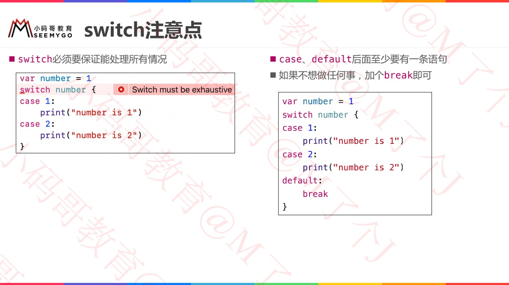

# if - else


# while


# for


## 区间类型


# switch


## fallthrough 贯穿


## switch 注意点




## switch 复合条件


## switch 区间匹配、元祖匹配


## switch 值绑定


# where


# 标签语句

> Demo：MyPlayground.playground	-->	AAA	-->	**func** 标签语句() 


# ============分割线=============


# 一、循环类型

## for (Swift 3 已弃用)

```swift
var someInts:[Int] = [10, 20, 30]
for var index = 0; index < 3; ++index {
   print( "索引 [\(index)] 对应的值为 \(someInts[index])")
}
// 报错：C-style for statement has been removed in Swift 3
```

## for - in

```swift
for index in 1...5 {
    print("index ：\(index)")
}

var someInts:[Int] = [10, 20, 30]
for value in someInts {
   print( "index 的值为 \(value)")
}
```

## while

```swift
var index = 10
while index < 20
{
   print( "index 的值为 \(index)")
   index = index + 1
}
```

## repeat...while 取代 do...while

```swift
var index = 15
repeat {
    print( "index 的值为 \(index)")
    index = index + 1
} while index < 20
```

## forEach

> 1、You cannot use a `break` or `continue` statement to exit the current call of the `body` closure or skip subsequent calls.
>
> 1、您不能使用“ break”或“ continue”语句来退出“ body”闭包的当前调用或跳过后续调用。
>
> 2、Using the `return` statement in the `body` closure will exit only from the current call to `body`, not from any outer scope, and won't skip subsequent calls.
>
> 2、在body闭包中使用return语句将仅从当前对body的调用中退出，而不会从任何外部范围退出，并且不会跳过后续调用。

```swift
let array = [1, 2, 3, "cat", "rabbit"] as [Any]
array.forEach { (element) in
    print(element)
}

// return
let array = [1, 2, 3, 4, 5]
array.forEach { (element) in
    if element == 3 {
        return
    }
    print(element)
}
/// 1 2 4 5

// return
let array = [1, 2, 3, 4, 5]
array.forEach { (element) in
    return
    print(element)   // Warning : Expression following 'return' is treated as an argument of the 'return'
}
/// 1 2 3 4 5

// return
let array = [1, 2, 3, 4, 5]
array.forEach { (element) in
    print(element)
    return
}
/// 1 2 3 4 5
```


# 二、循环控制语句

##  continue

> 跳过本次循环，重新开始下次循环。

```swift
var index = 10
repeat {
   index = index + 1
   if( index == 15 ) { // index 等于 15 时跳过
      continue
   }
   print( "index 的值为 \(index)")
} while index < 20
```


## break

> 立刻结束整个控制流的执行。

```swift
var index = 10
repeat {
    index = index + 1
    if( index == 15 ) {  // index 等于 15 时终止循环
        break
    }
    print( "index 的值为 \(index)")
} while index < 20
```


## fallthrough

> 使用fallthrough可以实现贯穿效果。

```swift
// 正常
var index = 10
switch index {
   case 100  :
      print( "index 的值为 100")
   case 10,15  :
      print( "index 的值为 10 或 15")
   case 5  :
      print( "index 的值为 5")
   default :
      print( "默认 case")
}
// Log
index 的值为 10 或 15


// 使用fallthrough
var index = 10
switch index {
   case 100  :
      print( "index 的值为 100")
   case 10,15  :
      print( "index 的值为 10 或 15")
      fallthrough
   case 5  :
      print( "index 的值为 5")
   case 56  :
      print( "index 的值为 56")
   default :
      print( "默认 case")
}
// Log
index 的值为 10 或 15
index 的值为 5
```


# ============分割线=============


guard case 用法

https://stackoverflow.com/questions/32256834/swift-guard-let-vs-if-let


# 一、guard VS if 

* Guard let
  * 要求返回值，`return/throw/break/continue`；
  * 创建的变量，guard内不能访问，guard外可以访问；
  * 存在于函数的前面；

* If let
  * 返回值return非必须，当然也可以写；
  * 创建的变量，超出作用域就不能访问；


# 二、guard 作用


## 1. 提前退出

> 如果name不存在，则不需要执行后面的代码，直接返回。

```swift
func greet(person: [String: String]) {
    guard let name = person["name"] else {
        return
    }
		//.......    
}
```


## 2. 使代码清晰，避免金字塔

```swift
func validateFieldsAndContinueRegistration() {
    if let firstNameString = firstName.text where firstNameString.characters.count > 0 {
        if let lastNameString = lastName.text where lastNameString.characters.count > 0 {
            if let emailString = email.text where emailString.characters.count > 3 && emailString.containsString("@") {
                if let passwordString = password.text where passwordString.characters.count > 7 {
                    //......
                } else {
                    //......
                }
            } else {
                //......
            }
        } else {
            //......
        }
    } else {
        //......
    }
}
```


## 3. guard创建的变量作用域

> 使用guard可以创建一个新的变量，该变量将存在于else语句之外。
>
> 新创建的变量只存在于代码块内部。

```swift
func someFunc(blog: String?) {

    guard let blogName = blog else {
        print("some ErrorMessage")
        print(blogName)    // Error : Variable declared in 'guard' condition is not usable in its body
        return
    }
    print(blogName)   // You can access it here ie AFTER the guard statement!!

    // And if I decided to do 'another' guard let with the same name ie 'blogName' then I would create an error!
    guard let blogName = blog else { // Error: Definition Conflicts with previous value.
        print(" Some errorMessage")
        return
    }
    print(blogName)
}
```


