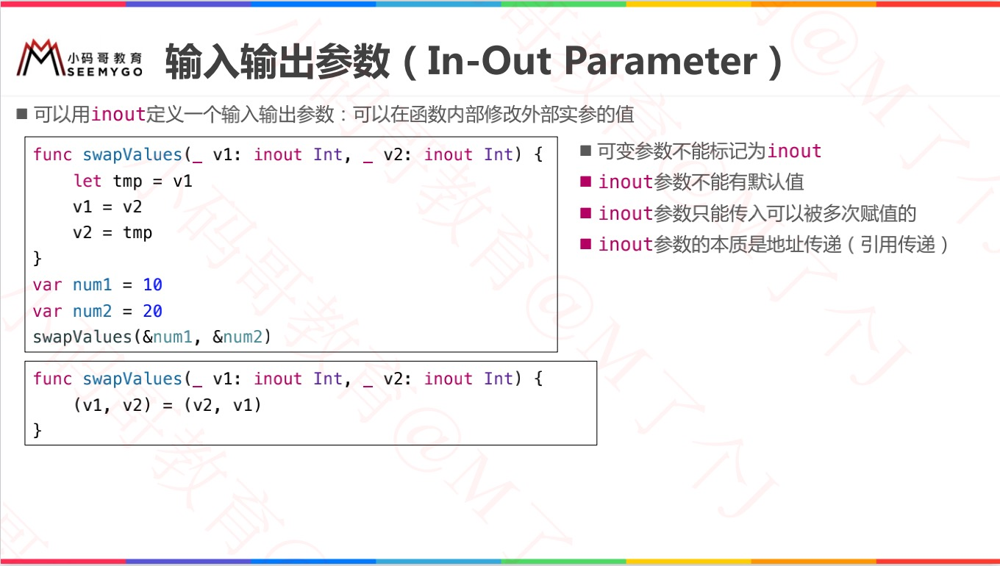
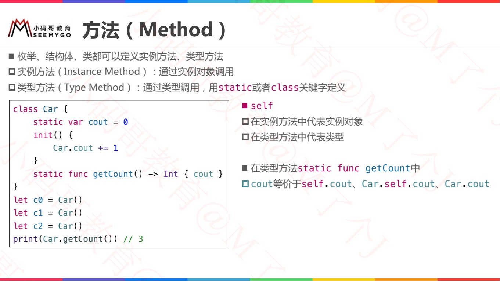

#  函数定义

## 无形式参数、无返回值

```swift
// 无形式参数、无返回值
func test1() {
		//......
}
/// 严格来讲，函数还是有一个返回值的，尽管没有定义返回值。没有定义返回类型的函数实际上会返回一个特殊的类型 Void。它其实是一个空的元组，作用相当于没有元素的元组，可以写作 () 。
```


## 多形式参数、有返回值

```swift
// 多形式参数、有返回值
func test2(name: String, aget: Int) -> String {
    //......
		return "xxx"
}
// 调用
test2(name: "lin", age: 12)
```


## 可选元组返回类型

```swift
// 可选元组返回类型
// (Int, Int)?的可选元组类型和包含可选类型的元组 (Int?, Int?)是不同的。
func minMax(array: [Int]) -> (min: Int, max: Int)? {
    if array.isEmpty { return nil }
    var currentMin = array[0]
    var currentMax = array[0]
    for value in array[1..<array.count] {
        if value < currentMin {
            currentMin = value
        } else if value > currentMax {
            currentMax = value
        }
    }
    return (currentMin, currentMax)
}
// 调用
let bounds = minMax(array: [8, -6, 2, 109, 3, 71])
print("min is \(bounds.min) and max is \(bounds.max)")
```


## 隐式返回（Implicit Return）

```swift
// 隐式返回的函数
// 整个函数体是一个单一表达式，那么函数隐式返回这个表达式，通俗来说：可以省略那个 return
func greeting(for person: String) -> String {
    "Hello, " + person + "!"
}
```


# 函数参数

## 参数标签（Argument Label）

```swift
// 默认情况下，形式参数使用它们的形式参数名作为实际参数标签。
func someFunction(firstParameterName: Int, secondParameterName: Int) {
    //......
}
// 调用
someFunction(firstParameterName: 1, secondParameterName: 2)


// 指定实际参数标签
func someFunction(argumentLabel parameterName: Int) {
    // In the function body, parameterName refers to the argument value
    // for that parameter.
}
// 调用
someFunction(argumentLabel: 1)


// 若指定了实际参数标签，则调用时必须使用实参标签
func someFunction(person: String, from hometown: String) -> String {
    return "Hello \(person)!  Glad you could visit from \(hometown)."
}
// 调用
someFunction(person: "Bill", from: "Cupertino")


// 省略实际参数标签
// 用下划线（ _ ）来代替显式的实际参数标签。
func someFunction(_ firstParameterName: Int, secondParameterName: Int) {
    // In the function body, firstParameterName and secondParameterName
    // refer to the argument values for the first and second parameters.
}
// 调用
someFunction(1, secondParameterName: 2)
```


## 默认参数值（Default Parameter Value）

> 注意：多个默认值时，都写在末尾，而不能间隔写。

```swift
// 默认形式参数值
func someFunction(parameterWithDefault: Int = 12) {
    //......
}
// 调用
someFunction(parameterWithDefault: 6) // parameterWithDefault is 6
someFunction() // parameterWithDefault is 12
```


## 可变参数（Variadic Parameter）

```swift
// 可变形式参数
// 一个可变形式参数可以接受零或者多个特定类型的值。可以通过在形式参数的类型名称后边插入三个点符号（ ...）来书写可变形式参数。
// 传入到可变参数中的值在函数的主体中被当作是对应类型的数组。举个栗子，一个可变参数的名字是 numbers类型是 Double...在函数的主体中它会被当作名字是 numbers 类型是 [Double]的常量数组。
// 注意：一个函数最多只能有一个可变形式参数。
func arithmeticMean(_ numbers: Double...) -> Double {
    var total: Double = 0
    for number in numbers {
        total += number
    }
    return total / Double(numbers.count)
}
// 调用
arithmeticMean(1, 2, 3, 4, 5)
// returns 3.0, which is the arithmetic mean of these five numbers
arithmeticMean(3, 8.25, 18.75)
// returns 10.0, which is the arithmetic mean of these three numbers
```


## 输入输出参数（In-Out Parameter）

```swift
/// 输入输出形式参数
/// 输入输出形式参数不能有默认值
/// 不能用常量或者字面量作为实际参数，因为常量和字面量不能修改。
/// 在将变量作为实际参数传递给输入输出形式参数的时候f，前边添加符号 ( &) 来明确可以被函数修改。
func swapTwoInts(_ a: inout Int, _ b: inout Int) {
    let temporaryA = a
    a = b
    b = temporaryA
}
// 调用
var someInt = 3
var anotherInt = 107
swapTwoInts(&someInt, &anotherInt)
print("someInt is now \(someInt), and anotherInt is now \(anotherInt)")
// prints "someInt is now 107, and anotherInt is now 3"
```




# 函数重载（Function Overload）


# 内联函数（Inline Function）


# 函数类型（Function Type）


```swift
// 每一个函数都有一个特定的函数类型，它由形式参数类型，返回类型组成。
func printHelloWorld() {
    print("hello, world")
}
// 这个函数的类型是 () -> Void，或者 “一个没有形式参数的函数，返回 Void。”

func addTwoInts(_ a: Int, _ b: Int) -> Int {
    return a + b
}
// 函数的类型都是 (Int, Int) -> Int 。也读作：“有两个形式参数的函数类型，它们都是 Int类型，并且返回一个 Int类型的值。”


/// 声明函数类型的变量
var a: () -> Void
var b: (Int, String) -> String
var c: ([Int]) -> (Int, String)

// 使用函数类型
func addTwoInts(_ a: Int, _ b: Int) -> Int {
    return a + b
}
var d: (Int, Int) -> Int = addTwoInts
d(1, 3)
```


##  函数类型作为函数参数


```swift
// 函数类型作为形式参数类型
func test() {
    print("test()方法被调用了")
}
func test11(param: () -> Void) {
    param()
}
// 调用一
test11(param: test)   // Log：test()方法被调用了
// 调用二
test11(param: {() -> Void in
    print("345")
})
// 调用三
test11 {() -> Void in
    print("123")
}

// 进阶
func sum(param: (Int, Int) -> Int) {
    let value = param(1, 3)
    print(value)
}
func add(a: Int, b: Int) -> Int {
    return a + b
}
// 调用一
sum(param: add)
// 调用二
sum(param: {(a: Int, b: Int) -> Int in
    return a + b
})

// 样例
var arr = [4,1,2,3]
arr.sort { (a, b) -> Bool in
    if a < b {
        return true
    } else {
        return false
    }
}
print(arr)   // Log：[1, 2, 3, 4]
```


## 函数类型作为函数返回值


```swift
func play1(value: Int) -> Int {
    return value * value
}
func play2(value: Int) -> Int {
    return value + value
}
// 函数类型作为返回类型
func test(param: Bool) -> (Int) -> Int {
    return param ? play1 : play2
}
// 调用
var a = test(param: true)  // 此时a为一个函数
print(type(of: a))     // Log: (Int) -> Int
// 此时a为paly1函数
print(a(5)) 		// Log: 25
```


# 嵌套函数（Nested Function）

> 在函数里面定义函数

```swift
// 外面大方法
func test(param: Bool) -> (Int) -> Int {
    // 内部方法1
    func play1(value: Int) -> Int {
        return value * value
    }
		// 内部方法2
    func play2(value: Int) -> Int {
        return value + value
    }
    
    return param ? play1 : play2
}

// 调用
var a = test(param: true)  // 此时a为一个函数
print(type(of: a))     // Log: (Int) -> Int
// 此时a为paly1函数
print(a(5)) 		// Log: 25
```


# ===== ===== ===== =====


# 方法 Method

> Swift 方法是与某些特定类型相关联的函数。
>
> 在 Objective-C 中，类是唯一能定义方法的类型。但在 Swift 中，你不仅能选择是否要定义一个 `类 / 结构体 / 枚举`，还能灵活的在你创建的类型（`类/结构体/枚举`）上定义方法。

* 实例方法 Instance Method

  > 在 Swift 语言中，实例方法是属于某个特定类、结构体或者枚举类型实例的方法。

* 类型方法 Type Method





## mutating


## @discardableResult


# ===== ===== ===== =====


# 下标

* 结构体作为返回值

    ```swift
    // 结构体
    struct Point {
    	var x = 0, y = 0 
    }
    
    class PointManager {
    	var point = Point()
    	subscript(index: Int) -> Point {
            set { 
                point = newValue 
            }
            get { point } 
    	} 
    }
    
    var pm = PointManager()
    pm[0].x = 11  
    pm[0].y = 22
    // 本质上，等价于 
    pm[0] = Point(x:11, y: pm[0].y)
    pm[0] = Point(x:pm[0].x, y: 22)
    ```

* 类作为返回值

    * 当类作为返回值，不需要`set方法` ，而结构体不行，为什么？？
    * 因为：结构体是值类型，`pm[0]`是拷贝的临时值，并不是原始值；而类是引用类型，`get方法`返回的是`指针变量`，所以可以修改。

    ```swift
    // 结构体
    class Point {
    	var x = 0, y = 0 
    }
    
    class PointManager {
    	var point = Point()
    	subscript(index: Int) -> Point {
            get { point } 
    	} 
    }
    
    var pm = PointManager()
    pm[0].x = 11  		// pm[0]返回的是指针变量，无序set方法，也可以访问指针变量的x
    pm[0].y = 22
    ```


# ===== ===== ===== =====


# 单例方法


# ===== ===== ===== =====


# 函数注释


# Swift自带的print函数


# typealias 


