[Swift-可选项](https://www.jianshu.com/p/0d471e4e506b)


# 可选项基础（Optional）


## 1.nil 在OC与Swift中

> 1. OC中nil是无类型的指针，是指向一个不存在对象的指针；
> 2. OC中NSArray、NSDictionary、NSSet等不允许放入nil；
> 3. OC所有对象变量都可以为nil；
> 4. OC中nil只能用在对象上，而其他地方又有其他特殊值（如NSNotFound）表示值的缺失；
> 5. 在Swift中，**nil不是指针**，它是值缺失的一种特殊类型，**「任何类型 Optional可选项」**都可以设置成nil；
> 6. 在Swift中，`nil` 不能用于非可选的常量和变量。

**代码比较**

```swift
var str: String? = nil  // 代表空，无对象，
var str1: String? = ""  // 有对象，为空对象
NSString *str2 = nil;

// 调用
str.isEmpty()   				// 会Crash, 因为str无对象
str1.isEmpry()  				// 输出 0
str2.isEmpty();					// 不会Crash
```


## 2.Optional展开

> 1. 可选项是没法直接使用；
> 2. 需要用 ！展开使用；（意思是：我知道这个可选项中有值，展开吧，可以使用）

```swift
//【ERROR】
var str: String? = "abc"
let count = str.count

//【Right】
var str: String? = "abc"
if str != nil {
		let count = str.count
}
```


## 3.Optional强制展开

> 使用 ！来获取一个不存在的可选值会导致运行报错，所以在使用！强制展开之前必须确保可选项中包含一个非nil的值。

```swift
//【ERROR】
var str: String?
let count = str!.count
```


## 4.Optional绑定

> 1. 可以使用可选项绑定来判断可选项是否包含值，如果包含就把值赋给一个临时变量或常量；
> 2. 可以与 if 和 while 语句配合使用；
> 3. 同一个if语句中可以包含多个可选项绑定，用逗号隔开，如果其中一个为nil，则整个if判断为false。

```swift
var str: String? = "abc"
var str1: String? = nil
if let acc = str, let bb = str1 {
		let count = acc.count
}
```


## 5.Optional隐式展开

> 1. 有些可选项一旦被赋值后，就会一直拥有值，这种情况下，就可以去掉检查，不必每次访问都进行展开；
> 2. 通过在声明类型后面加一个叹号（!）而非问号（?）来书写隐式展开；
> 3. 隐身展开可选项主要被用在Swift类初始化过程中；

```swift
var str: String! = "abc"
let count = str.count
print(count) // 3，隐式展开，不是Optional(3)


// ！！！比较 ！！！
var a: Int = 100
var b: Int! = 100

a = nil  // 报错：'nil' cannot be assigned to type 'Int'
b = nil  // 正确
```


## 6.Optional可选链

> 1. 可选项后面加？进行执行；
> 2. 如果可选项不为nil，返回一个可选项结果，可选项结果后续使用依旧需要展开；否则返回nil。

```swift
var str: String? = "abc"
let count = str?.count      // 这里的count也是一个可选项类型，后续使用也必须进行展开
if count != nil {
		let last = count! - 1
}
```


# ================


# 可选项（Optional）

> 可选项，一般也叫可选类型，它允许将值设置为nil
> 在类型名称后面加个问号 ? 来定义一个可选项

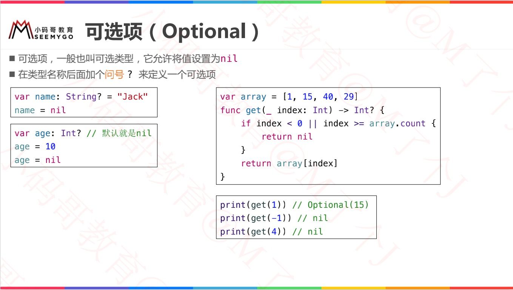


# 强制解包（Forced Unwrapping） 

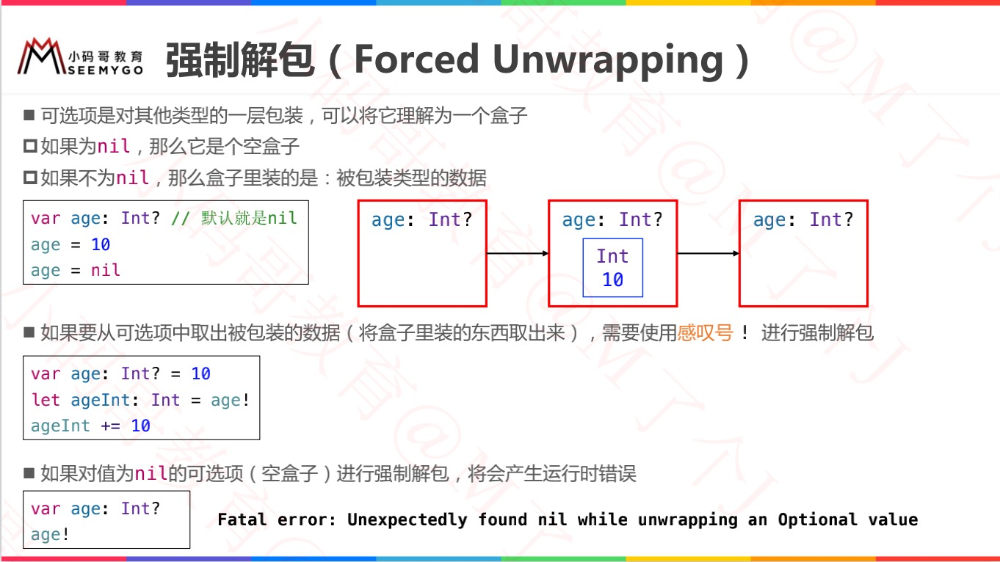


# 可选项绑定（Optional Binding）

## 一般方法：判断可选项是否包含值

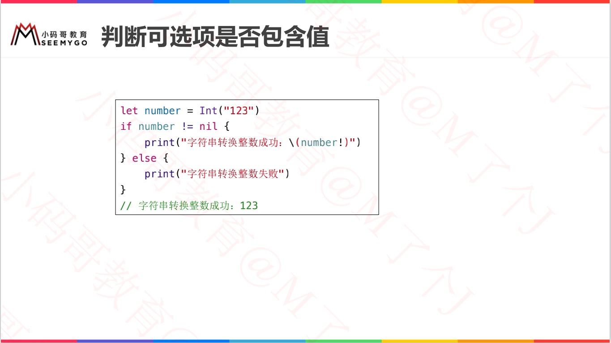


## 可选项绑定

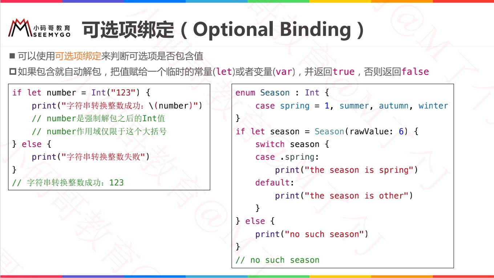


## 可选项绑定的等价写法

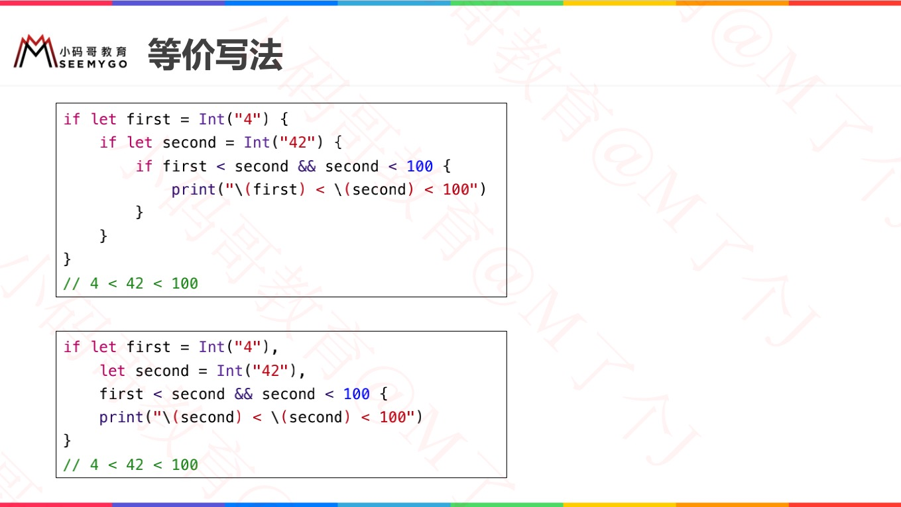


## while循环中使用可选项绑定

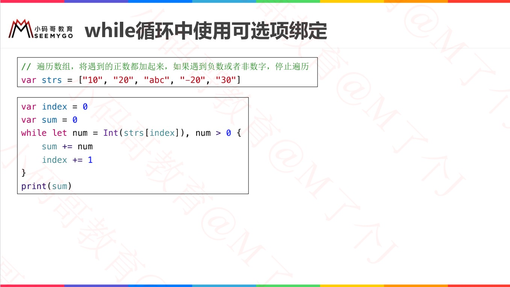


# 空合并运算符 ??（Nil-Coalescing Operator）

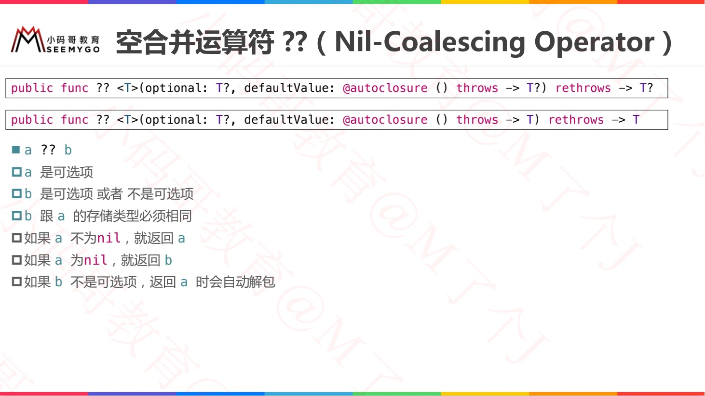

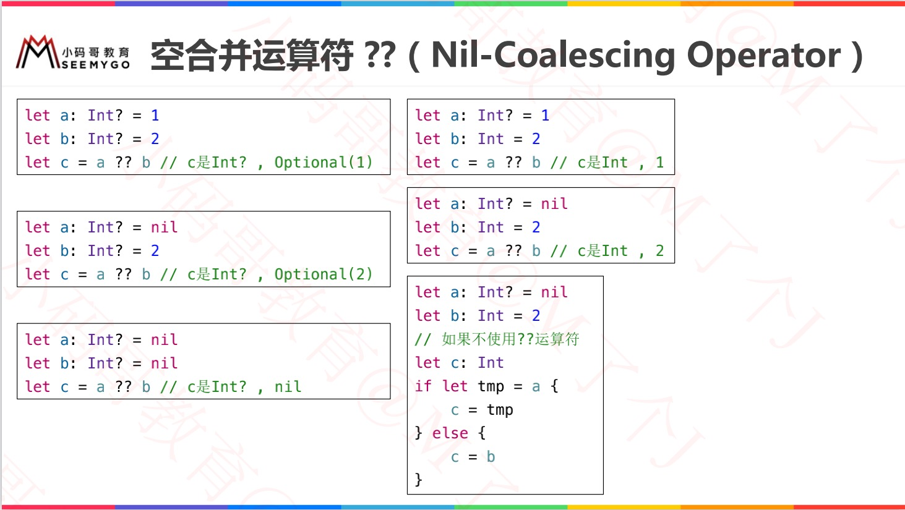


## 多个 ??

> c 的类型，根据最右边是什么类型决定。

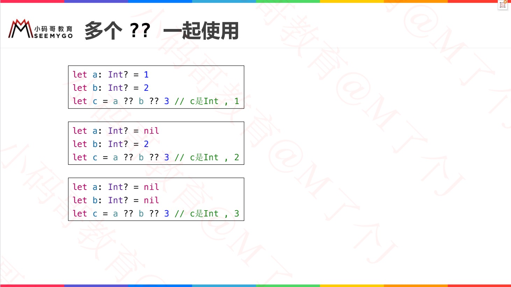


## ?? 与 if

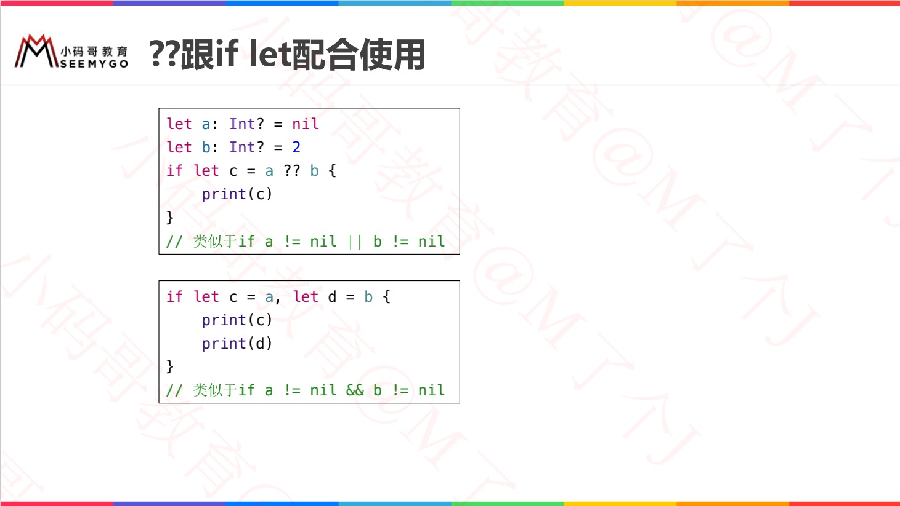


# if VS guard 可选性绑定

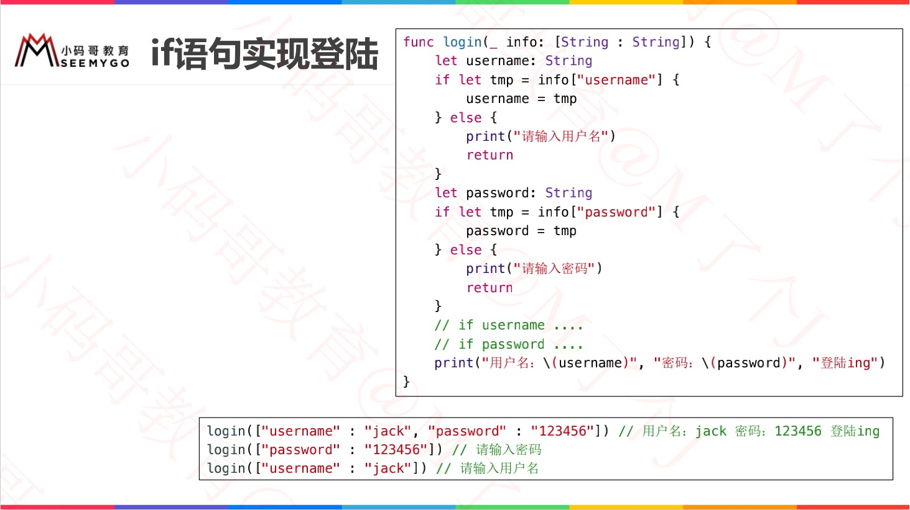

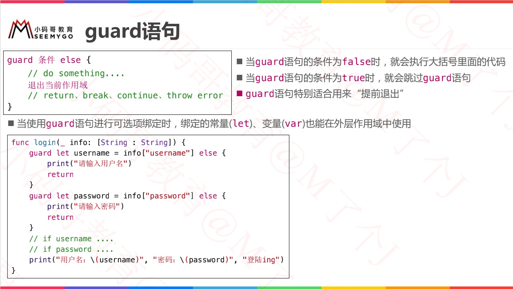


# 隐式解包（Implicitly Unwrapped Optional）

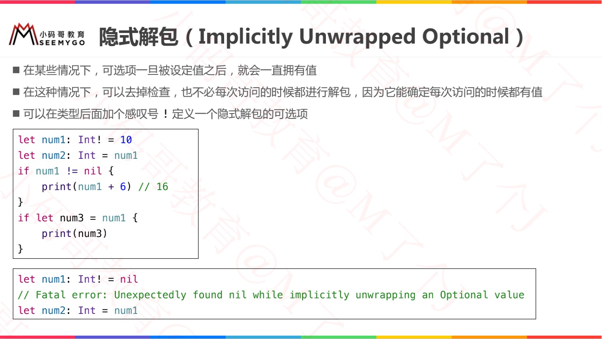


# 字符串插值

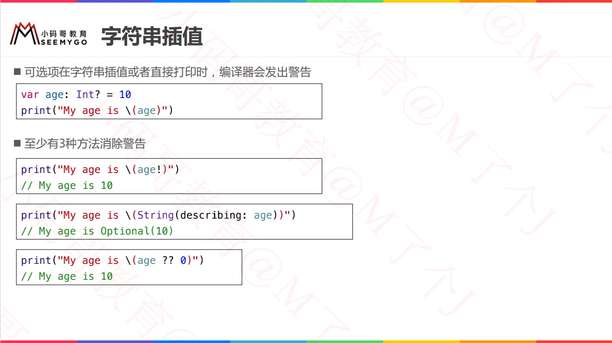


# 多重可选项

## 有值

```swift
var num1: Int? = 10    //包装Int类型的可选类型
var num2: Int?? = num1 //包装Int?可选类型的可选类型
var num3: Int?? = 10   //可能你会想，右边不应该传Int?类型的吗，其实传10编译器会自动帮我们包装的

print(num2 == num3) //true
可以这样理解：num2和num3都有值10，并且类型都是Int??，所以当然相等啦！
```

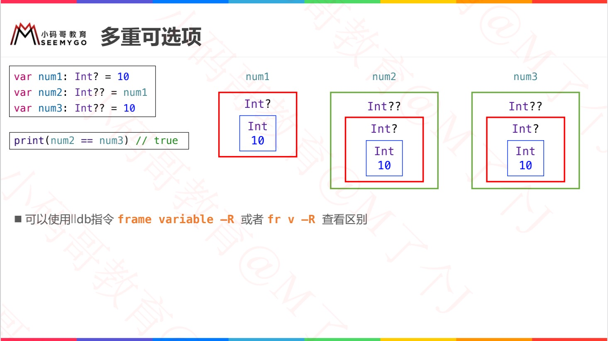


## 无值

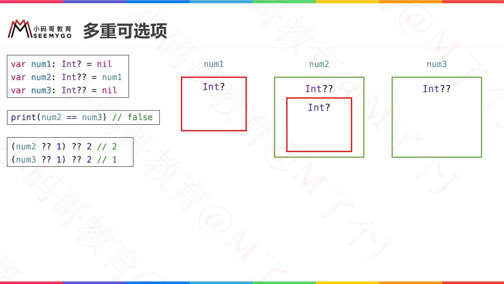


# ================

 

# 可选链（Option chaining）


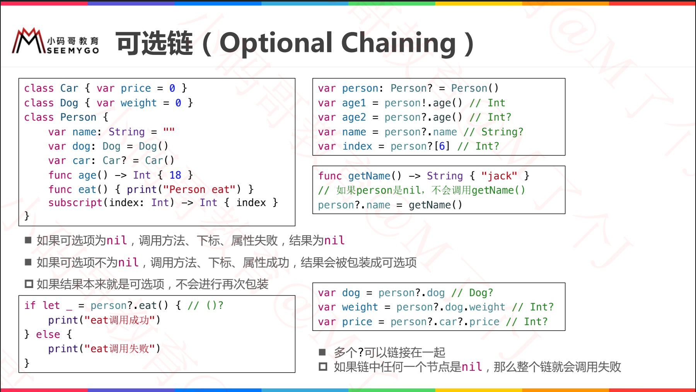


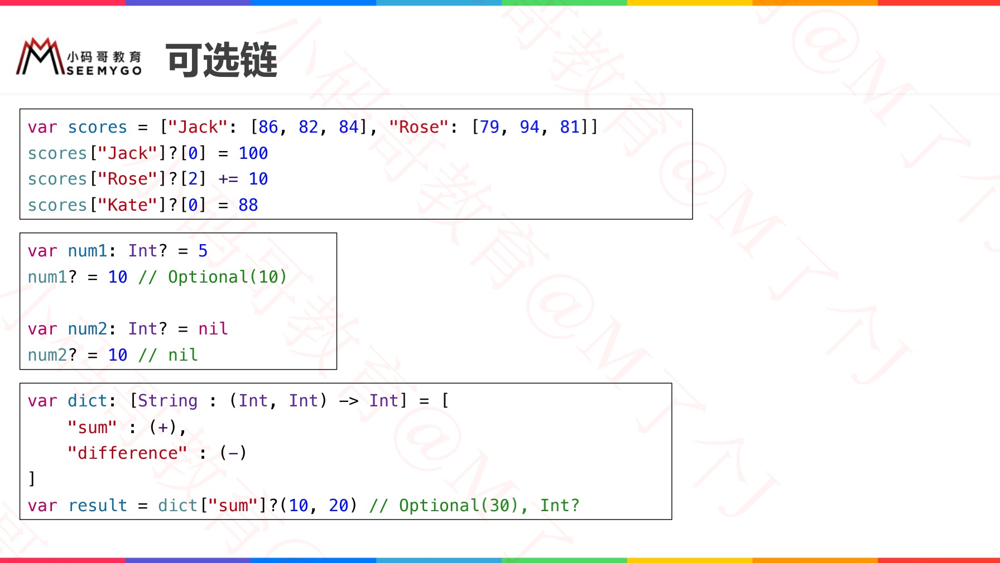

