# 可参考

[类和结构体](https://www.cnswift.org/classes-and-structures#spl)


# 结构体

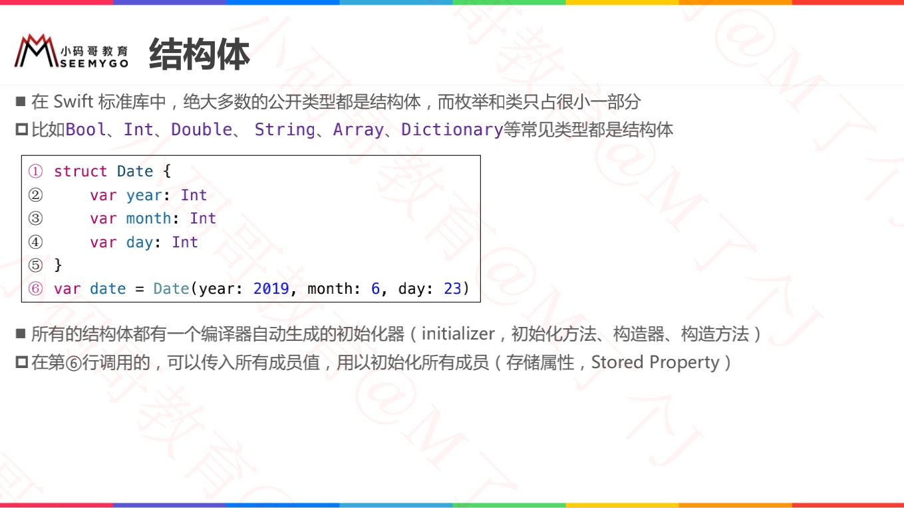


## 初始化器

### 自动生成初始化器

> **保证所有成员都有初始值！！！**

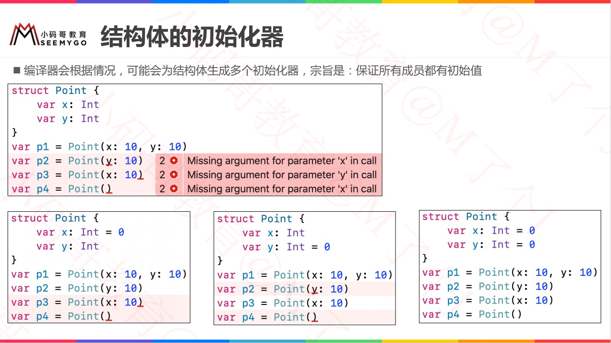

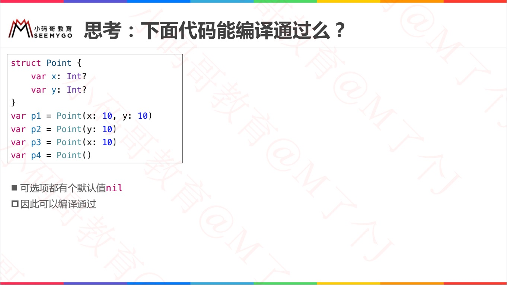


### 自定义初始化器

> **结构体若自定义初始化，则不会自动生成其他初始化器！！！**

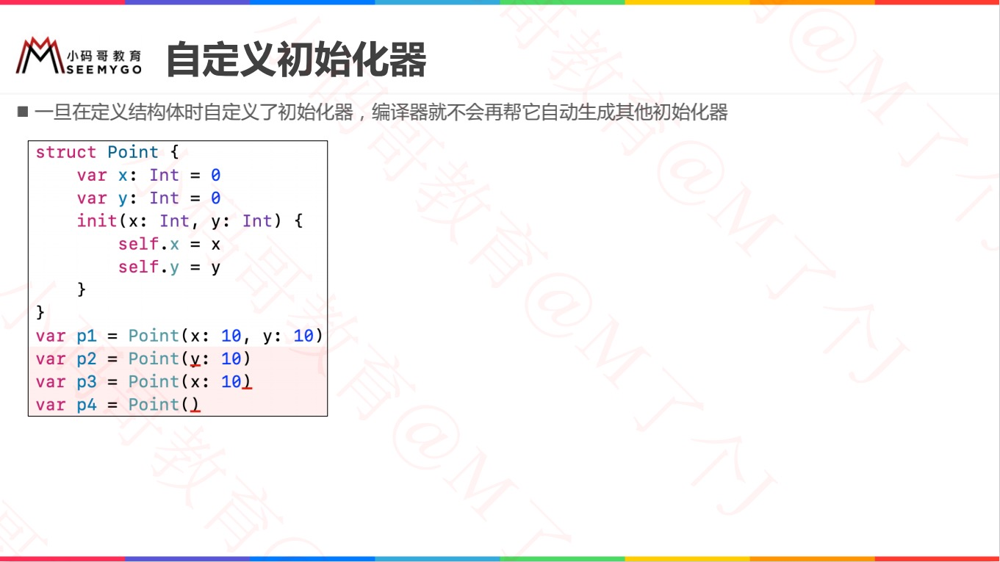


### 初始化器本质

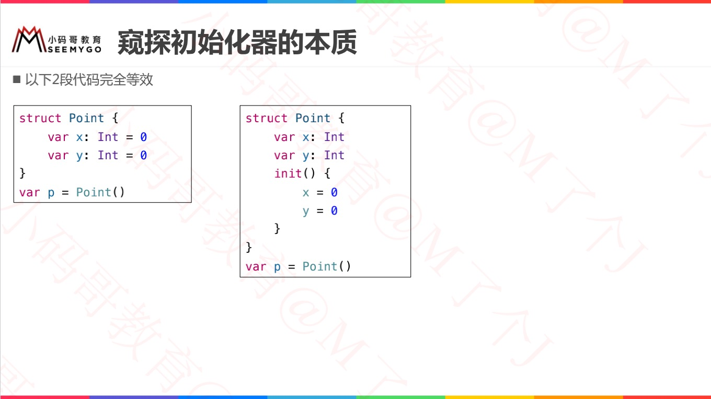

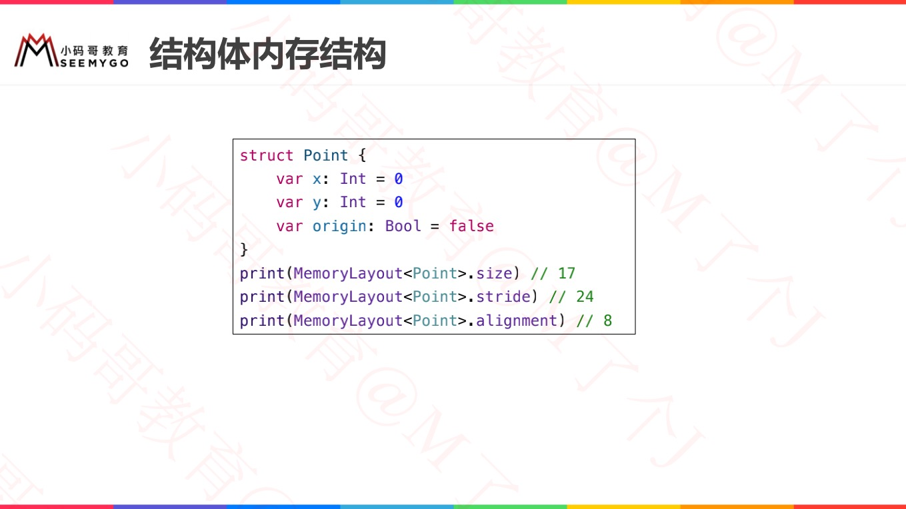


# 类

## 初始化器

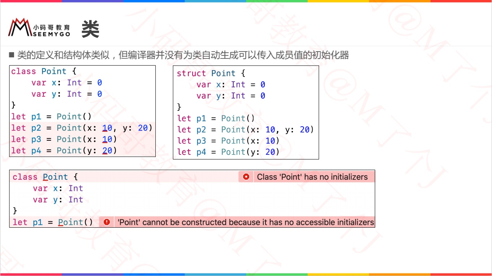

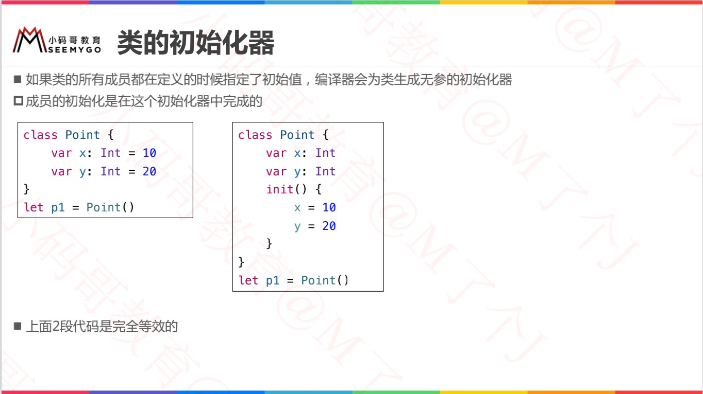


# 结构体 VS 类⭐

## 相同点

* 都能定义属性、方法、初始化器；
* 都能添加extension扩展；
* 都能遵循协议。

## 不同点

* 初始化器
  * 结构体
    * 会自动生成初始化器，保证每个成员都有初始值
  * 类
    * 若成员有初始化值，则编译器会自动生成无参的初始化器
    * 若成员没有初始化，则编译器不会生成任何初始化器
* 类型
  * 结构体是 **值类型**
  * 类是 **引用类型**
* 内存分布
  * 结构体在 **栈空间**
  * 类在 **堆空间**

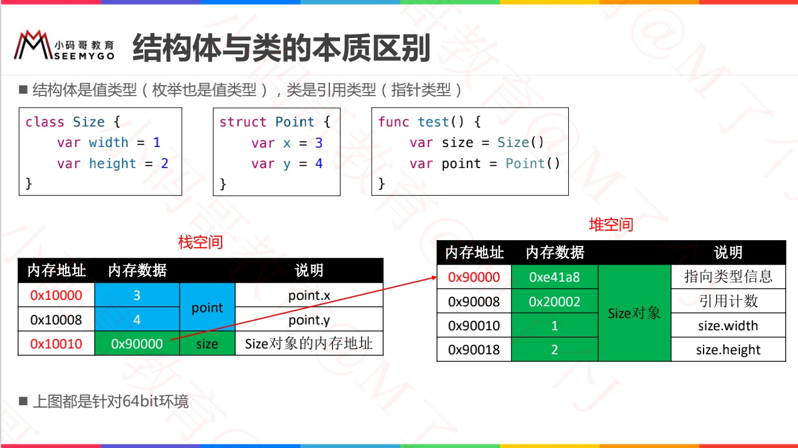


# 值类型 VS 引用类型⭐

**值类型**

> *值类型* 是一种当它被指定到常量或者变量，或者被传递给函数时会被 **拷贝** 的类型。
>
> * 基本类型：整数、浮点数、布尔量、字符串、数组和字典，都是值类型；
>
> * **结构体** 和 **枚举** 都是值类型。
>
> 这意味着你所创建的任何结构体和枚举实例——和实例作为属性所包含的任意值类型——在代码传递中总是被拷贝的。

**引用类型**

> * 类是引用类型
>
> * 闭包是引用类型
>
> 不同于值类型，在*引用类型*被赋值到一个常量，变量或者本身被传递到一个函数的时候它是*不会*被拷贝的。相对于拷贝，这里使用的是同一个对现存实例的引用。

 

 

# 值类型

> **赋值 是 内容拷贝！！**
>
> Copy On Write

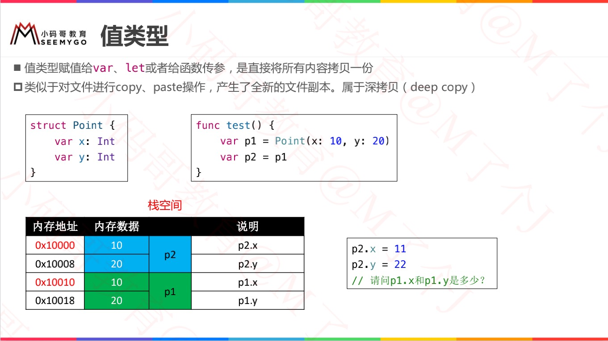


## 值类型的赋值操作

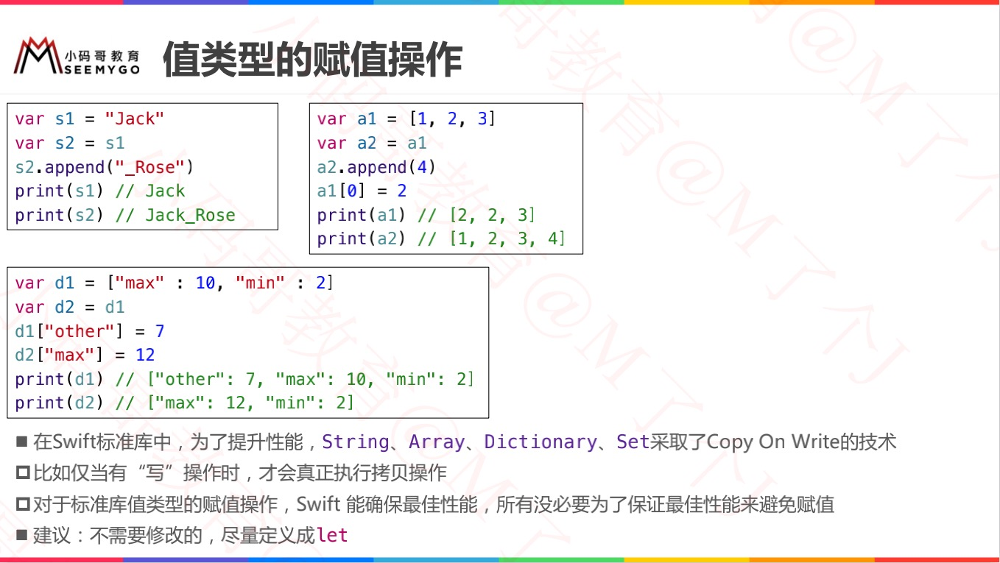

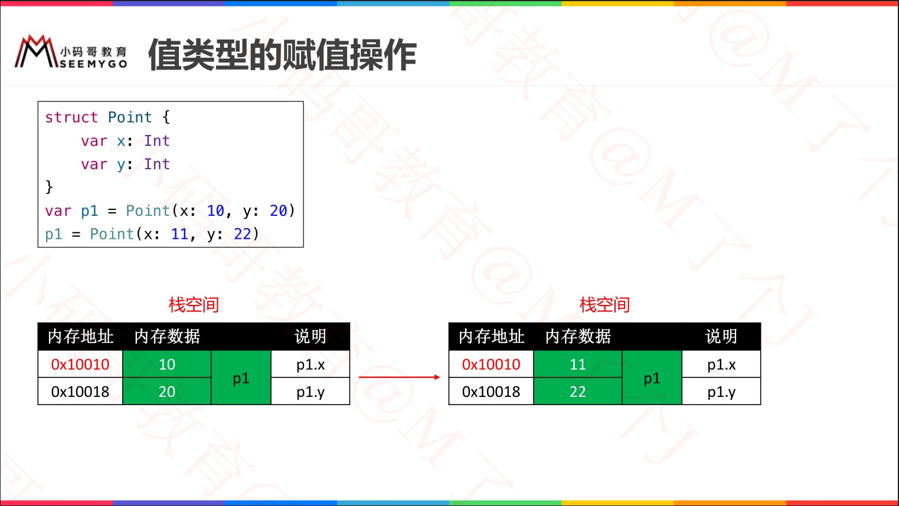

**自己验证**

```swift
struct Size {
    var w: Int
    var h: Int
}

var s1 = Size(w: 10, h: 20)
print("s1: \(Mems.ptr(ofVal: &s1))")

s1 = Size(w: 20, h: 30)
print("s1: \(Mems.ptr(ofVal: &s1))")

var s2 = s1
print("s2: \(Mems.ptr(ofVal: &s2))")

// LOG
s1: 0x000000010000c538
s1: 0x000000010000c538
s2: 0x000000010000c548
```


## 方法传参赋值

```swift
struct Size {
    var w: Int
    var h: Int
}

func test(s: Size) {
    var ss = s
    print("s: \(Mems.ptr(ofVal: &ss))")
}

var s1 = Size(w: 10, h: 20)
print("s1: \(Mems.ptr(ofVal: &s1))")
test(s: s1)

// Log
s1: 0x000000010000c538
s: 0x00007ffeefbff210
```


# 引用类型（指针类型）

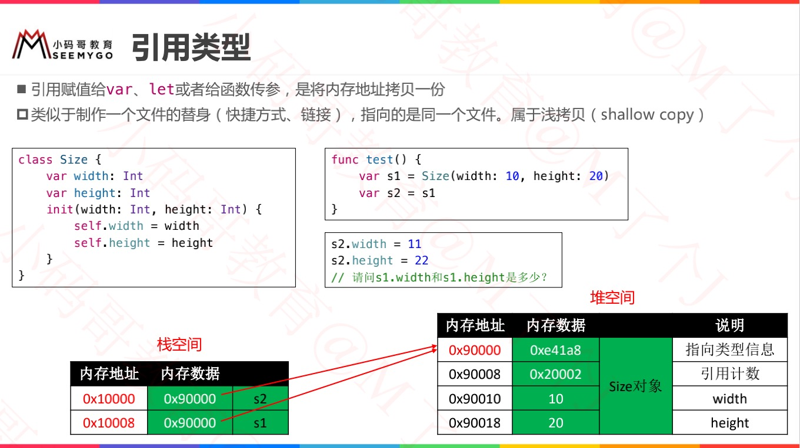


## 引用类型的赋值操作

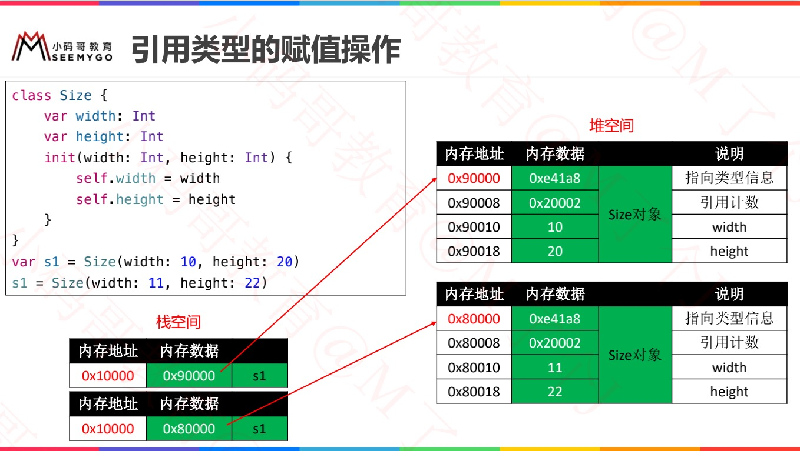

**自己验证**

```swift
class Size {
    var w: Int = 0
    var h: Int = 0
}

var s2 = Size()
print("s2: \(Mems.ptr(ofRef: s2))")

s2 = Size()
print("s2: \(Mems.ptr(ofRef: s2))")

// Log
s2: 0x000000010056e250
s2: 0x0000000100708ac0
```


## 方法传参赋值

```swift
class Size {
    var w: Int = 0
    var h: Int = 0
}

func test(s: Size) {
    print("s: \(Mems.ptr(ofRef: s))")
}

var s2 = Size()
print("s2: \(Mems.ptr(ofRef: s2))")
test(s: s2)

// LOG
s2: 0x0000000103828d00
s: 0x0000000103828d00
```


# 其他

## 值类型、引用类型的let

* 结构体 let
  * p的内存不能改，成员也不能改
  * 由于结构体是值类型，内存中包含了成员，所以不能改
* 类 let
  * s是引用类型，8个字节，不能改
  * 但是它指向的堆空间的内存可以修改
* 字符串 let
* 数组 let

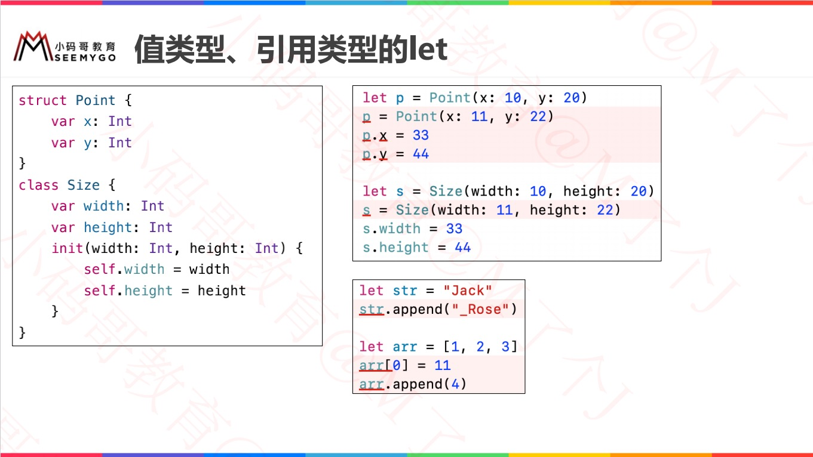


## 嵌套类型

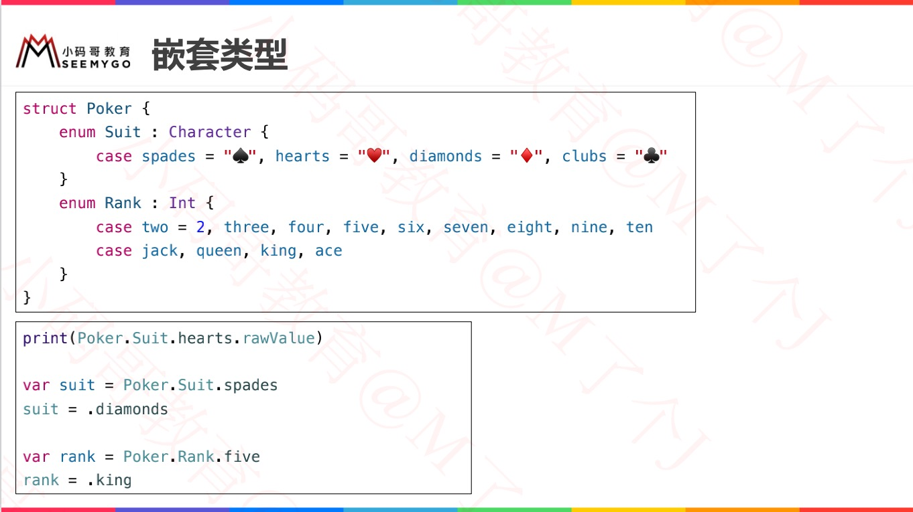


## 枚举、结构体、类都可以定义方法

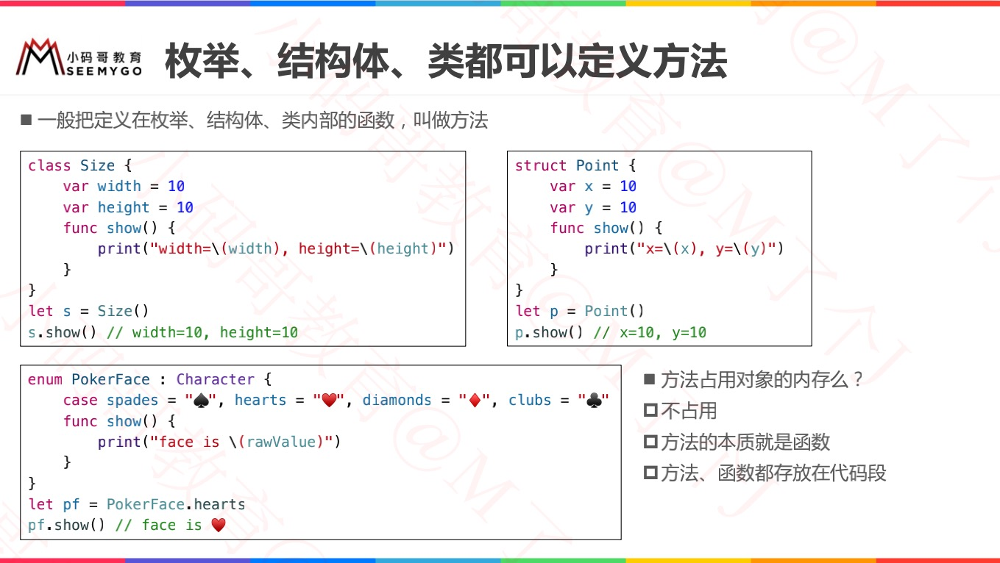


# 思考

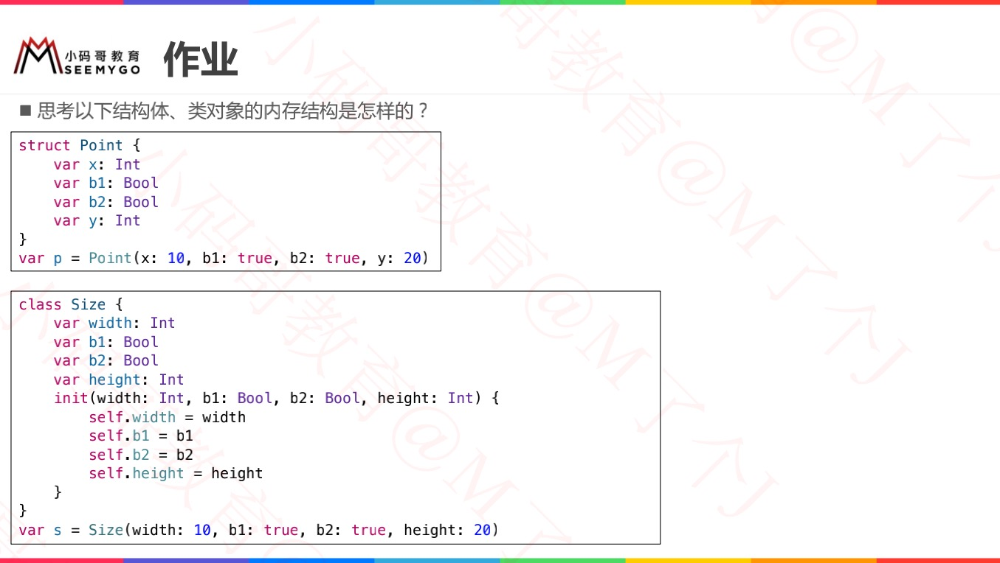


# 类 - 内存分析

```swift
class Point {
  	// 类分配对象，前十六个字节：前八个指向类型信息+后八个引用计数
    var x = 11      // 8
    var b = true    // 1
    var y = 16      // 8
}
var p = Point()

// class是对象类型数据，使用MemoryLayout对class类型计算其内存结果实际上是对其class类型的引用指针进行操作
print(MemoryLayout<Point>.size)      // 8
print(MemoryLayout<Point>.stride)    // 8
print(MemoryLayout<Point>.alignment) // 8

// 如何查看对象占用多少堆空间内存？？
// 方式一：小码哥封装，底层方法：public func malloc_size(_ ptr: UnsafeRawPointer!) -> Int
// Mac、iOS中malloc分配的内存总是16的倍数！！！
print(Mems.size(ofRef: p)) 		// 48

print("p变量的地址", Mems.ptr(ofVal: &p))
print("p变量的内存的内容", Mems.memStr(ofVal: &p))

print("p所指向内存的地址", Mems.ptr(ofRef: p))
print("p所指向内存的内容", Mems.memStr(ofRef: p))

/// Log
p变量的地址 0x000000010000c580
p变量的内存的内容 0x0000000104854a90
p所指向内存的地址 0x0000000104854a90
p所指向内存的内容 0x000000010000c380 0x0000000200000003 0x000000000000000b 0x00007fff2382e901 0x0000000000000010 0x0003000000000000


//
// public func class_getInstanceSize(_ cls: AnyClass?) -> Int
// 此方法可得知：类对象至少需要占用多少内存
//
print(class_getInstanceSize(Point.self))	// 40
print(class_getInstanceSize(type(of: p)))	// 40

//
// 总结得出
//
1. p对象实际占用33个字节；（类分配对象，前十六个字节：前八个指向类型信息+后八个引用计数）
2. p对象最少需要40个字节；（字节对齐）
3. p实际分配48个字节；（由于是堆空间，使用malloc分配内存，Mac、iOS中malloc分配的内存总是16的倍数！！！）
```


## 创建类的实例对象，内存申请

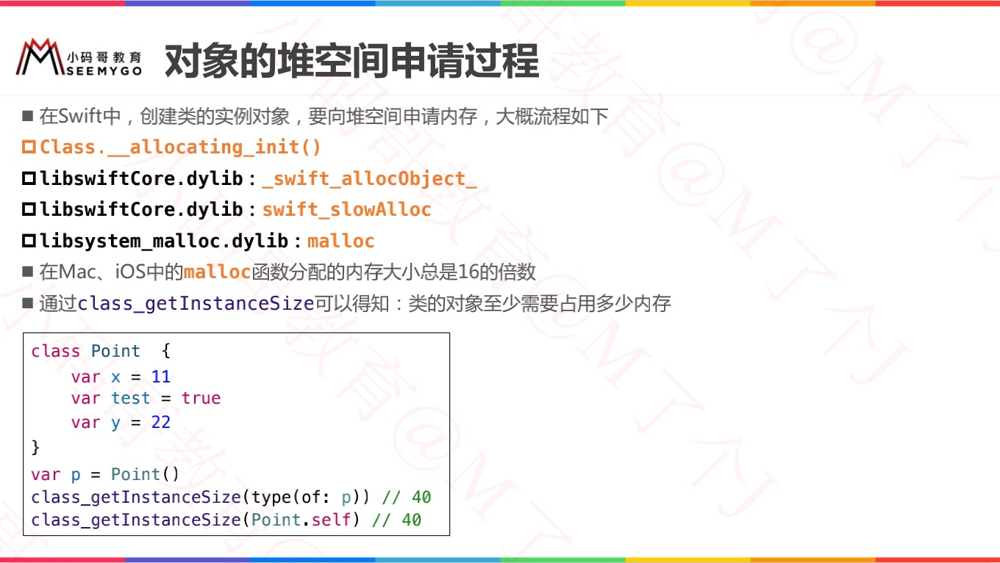


## 如何查看结构体与类的内存信息？

```swift
class Size {
    var width = 1
    var height = 2
}
    
struct Point {
    var x = 3
    var y = 4
}

var ptr = malloc(17)
print(malloc_size(ptr))

print("MemoryLayout<Size>.stride", MemoryLayout<Size>.stride)
print("MemoryLayout<Point>.stride", MemoryLayout<Point>.stride)

print("------------------------")

var size = Size()

print(Mems.size(ofRef: size))

print("size变量的地址", Mems.ptr(ofVal: &size))
print("size变量的内存", Mems.memStr(ofVal: &size))

print("size所指向内存的地址", Mems.ptr(ofRef: size))
print("size所指向内存的内容", Mems.memStr(ofRef: size))

print("------------------------")

var point = Point()
print("point变量的地址", Mems.ptr(ofVal: &point))
print("point变量的内存", Mems.memStr(ofVal: &point))
```


