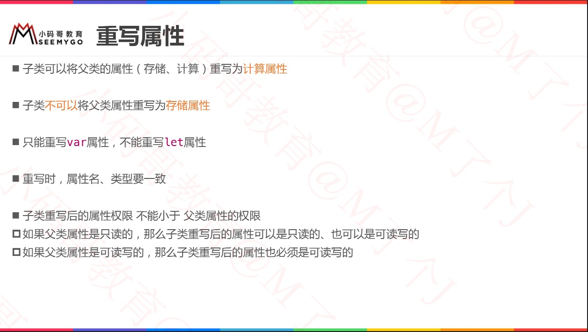

# 继承简介


# 类对象的内存结构

* Animal 对象内存：
    * 对象a分配在堆空间，iOS中堆空间分配默认是16的倍数
    * 类分配对象，前十六个字节：前八个指向类型信息+后八个引用计数 = 16
    * 类中 age 是 int 型 = 8
    * 综上 = 32
* Dog 对象内存：
    * Dog 继承自 Animal，所以有age、weight 两个属性 = 16
    * 综合Animal规则 = 32
* ErHa 对象内存：
    * ErHa继承自Dog，所有用于所有父类的属性，包括age、weight，以及自己的属性iq = 24
    * 综上规则 = 48


# 重写实例方法


# 重写类型方法

* class、static修饰类型方法的区别？
    * class修饰的类型方法可以被重写；而static修饰的类型方法不可用被重写。
* 父类是class修饰类型方法，子类重写时可以使用static修饰。


# 重写属性

* 子类 **可以** 重写父类的属性（包括：存储、计算）重写为 **计算属性**
* 子类 **不可以** 重写分类的属性（包括：存储、计算）重写为 **存储属性**
  * 子类虽然不能重写为存储属性，但子类对象中依旧继承父类的存储属性。




## 重写实例属性


## 重写类型属性


# 属性观察器

* 子类为父类属性增加属性观察器（除了只读计算属性、let属性）


# Swift 多态


## 结构体没有多态

* 由于结构体是值类型，不存在继承，所以不存在多态
* 所以结构体的方法调用，在编译阶段就已经确定！

```swift
struct Animal {
    func speak() {
        print("Animal speak")
    }
    func eat() {
        print("Animal eat")
    }
    func sleep() {
        print("Animal sleep")
    }
}

var anim = Animal()
anim.speak()
anim.eat()
anim.sleep()
```


## 类多态


```swift
class Animal {
    func speak() {
        print("Animal speak")
    }
    func eat() {
        print("Animal eat")
    }
    func sleep() {
        print("Animal sleep")
    }
}

class Dog : Animal {
    override func speak() {
        print("Dog speak")
    }
    override func eat() {
        print("Dog eat")
    }
    func run() {
        print("Dog run")
    }
}
```

* Dog对象调用

  ```swift
  var anim = Dog()
  anim.speak()
  anim.eat()
  anim.sleep()
  anim.run()
  
  // Console
  Dog speak
  Dog eat
  Animal sleep
  Dog run
  ```

* 多态Dog对象调用

  ```swift
  var anim = Animal()
  anim = Dog()
  anim.speak()
  anim.eat()
  anim.sleep()
  anim.run()       	// Error: Value of type 'Animal' has no member 'run'
  
  // Console
  Dog speak
  Dog eat
  Animal sleep
  ```

  


