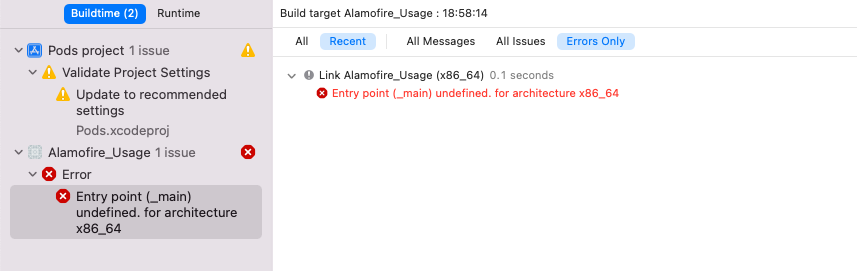
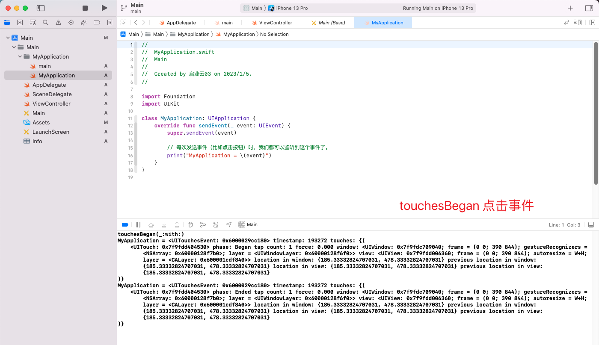

[swift 中的 @UIApplicationMain](https://juejin.cn/post/6844903541023178765)


# @main 与 @UIApplicationMain

​		在C 语言中，程序的入口都是`main 函数`。对于一个`Objective-C` 的`iOS app` 项目，在新建项目时，Xcode 将帮助我们准备好一个`main.m` 文件，其中就有这个`main 函数`：

```objective-c
#import <UIKit/UIKit.h>
#import "AppDelegate.h"

int main(int argc, char * argv[]) {
    @autoreleasepool {
        return UIApplicationMain(argc, argv, nil, NSStringFromClass([AppDelegate class]));
    }
}
```

​		在这里我们调用了`UIKit` 的`UIApplicationMain 方法`。

​		这个方法将根据`第三个`参数初始化一个`UIApplication 或其子类的对象`开始接`收事件`（在这个例子中传入`nil`，意味使用默认的`UIApplication`）。最后一个参数指定了`AppDelegate 类`作为`应用的委托`，它被用来接收类似`didFinishLaunching` 或者`didEnterBackground` 这样的与`应用生命周期`相关的委托`方法`。另外，虽然这个方法标明为返回一个`int`，但是其实它并`不会真正返回`。它会一直存在于内存中，直到用户或者系统将其强制终止。


​		新建一个`Swift 的iOS App 项目`后，我们会发现所有文件中都没有一个像`Objective-C 中`那样的`main 文件`，也`不存在main 函数`。`唯一`和`main` 有关系的是在默认的 `AppDelegate` 类的声明上方有一个`@UIApplicationMain` 或 `@main` 的标签

（**`@main` 标签是通用标签，当为`iOS` App项目时将自动执行`@UIApplicationMain` 标签的内容，当为`macOS` 项目时，将自动执行`@NSApplicationMain` 标签的内容，`@UIApplicationMain` 标签与`@NSApplicationMain` 标签不互通**）。

```swift
@main
class AppDelegate: UIResponder, UIApplicationDelegate {
	//....
}
```

​		这个`标签`做的事情就是将`被标注的类作为委托`，去创建一个`UIApplication` 并`启动`整个`程序`。在编译的时候，编译器将寻找这个`标记的类`，并自动插入像 `main 函数`这样的模板代码。

我们可以试试把`@UIApplicationMain` 去掉会怎么样：



这说明找不到main 函数了。

​		其实`Swift` 的App 也是`需要main 函数`的，只不过默认情况下是`@UIApplicationMain` 帮助我们`自动生成`了而已。和`C` 语言的`main.c` 或者`main.m 文件`一样，Swift 项目也可以有一个名为`main.swift 的特殊文件`。在这个文件中，我们不需要定义作用域，而可以直接书写代码。这个文件中的代码将作为`main 函数`来执行。比如我们在删除`@UIApplicationMain` 后，在项目中添加一个`main.swift` 文件，然后加上这样的代码：

```swift
import Foundation
import UIKit

UIApplicationMain(CommandLine.argc, UnsafeMutablePointer(CommandLine.unsafeArgv), NSStringFromClass(UIApplication.self), NSStringFromClass(AppDelegate.self))
```

现在编译运行后，就不会再出现错误了。当然，我们还可以将`第三个参数`替换成自己的`UIApplication 子类`，这样我们就可以轻易的做一些`控制整个应用行为`的事情了，比如将main.swift 的内容换成：

```swift
// MyApplication.swift
import Foundation
import UIKit

class MyApplication: UIApplication {
    override func sendEvent(_ event: UIEvent) {
        super.sendEvent(event)

        // 每次发送事件（比如点击按钮）时，我们都可以监听到这个事件了。
        print("MyApplication = \(event)")
    }
}
```

```swift
// main.swift
import Foundation
import UIKit

UIApplicationMain(CommandLine.argc, UnsafeMutablePointer(CommandLine.unsafeArgv), NSStringFromClass(MyApplication.self), NSStringFromClass(AppDelegate.self))
```

这样每次发送事件（比如点击按钮）时，我们都可以监听到这个事件了。



