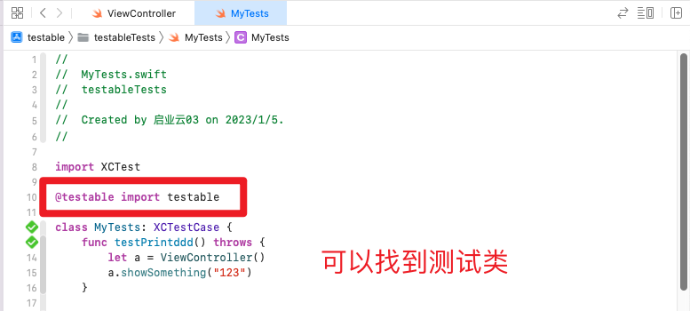

# 单元测试@testable

## 1. 什么是testable

当我们编写代码时，我们根据它们的用途定义类和方法的访问级别。在编写测试时，我们必须在测试目标中访问这些类和方法。

> 如果我们不指定显式访问级别，则几乎所有代码中的实体都具有默认的 **内部访问级别 internal**。因此，在许多情况下，我们不需要在代码中指定明确的访问级别。

swift 的访问控制模型防止外部实体访问应用程序或框架中声明为内部的任何内容。默认情况下，为了能够从我们的测试代码访问这些项目，我们需要将它们的访问级别至少提升到公共，从而降低快速类型安全的好处。

解决方案：

1. 启用可测试性构建设置为 YES。Xcode 在编译期间包含 -enable-testing 标志。这使得 complied 模块中声明的 swift 实体有资格获得更高级别的访问权限。

2. 当我们将@testable 属性添加到启用测试的模块的导入语句中时，我们会在该范围内激活该模块的提升访问权限。标记为 public 的类和类成员的行为就像标记为 open 一样。其他标记为内部的实体的行为就好像它们被宣布为公开的一样。


​		对于类库来说，这种做法是没什么问题的 -- 那些被标记为 `public` 的东西恰好就是需要被测试的代码接口。但是对于 app 开发时的测试来说，我们需要尽可能地控制访问权限：我们没有理由为一些理论上不存在外部调用可能的代码赋予 `public` 这样高级的权限，这违背了最小权限的设计原则。对 app 的测试在 Swift 1.x 的时代中一直是一个很麻烦的问题。而在 Swift 2.0 中， Apple 为 app 的测试开了“后门”。现在我们可以通过在测试代码中导入 app 的 target 时，在之前追加 `@testable`，就可以访问到 app target 中 `internal` 的内容了。


## 2. 新建 Unit Test Target

* 方式一


* 方式二


开始测试

* Product => Test

* command + U


按下 cmd + 6 ，就可以看到所有的测试方法


## 3. 测试方法说明

### setUpWithError() 

```swift
// 此方法会在第一个测试之前执行，可以用来初始化一些设定
override func setUpWithError() throws {
    // Put setup code here. This method is called before the invocation of each test method in the class.
}
```


### tearDownWithError()

```swift
// 此方法会在最后一个测试后执行，可以写一些释放物件的程式码
override func tearDownWithError() throws {
    // Put teardown code here. This method is called after the invocation of each test method in the class.
}
```


### testExample()

```swift
// 此为测试方法的范本，一般我们的测试方法都为void方法
func testExample() throws {
    // This is an example of a functional test case.
    // Use XCTAssert and related functions to verify your tests produce the correct results.
}
```


### testPerformanceExample()

```swift
// 此为性能测试的一个简单例子
func testPerformanceExample() throws {
    // This is an example of a performance test case.
    measure {
        // Put the code you want to measure the time of here.
    }
}
```


## 4. 写自己的测试代码

### 新建 Unit Test Class


### 写一个方法


### 测试该方法

####  import testable

在单元测试类 `MyTest.swift` 中 导入 `import testable`，报错，找不到


#### @testable import testable

在单元测试类 `MyTest.swift` 中 导入 `@testable import testable`，成功，找到方法


