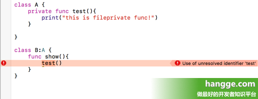

# Swift - 访问控制

在 **Swift** 语言中，访问修饰符有五种，分别为 **fileprivate**，**private**，**internal**，**public** 和 **open**。

其中 **fileprivate** 和 **open** 是 **Swift 3** 新添加的。由于过去 **Swift** 对于访问权限的控制，不是基于类的，而是基于文件的。这样会有问题，所以 **Swift 3** 新增了两个修饰符对原来的 **private**、**public** 进行细分。

## 一、各个修饰符区别

### 1. private

**private** 访问级别所修饰的属性或者方法只能在当前类里访问。

（注意：**Swift4** 中，**extension** 里也可以访问 **private** 的属性。）



### 2. fileprivate

**fileprivate** 访问级别所修饰的属性或者方法在当前的 **Swift** 源文件里可以访问。（比如上面样例把 **private** 改成 **fileprivate** 就不会报错了）

### 3. internal（默认访问级别，internal修饰符可写可不写）

- **internal** 访问级别所修饰的属性或方法在源代码所在的整个模块都可以访问。
- 如果是框架或者库代码，则在整个框架内部都可以访问，框架由外部代码所引用时，则不可以访问。
- 如果是 **App** 代码，也是在整个 **App** 代码，也是在整个 **App** 内部可以访问。

### 4. public

可以被任何人访问。但其他 **module** 中不可以被 **override** 和继承，而在 **module** 内可以被 **override** 和继承。

### 5. open

可以被任何人使用，包括 **override** 和继承。

## 二、5种修饰符访问权限排序

从高到低排序如下：

```
open > ``public` `> interal > fileprivate > ``private
```


原文出自：[www.hangge.com](https://www.hangge.com/) 转载请保留原文链接：https://www.hangge.com/blog/cache/detail_524.html
