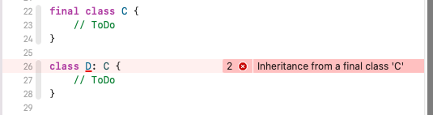
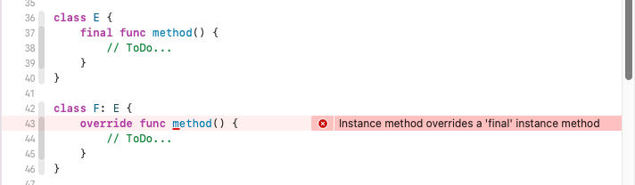
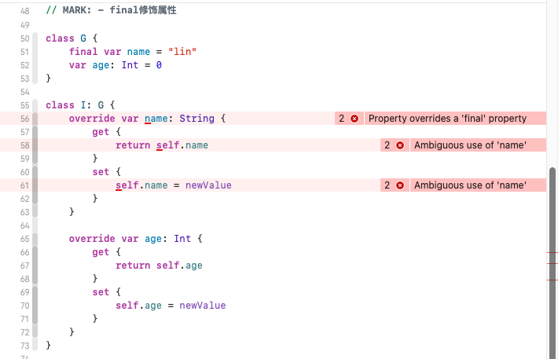

# Swift中的final修饰符

> ​		Swift中的`final`修饰符可以防止类（class）被继承，还可以防止子类重写父类的属性、方法以及下标。需要注意的是，`final`修饰符只能用于类，不能修饰结构体（struct）和枚举（enum），因为结构体和枚举只能遵循协议（protocol）。虽然协议也可以遵循其他协议，但是它并不能重写遵循的协议的任何成员，这就是结构体和枚举不需要`final`修饰的原因。

# final修饰符的几点使用原则

- `final`修饰符只能修饰类，表明该类不能被其他类继承，也就是它没资格当父类。
- `final`修饰符也可以修饰类中的属性、方法和下标，但前提是该类并没有被final修饰过。
- `final`不能修饰结构体和枚举。

## final修饰class

上面代码中，因为 `A` 类被 `final` 修饰过，所以当`B`类继承了`A`后，编译器会提示错误。

## final修饰function

## final修饰属性

# 有何好处

使用 final 可以提高性能。使用 final 修饰可以避免系统的动态派发(Dynamic Dispatch)。关于 Dynamic Dispatch 的更多优化可以参见[此处](https://link.juejin.cn/?target=https%3A%2F%2Fdeveloper.apple.com%2Fswift%2Fblog%2F%3Fid%3D27)。

## 通过减少动态分发来提升性能 

像许多其他语言一样，Swift允许类覆盖其超类中声明的方法和属性。这意味着程序必须在运行时确定正在转介哪种方法或属性，然后执行间接呼叫或间接访问。该技术称为动态调度，以每种间接用法的恒定运行时开销成本提高语言表达性。在性能敏感的代码中，这种开销通常是不受欢迎的。这篇博客文章通过消除这种动力来展示提高性能的三种方法：final, private, and Whole Module Optimization.

