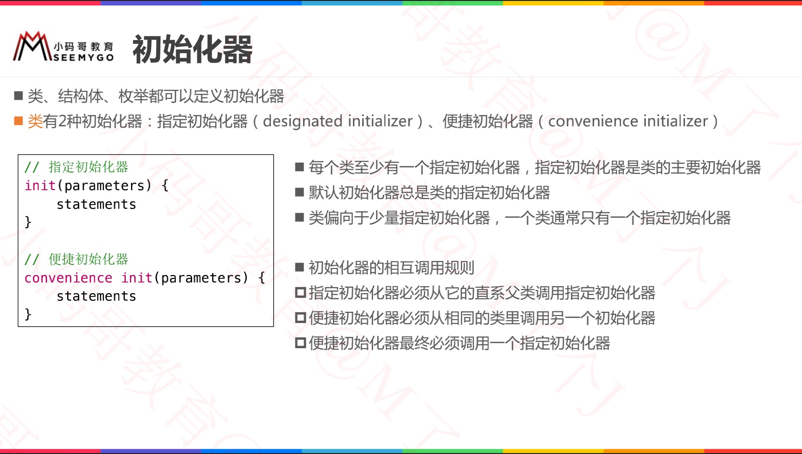
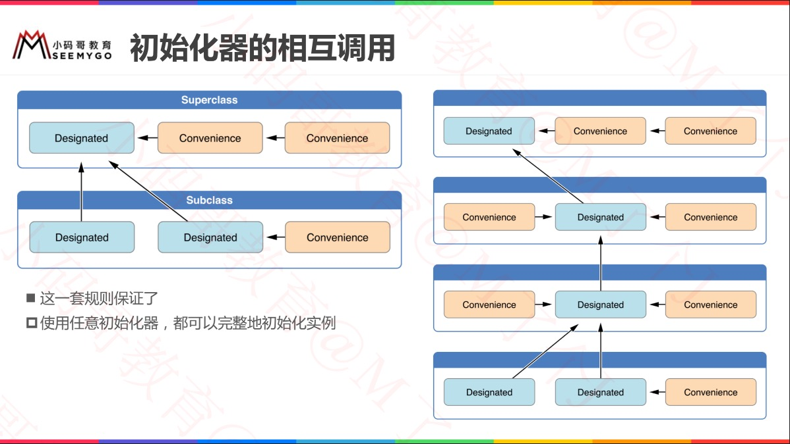
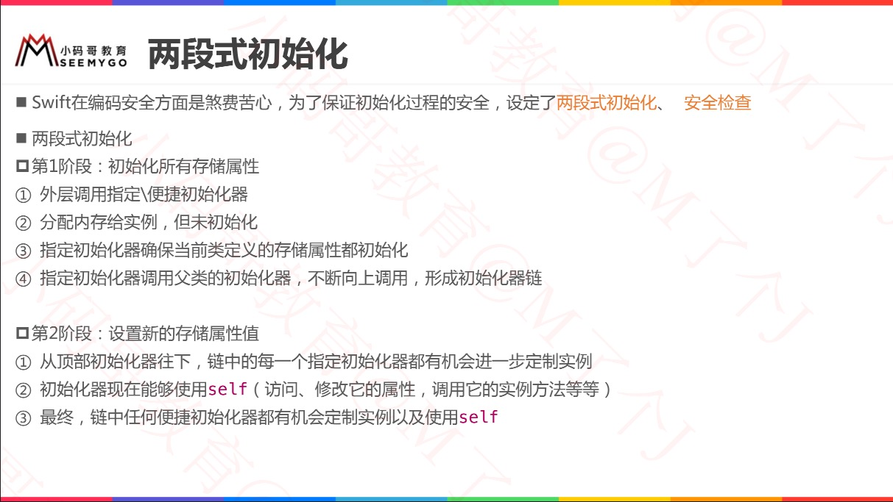
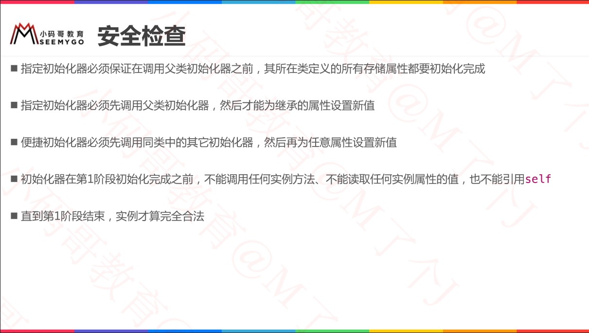
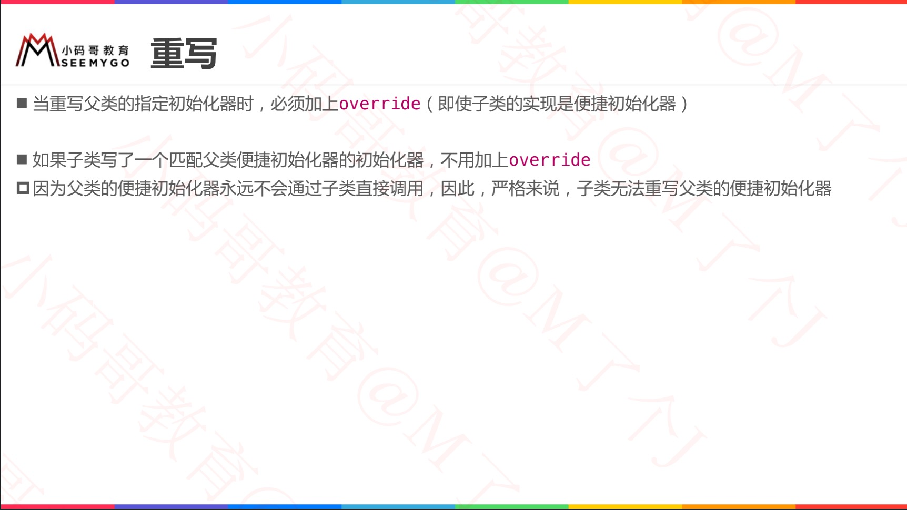
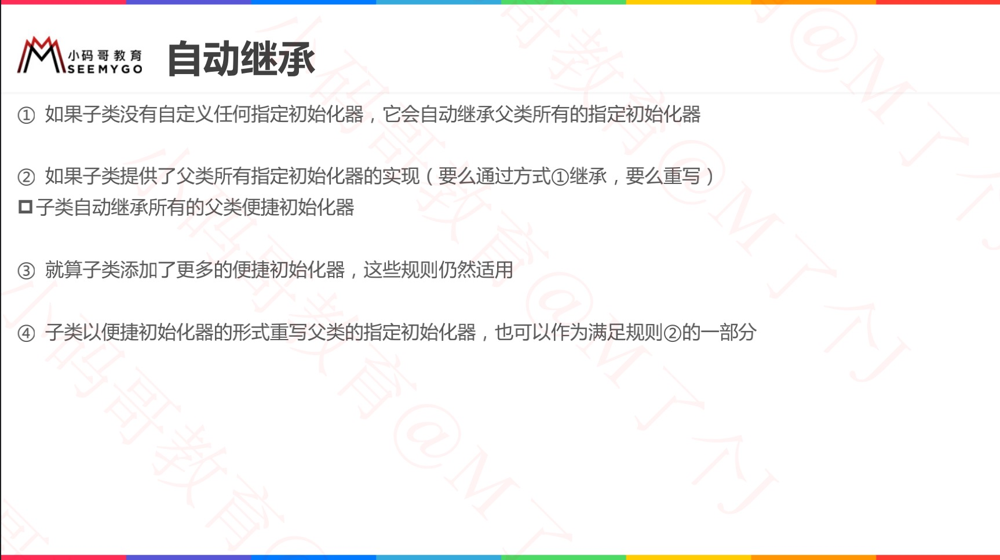
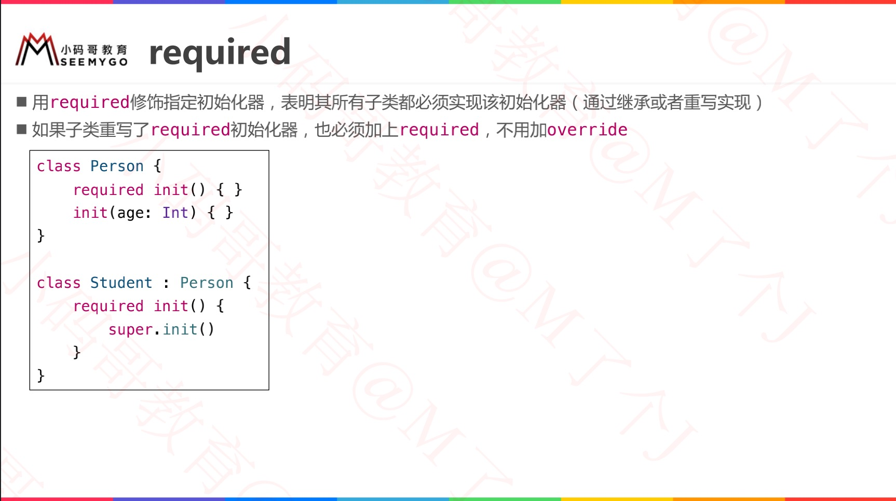
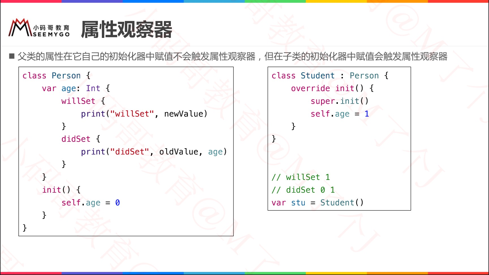
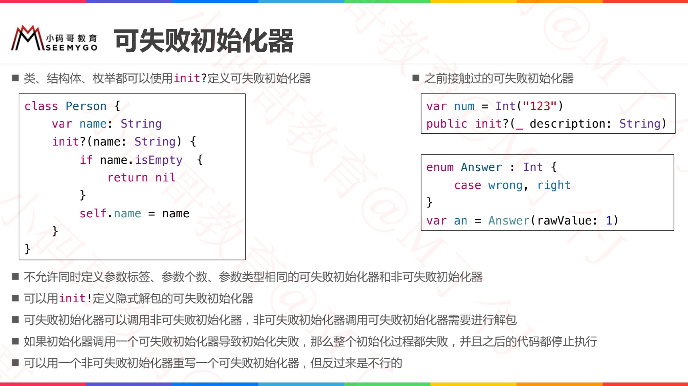
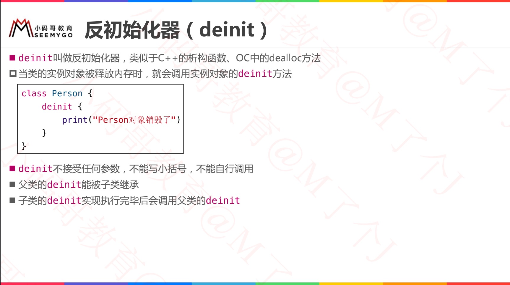

[swift Document_Initialization](https://docs.swift.org/swift-book/LanguageGuide/Initialization.html#//apple_ref/doc/uid/TP40014097-CH18-ID216)


# OC vs Swift初始化

[参考](https://www.jianshu.com/p/fb1a91600468)

## 1.基础版本

```objective-c
@implementation A_OC

- (instancetype)init {
    self = [super init];
    if (self) {
      
    }
    return self;
}

@end
```

VS

```swift
class A_Swift: NSObject {
    override init() {  // 需要override关键字
        
    }
}
```


## 2.新增属性

```swift
class A_Swift: NSObject {
    // 新增属性
    var name: String
    
    override init() {
        
    }
}

// ERROR
// ### Property 'self.name' not initialized at implicitly generated super.init call

// 解析：
// ### 原来 Swift 中并不是不调用 super.init，而是为了方便开发者由编译器完成了这一步，
// ### 但是要求开发者在初始化方法中调用 super.init 之前完成成员变量的初始化。

// 优化
class A_Swift: NSObject {
    // 新增属性
    var name: String
    
    override init() {
        self.name = "linx"
     // super.init() // 可不写，编译器隐式生成 
    }
}
```


## 3.修改父类属性

```swift
// 修改父类中成员变量值的情况，我们需要在调用 super.init 之后再进行修改

class Cat {
    var name: String
    
    init() {
        name = "cat"
    }
}

class Tiger: Cat {
    let power: Int
    
    override init() {
        power = 10
        super.init()
        name = "tiger"
    }
}
```


## 总结

> 因此 Swift 中类的初始化顺序可以总结如下：
>
> 1. 初始化自己的成员变量，***必须***；
> 2. 调用父类初始化方法，***如无需第三步，则这一步也可省略***；
> 3. 修改父类成员变量，***可选***。
>
> 
>
> 这里补充说明两点：
>
> 1. 使用 let 声明的常量是可以在初始化方法中进行赋值的，这是编译器所允许的，因为 Swift 中的 init 方法只会被调用一次，这与 Objective-C 不同；
> 2. 即使成员变量是可选类型，如：`let param: String?`，仍然是需要进行初始化的。


## 4. 继承自UIView

```swift
// 我们只是将父类从 NSObject 修改为 UIView，竟然收到3条错误：
class A_Swift: UIView {
    var name: String
    
    override init() { // Initializer does not override a designated initializer from its superclass
        self.name = "linx" 
        super.init() // Must call a designated initializer of the superclass 'UIView'
    }
} // 'required' initializer 'init(coder:)' must be provided by subclass of 'UIView'


class A_Swift: UIView {
    convenience init(param: Int, frame: CGRect) {
        super.init(frame: frame) // Convenience initializer for 'A_Swift' must delegate (with 'self.init') rather than chaining to a superclass initializer (with 'super.init')
    }
    
    required init?(coder aDecoder: NSCoder) {
        fatalError("init(coder:) has not been implemented")
    }
}
```


# 课件一览

```swift
// 等价
var p0 = Person()		// init()
var p1 = Person.self()	// init()
var p2 = Person.init()	// init()
var p3 = Person.self.init()	// init()
```


## designated VS convenience



















## required












