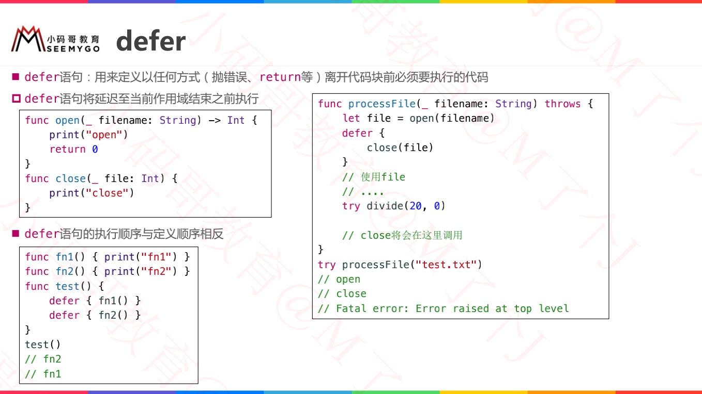

# 自定义错误信息 并 throws / throw

> 使用throws放在参数列表后面标明一个方法有异常抛出,标准格式 : `func 方法名字 (参数列表) throws -> 返回值类型` 
>
> 并在方法内使用throw抛出异常。


# do - catch


# 处理Error

* 处理错误的两种方式
    * 1、使用do - catch捕捉错误并处理
    * 2、不捕捉，throws 向上层抛


# try try? try!

> `Swift2.0` 后加入了新的关键字 `try?`，如果不想处理异常那么可以用这个关键字，使用这个关键字返回一个可选值类型，如果有异常出现，返回nil；如果没有异常，则返回可选值。
>
> 如果不想处理异常，而且不想让异常继续传播下去，可以使用 `try!`。这有点儿类似 `NSAssert()`，但是一旦使用 `try!` 后，在可能抛出异常的方法中抛出了异常，那么程序会立刻停止。

## 区别

- **try** 出现异常处理异常
- **try?** 不处理异常,返回一个可选值类型,出现异常返回nil
- **try!** 不让异常继续传播,一旦出现异常程序停止,类似NSAssert()


# rethrows


# defer

```swift
// MARK:- ========== defer ==========
/*
 使用 defer 代码块来表示在函数返回前，函数中最后执行的代码。无论函数是否会抛出错误，这段代码都将执行。
 使用 defer 可以把函数调用之初就要执行的代码和函数调用结束时的扫尾代码写在一起，虽然这两者的执行时机截然不同。
 */
func deferFunc() {
    Log("代码前...")
    defer {
        Log("代码后...")
    }
    Log("代码中...")
}
```




# assert


# fatalError


# do - 局部作用域


