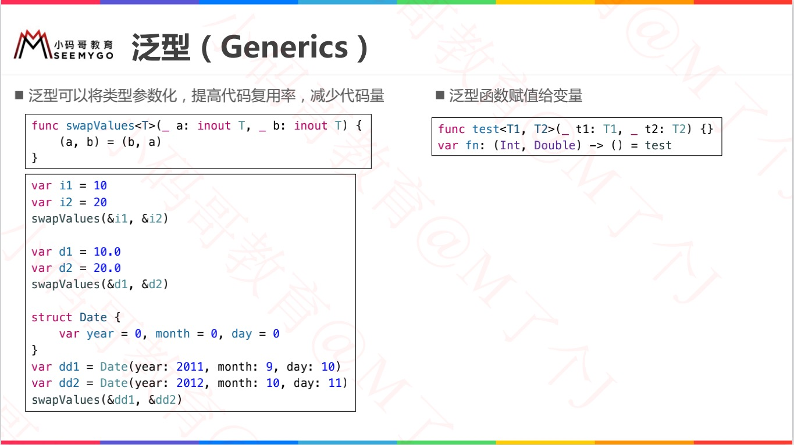
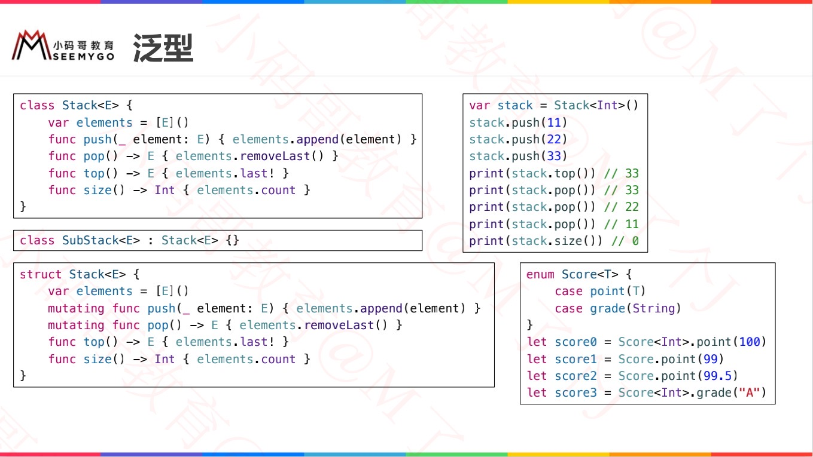
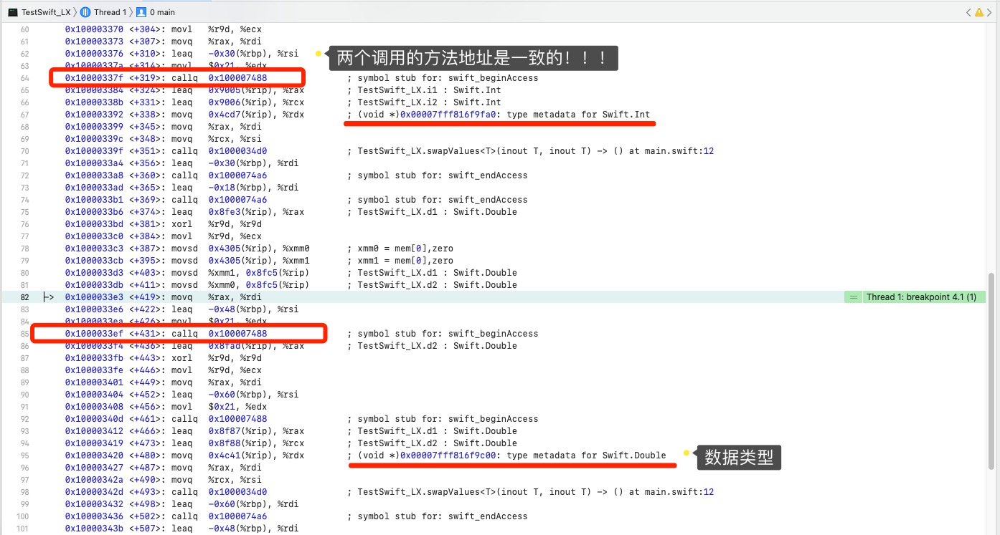
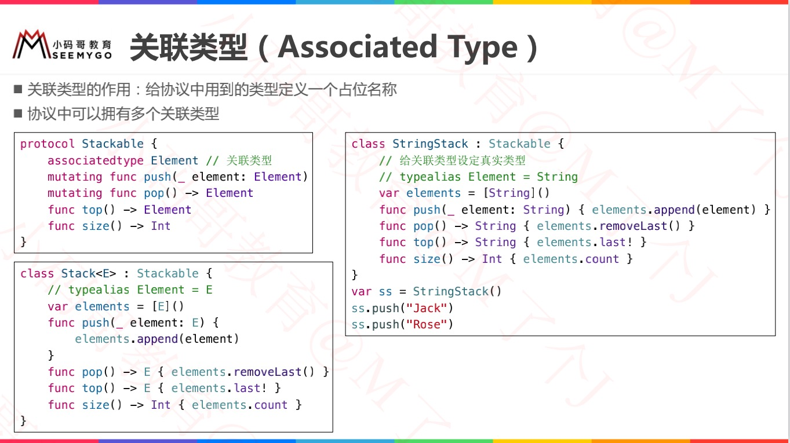
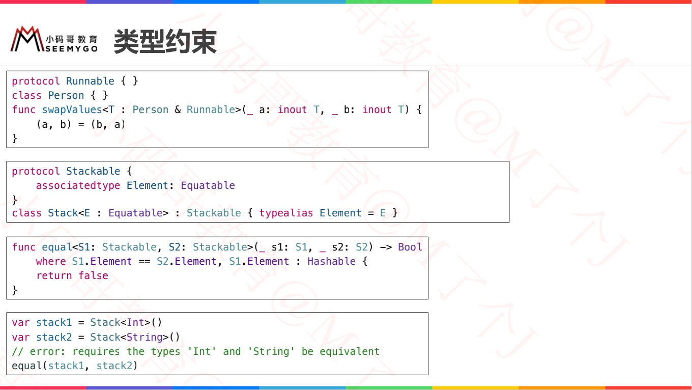
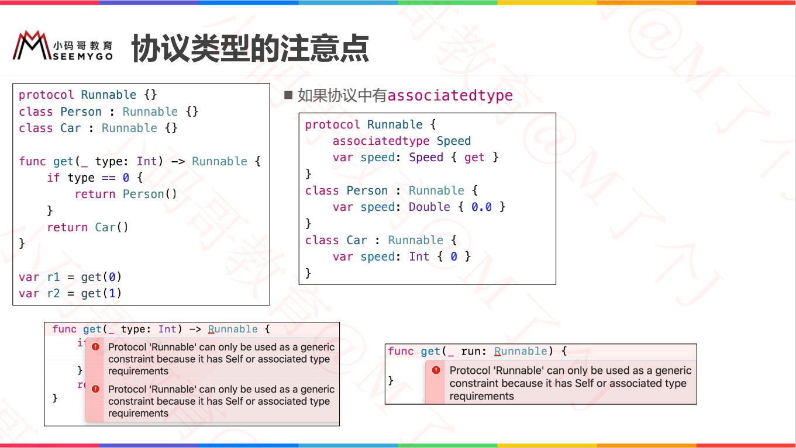
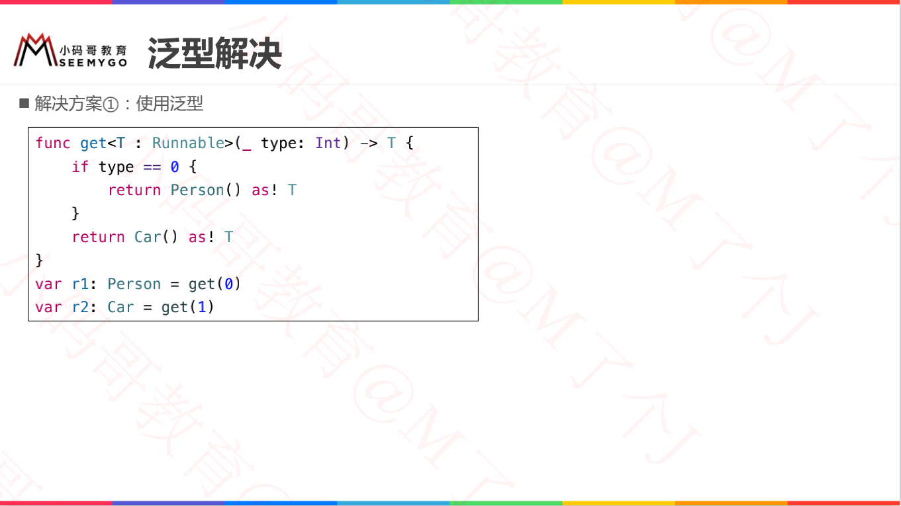
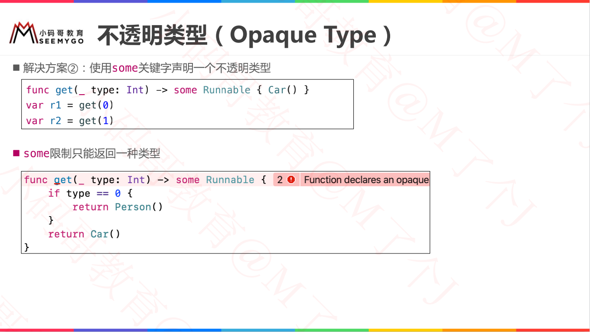
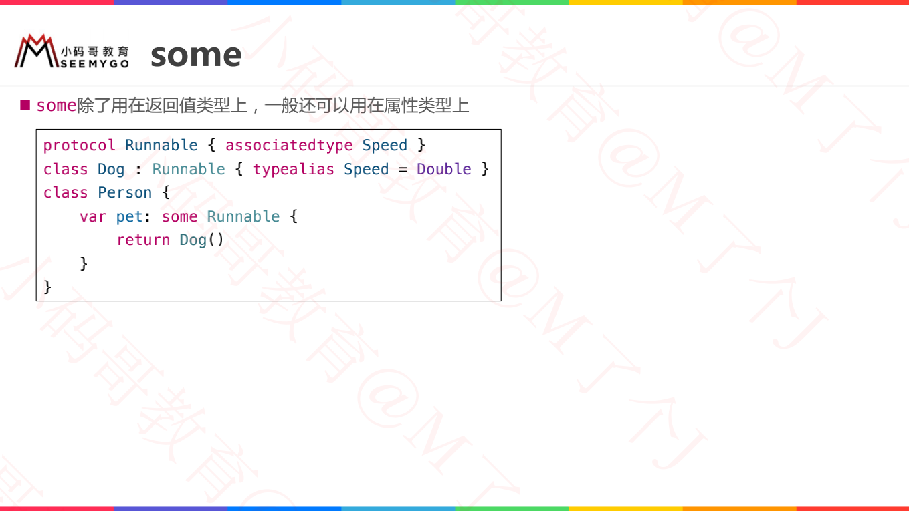

# 什么是泛型 Generics

> 泛型可以将类型参数化，提高代码复用率，减少代码量




# 泛型基本使用

## 模拟stack栈

* class
* struct
* enum




# 泛型本质

```swift
// 泛型函数
func swapValues<T>(_ a: inout T, _ b: inout T) {
	(a, b) = (b, a)
}

// 等价于
func swapValues(_ a: inout Int, _ b: inout Int) {
	(a, b) = (b, a)
}
func swapValues(_ a: inout Double, _ b: inout Double) {
	(a, b) = (b, a)
}

var i1 = 10
var i2 = 20
swapValues(&i1, &i2)

var d1 = 10.0
var d2 = 20.0
swapValues(&d1, &d2)

// 结论
// 1、两个调用的方法地址是一致的！！！
// 2、参数是根据不同的类型的元类型传入的！！！
```




# 关联类型（Associated Type）

```swift
// 如何在协议中使用泛型？？
// 错误：
protocol Stackable<Element> {
	mutating func push(_ element: Element)
	mutating func pop() -> Element
	func top() -> Element
	func size() -> Int
}

// 正确：
protocol Stackable {
    associatedtype Element     // 关联类型
    associatedtype Element2    // 关联类型
	mutating func push(_ element: Element)
	mutating func pop() -> Element
	func top() -> Element
	func size() -> Int
}
```




# 类型约束




# 泛型在协议中的使用







## 不透明类型（Opaque Type）




## some




