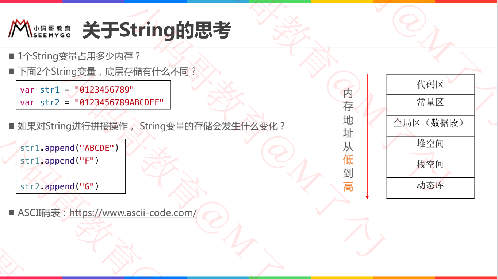
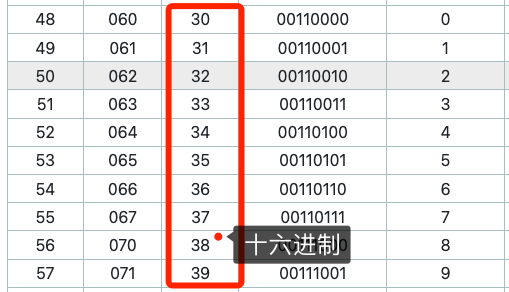

# String内存思考



> 代码在 TestSwift_LX 中 String.swift中
>
> https://www.ascii-code.com/

**问题一：1个String变量占用多少内存？**

## String = "0123456789"

```swift
var first = "0123456789"
print("占用内存大小：\(MemoryLayout.stride(ofValue: first))")
print("内存地址：\(Mems.memStr(ofVal: &first))")

// 占用内存大小：16
// 内存地址：0x3736353433323130 0xea00000000003938

// 解析：
1.可以发现内存地址对应了 0 - 9 ASCII码（30 31 32 ... 39）；
2.0xea占用一位标识 a表示有十个字符，猜想：此类最多15个字符；
3.这与OC中的 "Tagged Pointer" 类似。
```

**0 - 9 ASCII码表**




## String = "0123456789ABCDEF"

```swift
var second = "0123456789ABCDEF"
print("0123456789ABCDEF占用内存大小：\(MemoryLayout.stride(ofValue: second))")
print("0123456789ABCDEF内存地址：\(Mems.memStr(ofVal: &second))")

// 0123456789ABCDEF占用内存大小：16
// 0123456789ABCDEF内存地址：0xd000000000000010 0x80000001000073b0

// 解析：
1.数据放到单独的内存中。
```


