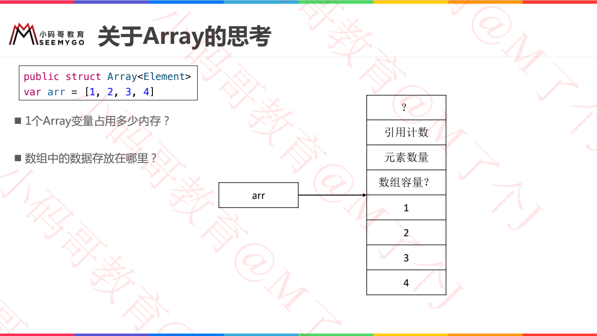

# Array内存思考




```swift
var arr = [1, 2, 3, 4]
print("arr占用内存大小：\(MemoryLayout.stride(ofValue: arr))")
print("arr内存地址：\(Mems.memStr(ofVal: &arr))")

// arr占用内存大小：8
// arr内存地址：0x0000000104404080

// 解析：
// 1.arr占有8个字节，说明是个地址；
```


