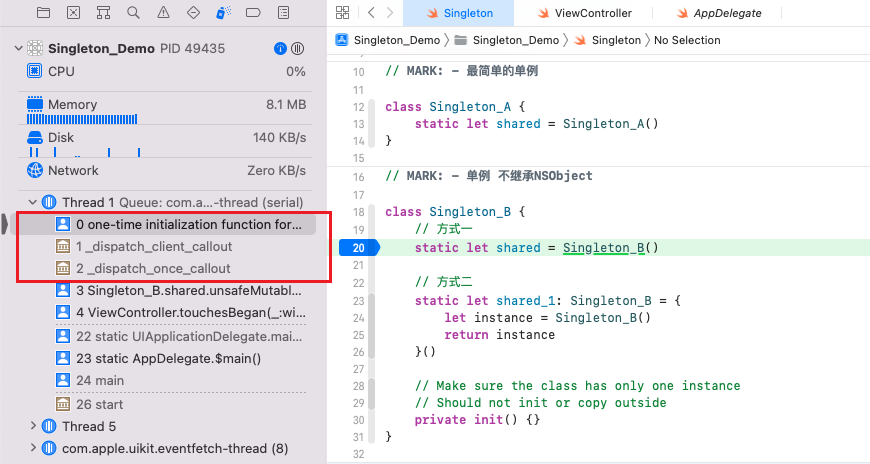
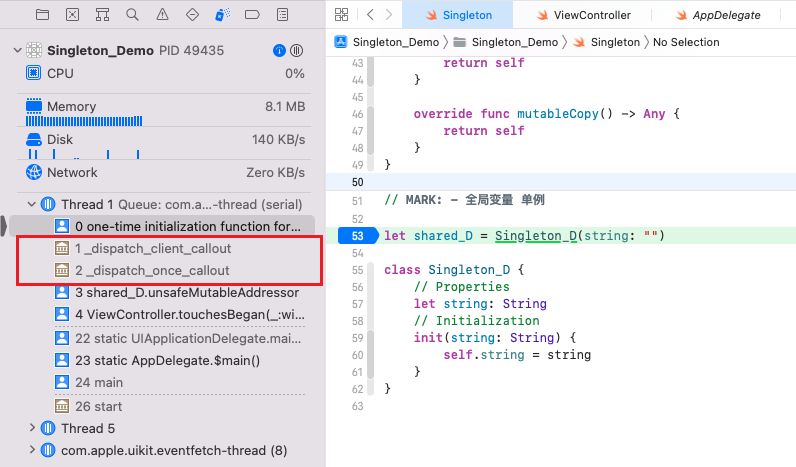

[单例集合](https://juejin.cn/s/swift%205%20%E5%8D%95%E4%BE%8B)

[Swift **单例**模式讲解和代码示例](https://refactoringguru.cn/design-patterns/singleton/swift/example)

[Swift严格的单例写法](https://www.jianshu.com/p/7c306793f49a)


# iOS 中的单例

- `UIApplication.shard` ：每个应用程序有且只有一个UIApplication实例，由UIApplicationMain函数在应用程序启动时创建为单例对象。
- `NotificationCenter.defualt`：管理 iOS 中的通知
- `FileManager.defualt`：获取沙盒主目录的路径
- `URLSession.shared`：管理网络连接
- `UserDefaults.standard`：存储轻量级的本地数据
- `SKPaymentQueue.default()`：管理应用内购的队列。系统会用 **StoreKit** framework 创建一个支付队列，每次使用时通过类方法 `default()` 去获取这个队列。


# 单例的优点

- **提供了对唯一实例的受控访问**：单例类封装了它的唯一实例，防止其它对象对自己的实例化，确保所有的对象都访问一个实例。
- **节约系统资源**：由于在系统内存中只存在一个对象，因此可以节约系统资源，对于一些需要频繁创建和销毁的对象，单例模式无疑可以提高系统的性能。
- **伸缩性**：单例模式的类自己来控制实例化进程，类就在改变实例化进程上有相应的伸缩性。
- **避免对资源的多重占用**：比如写文件操作，由于只有一个实例存在内存中，避免对同一个资源文件的同时写操作


# 单例的缺点

* 单例状态的混乱

    由于单例是共享的，所以当使用单例时，程序员无法清楚的知道单例当前的状态。

    当用户登录，由一个实例负责当前用户的各项操作。但是由于共享，当前用户的状态很可能已经被其他实例改变，而原来的实例仍然不知道这项改变。如果想要解决这个问题，实例就必须对单例的状态进行监控。Notifications 是一种方式，但是这样会使程序过于复杂，同时产生很多无谓的通知。

* 测试困难

    测试困难主要是由于单例状态的混乱而造成的。因为单例的状态可以被其他共享的实例所修改，所以进行需要依赖单例的测试时，很难从一个干净、清晰的状态开始每一个 test case

* 单例访问的混乱

    由于单例时全局的，所以无法对访问权限作出限定。程序任何位置、任何实例都可以对单例进行访问，这将容易造成管理上的混乱。


# 单例规则

关于单例，有三个重要的准则需要牢记：

1. 单例必须是唯一的(要不怎么叫单例？) 在程序生命周期中只能存在一个这样的实例。单例的存在使我们可以全局访问状态。例如：

`NSNotificationCenter`, `UIApplication`和`NSUserDefaults`。

1. 为保证单例的唯一性，单例类的初始化方法必须是私有的。这样就可以避免其他对象通过单例类创建额外的实例。
2. 考虑到规则1，为保证在整个程序的生命周期中值有一个实例被创建，单例必须是线程安全的。并发有时候确实挺复杂，简单说来，如果单例的代码不正确，如果有两个线程同时实例化一个单例对象，就可能会创建出两个单例对象。也就是说，必须保证单例的线程安全性，才可以保证其唯一性。通过调用`dispatch_once`，即可保证实例化代码只运行一次。

在程序中保持单例的唯一性，只初始化一次，这样并不难。需要记住：单例实现要满足隐藏的`dispatch_once`规则。


# OC单例例子

使用 GCD 中的 `dispatch_once_t` 可以保证里面的代码只被调用一次，以此保证单例在线程上的安全。

```objc
@implementation TestViewController
+ (id)sharedManager {
      static TestViewController *staticInstance = nil;
      static dispatch_once_t onceToken;
      dispatch_once(&onceToken, ^{
          staticInstance = [[self alloc] init];
       });
      return staticInstance;
}
@end
```


# Swift 单例的实现


## 0. 历史版本的单例

- [SwiftSingleton](https://link.jianshu.com/?t=https://github.com/hpique/SwiftSingleton)
- [dispatch_once singleton model in swift](https://link.jianshu.com/?t=http://stackoverflow.com/questions/24024549/dispatch-once-singleton-model-in-swift)
- [Apple Swift Blog](https://link.jianshu.com/?t=https://developer.apple.com/swift/blog/?id=7)
- [THE RIGHT WAY TO WRITE A SINGLETON](https://krakendev.io/blog/the-right-way-to-write-a-singleton?utm_content=buffer0072d)


### a. 翻译OC单例

因为在 Swift 中可以无缝直接使用 GCD，所以我们可以很方便地把类似方式的单例用 Swift 进行改写：

```swift
class TheOneAndOnlyKraken {
    class var sharedInstance: TheOneAndOnlyKraken {
        struct Static {
            static var onceToken: dispatch_once_t = 0
            static var instance: TheOneAndOnlyKraken? = nil
        }
        dispatch_once(&Static.onceToken) {
            Static.instance = TheOneAndOnlyKraken()
        }
        return Static.instance!
    }
}
```


### b. 结构体方法

```swift
class TheOneAndOnlyKraken {
    class var sharedInstance: TheOneAndOnlyKraken {
        struct Static {
            static let instance = TheOneAndOnlyKraken()
        }
        return Static.instance
    }
}
```

**Swift 1.0**时，不支持静态类变量，那时这个方法是不得已而为之。但使用结构体，就可以支持这个功能。因为静态变量的限制，我们被约束在这样的一个模型中。这比Objective-C移植版本好一些，但还不够好。


### c. private 全局变量

还有另一种更受大家欢迎，并被认为是 Swift 1.2 之前的最佳实践的做法。由于 Swift 1.2 之前 class 不支持存储式的 property，我们想要使用一个只存在一份的属性时，就只能将其定义在全局的 scope 中。值得庆幸的是，在 Swift 中是有访问级别的控制的，我们可以在变量定义前面加上 private 关键字，使这个变量只在当前文件中可以被访问。这样我们就可以写出一个没有嵌套的，语法上也更简单好看的单例了：

```swift
private let sharedInstance = TestViewController()

class TestViewController: UIViewController  {
    class var sharedManager : TestViewController {
        return sharedInstance
    }
}
```


## 1. 最简单的单例

```swift
// MARK: - 最简单的单例
class Singleton_A {
    static let shared = Singleton_A()
}
```


## 2. 单例不继承NSObject

```swift
// MARK: - 单例 不继承NSObject
class Singleton_B {
    // 方式一
    static let shared = Singleton_B()

    // 方式二
    static let shared_1: Singleton_B = {
        let instance = Singleton_B()
        return instance
    }()

    // Make sure the class has only one instance
    // Should not init or copy outside
    // 私有化构造方法，不允许外界创建实例
    private init() {}
}
```

不继承自 NSObject 的类没有 copy()、mutableCopy() 方法，不需要重载。


当尝试直接创建对象时

```swift
let sing = Singleton_B()
```

这种方法去创建一个`Singleton_B`实例时，编译器将会报错，因为我们把`init()`方法私有化了，类外无法通过构造方法创建新实例。


## 3. 单例继承NSObject

```swift
// MARK: - 单例 继承NSObject
class Singleton_C: NSObject {
    static let shared = Singleton_C()

    // Make sure the class has only one instance
    // Should not init or copy outside
    override private init() {}

    override class func copy() -> Any {
        return self
    }

    override func mutableCopy() -> Any {
        return self
    }
}
```

静态属性 shared 持有唯一的实例，对外公开。

重载 init() 方法，使其对外不可见，不可以在外部调用，防止在外部创建实例。

重载 copy()、mutableCopy() 方法，返回 self，防止在外部复制实例。这里也可以返回 SingletonClass.shared，效果是一样的，因为只有一个实例。只有 shared 能调用 copy()、mutableCopy() 方法，那么 self 就是 shared。写 self，代码比较简洁。


## 4. 全局变量

```swift
// MARK: - 全局变量 单例
let shared_D = Singleton_D(string: "")

class Singleton_D {
    // Properties
    let string: String
    // Initialization
    init(string: String) {
        self.string = string
    }
}
```

Swift 全局变量初始化时默认使用`dispatch_once`，这保证了全局变量的构造器（initializer）只会被调用一次，保证了`shardManager`的**原子性**。

- **关于 Swift 中全局变量的懒加载**

> Initialize lazily, run the initializer for a global the first time it is referenced, similar to Java. It allows custom initializers, startup time in Swift scales cleanly with no global initializers to slow it down, and the order of execution is completely predictable.
> Swift 采用与 Java 类似的方式，对全局变量实行懒加载。这样设计使得构造器可以自定义、启动时间不会因为加载全局变量而变慢、同时操作执行的顺序也变得可控。

- **关于 Swift 中的 dispatch_once 和 原子性**

> The lazy initializer for a global variable ... is launched as `dispatch_once` to make sure that the initialization is atomic. This enables a cool way to use `dispatch_once` in your code: just declare a global variable with an initializer and mark it private.
> 全局变量的懒加载在初始化时会使用 `dispatch_once` 以确保初始化的原子性。所以这是一个很酷地使用 `dispatch_once` 的方式：仅在定义全局变量时将其构造器标志为 `private` 就行。


### 说明

`static let shared = Tools()` 是线程安全的，并且将在第一次调用时进行赋值。

> The lazy initializer for a global variable (also for static members of structs and enums) is run the first time that global is accessed, and is launched as dispatch_once to make sure that the initialization is atomic. This enables a cool way to use dispatch_once in your code: just declare a global variable with an initializer and mark it private.
>
> https://developer.apple.com/swift/blog/?id=7
>
> “全局变量（还有结构体和枚举体的静态成员）的Lazy初始化方法会在其被访问的时候调用一次。类似于调用`dispatch_once`以保证其初始化的原子性。这样就有了一种很酷的`单次调用`方式：只声明一个全局变量和私有的初始化方法即可。”


### 为何看不到`dispatch_once`？

* 单行单例方法

    

* 全局单例方法

    


