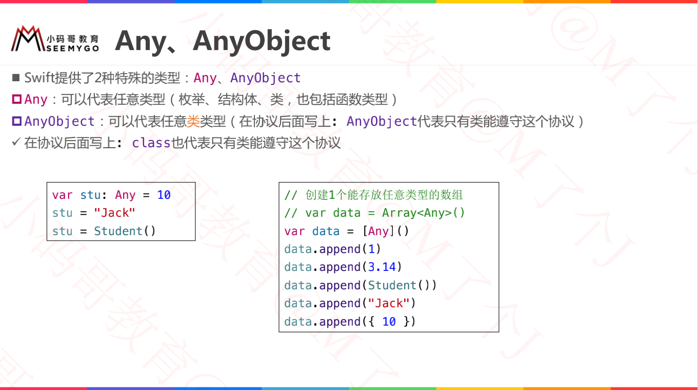
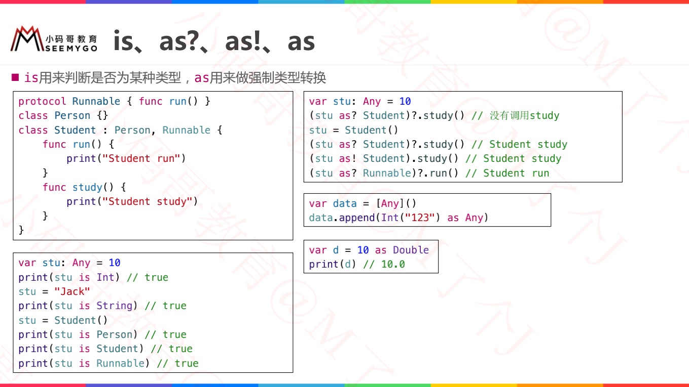
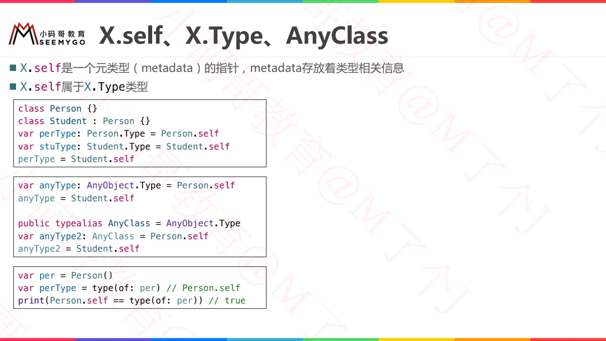

https://www.jianshu.com/p/3b5ca3d1911a

[DESIGNATED，CONVENIENCE 和 REQUIRED](https://swifter.tips/init-keywords/)

# convenience

[DESIGNATED，CONVENIENCE 和 REQUIRED](https://swifter.tips/init-keywords/)

# static VS class

https://juejin.cn/post/6844903792647864328

- static能修饰`class/struct/enum`的计算属性、存储属性、类型方法;class能修饰类的计算属性和类方法
- static修饰的类方法不能继承；class修饰的类方法可以继承
- 在protocol中要使用static

# designated

# required

# [mutating](./03函数与闭包.md)

# [@discardableResult](./03函数与闭包.md)

# [@escaping](./03函数与闭包.md)

# [@autoclosure](./03函数与闭包.md)

# ============分割线=============

# Any / AnyObject

# is、as?、as!、as

> // 知识点：向下转型
>
>   // as! 强制类型转换，无法转换时会抛出运行时异常
>
>   // as？可选类型转换，无法转换时返回nil

# X.self、X.Type、AnyClass

**1. mutating**

构体和枚举是值类型，默认情况下，值类型的属性不能被自身的实例方法修改,在 func 关键字前加 mutating 可以允许这种修改行为。

**2. inout**

`inout` - 输入输出参数(In-Out Parameter)。可以用 inout 定义一个输入输出参数，可以在函数内部修改外部实参的值。inout 需要注意的有以下几个点：

- 可变参数不能标记为 inout。
- inout 参数不能有默认值。
- inout 参数只能传入可以被多次赋值的。
- inout 参数的本质是地址传递(引用传递)。

**3. @discardableResult**

在 func 前面加个 @discardableResult，可以消除:函数调用后返回值未被使用的警告⚠。

**4. final**

- 被 final 修饰的类，禁止被继承。
- 被 final 修饰的方法、下标、属性，禁止被重写。并且添加了 final 关键字的函数无法被重写，使用静态派发，不会在 vtable 中出现，且对 objc 运行时不可⻅。

**5. dynamic**

函数均可添加 dynamic 关键字，为非 objc 类和值类型的函数赋予动态性，但派发 方式还是函数表派发。

**6.@objc**

该关键字可以将 Swift 函数暴露给 objc 运行时，与 OC 交互，但依旧是函数表派发。

那么，@objc + dynamic 就会变成消息派发的方式-也就是 OC 中的消息传递。

