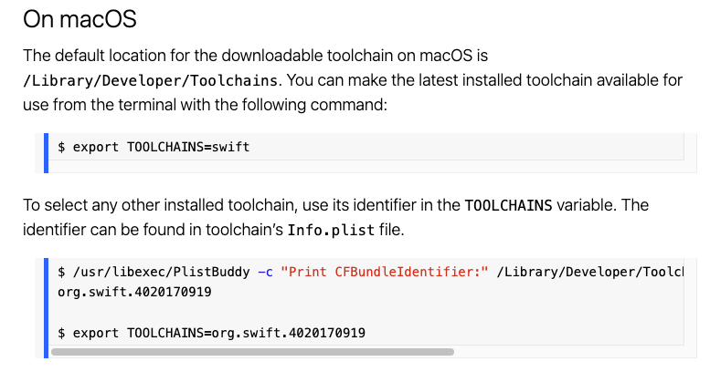

[swift.org](https://www.swift.org/getting-started/)


# Installing Swift




## Check your swift

Firstly, know the version.

```shell
$ xcrun swift --version

swift-driver version: 1.62.15 Apple Swift version 5.7.2 (swiftlang-5.7.2.135.5 clang-1400.0.29.51)
Target: x86_64-apple-macosx13.0
```

But where is the swift toolchain from?

```shell
$ xcrun -f swift

/Applications/Xcode.app/Contents/Developer/Toolchains/XcodeDefault.xctoolchain/usr/bin/swift
```

This is the default Xcode app if installed from Mac App Store.


## Installing alternative swift toolchain

* [Swift Toolchain Snapshots](https://www.swift.org/download/#snapshots)

You can [download another swift version](https://www.swift.org/download/#snapshots) (select Toolchain for Xcode), and install it.


