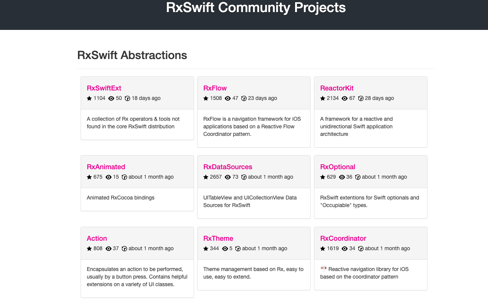

# RxSwift学习资料

## 官方

* [RxSwift - Github](https://github.com/ReactiveX/RxSwift)
* [RxSwift中文文档](https://beeth0ven.github.io/RxSwift-Chinese-Documentation/)
* [ReactiveX](http://reactivex.io/)
    * [ReactiveX Introduction](https://reactivex.io/intro.html)
    * Documents
        * [Observable](https://reactivex.io/documentation/observable.html)
        * [Operators](https://reactivex.io/documentation/operators.html)
        * [Single](https://reactivex.io/documentation/single.html)
        * [Subject](https://reactivex.io/documentation/subject.html)
        * [Scheduler](https://reactivex.io/documentation/scheduler.html)

    * [tutorials](https://reactivex.io/tutorials.html)


## 博客

* [RxSwift技术路线与参考资料](https://blog.csdn.net/qq_14920635/article/details/114981760)

* [Swift-RxSwift使用-航哥](https://www.hangge.com/blog/cache/category_72_11.html)
* [理解 RxSwift：为什么要使用 RxSwift（一）](https://juejin.cn/post/6844903859844808717)


## 书籍

* [《RxSwift Reactive Programming with Swift 4th》]()


## 社区

RxSwift社区聚合了生态学习资源和文档等开源代码指南社区，包含以下模块：

* [RxSwift Community](https://community.rxswift.org/)

- 包含RxSwift一些抽象工具库，比如RxDataSource, RxCoordinator, Action, RxSwiftExt, ReactorKit等
- 其他库的扩展支持，比如RxRealm, RxAlamofire, RxWebKit等
- 提供RxSwift支持的库，比如 Moya
- 使用RxSwift编写的开源应用，比如[MVVM-RouterDemo](https://github.com/OlexandrStepanov/MVVM-RouterDemo), [Papr(MVVM+Coordinator)](https://github.com/jdisho/Papr), [Simple MVVM Login Example](https://github.com/carlosypunto/ReallySimpleMVVMLoginExampleWithRxSwift)


## RxSwift项目

* [RxSwift Community Projects](https://community.rxswift.org/)




# 一、RxSwift简介

## Rx 介绍

* [ReactiveX 官网](http://reactivex.io/)

- **Rx** 是 **ReactiveX** 的缩写，简单来说就是基于异步 **Event**（事件）序列的响应式编程。
- **Rx** 可以简化异步编程方法，并提供更优雅的数据绑定。让我们可以时刻响应新的数据同时顺序地处理它们。


## RxSwift 介绍

（1）在编写代码时我们经常会需要检测某些值的变化（比如：**textFiled** 输入值的变化、数据请求完成或失败的变化），然后进行相应的处理。

- 过去针对不同的情况，我们需要采用不同的事件传递方法去处理，比如：**delegate**、**notification**、**target-action**、**KVO** 等等。
- 而 **RectiveX** 机制（由 **RxSwift** 实现）的出现，让程序里的事件传递响应方法做到统一。将之前那些常用的事件传递方法（比如：**delegate**、**notification**、**target-action** 等等），全部替换成 **Rx** 的“**信号链**”方式。

（2）如果我们平时使用的是 **MVVM** 开发模式的话，通过 **RxSwift** 可以获得更加方便的数据绑定的方法，使得 **MVVM** 开发更加如虎添翼。


**响应式编程**

响应式编程（Reactive Programming）是一种通过异步和数据流来构建事务关系的编程思想。核心体现就是观察者和可被观察者,通过构造操作数据序列，然后再对这些序列作出响应。

**响应式编程框架**

[ReactiveX](http://reactivex.io/)（简写: Rx） 是一个可以帮助我们简化异步编程的框架。

在Objective-C语言中，也流行着响应式编程框架[ReactiveCocoa](https://github.com/ReactiveCocoa/ReactiveCocoa)

而在Swift语言中，最受欢迎的应该是ReativeX社区的[RxSwift](https://github.com/ReactiveX/RxSwift)

KVO，异步操作 和 流 全部被统一成抽象序列。这就是为什么 Rx 会如此简单，优雅和强大。


# 二、登录页入手

[我的第一个 RxSwift 应用程序 - 输入验证：](https://beeth0ven.github.io/RxSwift-Chinese-Documentation/content/first_app.html)


## 安装与使用

CocoaPods导入

```
# Podfile
use_frameworks!

target 'YOUR_TARGET_NAME' do
    pod 'RxSwift', '6.5.0'
    pod 'RxCocoa', '6.5.0'
end

# RxTest and RxBlocking make the most sense in the context of unit/integration tests
target 'YOUR_TESTING_TARGET' do
    pod 'RxBlocking', '6.5.0'
    pod 'RxTest', '6.5.0'
end
```

导入头文件

```
import RxSwift
import RxCocoa
```


## RxSwift 五个单独的组件

```
┌──────────────┐    ┌──────────────┐
│   RxCocoa    ├────▶   RxRelay    │
└───────┬──────┘    └──────┬───────┘
        │                  │        
┌───────▼──────────────────▼───────┐
│             RxSwift              │
└───────▲──────────────────▲───────┘
        │                  │        
┌───────┴──────┐    ┌──────┴───────┐
│    RxTest    │    │  RxBlocking  │
└──────────────┘    └──────────────┘
```

* **RxSwift**：RxSwift 的核心，提供（大部分）由 ReactiveX 定义的 Rx 标准。它只是基于 **Swift** 语言的 **Rx** 标准实现接口库，所以 **RxSwift** 里不包含任何 **Cocoa** 或者 **UI** 方面的类。它没有其他依赖项。
* **RxCocoa**：为通用 iOS/macOS/watchOS 和 tvOS 应用程序开发提供 Cocoa 特定的功能，例如共享序列、特征等。它依赖于 RxSwift 和 RxRelay。是基于 **RxSwift** 针对于 **iOS** 开发的一个库，它通过 **Extension** 的方法给原生的比如 **UI** 控件添加了 **Rx** 的特性，使得我们更容易订阅和响应这些控件的事件。
* **RxRelay**：提供 PublishRelay、BehaviorRelay 和 ReplayRelay，三个简单的 Subjects 包装器。这取决于 RxSwift。
* **RxTest** 和 **RxBlocking**：为基于 Rx 的系统提供测试功能。这取决于 RxSwift。


