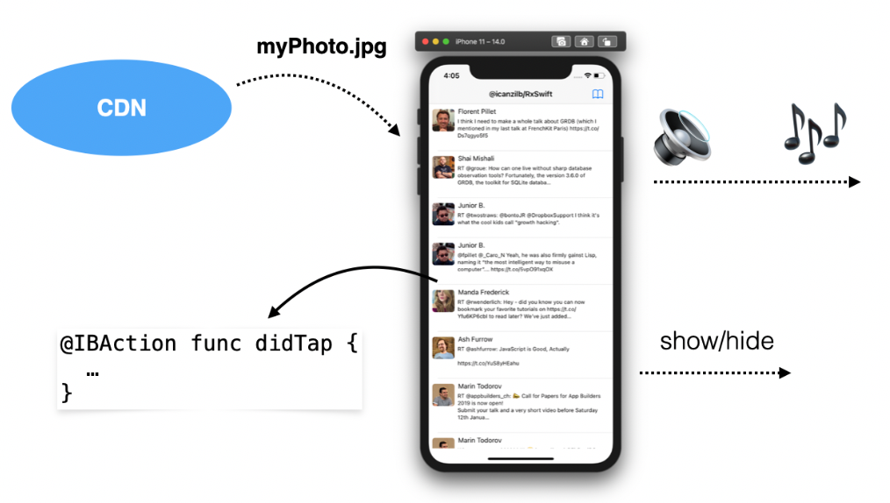
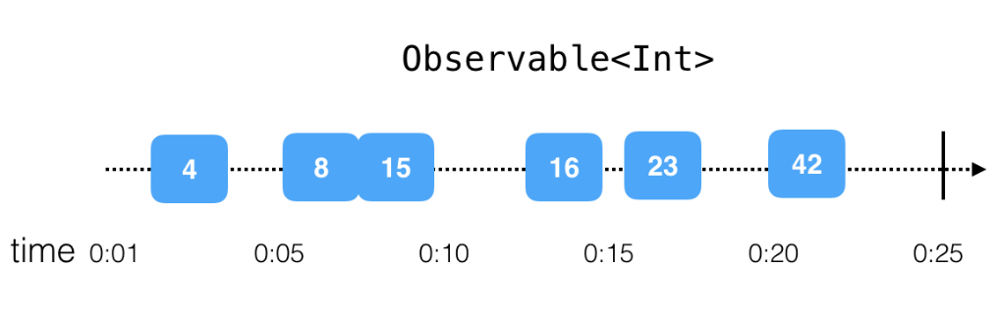
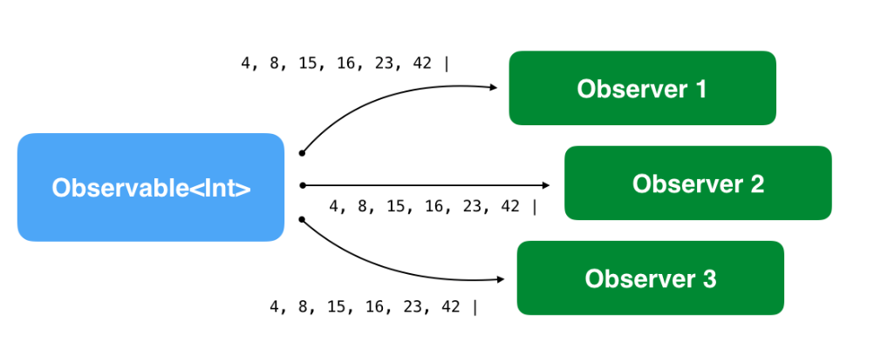
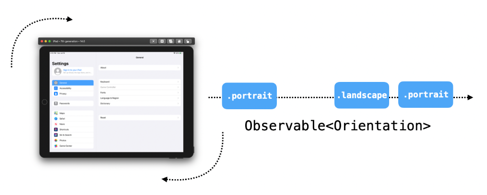
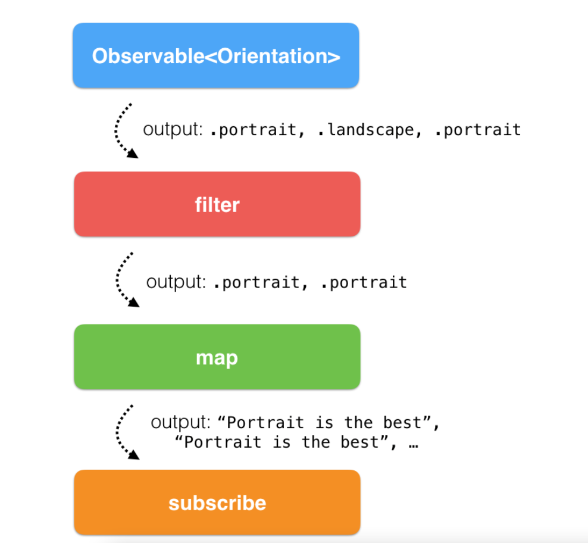
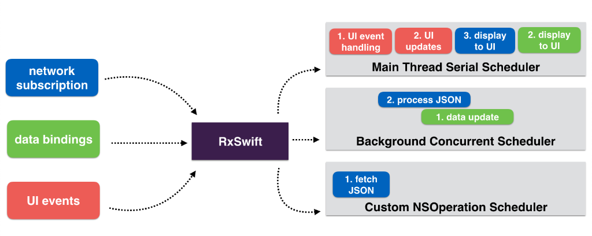
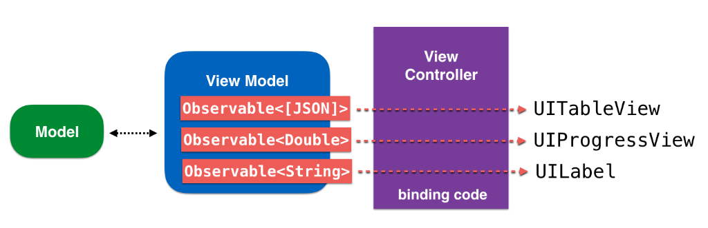
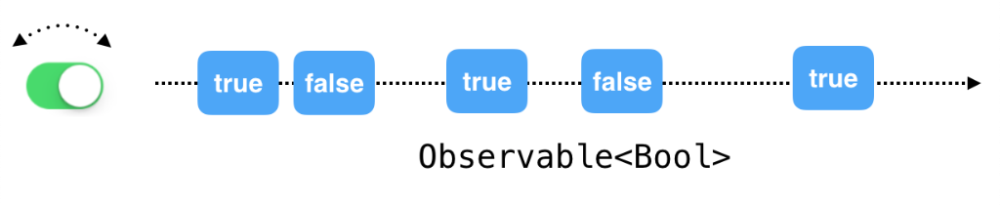
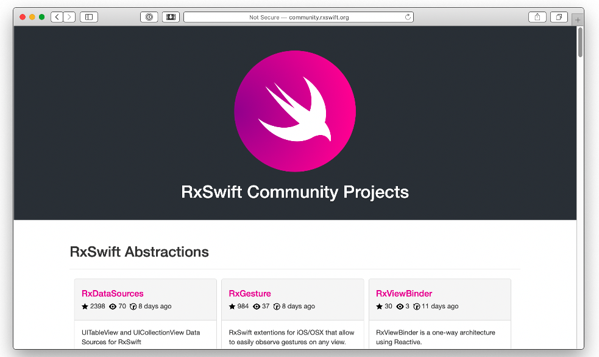

# Chapter 1 - Hello, RxSwift!

This book aims to introduce you, the reader, to the RxSwift library and to writing reactive iOS apps with RxSwift.
But what exactly is RxSwift? Here’s a good definition:

> **RxSwift** is a library for composing asynchronous and event-based code by using observable sequences and functional style operators, allowing for parameterized execution via schedulers.

```apl
本书旨在向您（读者）介绍 RxSwift 库以及使用 RxSwift 编写响应式 iOS 应用程序。
但RxSwift到底是什么？这里有一个很好的定义：
RxSwift是一个库，用于通过使用可观察序列和函数样式运算符来编写异步和基于事件的代码，允许通过调度程序进行参数化执行。
```


Sounds complicated? Don’t worry if it does. Writing reactive programs, understanding the many concepts behind them, and navigating a lot of the relevant, commonly used lingo might be intimidating — especially if you try to take it all in at once, or when you haven’t been introduced to it in a structured way.

That’s the goal of this book: to gradually introduce you to the various RxSwift APIs and general Rx concepts by explaining how to use each of the APIs and build intuition about how reactive programming can serve you, all while covering RxSwift's practical usage in iOS apps.

You’ll start with the basic features of RxSwift, and then gradually work through intermediate and advanced topics. Taking the time to exercise new concepts extensively as you progress will make it easier to master RxSwift by the end of the book. Rx is too broad of a topic to cover completely in a single book; instead, we aim to give you a solid understanding of the library so that you can continue developing Rx skills on your own.

We still haven’t quite established what RxSwift is though, have we? Let’s start with a simple, understandable definition and progress to a better, more expressive one as we waltz through the topic of reactive programming later in this chapter.

> **RxSwift**, in its essence, simplifies developing asynchronous programs by allowing your code to react to new data and process it in a sequential, isolated manner.

As an iOS app developer, this should be much more clear and tell you more about what RxSwift is, compared to the first definition you read earlier in this chapter.

Even if you’re still fuzzy on the details, it should be clear that RxSwift helps you write asynchronous code. And you know that developing good, deterministic, asynchronous code is hard, so any help is quite welcome!

```apl
听起来很复杂？如果确实如此，请不要担心。编写响应式程序、理解它们背后的许多概念以及浏览大量相关的常用行话可能会让人望而生畏——尤其是当你试图一下子把它全部理解时，或者当你还没有被介绍到它时结构化的方式。

这就是本书的目标：通过解释如何使用每个 API 并建立反应式编程如何为您服务的直觉，逐步向您介绍各种 RxSwift API 和一般 Rx 概念，同时涵盖 RxSwift 在 iOS 应用程序中的实际用法。

您将从 RxSwift 的基本功能开始，然后逐步学习中级和高级主题。随着你的进步，花时间广泛地练习新概念将使你在本书结束时更容易掌握 RxSwift。 Rx 的主题过于宽泛，无法在一本书中完全涵盖；相反，我们的目标是让您对库有一个扎实的了解，以便您可以继续自己开发 Rx 技能。

我们还没有完全确定 RxSwift 是什么，不是吗？让我们从一个简单易懂的定义开始，然后在本章后面的反应式编程主题中逐步过渡到一个更好、更具表现力的定义。

> RxSwift，本质上，通过允许您的代码对新数据做出反应并以顺序、隔离的方式处理它来简化异步程序的开发。

作为 iOS 应用程序开发人员，与您在本章前面阅读的第一个定义相比，这应该更加清晰，并告诉您更多关于 RxSwift 是什么的信息。

即使您对细节仍然很模糊，也应该清楚 RxSwift 可以帮助您编写异步代码。而且您知道开发良好的、确定性的异步代码很困难，因此非常欢迎任何帮助！
```


## Introduction to asynchronous programming

If you tried to explain asynchronous programming in a simple, down to earth language, you might come up with something along the lines of the following.

An iOS app, at any moment, might be doing any of the following things and more:

* Reacting to button taps
* Animating the keyboard as a text field loses focus
* Downloading a large photo from the Internet
* Saving bits of data to disk
* Playing audio
  

All of these things seemingly happen at the same time. Whenever the keyboard animates out of the screen, the audio in your app doesn’t pause until the animation has finished, right?

```apl
## 异步编程简介

如果您尝试用一种简单、接地气的语言来解释异步编程，您可能会想出类似以下内容的内容。

iOS 应用在任何时候都可能执行以下任何操作以及更多操作：

* 对按钮点击做出反应
* 将键盘动画化为文本字段会失去焦点
* 从互联网下载大照片
* 将数据位保存到磁盘
* 播放音频

所有这些事情似乎同时发生。每当键盘在屏幕外以动画形式显示时，应用中的音频在动画完成之前不会暂停，对吗？
```



All the different bits of your program don’t block each other’s execution. iOS offers you various kinds of APIs that allow you to perform different pieces of work on different threads, across different execution contexts, and perform them across the different cores of the device’s CPU.

Writing code that truly runs in parallel, however, is rather complex, especially when different bits of code need to work with the same pieces of data. It’s hard to know for sure which piece of code updates the data first, or which code read the latest value.

```apl
程序的所有不同位都不会阻止彼此的执行。iOS 为您提供了各种 API，允许您在不同的线程、不同的执行上下文中执行不同的工作，并在设备 CPU 的不同内核上执行它们。

然而，编写真正并行运行的代码相当复杂，尤其是当不同的代码位需要处理相同的数据片段时。很难确定哪段代码首先更新数据，或者哪段代码读取最新值。
```


### Cocoa and UIKit asynchronous APIs

Apple has always provided numerous APIs in the iOS SDK that help you write asynchronous code. In fact the best practices on how to write asynchronous code on the platform have evolved many times over the years.

You’ve probably used many of these in your projects and probably haven’t given them a second thought because they are so fundamental to writing mobile apps.

To mention few, you have a choice of:

* **NotificationCenter**: To execute a piece of code any time an event of interest happens, such as the user changing the orientation of the device or the software keyboard showing or hiding on the screen.
* **The delegate pattern**: Lets you define an object that acts on behalf, or in coordination with, another object.
* **Grand Central Dispatch**: To help you abstract the execution of pieces of work. You can schedule blocks of code to be executed sequentially, concurrently, or after a given delay.
* **Closures**: To create detached pieces of code that you can pass around in your code, and finally
* **Combine**: Apple's own framework for writing reactive asynchronous code with Swift, introduced in and available from iOS 13.

Depending on which APIs you chose to rely on, the degree of difficulty to maintain your app in a coherent state varies largely.

For example if you're using some of the older Apple APIs like the delegate pattern or notification center you need to do a lot of hard work to keep your app's state consistent at any given time.

If you have a shiny new codebase using Apple's Combine, then (of course) you're already verse with reactive programming - congrats and kudos!

To wrap up this section and put the discussion into a bit more context, you’ll compare two pieces of code: one synchronous and one asynchronous.

```apl
### Cocoa 和 UIKit 异步 API

Apple 一直在 iOS SDK 中提供大量 API 来帮助您编写异步代码。事实上，多年来，关于如何在平台上编写异步代码的最佳实践已经发展了很多次。

你可能在你的项目中使用过其中的许多，并且可能没有再考虑过它们，因为它们对于编写移动应用程序来说是如此基础。

仅举几例，您可以选择：

* **NotificationCenter**：在感兴趣的事件发生时执行一段代码，例如用户改变设备的方向或软件键盘在屏幕上显示或隐藏。
* **委托模式**：让您定义一个代表另一个对象或与另一个对象协调的对象。
* **Grand Central Dispatch**：帮助您抽象工作的执行。您可以安排代码块按顺序、同时或在给定延迟后执行。
* **闭包**：创建可以在代码中传递的独立代码段，最后
* **Combine**：Apple 自己的框架，用于使用 Swift 编写反应式异步代码，在 iOS 13 中引入并可用。

根据您选择依赖的 API，将您的应用程序保持在一致状态的难度差异很大。

例如，如果您正在使用一些较旧的 Apple API，例如委托模式或通知中心，您需要做很多艰苦的工作才能在任何给定时间保持应用程序的状态一致。

如果你有一个使用 Apple 的 Combine 的闪亮的新代码库，那么（当然）你已经精通响应式编程 - 恭喜和荣誉！

为了结束本节并将讨论置于更多上下文中，您将比较两段代码：一段同步代码和一段异步代码。
```


#### Synchronous code

Performing an operation for each element of an array is something you’ve done plenty of times. It’s a very simple yet solid building block of app logic because it guarantees two things: It executes synchronously, and the collection is immutable while you iterate over it.

Take a moment to think about what this implies. When you iterate over a collection, you don’t need to check that all elements are still there, and you don’t need to rewind back in case another thread inserts an element at the start of the collection. You assume you always iterate over the collection in its entirety at the beginning of the loop.

If you want to play a bit more with these aspects of the for loop, try this in a playground:

```swift
var array = [1, 2, 3]
for number in array {
  print(number)
  array = [4, 5, 6]
}
print(array)
```

Is array mutable inside the for body? Does the collection that the loop iterates over ever change? What’s the sequence of execution of all commands? Can you modify number if you need to?

````apl
#### 同步代码

对数组的每个元素执行操作是你已经做了很多次的事情。它是应用逻辑的一个非常简单但可靠的构建基块，因为它保证了两件事：它同步执行，并且在循环访问它时集合是不可变的。

花点时间想想这意味着什么。循环访问集合时，无需检查所有元素是否仍然存在，也无需回退，以防另一个线程在集合的开头插入元素。假设您总是在循环开始时完整地循环访问集合。

如果你想更多地玩 for 循环的这些方面，请在操场上尝试一下：

```
var array = [1, 2, 3]
for number in array {
  print(number)
  array = [4, 5, 6]
}
print(array)
```

数组在 for 主体内部是可变的吗？循环迭代的集合是否会更改？所有命令的执行顺序是什么？如果需要，可以修改数字吗？
````


#### Asynchronous code

Consider similar code, but assume each iteration happens as a reaction to a tap on a button. As the user repeatedly taps on the button, the app prints out the next element in an array:

```swift
var array = [1, 2, 3]
var currentIndex = 0

// This method is connected in Interface Builder to a button
@IBAction private func printNext() {
  print(array[currentIndex])
  
  if currentIndex != array.count - 1 {
    currentIndex += 1
  }
}
```

Think about this code in the same context as you did for the previous one. As the user taps the button, will that print all of the array’s elements? You really can’t say. Another piece of asynchronous code might remove the last element, before it’s been printed.

Or another piece of code might insert a new element at the start of the collection after you’ve moved on.

Also, you assume currentIndex is only mutated by printNext(), but another piece of code might modify currentIndex as well — perhaps some clever code you added at some point after crafting the above method.

You’ve likely realized that some of the core issues with writing asynchronous code are: a) the order in which pieces of work are performed and b) shared mutable data.

Luckily, these are some of RxSwift’s strong suits!

Next, you need a good primer on the language that will help you start understanding how RxSwift works and what problems it solves; this will ultimately let you move past this gentle introduction and into writing your first Rx code in the next chapter.

````apl
#### 异步代码

考虑类似的代码，但假设每次迭代都是对点击按钮的反应。当用户反复点击按钮时，应用会打印出数组中的下一个元素：

```
var array = [1, 2, 3]
var currentIndex = 0

// This method is connected in Interface Builder to a button
@IBAction private func printNext() {
  print(array[currentIndex])
  
  if currentIndex != array.count - 1 {
    currentIndex += 1
  }
}
```

在与前一个代码相同的上下文中考虑此代码。当用户点击按钮时，会打印数组的所有元素吗？你真的不能说。另一段异步代码可能会在最后一个元素被打印之前删除它。

或者，另一段代码可能会在您继续前进后在集合的开头插入一个新元素。

此外，您假设 currentIndex 仅由 printNext() 改变，但另一段代码也可能会修改 currentIndex — 可能是您在制作上述方法后在某个时候添加的一些聪明的代码。

您可能已经意识到编写异步代码的一些核心问题是：a) 执行工作的顺序和 b) 共享可变数据。

幸运的是，这些是 RxSwift 的一些强项！

接下来，您需要一本很好的语言入门书，这将帮助您开始理解 RxSwift 的工作原理以及它解决的问题；这最终会让你跳过这个温和的介绍，并在下一章开始编写你的第一个 Rx 代码。
````


### Asynchronous programming glossary

Some of the language in RxSwift is so tightly bound to asynchronous, reactive, and/or functional programming that it will be easier if you first understand the following foundational terms.
In general, RxSwift tries to address the following issues:

```apl
### 异步编程词汇表

RxSwift 中的某些语言与异步、反应式和/或函数式编程紧密相关，如果您首先了解以下基础术语，就会更容易。
总的来说，RxSwift 试图解决以下问题：
```

#### 1. State, and specifically, shared mutable state
State is somewhat difficult to define. To understand state, consider the following practical example.

When you start your laptop it runs just fine, but, after you use it for a few days or even weeks, it might start behaving weirdly or abruptly hang and refuse to speak to you. The hardware and software remains the same, but what’s changed is the state. As soon as you restart, the same combination of hardware and software will work just fine once more.

The data in memory, the one stored on disk, all the artifacts of reacting to user input, all traces that remain after fetching data from cloud services — the sum of these is the state of your laptop.

Managing the state of your app, especially when shared between multiple asynchronous components, is one of the issues you’ll learn how to handle in this book.

```apl
#### 1. 状态，特别是共享可变状态

状态有点难以定义。要了解状态，请考虑以下实际示例。

当您启动笔记本电脑时，它运行得很好，但是，在您使用它几天甚至几周后，它可能会开始表现怪异或突然挂起并拒绝与您通话。硬件和软件保持不变，但改变的是状态。重新启动后，相同的硬件和软件组合将再次正常工作。

内存中的数据、存储在磁盘上的数据、对用户输入做出反应的所有人工产物、从云服务获取数据后留下的所有痕迹——这些的总和就是你笔记本电脑的状态。

管理应用程序的状态，尤其是在多个异步组件之间共享时，是您将在本书中学习如何处理的问题之一。
```

#### 2. Imperative programming

Imperative programming is a programming paradigm that uses statements to change the program’s state. Much like you would use imperative language while playing with your dog — “Fetch! Lay down! Play dead!” — you use imperative code to tell the app exactly when and how to do things.

Imperative code is similar to the code that your computer understands. All the CPU does is follow lengthy sequences of simple instructions. The issue is that it gets challenging for humans to write imperative code for complex, asynchronous apps — especially when shared mutable state is involved.

For example, take this code, found in viewDidAppear(_:) of an iOS view controller:

```swift
override func viewDidAppear(_ animated: Bool) {
  super.viewDidAppear(animated)

  setupUI()
  connectUIControls()
  createDataSource()
  listenForChanges()
}
```

There’s no telling what these methods do. Do they update properties of the view controller itself? More disturbingly, are they called in the right order? Maybe somebody inadvertently swapped the order of these method calls and committed the change to source control. Now the app might behave differently due to the swapped calls.

````apl
#### 2. 命令式编程

命令式编程是一种使用语句来改变程序状态的编程范式。就像你在和你的狗玩耍时会使用命令式语言一样——“Fetch！躺下！假死！” — 您使用命令式代码来准确告诉应用程序何时以及如何做事。

命令式代码类似于您的计算机可以理解的代码。 CPU 所做的只是遵循冗长的简单指令序列。问题在于，为复杂的异步应用程序编写命令式代码对人类来说越来越具有挑战性——尤其是在涉及共享可变状态时。

例如，在 iOS 视图控制器的 viewDidAppear(_:) 中找到这段代码：

```
override func viewDidAppear(_ animated: Bool) {
  super.viewDidAppear(animated)

  setupUI()
  connectUIControls()
  createDataSource()
  listenForChanges()
}
```

不知道这些方法是做什么的。他们会更新视图控制器本身的属性吗？更令人不安的是，它们的调用顺序是否正确？也许有人无意中调换了这些方法调用的顺序并将更改提交给源代码管理。现在，由于交换调用，应用程序的行为可能会有所不同。
````

#### 3. Side effects

Now that you know more about mutable state and imperative programming, you can pin down most issues with those two things to side effects.

Side effects represent any changes to the state outside of your code's current scope. For example, consider the last piece of code in the example above. connectUIControls() probably attaches some kind of event handler to some UI components. This causes a side effect, as it changes the state of the view: The app behaves one way before executing connectUIControls() and differently after that.

Any time you modify data stored on disk or update the text of a label on screen, you cause a side effect.

Side effects are not bad in themselves. After all, causing side effects is the ultimate goal of any program! You need to change the state of the world somehow after your program has finished executing.

Running for a while and doing nothing makes for a pretty useless app.

The important aspect of producing side effects is doing so in a controlled way. You need to be able to determine which pieces of code cause side effects, and which simply process and output data.

RxSwift tries to address the issues (or problems) listed above by tackling the following couple of concepts.

```apl
#### 3.副作用

现在您对可变状态和命令式编程有了更多的了解，您可以将这两个方面的大多数问题归结为副作用。

副作用表示对代码当前范围之外的状态的任何更改。例如，考虑上例中的最后一段代码。 connectUIControls() 可能将某种事件处理程序附加到某些 UI 组件。这会导致副作用，因为它会更改视图的状态：应用程序在执行 connectUIControls() 之前以一种方式运行，而在执行之后则不同。

任何时候修改存储在磁盘上的数据或更新屏幕上标签的文本，都会产生副作用。

副作用本身并不坏。毕竟，引起副作用是任何程序的最终目标！在程序执行完毕后，您需要以某种方式改变世界的状态。

运行一段时间什么都不做会导致一个非常无用的应用程序。

产生副作用的重要方面是以可控的方式进行。您需要能够确定哪些代码片段会导致副作用，哪些只是处理和输出数据。

RxSwift 试图通过解决以下几个概念来解决上面列出的问题。
```

#### 4. Declarative code

In imperative programming, you change state at will. In functional programming, you aim to minimize the code that causes side effects. Since you don’t live in a perfect world, the balance lies somewhere in the middle. RxSwift combines some of the best aspects of imperative code and functional code.

Declarative code lets you define pieces of behavior. RxSwift will run these behaviors any time there’s a relevant event and provide an immutable, isolated piece of data to work with.

This way, you can work with asynchronous code, but make the same assumptions as in a simple for loop: that you’re working with immutable data and can execute code in a sequential, deterministic way.

```apl
#### 4.声明性代码

在命令式编程中，您可以随意更改状态。在函数式编程中，您的目标是最小化导致副作用的代码。由于你不生活在一个完美的世界里，平衡就在中间的某个地方。RxSwift结合了命令式代码和功能代码的一些最佳方面。

声明性代码允许您定义行为片段。RxSwift 将在发生相关事件时随时运行这些行为，并提供不可变的隔离数据片段。

这样，您就可以使用异步代码，但要做出与简单 for 循环相同的假设：您正在使用不可变的数据，并且可以以顺序、确定性的方式执行代码。
```

#### 5. Reactive systems
Reactive systems is a rather abstract term and covers web or iOS apps that exhibit most or all of the following qualities:

* **Responsive**: Always keep the UI up to date, representing the latest app state.
* **Resilient**: Each behavior is defined in isolation and provides for flexible error recovery.
* **Elastic**: The code handles varied workload, often implementing features such as lazy pull-driven data collections, event throttling, and resource sharing.
* **Message-driven**: Components use message-based communication for improved reusability and isolation, decoupling the lifecycle and implementation of classes.

Now that you have a good understanding of the problems RxSwift helps solve and how it approaches these issues, it’s time to talk about the building blocks of Rx and how they play together.

```apl
#### 5.反应式系统

响应式系统是一个相当抽象的术语，涵盖了表现出以下大部分或全部品质的 Web 或 iOS 应用程序：

* **响应式**：始终使 UI 保持最新，表示最新的应用状态。
* **弹性**：每个行为都是单独定义的，并提供灵活的错误恢复。
* **弹性**：代码处理各种工作负载，通常实现延迟拉取驱动的数据收集、事件限制和资源共享等功能。
* **消息驱动**：组件使用基于消息的通信来提高可重用性和隔离性，从而分离类的生命周期和实现。

现在您已经很好地了解了 RxSwift 帮助解决的问题以及它如何处理这些问题，现在是时候讨论 Rx 的构建块以及它们如何协同工作了。
```


## Foundation of RxSwift

Reactive programming isn’t a new concept; it’s been around for a fairly long time, but its core concepts have made a noticeable comeback over the last decade.

In that period, web apps have became more involved and are facing the issue of managing complex asynchronous UIs. On the server side, reactive systems (as described above) have become a necessity.

A team at Microsoft took on the challenge of solving the problems of asynchronous, scalable, real-time app development that we’ve discussed in this chapter. Sometime around 2009 they offered a new client and server side framework called Reactive Extensions for .NET (Rx).

Rx for .NET has been open source since 2012 permitting other languages and platforms to reimplement the same functionality, which turned Rx into a cross-platform standard.

Today, you have RxJS, RxKotlin, Rx.NET, RxScala, RxSwift and more. All strive to implement the same behavior and same expressive APIs, based on the Reactive Extensions specification. Ultimately, a developer creating an iOS app with RxSwift can freely discuss app logic with another programmer using RxJS on the web.

> Note: More about the family of Rx implementations at http://reactivex.io.
>

Like the original Rx, RxSwift also works with all the concepts you’ve covered so far: It tackles mutable state, it allows you to compose event sequences and improves on architectural concepts such as code isolation, reusability and decoupling.

In this book, you are going to cover both the cornerstone concepts of developing with RxSwift as well as real-world examples of how to use them in your apps.

The three building blocks of Rx code are observables, operators and schedulers. The sections below cover each of these in detail.

```apl
## RxSwift 的基础

响应式编程不是一个新概念。它已经存在了相当长的时间，但其核心概念在过去十年中明显回归。

在那个时期，Web 应用程序变得更加复杂，并面临着管理复杂的异步 UI 的问题。在服务器端，反应式系统（如上所述）已成为必需品。

Microsoft 的一个团队接受了解决我们在本章中讨论的异步、可扩展、实时应用程序开发问题的挑战。大约在 2009 年的某个时候，他们提供了一个新的客户端和服务器端框架，称为 Reactive Extensions for .NET (Rx)。

Rx for .NET 自 2012 年以来一直是开源的，允许其他语言和平台重新实现相同的功能，这将 Rx 变成了跨平台标准。

今天，你有 RxJS、RxKotlin、Rx.NET、RxScala、RxSwift 等等。所有这些都基于 Reactive Extensions 规范努力实现相同的行为和相同的表达 API。最终，使用 RxSwift 创建 iOS 应用程序的开发人员可以在网络上与另一个使用 RxJS 的程序员自由讨论应用程序逻辑。

> 注意：有关 Rx 实现系列的更多信息，请访问 http://reactivex.io。

与原始的 Rx 一样，RxSwift 也适用于您到目前为止所涵盖的所有概念：它处理可变状态，它允许您组合事件序列并改进代码隔离、可重用性和解耦等架构概念。

在本书中，您将涵盖使用 RxSwift 进行开发的基础概念，以及如何在您的应用程序中使用它们的真实示例。

Rx 代码的三个构建块是可观察对象、运算符和调度程序。以下部分详细介绍了其中的每一个。
```


### Observables

Observable<Element> provides the foundation of Rx code: the ability to asynchronously produce a sequence of events that can “carry” an immutable snapshot of generic data of type Element. In the simplest words, it allows consumers to subscribe for events, or values, emitted by another object over time.

The Observable class allows one or more observers to react to any events in real time and update the app's UI, or otherwise process and utilize new and incoming data.

The ObservableType protocol (to which Observable conforms) is extremely simple. An Observable can emit (and observers can receive) only three types of events:


* **A next event**: An event that “carries” the latest (or "next") data value. This is the way observers “receive” values. An Observable may emit an indefinite amount of these values, until a terminating event is emitted.
* **A completed event**: This event terminates the event sequence with success. It means the Observable completed its lifecycle successfully and won’t emit additional events.
* **An error event**: The Observable terminates with an error and will not emit additional events.
    When talking about asynchronous events emitted over time, you can visualize an observable stream of integers on a timeline, like so:

```apl
### 可观察对象

Observable<Element> 提供了 Rx 代码的基础：异步生成一系列事件的能力，这些事件可以“携带”Element 类型的通用数据的不可变快照。用最简单的话来说，它允许消费者订阅另一个对象随时间发出的事件或值。

Observable 类允许一个或多个观察者实时对任何事件做出反应并更新应用程序的 UI，或者以其他方式处理和利用新的和传入的数据。

ObservableType 协议（Observable 遵循的协议）非常简单。一个 Observable 只能发出（并且观察者可以接收）三种类型的事件：


* **下一个事件**：“携带”最新（或“下一个”）数据值的事件。这就是观察者“接受”价值的方式。一个 Observable 可以发出无限量的这些值，直到发出一个终止事件。
* **A completed event**：此事件成功终止事件序列。这意味着 Observable 成功完成了它的生命周期并且不会发出额外的事件。
* **错误事件**：Observable 因错误而终止，不会发出额外的事件。
    在谈论随时间发出的异步事件时，您可以在时间轴上可视化可观察的整数流，如下所示：
```



This simple contract of three possible events an Observable can emit is anything and everything in Rx. Because it is so universal, you can use it to create even the most complex app logic.

Since the observable contract does not make any assumptions about the nature of the Observable or the observer, using event sequences is the ultimate decoupling practice.

You don’t ever need to use delegate protocols or to inject closures to allow your classes to talk to each other.

```apl
这个由三个可能的事件组成的简单契约是一个可观察量可以发出的，是 Rx 中的任何内容。因为它非常通用，所以你可以使用它来创建最复杂的应用逻辑。

由于可观察合约不对可观察或观察者的性质做出任何假设，因此使用事件序列是最终的解耦实践。

您永远不需要使用委托协议或注入闭包来允许类相互通信。
```



To get an idea about some real-life situations, you’ll look at two different kinds of observable sequences: **finite and infinite.**

```apl
为了了解一些现实生活中的情况，您将查看两种不同类型的可观察序列：**有限和无限。**
```


#### Finite observable sequences

Some observable sequences emit zero, one or more values, and, at a later point, either terminate successfully or terminate with an error.

In an iOS app, consider code that downloads a file from the internet:

* First, you start the download and start observing for incoming data.
* You then repeatedly receive chunks of data as parts of the file arrive.
* In the event the network connection goes down, the download will stop and the connection will time out with an error.
* Alternatively, if the code downloads all the file’s data, it will complete with success.

This workflow accurately describes the lifecycle of a typical observable. Take a look at the related code below:

```swift
API.download(file: "http://www...")
   .subscribe(
     onNext: { data in
      // Append data to temporary file
     },
     onError: { error in
       // Display error to user
     },
     onCompleted: {
       // Use downloaded file
     }
   )
```

API.download(file:) returns an Observable<Data> instance, which emits Data values as chunks of data fetched over the network.
You subscribe for next events by providing the onNext closure. In the downloading example, you append the data to a temporary file stored on disk.

You subscribe for an error by providing the onError closure. In this closure, you can display the error.localizedDescription in an alert box or otherwise handle your error.

Finally, to handle a completed event, you provide the onCompleted closure, where you can push a new view controller to display the downloaded file or anything else your app logic dictates.

````apl
#### 有限可观察序列

一些可观察序列发出零个、一个或多个值，并且在稍后的某个时刻，要么成功终止，要么因错误而终止。

在 iOS 应用程序中，考虑从互联网下载文件的代码：

* 首先，您开始下载并开始观察传入数据。
* 然后，当文件的一部分到达时，您会重复接收数据块。
* 如果网络连接中断，下载将停止并且连接将因错误而超时。
* 或者，如果代码下载了文件的所有数据，它将成功完成。

此工作流程准确地描述了典型可观察对象的生命周期。看看下面的相关代码：

```
API.download(file: "http://www...")
   .subscribe(
     onNext: { data in
      // Append data to temporary file
     },
     onError: { error in
       // Display error to user
     },
     onCompleted: {
       // Use downloaded file
     }
   )
```

API.download(file:) 返回一个 Observable<Data> 实例，它发出数据值作为通过网络获取的数据块。
您通过提供 onNext 闭包订阅下一个事件。在下载示例中，您将数据附加到存储在磁盘上的临时文件中。

您通过提供 onError 闭包来订阅错误。在此闭包中，您可以在警告框中显示 error.localizedDescription 或以其他方式处理您的错误。

最后，为了处理完成的事件，您提供了 onCompleted 闭包，您可以在其中推送一个新的视图控制器来显示下载的文件或您的应用程序逻辑指示的任何其他内容。
````


#### Infinite observable sequences

Unlike file downloads or similar activities, which are supposed to terminate either naturally or forcefully, there are other sequences which are simply infinite. Often, UI events are such infinite observable sequences.

For example, consider the code you need to react to device orientation changes in your app:

* You add your class as an observer to UIDeviceOrientationDidChange notifications from NotificationCenter.
* You then need to provide a method callback to handle orientation changes. It needs to grab the current orientation from UIDevice and react accordingly to the latest value.

This sequence of orientation changes does not have a natural end. As long as there is a device, there is a possible sequence of orientation changes. Further, since the sequence is virtually infinite and stateful, you always have an initial value at the time you start observing it.

```apl
#### 无限可观察序列

与文件下载或类似活动不同，它们应该自然或强制终止，还有其他序列是无限的。通常，UI 事件是无限可观察的序列。

例如，考虑对应用中的设备方向更改做出反应所需的代码：

* 您将您的类作为观察者添加到 UIDeviceOrientationDidChange 通知中。
* 然后，您需要提供一个方法回调来处理方向更改。它需要从 UIDevice 获取当前方向，并对最新值做出相应的反应。

这一系列的方向变化没有自然的结束。只要有设备，就有可能发生方向变化。此外，由于序列实际上是无限和有状态的，因此在开始观察它时始终有一个初始值。
```



It may happen that the user never rotates their device, but that doesn’t mean the sequence of events is terminated. It just means there were no events emitted.

In RxSwift, you could write code like this to handle device orientation:

```swift
UIDevice.rx.orientation
  .subscribe(onNext: { current in
    switch current {
    case .landscape:
      // Re-arrange UI for landscape
    case .portrait:
      // Re-arrange UI for portrait
    }
  })
```

UIDevice.rx.orientation is a fictional control property that produces an Observable<Orientation> (this is very easy to code yourself; you’ll learn how in the next chapters). You subscribe to it and update your app UI according to the current orientation. You skip the onError and onCompleted arguments, since these events can never be emitted from that observable.

````apl
用户可能永远不会轮换其设备，但这并不意味着事件序列已终止。这只是意味着没有发出任何事件。

在 RxSwift 中，您可以编写这样的代码来处理设备方向：

'''
UIDevice.rx.orientation
  .subscribe(onNext: { current in
    switch current {
    case .landscape:
      // Re-arrange UI for landscape
    case .portrait:
      // Re-arrange UI for portrait
    }
  })
```

UIDevice.rx.orientation是一个虚构的控件属性，它生成一个可观察的<Orientation>（这很容易自己编码;你将在下一章中学习如何）。您可以订阅它并根据当前方向更新您的应用程序 UI。您可以跳过 onError 和 onCompleted 参数，因为这些事件永远无法从该可观察量发出。
````


### Operators

ObservableType and the implementation of the Observable class include plenty of methods that abstract discrete pieces of asynchronous work and event manipulations, which can be composed together to implement more complex logic. Because they are highly decoupled and composable, these methods are most often referred to as operators.

Since these operators mostly take in asynchronous input and only produce output without causing side effects, they can easily fit together, much like puzzle pieces, and work to build a bigger picture.

For example, take the mathematical expression: (5 + 6) * 10 - 2.

In a clear, deterministic way, you can apply the operators *, ( ), + and - in their predefined order to the pieces of data that are their input, take their output and keep processing the expression until it’s resolved.

In a somewhat similar manner, you can apply Rx operators to the events emitted by an Observable to deterministically process inputs and outputs until the expression has been resolved to a final value, which you can then use to cause side effects.
Here’s the previous example about observing orientation changes, adjusted to use some common Rx operators:

```swift
UIDevice.rx.orientation
  .filter { $0 != .landscape }
  .map { _ in "Portrait is the best!" }
  .subscribe(onNext: { string in
    showAlert(text: string)
  })
```

Each time UIDevice.rx.orientation produces either a .landscape or .portrait value, RxSwift will apply filter and map to that emitted piece of data.

````apl
### 运算符

ObservableType 和 Observable 类的实现包括大量抽象异步工作和事件操作的离散片段的方法，这些方法可以组合在一起以实现更复杂的逻辑。因为它们是高度解耦和可组合的，所以这些方法通常被称为运算符。

由于这些运算符主要接受异步输入并且只产生输出而不会产生副作用，因此它们可以很容易地组合在一起，就像拼图一样，并努力构建更大的图景。

例如，采用数学表达式：(5 + 6) * 10 - 2。

以一种清晰、确定的方式，您可以按照预定义的顺序将运算符 *、( )、+ 和 - 应用于作为其输入的数据片段，获取其输出并继续处理表达式，直到它被解析。

以某种类似的方式，您可以将 Rx 运算符应用于 Observable 发出的事件，以确定性地处理输入和输出，直到表达式被解析为最终值，然后您可以使用它来产生副作用。
这是前面关于观察方向变化的例子，调整为使用一些常见的 Rx 运算符：

```
UIDevice.rx.orientation
  .filter { $0 != .landscape }
  .map { _ in "Portrait is the best!" }
  .subscribe(onNext: { string in
    showAlert(text: string)
  })
```

每次 UIDevice.rx.orientation 产生 .landscape 或 .portrait 值时，RxSwift 将应用过滤器并映射到发出的数据。
````



First, filter will only let through values that are not .landscape. If the device is in landscape mode, the subscription code will not get executed because filter will suppress these events.

In case of .portrait values, the map operator will take the Orientation type input and convert it to a String output — the text "Portrait is the best!

Finally, with subscribe, you subscribe for the resulting next event, this time carrying a String value, and you call a method to display an alert with that text onscreen.

The operators are also highly composable — they always take in data as input and output their result, so you can easily chain them in many different ways achieving so much more than what a single operator can do on its own!

As you work through the book, you will learn about more complex operators that abstract more involved pieces of asynchronous work.

```apl
首先，筛选器将只允许通过不是 .landscape 的值。如果设备处于横向模式，则不会执行订阅代码，因为筛选器将禁止这些事件。

对于 .portrait 值，地图操作员将获取方向类型输入并将其转换为字符串输出 — 文本“肖像是最好的！

最后，通过订阅，您可以订阅生成的下一个事件，这次带有 String 值，并调用一个方法以在屏幕上显示带有该文本的警报。

运算符也是高度可组合的——它们总是将数据作为输入并输出结果，因此您可以轻松地以许多不同的方式链接它们，实现比单个运算符自己可以做的更多！

在阅读本书时，您将了解更复杂的运算符，这些运算符抽象出更多涉及的异步工作片段。
```


### Schedulers

Schedulers are the Rx equivalent of dispatch queues or operation queues — just on steroids and much easier to use. They let you define the execution context of a specific piece of work.

RxSwift comes with a number of predefined schedulers, which cover 99% of use cases and hopefully means you will never have to go about creating your own scheduler.

In fact, most of the examples in the first half of this book are quite simple and generally deal with observing data and updating the UI, so you won’t look into schedulers at all until you’ve covered the basics.

That being said, schedulers are very powerful.

For example, you can specify that you’d like to observe next events on a SerialDispatchQueueScheduler, which uses Grand Central Dispatch to run your code serially on a given queue.

ConcurrentDispatchQueueScheduler will run your code concurrently, while OperationQueueScheduler will allow you to schedule your subscriptions on a given OperationQueue.

Thanks to RxSwift, you can schedule your different pieces of work of the same subscription on different schedulers to achieve the best performance fitting your use-case.

RxSwift will act as a dispatcher between your subscriptions (on the left-hand side below) and the schedulers (on the right-hand side), sending the pieces of work to the correct context and seamlessly allowing them to work with each other’s output.

```apl
### 调度器

调度器是 Rx 中等价于调度队列或操作队列的——只是在类固醇上并且更容易使用。它们让您定义特定工作的执行上下文。

RxSwift 附带了许多预定义的调度器，它们涵盖了 99% 的用例，希望这意味着您永远不必着手创建自己的调度器。

事实上，本书前半部分的大部分示例都非常简单，并且通常处理观察数据和更新 UI，因此在了解基础知识之前，您根本不会研究调度程序。

话虽这么说，调度器非常强大。

例如，您可以指定您想要观察 SerialDispatchQueueScheduler 上的下一个事件，它使用 Grand Central Dispatch 在给定队列上连续运行您的代码。

ConcurrentDispatchQueueScheduler 将同时运行您的代码，而 OperationQueueScheduler 将允许您在给定的 OperationQueue 上安排订阅。

感谢 RxSwift，您可以在不同的调度器上安排同一订阅的不同工作，以实现适合您的用例的最佳性能。

RxSwift 将充当您的订阅（在下方左侧）和调度器（在右侧）之间的调度程序，将工作片段发送到正确的上下文并允许它们无缝地与彼此的输出一起工作。
```




To read this diagram, follow the colored pieces of work in the sequence they were scheduled (1, 2, 3, ...) across the different schedulers. For example:

* The blue network subscription starts with a piece of code (1) that runs on a custom OperationQueue-based scheduler.
* The data output by this block serves as the input of the next block (2), which runs on a different scheduler, which is on a concurrent background GCD queue.
* Finally, the last piece of blue code (3) is scheduled on the Main thread scheduler in order to update the UI with the new data.

Even if it looks very interesting and quite handy, don’t bother too much with schedulers right now. You’ll return to them later in this book.

```apl
要阅读此图，请按照不同调度程序的顺序（1、2、3 等）跟踪彩色工作片段。例如：

* 蓝色网络订阅以一段代码 （1） 开头，该代码在基于 OperationQueue 的自定义调度程序上运行。
* 此块的数据输出用作下一个块 （2） 的输入，该块在不同的调度程序上运行，该调度程序位于并发后台 GCD 队列上。
* 最后，在主线程调度器上调度最后一段蓝色代码 （3），以便使用新数据更新 UI。

即使它看起来非常有趣且非常方便，现在也不要太在意调度程序。在本书的后面，你将回到它们。
```


## App architecture

It’s worth mentioning that RxSwift doesn’t alter your app’s architecture in any way; it mostly deals with events, asynchronous data sequences and a universal communication contract.

It’s also important to note that you definitely do not have to start a project from scratch to make it a reactive app; you can iteratively refactor pieces of an exiting project or simply use RxSwift when building new features for your app.

You can create apps with Rx by implementing a Model-View-Controller architecture, Model-View-Presenter, or Model-View-ViewModel (MVVM), or any other pattern that makes your life easier.

RxSwift and MVVM specifically do play nicely together. The reason is that a ViewModel allows you to expose Observable properties, which you can bind directly to UIKit controls in your View controller's glue code. This makes binding model data to the UI very simple to represent and to code:

```apl
## 应用架构

值得一提的是，RxSwift 不会以任何方式改变应用程序的架构;它主要处理事件、异步数据序列和通用通信协定。

同样重要的是要注意，您绝对不必从头开始一个项目来使其成为反应式应用程序;您可以迭代重构现有项目的各个部分，或者在为应用构建新功能时简单地使用 RxSwift。

您可以通过实现模型-视图-控制器体系结构、模型-视图-表示器或模型-视图-视图模型 （MVVM） 或任何其他使你的生活更轻松的模式，使用 Rx 创建应用。

RxSwift 和 MVVM 可以很好地结合在一起。原因是 ViewModel 允许您公开可观察属性，您可以将这些属性直接绑定到 View 控制器的粘附代码中的 UIKit 控件。这使得将模型数据绑定到 UI 非常易于表示和编码：
```



Towards the end of this book, you’ll look into that pattern and how to implement it with RxSwift. All other examples in the book use the MVC architecture in order to keep the sample code simple and easy to understand.

```apl
在本书的最后，您将研究该模式以及如何使用 RxSwift 实现它。本书中的所有其他示例都使用 MVC 体系结构，以使示例代码简单易懂。
```


## RxCocoa

RxSwift is the implementation of the common, platform-agnostic, Rx specification. Therefore, it doesn’t know anything about any Cocoa or UIKit-specific classes.

RxCocoa is RxSwift’s companion library holding all classes that specifically aid development for UIKit and Cocoa. Besides featuring some advanced classes, RxCocoa adds reactive extensions to many UI components so that you can subscribe to various UI events out of the box.

For example, it’s very easy to use RxCocoa to subscribe to the state changes of a UISwitch, like so:

```swift
toggleSwitch.rx.isOn
  .subscribe(onNext: { isOn in
    print(isOn ? "It's ON" : "It's OFF")
  })
```

RxCocoa adds the rx.isOn property (among others) to the UISwitch class so you can subscribe to useful events as reactive Observable sequences.

````apl
## 瑞可可

RxSwift 是通用的、与平台无关的 Rx 规范的实现。因此，它对任何特定于Cocoa或UIKit的类一无所知。

RxCocoa 是 RxSwift 的配套库，包含所有专门帮助 UIKit 和 Cocoa 开发的类。除了提供一些高级类外，RxCocoa 还为许多 UI 组件添加了反应式扩展，以便您可以立即订阅各种 UI 事件。

例如，使用 RxCocoa 订阅 UISwitch 的状态更改非常容易，如下所示：

'''
toggleSwitch.rx.isOn
  .subscribe(onNext: { isOn in
    print(isOn ? "It's ON" : "It's OFF")
  })
```

RxCocoa 将 rx.isOn 属性（以及其他属性）添加到 UISwitch 类中，以便您可以将有用的事件作为反应式可观察序列订阅。
````



Further, RxCocoa adds the rx namespace to UITextField, URLSession, UIViewController and many more, and even lets you define your own reactive extensions under this namespace, which you'll learn more about later in this book.

```apl
此外，RxCocoa 将 rx 命名空间添加到 UITextField、URLSession、UIViewController 等中，甚至允许您在此命名空间下定义自己的反应式扩展，您将在本书后面了解更多信息。
```


## Installing RxSwift

RxSwift is open-source and available for free at https://bit.ly/2ZOzK2i.

RxSwift is distributed under the MIT license, which in short allows you to include the library in free or commercial software, on an as-is basis. As with all other MIT-licensed software, the copyright notice should be included in all apps you distribute.

There is plenty to explore in the RxSwift repository. It includes the **RxSwift**, **RxCocoa**, and **RxRelay** libraries, but you will also find **RxTest** and **RxBlocking** in there, which allow you to write tests for your RxSwift code.

Besides all the great source code (definitely worth peeking into), you will find **Rx.playground**, which interactively demonstrates many of the operators. Also check out **RxExample**, which is a great showcase app that demonstrates many of the concepts in practice.

You can install RxSwift/RxCocoa in few different ways - either via Xcode's built-in dependency management, via Cocoapods, or Carthage.

```apl
## 安装 RxSwift

RxSwift是开源的，可以在 https://bit.ly/2ZOzK2i 免费获得。

RxSwift 在 MIT 许可证下分发，简而言之，它允许您按原样将库包含在免费或商业软件中。与所有其他 MIT 许可的软件一样，版权声明应包含在您分发的所有应用程序中。

在 RxSwift 存储库中有很多值得探索的地方。它包括 RxSwift、RxCocoa* 和 RxRelay 库，但你也可以在其中找到 RxTest** 和 RxBlocking，它们允许你为 RxSwift 代码编写测试。

除了所有伟大的源代码（绝对值得一看），你会发现**Rx.playground**，它以交互方式演示了许多运算符。另请查看**RxExample**，这是一款出色的展示应用程序，在实践中演示了许多概念。

您可以通过几种不同的方式安装 RxSwift/RxCocoa - 通过 Xcode 的内置依赖项管理、Cocoapods 或 Carthage。
```


###  RxSwift via CocoaPods

You can install RxSwift via CocoaPods like any other CocoaPod. A typical Podfile would look something like this:

```bash
use_frameworks!

target 'MyTargetName' do
  pod 'RxSwift', '~> 5.1'
  pod 'RxCocoa', '~> 5.1'
end
```

Of course, you can include just RxSwift, both RxSwift and RxCocoa, or even all the libraries found in the GitHub repository.

````apl
### RxSwift via CocoaPods

您可以通过CocoaPods安装RxSwift，就像任何其他CocoaPod一样。一个典型的 Podfile 看起来像这样：

'''
use_frameworks!

target 'MyTargetName' do
  pod 'RxSwift', '~> 5.1'
  pod 'RxCocoa', '~> 5.1'
end
```

当然，你可以只包含 RxSwift、RxSwift 和 RxCocoa，甚至是 GitHub 存储库中的所有库。
````


### RxSwift via Carthage
Installing RxSwift via Carthage is almost equally streamlined. First, make sure you’ve installed the latest version of Carthage from here: https://bit.ly/3cd1fF5.

In your project, create a new file named Cartfile and add the following line to it:

```bash
github "ReactiveX/RxSwift" ~> 5.1”
```

Next, within the folder of your project execute carthage update.

This will download the source code of all libraries included in the RxSwift repository and build them, which might take some time. Once the process finishes, find the resulting framework files in the Carthage subfolder created inside the current folder and link them in your project.

Build once more to make sure Xcode indexes the newly added frameworks, and you’re ready to go.

````apl
### RxSwift 通过迦太基

通过 Carthage 安装 RxSwift 几乎同样是流线型的。首先，请确保您已从此处安装了最新版本的 Carthage：https://bit.ly/3cd1fF5。

在您的项目中，创建一个名为 Cartfile 的新文件并向其中添加以下行：

```
github "ReactiveX/RxSwift" ~> 5.1”
```

接下来，在项目的文件夹中执行 carthage update。

这将下载 RxSwift 存储库中包含的所有库的源代码并构建它们，这可能需要一些时间。该过程完成后，在当前文件夹内创建的 Carthage 子文件夹中找到生成的框架文件，并将它们链接到您的项目中。

再次构建以确保 Xcode 为新添加的框架建立索引，然后您就可以开始了。
````


### Installing RxSwift in the book projects

The projects in this book all come with a completed Podfile to use with CocoaPods, but without RxSwift itself installed, to keep the download size of the book projects light.

Before you start working on the book, make sure you have the latest version of CocoaPods installed. You need to do that just once before starting to work on the book’s projects. Usually executing this in Terminal will suffice:

```bash
sudo gem install cocoapods
```

If you want to know more, visit the CocoaPods website: https://bit.ly/2XGIvIN.

At the start of **each chapter**, you will be asked to open the starter project for that chapter and install RxSwift in the starter project. This is an easy operation:

1. In the book folder, find the directory matching the name of the chapter you are working on.
2. Copy the starter folder in a convenient location on your computer. A location in your user folder is a good idea.
3. Open the built-in Terminal.app or another one you use on daily basis and navigate to the starter folder. Type cd /users/yourname/path/to/starter, replacing the example path with the actual path on your computer.
4. In the chapters you'll be using a Playground, simply run ./bootstrap.sh, which will fetch RxSwift from GitHub, pre-build the framework, and then automatically open Xcode for you so you can start writing some code.
5. In chapters you'll be using a standard Xcode project, type pod install to fetch RxSwift from GitHub and install it in the chapter project. Find the newly created .xcworkspace file and launch it. Build the workspace one time in Xcode.

You’re now ready to work through the chapter!

> **Note**: While all playgrounds were tested under Xcode 11, Xcode 12 suffers from a myriad of issues related to playground support with third-party dependencies, such as RxSwift. If one of the provided playgrounds in this book doesn't work for you, we suggest copy and pasting the code from the playgrounds into a regular project with RxSwift embedded into it, or working with Xcode 11 in regards to these specific chapters.

````apl
### 在本书项目中安装 RxSwift

本书中的项目都带有一个完整的 Podfile 以与 CocoaPods 一起使用，但没有安装 RxSwift 本身，以保持本书项目的下载大小。

在你开始写这本书之前，确保你已经安装了最新版本的 CocoaPods。在开始处理本书的项目之前，你只需要这样做一次。通常在终端中执行这个就足够了：

```
sudo gem install cocoapods
```

如果您想了解更多信息，请访问 CocoaPods 网站：https://bit.ly/2XGIvIN。

在**每一章**的开始，您将被要求打开该章的起始项目并在起始项目中安装 RxSwift。这是一个简单的操作：

1. 在书籍文件夹中，找到与您正在阅读的章节名称相匹配的目录。
2. 将 starter 文件夹复制到计算机上方便的位置。您的用户文件夹中的一个位置是个好主意。
3. 打开内置的 Terminal.app 或您日常使用的其他应用程序，然后导航至启动文件夹。键入 cd /users/yourname/path/to/starter，将示例路径替换为计算机上的实际路径。
4. 在您​​将使用 Playground 的章节中，只需运行 ./bootstrap.sh，它将从 GitHub 获取 RxSwift，预构建框架，然后自动为您打开 Xcode，这样您就可以开始编写一些代码了。
5. 在您将使用标准 Xcode 项目的章节中，键入 pod install 以从 GitHub 获取 RxSwift 并将其安装在章节项目中。找到新创建的 .xcworkspace 文件并启动它。在 Xcode 中构建工作区一次。

你现在已经准备好学习本章了！

> **注意**：虽然所有 playground 都在 Xcode 11 下进行了测试，但 Xcode 12 存在与第三方依赖项（例如 RxSwift）对 playground 支持相关的无数问题。如果本书提供的某个 playground 不适合你，我们建议将代码从 playground 复制并粘贴到一个嵌入了 RxSwift 的常规项目中，或者在这些特定章节中使用 Xcode 11。
````


## RxSwift and Combine
In this introductory chapter you got a taste of what RxSwift is all about. We spoke about some of the benefits of writing reactive code with RxSwift over using more traditional APIs like notification center and delegates.

Before wrapping up, it's definitely worth expanding a bit on what we already mentioned earlier - Apple's own reactive framework called Combine.

RxSwift and Combine (as well as other reactive programming frameworks in Swift) share a lot of common language and very similar concepts.

**RxSwift** is an older, well established framework with some of its own, original concepts, operator names and type variety mainly due to its multi-platform cross-language standard, which works also on Linux which is great for Server-Side Swift. It's also open source so you can, if you so wish, contribute directly to its core, and see exactly how specific portions of it work. It's compatible with all Apple platform versions that support Swift all the way back to iOS 8.

**Combine** is Apple's new and shiny framework that covers similar concepts but tailored specifically towards Swift and Apple's own platforms. It shares a lot of the common language with the Swift standard library so the APIs feel very familiar even to newcomers. It supports only the newer Apple platforms starting at iOS 13, macOS 10.15, etc. It is unfortunately not open-source as of today, and does not support Linux.

Luckily, since RxSwift and Combine resemble each other so closely, your RxSwift knowledge is easily transferable to Combine, and vice-versa. And projects such as RxCombine (https://github.com/CombineCommunity/RxCombine) allow you to mix-and-match RxSwift Observables and Combine Publishers based on your needs.

If you'd like to learn more about Combine - we've created the definitive book on that framework too "Combine: Asynchronous Programming with Swift" which you can check out here:
https://bit.ly/3dgOGds.

```apl
## RxSwift 和组合

在本介绍性章节中，您可以领略到 RxSwift 的全部内容。我们谈到了使用 RxSwift 编写响应式代码相对于使用通知中心和委托等更传统的 API 的一些好处。

在结束之前，绝对值得对我们之前提到的内容进行一些扩展 - Apple 自己的名为 Combine 的响应式框架。

RxSwift 和 Combine（以及 Swift 中的其他响应式编程框架）共享许多通用语言和非常相似的概念。

**RxSwift** 是一个较老的、完善的框架，具有自己的一些原始概念、运算符名称和类型多样性，这主要归功于其多平台跨语言标准，它也适用于 Linux，非常适合服务器端迅速。它也是开源的，因此如果您愿意，您可以直接为其核心做出贡献，并确切地了解它的特定部分是如何工作的。它兼容所有支持 Swift 的 Apple 平台版本，一直到 iOS 8。

**Combine** 是 Apple 全新的闪亮框架，涵盖了类似的概念，但专门针对 Swift 和 Apple 自己的平台量身定制。它与 Swift 标准库共享许多通用语言，因此即使是新手也能对 API 感到非常熟悉。它仅支持从 iOS 13、macOS 10.15 等开始的较新的 Apple 平台。不幸的是，截至目前它还不是开源的，也不支持 Linux。

幸运的是，由于 RxSwift 和 Combine 非常相似，你的 RxSwift 知识很容易转移到 Combine，反之亦然。 RxCombine (https://github.com/CombineCommunity/RxCombine) 等项目允许您根据需要混合搭配 RxSwift Observables 和 Combine Publishers。

如果您想了解有关 Combine 的更多信息 - 我们也创建了关于该框架的权威书籍“Combine：使用 Swift 进行异步编程”，您可以在此处查看：
https://bit.ly/3dgOGds。
```


## Community

The RxSwift project is alive and buzzing with activity, not only because Rx is inspiring programmers to create cool software with it, but also due to the positive nature of the community that formed around this project.

The RxSwift community is very friendly, open minded and enthusiastic about discussing patterns, common techniques or just helping each other.

Besides the official RxSwift repository, you’ll find plenty of projects created by Rx enthusiasts here: http://community.rxswift.org.

```apl
＃＃ 社区

RxSwift 项目充满活力并充满活力，这不仅是因为 Rx 激励程序员用它来创建很棒的软件，还因为围绕该项目形成的社区的积极性。

RxSwift 社区非常友好，思想开放，热衷于讨论模式、常用技术或只是互相帮助。

除了官方 RxSwift 存储库之外，您还可以在这里找到大量由 Rx 爱好者创建的项目：http://community.rxswift.org。
```



Even more Rx libraries and experiments, which spring up like mushrooms after the rain, can be found, here: https://github.com/RxSwiftCommunity

Probably the best way to meet many of the people interested in RxSwift is the Slack channel dedicated to the library: http://slack.rxswift.org.

The Slack channel has almost 8,000 members! Day-to-day topics are: helping each other, discussing potential new features of RxSwift or its companion libraries, and sharing RxSwift blog posts and conference talks.

```apl
更多的Rx库和实验，像雨后的蘑菇一样涌现，可以在这里找到：https://github.com/RxSwiftCommunity

结识许多对 RxSwift 感兴趣的人的最佳方式可能是专门用于图书馆的 Slack 频道：http://slack.rxswift.org。

Slack 频道拥有近 8，000 名会员！日常主题是：互相帮助，讨论 RxSwift 或其配套库的潜在新功能，以及分享 RxSwift 博客文章和会议演讲。
```


## Where to go from here?

This chapter introduced you to many of the problems that RxSwift addresses. You learned about the complexities of asynchronous programming, sharing mutable state, causing side effects and more.

You haven’t written any RxSwift code yet, but you now understand why RxSwift is a good idea and you’re aware of the types of problems it solves. This should give you a good start as you work through the rest of the book.

And there is plenty to work through. You’ll start by creating very simple observables and work your way up to complete real-world apps using MVVM architecture.
Move right on to Chapter 2, “Observables”!

```apl
## 何去何从？

本章向您介绍了 RxSwift 解决的许多问题。您了解了异步编程、共享可变状态、导致副作用等的复杂性。

您还没有编写任何 RxSwift 代码，但您现在明白了为什么 RxSwift 是个好主意，并且您已经了解了它解决的问题类型。这应该会给你一个良好的开端，因为你在完成本书的其余部分。

还有很多工作要做。你将从创建非常简单的可观察量开始，然后逐步使用 MVVM 体系结构完成实际应用。
右转到第 2 章 “可观察量”！
```


