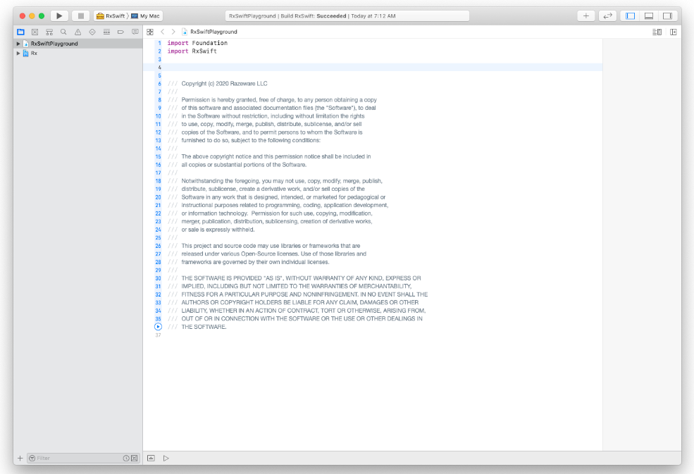
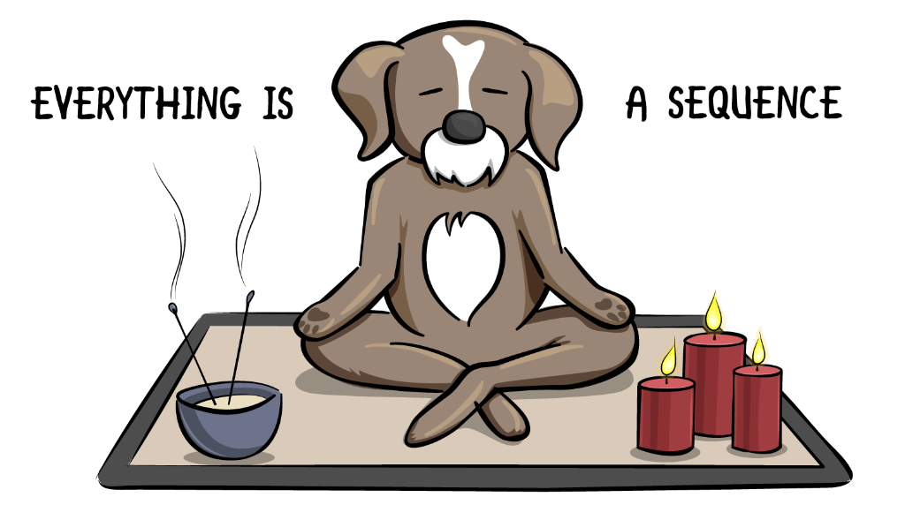
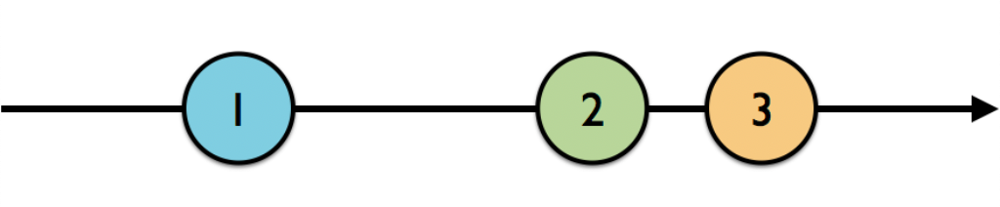

# Chapter 2 - Observables

“Now that you’ve learned some of the basic concepts of RxSwift, it’s time to take the jump and play with observables.
In this chapter, you’ll go over several examples of creating and subscribing to observables. The real-world use of some of the observables may seem a bit obscure, but rest assured that you’ll acquire important skills and learn a lot about the types of observables available to you in RxSwift. You’ll use these skills throughout the rest of this book — and beyond!”

摘录来自
Untitled
By Marin Todorov
此材料可能受版权保护。


## Getting started

“For this chapter, you’re going to use an Xcode project that’s already been set up to include a playground and the RxSwift framework. To get started, open up the Terminal app, navigate to this chapter’s starter folder and then to the RxPlayground project folder. Finally, run the bootstrap.sh script by entering this command:
”

摘录来自
Untitled
By Marin Todorov
此材料可能受版权保护。


```
./bootstraph.sh
```

“The bootstrap process will take a few seconds; remember that, every time you want to open this playground project, you will need to repeat the above steps. You cannot just open the playground file or workspace directly.
Select RxSwiftPlayground in the Project navigator, and you should see the following:”

摘录来自
Untitled
By Marin Todorov
此材料可能受版权保护。





“Twist down the playground page, through the Sources folder in the Project navigator, and select SupportCode.swift. It contains the following helper function example(of:):
”

摘录来自
Untitled
By Marin Todorov
此材料可能受版权保护。


```swift
“public func example(of description: String, action: () -> Void) {
  print("\n--- Example of:", description, "---")
  action()
}”

摘录来自
Untitled
By Marin Todorov
此材料可能受版权保护。
```

“You’re going to use this function to encapsulate different examples as you work your way through this chapter. You’ll see how to use this function shortly.”

摘录来自
Untitled
By Marin Todorov
此材料可能受版权保护。

“But before you get too deep into that, now would probably be a good time to answer the question: What is an observable?”

摘录来自
Untitled
By Marin Todorov
此材料可能受版权保护。


## “What is an observable?”

摘录来自
Untitled
By Marin Todorov
此材料可能受版权保护。

“Observables are the heart of Rx. You’re going to spend some time discussing what observables are, how to create them, and how to use them.
You’ll see “observable”, “observable sequence” and “sequence” used interchangeably in Rx. And, really, they’re all the same thing. You may even see an occasional “stream” thrown around from time to time, especially from developers that come to RxSwift from a different reactive programming environment. “Stream” also refers to the same thing, but, in RxSwift, all the cool kids call it a sequence, not a stream. In RxSwift...”

摘录来自
Untitled
By Marin Todorov
此材料可能受版权保护。




“...or something that works with a sequence. And an Observable is just a sequence, with some special powers. One of these powers — in fact the most important one — is that it is asynchronous. Observables produce events over a period of time, which is referred to as emitting. Events can contain values, such as numbers or instances of a custom type, or they can be recognized gestures, such as taps.
One of the best ways to conceptualize this is by using marble diagrams, which are just values plotted on a timeline.”

摘录来自
Untitled
By Marin Todorov
此材料可能受版权保护。




“The left-to-right arrow represents time, and the numbered circles represent elements of a sequence. Element 1 will be emitted, some time will pass, and then 2 and 3 will be emitted. How much time, you ask? It could be at any point throughout the lifetime of the observable — which brings you to the next topic you’ll learn about: the lifecycle of an observable.”

摘录来自
Untitled
By Marin Todorov
此材料可能受版权保护。


