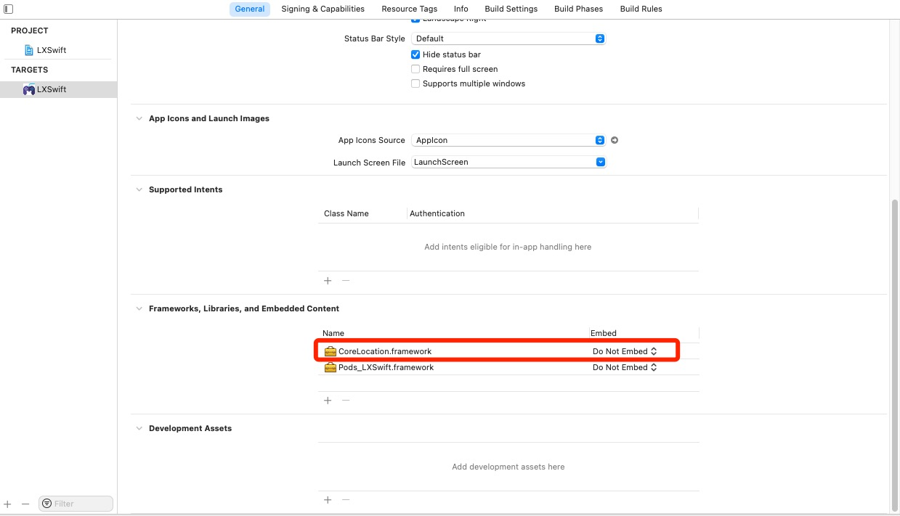
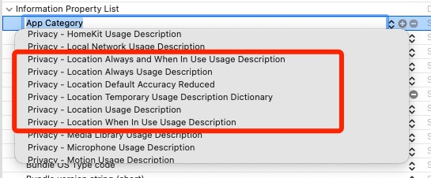

[iOS 火星坐标/地球坐标/百度坐标整理及解决方案汇总？如何转火星坐标？](https://www.jianshu.com/p/3cd701299cef)

[iOS中的地图与坐标](https://markmiao.com/2020/11/28/map/)


# iOS定位与地图介绍

- 地图：系统地图（MKMapView），百度地图（BMKMapView），高德地图（MAMapView）
- 坐标系：GPS坐标系（WGS-84），火星坐标系（GCJ-02），百度坐标系（BD-09）
- 定位：系统定位（CLLocationManager），百度定位SDK（BMKLocationManager），高德定位SDK（AMapLocationManager）


## 系统

系统定位返回的经纬度为WGS-84坐标，但在“**国内苹果原生地图的数据是由高德地图提供**”，所以需要将`地球坐标`转成`火星坐标`；

* 定位：WGS-84
* 地图：GCJ-02

## 高德

高德的定位和地图SDK只使用了一种坐标系：火星坐标系（GCJ-02）

* 定位：GCJ-02
* 地图：GCJ-02

## 百度

百度定位SDK获取的经纬度默认为火星坐标系（GCJ-02），百度地图中是百度坐标系（BD-09），如果要定位的坐标放到地图里用，则需要统一坐标系，指定坐标系为`.BMK09LL`。

* 定位：GCJ-02
* 地图：BD-09


# 坐标系介绍

> 苹果系统地图在海外全球通用，为GPS坐标系。在国内使用的是高德数据，所以返回的经纬度是火星坐标系的。国内测试，超出国境线就无法获取经纬度数据。
>
> 百度地图的坐标系是自己的BD09，无法切换为其他坐标系。
>
> 高德地图坐标系是火星坐标系，无法切换为其他坐标系。


## WGS-84 

> 地球坐标，**国际标准**，也是目前广泛使用的GPS全球卫星定位系统使用的坐标系；
>
> 谷歌国外地图、国际地图

## GCJ-02 

>  火星坐标，**中国坐标偏移标准**，是由中国国家测绘局制订的地理信息系统的坐标系统，是由WGS84坐标系经加密后的坐标系；
>
> 法律规定：在中国，地图产品不允许直接使用GPS坐标，至少使用一层加密的火星坐标系（GCJ02）。
>
> iOS原生地图（高德）、Google国内地图、高德、腾讯地图

## BD-09

> 百度坐标，**百度坐标偏移标准**，在GCJ02坐标系基础上再次加密。其中BD09ll表示百度经纬度坐标，BD09mc表示百度墨卡托米制坐标。
>
> 百度地图


# 坐标系转换

## 网页测试地址

* [百度地图 BD-09 - 经纬度查看](https://lbsyun.baidu.com/jsdemo/demo/yLngLatLocation.htm)

* [高德地图 GCJ-02 - 经纬度查看](https://lbs.amap.com/tools/picker)

* [Google Earth WGS-84 - 经纬度查看](https://earth.google.com/)

* [坐标系在线转换](https://tool.lu/coordinate/)


## iOS坐标转换

* [JZLocationConverter-Swift](https://github.com/JackZhouCn/JZLocationConverter-Swift)

* [CLLocation+Sino](https://github.com/graveliang/CLLocation)

* [iOS地图开发2-坐标系的转换(swift)](https://cloud.tencent.com/developer/article/1524369)

* [WGS84坐标转火星坐标（iOS篇）](https://www.keakon.net/2011/07/02/WGS84坐标转火星坐标（iOS篇）)
    * [coordinate](https://bitbucket.org/keakon/welcometomars/src/master/)

* [AHLocationManager](https://github.com/AidaHe/AHLocationManager)
    * [iOS中地图经纬度坐标转换](https://www.jianshu.com/p/abdb35b0ba78)

* [TQLocationConverter](https://github.com/TinyQ/TQLocationConverter)


# iOS系统定位

[Apple Document - CLLocationManager](https://developer.apple.com/documentation/corelocation/cllocationmanager#//apple_ref/doc/uid/TP40007125)

## 1.导入`CoreLocation.framework`




## 2.权限申请 `.plist`

* [Apple - NSLocationUsageDescription - 【Deprecated】 - 【iOS 6.0–8.0】](https://developer.apple.com/documentation/bundleresources/information_property_list/nslocationusagedescription)
    * Privacy - Location Usage Description：iOS 6.0–8.0

* [Apple - NSLocationAlwaysUsageDescription - 【Deprecated】 - 【iOS 8.0–10.0】](https://developer.apple.com/documentation/bundleresources/information_property_list/nslocationalwaysusagedescription)
    * Privacy - Location Always Usage Description：iOS 8.0–10.0

* [Apple - NSLocationWhenInUseUsageDescription - 【iOS 11.0+】](https://developer.apple.com/documentation/bundleresources/information_property_list/nslocationwheninuseusagedescription)
    * Privacy - Location When In Use Usage Description：iOS 11.0+

* [Apple - NSLocationAlwaysAndWhenInUseUsageDescription - 【iOS 11.0+】](https://developer.apple.com/documentation/bundleresources/information_property_list/nslocationalwaysandwheninuseusagedescription)
    * Privacy - Location Always and When In Use Usage Description：iOS 11.0+




## 3.代码

```swift
import CoreLocation

class LocationViewController: UIViewController {
    let locationManager = CLLocationManager()
    var currentLocation: CLLocation?
    var lock = NSLock()
    
    override func viewDidLoad() {
        title = "定位"
        view.backgroundColor = .white
        //
        locationManager.delegate = self
        // 定位精确度（最高）一般有电源接入，比较耗电
        locationManager.desiredAccuracy = kCLLocationAccuracyBest
        // 设备移动后获得定位的最小距离（适合用来采集运动的定位）
        locationManager.distanceFilter = 50           
        // 弹出用户授权对话框，使用程序期间授权（ios8后)
        locationManager.requestWhenInUseAuthorization()            
        // 开始定位
        locationManager.startUpdatingLocation()
    }
}

/*
 * 定位代理
 */
extension LocationViewController: CLLocationManagerDelegate {

    func locationManagerDidChangeAuthorization(_ manager: CLLocationManager) {
        print(#line, #function)
    }
    
    func locationManagerDidPauseLocationUpdates(_ manager: CLLocationManager) {
        print(#line, #function)
    }
    
    func locationManagerDidResumeLocationUpdates(_ manager: CLLocationManager) {
        print(#line, #function)
    }
    
    func locationManager(_ manager: CLLocationManager, didUpdateLocations locations: [CLLocation]) {
        lock.lock()
        currentLocation = locations.last    // 注意：获取集合中最后一个位置（最新的位置）
        let high = String(describing: currentLocation?.altitude)
        let jing = String(describing: currentLocation?.coordinate.longitude)
        let wei = String(describing: currentLocation?.coordinate.latitude)
        print("高度：\(high)")
        print("定位经纬度为：\(jing) : \(wei)")
        view.makeToast("定位经纬度为：\(jing) : \(wei)")
        lock.unlock()
    }
    
    func locationManager(_ manager: CLLocationManager, didFailWithError error: Error) {
        print("定位出错拉！！\(error)")
    }
}
```


## 4.将经纬度转换为位置

* 导入 `Map.framework`

```swift
import MapKit

let geoCoder = CLGeocoder()

func LocationToCity() {
    geoCoder.reverseGeocodeLocation(currentLocation!) { placemarks, error in
        if error != nil {
            print("reverse geodcode fail: \(error!)")
            return
        }
        var placemark: CLPlacemark!
        let pms = placemarks! as [CLPlacemark]
        if pms.count > 0 {
            placemark = pms[0] as CLPlacemark
            var addressString : String = ""
            if placemark.subThoroughfare != nil {
                addressString = placemark.subThoroughfare! + " "
            }
            if placemark.thoroughfare != nil {
                addressString = addressString + placemark.thoroughfare! + ", "
            }
            if placemark.postalCode != nil {
                addressString = addressString + placemark.postalCode! + " "
            }
            if placemark.locality != nil {
                addressString = addressString + placemark.locality! + ", "
            }
            if placemark.administrativeArea != nil {
                addressString = addressString + placemark.administrativeArea! + " "
            }
            if placemark.country != nil {
                addressString = addressString + placemark.country!
            }
            print("reverse geodcode success: \(addressString)")
        }
    }
}
```


## 5.显示地图

[MapKit 使用介绍：大头针和图形渲染](https://swift.gg/2017/01/20/mapkit-beginner-guide/)

https://blog.csdn.net/u014599371/article/details/80093157

