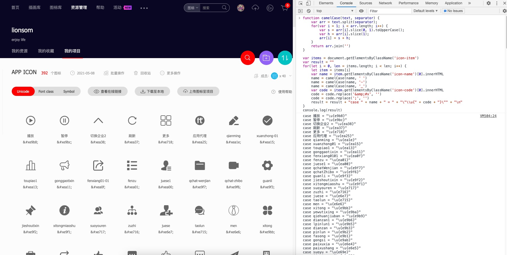

[SwiftIconFont](https://github.com/0x73/SwiftIconFont)

[EFIconFont](https://github.com/XiangWuShuo/EFIconFont)


https://fontawesome.com/

https://www.iconfont.cn/


[ttf预览工具1](https://fontdrop.info/)

[ttf预览工具2](http://blog.luckly-mjw.cn/tool-show/iconfont-preview/index.html)


## IconFont是什么

IconFont 也叫字体图标，顾名思义，就是字体做的图标。受到近些年扁平化设计 的影响，越来越多的图标都开始使用 icon font。
IconFont技术起源于Web领域的Web Font技术。随着时间的推移，网页设计越来越漂亮。但是电脑预装的字体远远无法满足设计者的要求，于是Web Font技术诞生了。一个英文字库并不大，通过网络下载字体，完成网页的显示。有了Web Font技术，大大提升了设计师的发挥空间。


目前最主要的几种网络字体(web font)格式包括WOFF，SVG，EOT，OTF/TTF。

* WOFF

  WOFF是Web Open Font Format几个词的首字母简写。这种字体格式专门用于网上，由Mozilla联合其它几大组织共同开发。WOFF字体通常比其它字体加载的要快些，因为使用了OpenType (OTF)和TrueType (TTF)字体里的存储结构和压缩算法。这种字体格式还可以加入元信息和授权信息。这种字体格式有君临天下的趋势，因为所有的现代浏览器都开始支持这种字体格式。【支持的浏览器：IE9+,Firefox3.5+,Chrome6+,Safari3.6+,Opera11.1+】

* SVG / SVGZ

  Scalable Vector Graphics (Font). SVG是一种用矢量图格式改进的字体格式，体积上比矢量图更小，适合在手机设备上使用。【支持的浏览器：Chrome4+,Safari3.1+,Opera10.0+,iOS Mobile Safari3.2+】

* EOT

  Embedded Open Type。这是微软创造的字体格式。这种格式只在IE6-IE8里使用。【支持的浏览器：IE4+】

* OTF / TTF

  OpenType Font 和 TrueType Font。部分的因为这种格式容易被复制(非法的)，这才催生了WOFF字体格式。然而，OpenType有很多独特的地方，受到很多设计者的喜爱。【支持的浏览器：IE9+,Firefox3.5+,Chrome4+,Safari3+,Opera10+,iOS Mobile Safari4.2+】


## IconFont优劣

优势:

- 自由的变化大小，且不会模糊，多设备适配一套图解决问题
- 比图片小，加载快，减小ipa包的大小
- 方便更改颜色大小，适应换肤要求
- 减少切图，一图多用提高开发效率

不足：

- 只能被渲染成单色或者CSS3的渐变色


## IconFont生成Swift 代码

参考自：https://github.com/EFPrefix/EFIconFont/blob/master/Extend/iconfont.md


在你 `iconfont.cn` 的某个项目页面，打开 Chrome 开发者工具的 Console，在其中执行如下 `JavaScript` 脚本，即可获取对应的枚举结构，如下所示：

```html
function camelCase(text, separator) {
    var arr = text.split(separator);
    for(var i = 1; i < arr.length; i++) {
        var s = arr[i].slice(0, 1).toUpperCase(); 
        var h = arr[i].slice(1);
        arr[i] = s + h;
    }
    return arr.join('')
}

var items = document.getElementsByClassName('icon-item')
var result = ""
for(let i = 0, len = items.length; i < len; i++) {
    let item = items[i]
    var name = item.getElementsByClassName('icon-name')[0].innerHTML
    name = camelCase(name, ' ')
    name = camelCase(name, '-')
    name = camelCase(name, '_')
    var code = item.getElementsByClassName('icon-code')[0].innerHTML
    code = code.replace('&amp;#x', '')
    code = code.replace(';', '')
    result = result + "case " + name + " = " + "\"\\u{" + code + "}\"" + "\n"
}
console.log(result)
```





## 自建Pod

```bash
# 1.创建本地库
➜ pod lib create LXIconFont_Swift

# 2.GitHub手动创建LXIconFont_Swift仓库

# 3.本地仓库关联远程仓库
➜ git remote add origin https://github.com/LXPods/LXIconFont_Swift.git
➜ git push --set-upstream origin master
```


```js
function camelCase(text, separator) {
    var arr = text.split(separator);
    for(var i = 1; i < arr.length; i++) {
        var s = arr[i].slice(0, 1).toUpperCase(); 
        var h = arr[i].slice(1);
        arr[i] = s + h;
    }
    return arr.join('')
}

var items = document.getElementsByClassName('icon-item')
var result = ""
for(let i = 0, len = items.length; i < len; i++) {
    let item = items[i]
    var name = item.getElementsByClassName('icon-name')[0].innerHTML
    name = camelCase(name, ' ')
    name = camelCase(name, '-')
    name = camelCase(name, '_')
    var code = item.getElementsByClassName('icon-code')[0].innerHTML
    code = code.replace('&amp;#x', '')
    code = code.replace(';', '')
    result = result + "\"" + name + "\"" + " : " + "\"" + code + "\"," + "\n"
}
console.log(result)

// eg:
"add" : "e664",
"addCircle" : "e665",
"arrowRightCircle" : "e666",
"arrowDown" : "e667",
"ashbin" : "e668",
"arrowRight" : "e669",
"bottom" : "e66a",
"arrowLeftCircle" : "e66b",
"close" : "e66c",
"link" : "e676",
"fullscreenExpand" : "e675",
"map" : "e677",
"notification" : "e679",
"mic" : "e678",
"play" : "e67a",
"search" : "e67d",
"smile" : "e67e",
"我的" : "e60b",
"首页" : "e60d",
"兑换" : "e615",
"邮件" : "e61c",
"钻石" : "e61d",
```


