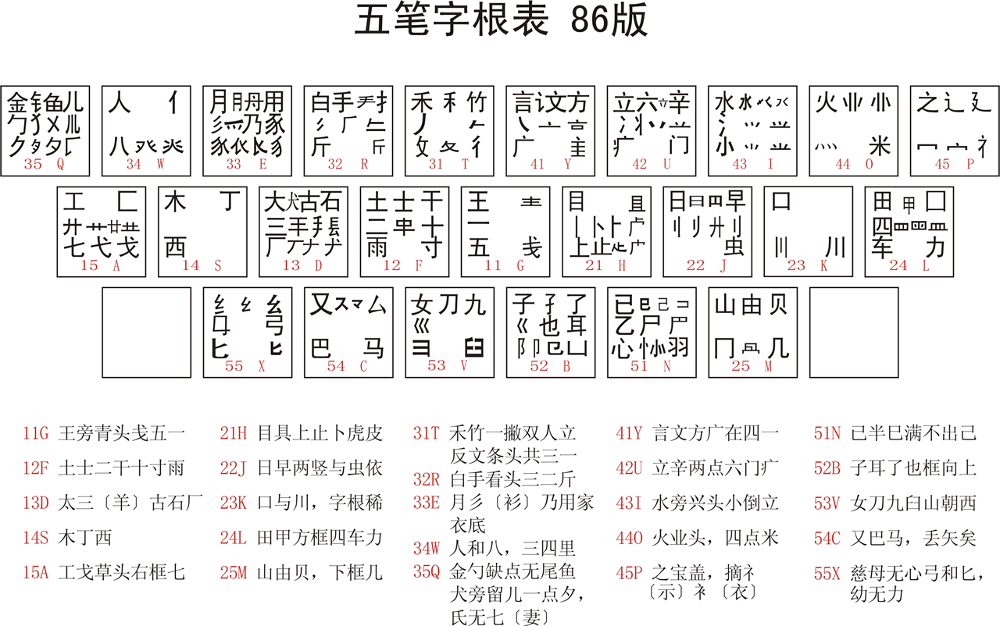
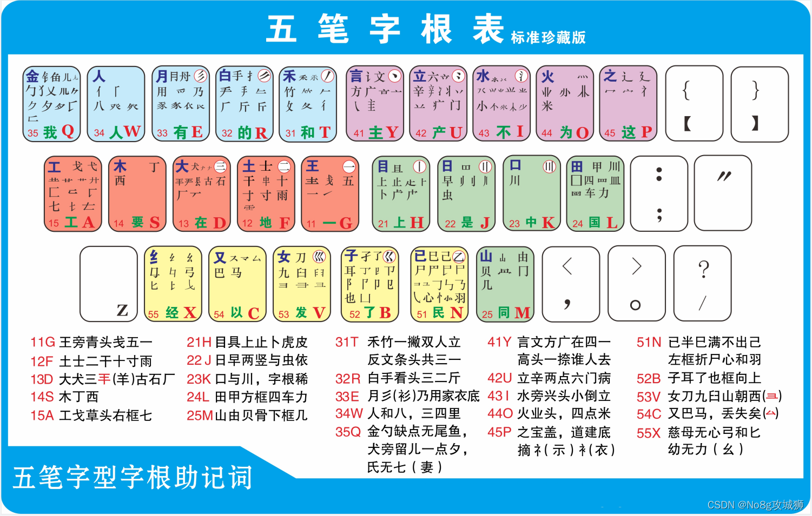
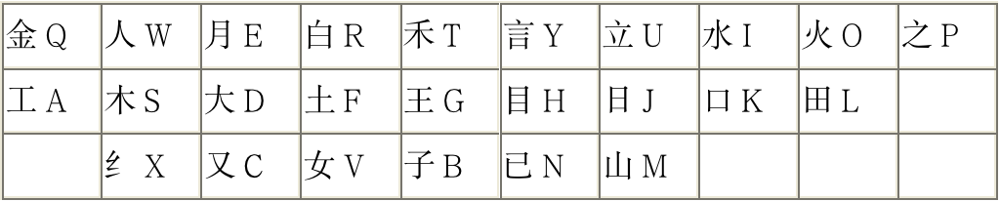
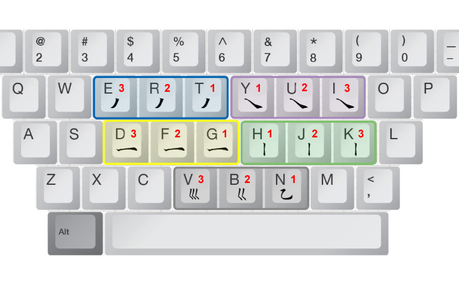
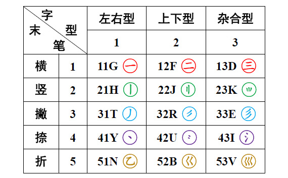

# 拼写规则

## 一级简码

> 字母 + 空格
>
> 11 - 15：一地在要工
>
> 21 - 25：上是中国同
>
> 31 - 35：和的有人我
>
> 41 - 45：主产不为这
>
> 51 - 55：民了发以经

## 键面字

> 键面上第一个字根的输入规则：**把所在键连打四下**，例如：“土”字就是边打四下“F”，即“FFFF”。
> 键面字一共有二十五个，它们所在的键位如下图：

## 成字字根

> 除键面字以外的其它字根的输入规则（这样的字不多）：
>
> 1. 报户口
> 2. 第一单笔画
> 3. 第二单笔画
> 4. 最末单笔画
>
> 举例
>
> eg：“雨”字，先打“F”键（打“雨”字所在的键，俗称“报户口”），然后再打 “一” “|” “丶” 三个单笔画所在的键，所以“雨”字的编码就是FGHY
> eg：“士”拆分为 “一” “|” “一” 编码为：FGHG
> eg：“文”拆分为 “丶” “一” “丶” 编码为：YYGY

## 多字根

* 一，如果只能拆分为两个字根，就打：第一字根+第二字根+空格
    * 如“明”字，拆分为“日”和“月”两个字根打“J”“E”再打空格
* 二，如果只能拆分为三个字根，就打：第一字根+第二字根+第三字根+空格
    * 如“些”字，拆分为“止”和“匕”“二”三个字根打“H”“X”“F”再打空格
* 三，如果只能拆分为四个字根，就打：第一字根+第二字根+第三字根+第四字根
    * 如“命”字，拆分为“人”“一”“口”“卩”四个字根打“W”“G”“K”“B”
* 四，如果拆分超过四个字根，就打：第一字根+第二字根+第三字根+最末字根
    * 如“厨”字，拆分为“厂”“一”“口”“寸”四个字根打“D”“G”“K”“F”

### 识别码

> 识别码规则：
>
> * 只有小于四个字根的单字才需要加识别码。
> * 第一个字根 + 第二个字根 +（第三个字根）+ 识别码
> * 先考虑该汉字的最后一笔（末笔），从而确定要加的识别码所在的区（横、竖、撇、捺、折），再考虑该汉字的结构（左右，上下，杂合），从而确定所加识别码所在区的位（第一位、第二位、第三位）。
>
> 例如：
>
> 

### 识别码其他原则

1，只有小于四个字根的单字才需要加识别码。也即成字根字（先打它所在的键，再按书写顺序打它的第一笔、第二笔和最后一笔）、键名字（连续击它所在的键四下），都不需要加识别码，或者一个汉字如果拆出了四个以上的字根，如“我”（丿，扌，乙，丶，丿）、“寒”（宀、二，刂、一，八，丶丶），就不再需要加识别码。

2，单笔划（一，丨，丿，丶，乙）与其它字根相交、相连时都应该把该字看成是杂合结构。

如：“乏”，拆分字根为：丿、之，但由于单笔划“丿”与“之”字相连，所以它必须看成是杂合结构，从而确定识别码为“I"

再如：”乡“，拆分字根]为：纟（须去掉最后一提）、丿，但由于单笔划“丿”与“纟”相连，也必须看成是杂合结构，从而确定它的识别码为“E”

又如：“君”，拆分字根为：彐，丿，口，但由于单笔划“丿”与“彐”相交，所以“君”也必须看成是杂合结构，从而确定其识别码为“D”

但如果单笔划与字根即不相连也不相交，就必须正常看待。

如：“旦”，上下结构，“旧”，左右结构。

3，字根与字根相连，是上下结构；字根与字根相交，杂合结构。

如：“看、着”，上下结构，而“击、出、里”为杂合结构。

4，带“辶、廴、囗”等全包围、半包围结构的汉字，它们的末笔必须取被包围结构的最后一笔，而不是这些偏旁的末笔。此举是为了提高识别码的效率，减少重码率。

如：连（LPK）、圆（LKMI）

5，若“刀、九、匕、力”在参与识别，作为汉字的最后一个字根时，其末笔统一规定为“乙”（折）。**注意：当“刀”字作为成字字根时，末笔为“丿”（撇），编码为vnt。**

## 笔画 一丨丿丶乙

> 区首键两下 + L键两下
>
> 一： ggll
>
> 丨：hhll
>
> 丿：ttll
>
> 丶：yyll
>
> 乙：nnll

## 词组

### 二字词

> 二字词输入规则：由每字全码的前两码组成，共四码。

例如：“天空”：“天”拆分为 “一” “大” 两个字根，“空”拆分为 “宀” “八” “工” 三个字根，分别取这两个字的前两码“一大宀八”，就形成了“天空”这个词组的编码“GDPW”

### 三字词

> 三字词的输入规则：前两字各取全码的第一码，最后一字取前两码。

例如：“计算机”：“计”拆分 “讠” “十” 两字根，“算”拆分为 “竹” “目” “艹” 三字根，“机”拆分为“木” “几” 两字根，那么词组“计算机”分别取“计”“算”的第一码再加上“机”的第一和第二码，即“讠竹木几”就形成了“计算机”，这个词组的编码：“YTSM”

### 四字词

> 四字词的输入规则：每字各取全码的第一码。

例如：“打草惊蛇”分别取这四个字的第一字根，就是“扌” “艹” “忄” “虫”，这四个字根所在的键分别为“R” “A” “N” “J”，所以“打草惊蛇”的编码就是“RANJ”

### 多字词

> 多字词的输入规则：取每一、二、三及最后一个汉字的每一码，共四码。

例如：“新疆维吾尔自治区”分别取“新疆维区”的第一字根，即“立” “弓” “纟” “匚”，这四个字根对应的键分别是“U” “X” “X” “A”，所以“新疆维吾尔自治区”的编码就是“UXXA”

提醒：包含一级简码的词组容易出现的问题：
由于一级简码大家打得比较多，所以输入包含有一级简码的词组大家容易出现一个问题，有些朋友容易把一级简码跟它的全码搞混淆，在所有词组规则中所说的第一或第二字根都是指汉字全码的第一或第二字根，跟一级简码没有任何关系！举例说明：

| 词组举例 | 五笔字根正确拆分 | 五笔字根错误拆分 | 正确的五笔编码 | 错误的五笔编码 |
| -------- | ---------------- | ---------------- | -------------- | -------------- |
| 我们     | 丿扌亻门         | 我我亻门         | TRWU           | QQWU           |
| 以为     | 乙丶丶力         | 以以为为         | NYYL           | CCYL           |
| 这里     | 文辶日土         | 这这日土         | YPJF           | PPJF           |
| 不要     | 一小西女         | 不不要要         | GISV           | IISS           |

## 其他规定

提醒：五笔输入法的几项硬性规定：
1：关于“力，刀，九，匕”。鉴于这些字根的字顺因人而异，五笔输入法规定，当它们参加“识别”时，一律以“折”作为末笔。
2：带“框框”的“国”“团”等字和带走之旁的“边”，“远”等字，一律以被包围部份的末笔为末笔。
3：“我”“定”“成”等字的末笔，由于因人而异，一律规定末笔为撇“丿”
4：五个单笔画的编码硬性规定为：“一”是GGLL,“|”是HHLL“丿”TTLL,“丶”为YYLL,“乙”为NNLL
5：有些五笔输入法为了避免“劳动”这个常用词组与“蔻”字重码，把“蔻”字编码最后一码改为“L”；同时为避免
“靥”不与“大”字重码，把“靥”最后一码改为“L”

最后一点说明：由于各种原因，您可能认为有些字拆法不科学（如曳字），不合理，但是没办法，五笔输入法是别人编写的，我们只有服从它，对于那些可能是错的地方，就请您将错就错，只要能打出来就行。

# **86版五笔字根助记口诀**

　**横区(一)：**

　　G--------11 王旁青头戋(兼)五一

　　F--------12 土士二干十寸雨

　　D--------13 大犬三羊古石厂　[说明：“羊”指没有上面两点的羊字底]

　　S--------14 木丁西

　　A--------15 工戈草头右框七

　**竖区(丨)：**

　　H--------21 目具上止卜虎皮

　　J--------22 日早两竖与虫依

　　K--------23 口与川，字根稀

　　L--------24 田甲方框四车力

　　M--------25 山由贝，下框几

　**撇区(丿)：**

　　T--------31 禾竹一撇双人立，反文条头共三一

　　R--------32 白手看头三二斤，

　　E--------33 月彡(衫)乃用家衣底

　　W--------34 人和八三四里

　　Q--------35 金勺缺点无尾鱼，犬旁留乂(叉)一点夕，氏无七

　**捺区(丶)：**

　　Y--------41 言文方广在四一，高头一捺谁人去

　　U--------42 立辛两点六门疒(病)

　　I--------43 水旁兴头小倒立

　　O--------44 火业头，四点米

　　P--------45 之宝盖，摘礻(示)衤(衣)

　**折区(乙)：**

　　N--------51 已半巳满不出己， 左框折尸心和羽

　　B--------52 子耳了也框向上

　　V--------53 女刀九臼山朝西

　　C--------54 又巴马，丢矢矣

　　X--------55 慈母无心弓和匕，幼无力

　　**注：**

　　1、口诀中括号内的字表示前一个字根的读音。

　　2、五笔编码中没有给“Z”键安排字根，“Z”键作为万能学习键。

　　3、它不但可以代替“识别码”帮你把字找出来，告诉你“识别码;

　　4、而且还可以代替一时记不清或分解不准的任何字根，并通过提示行。

　　5、使你知道“Z”键对应的键位或字根。

　　98五笔字根表口诀助记词(下图所示五笔字根表口诀为98版)右键目标另存为到您的电脑中，打印下来。

　　这是相对于旧版本86版，有所改进的。98版五笔字根表和助记词。

　　新型的五笔字根表也越来越多人用了。但普及度应该还没有86版那么广。。。

# **98版五笔字根口诀**

　　11 G 王旁青头五夫一，

　　12 F 土干十寸未甘雨，

　　13 D 大犬戊其古石厂，

　　14 S 木丁西甫一四里，

　　15 A 工戈草头右框七。

　　21 H 目上卜止虎头具，

　　22 J 日早两竖与虫依，

　　23 K 口中两川三个竖，

　　24 L 田甲方框四车里，

　　25 M 山由贝骨下框集。

　　31 T 禾竹反文双人立，

　　32 R 白斤气丘叉手提，

　　33 E 月用力豸毛衣臼，

　　34 W 人八登头单人几，

　　35 Q 金夕鸟儿犭边鱼。

　　41 Y 言文方点谁人去，

　　42 U 立辛六羊病门里，

　　43 I 水族三点鳖头小，

　　44 O 火业广鹿四点米，

　　45 P 之字宝盖补礻衤。

　　51 N 已类左框心尸羽，

　　52 B 子耳了也乃框皮，

　　53 V 女刀九艮山西倒，

　　54 C 又巴牛厶马失蹄，

　　55 X 幺母贯头弓和匕。
