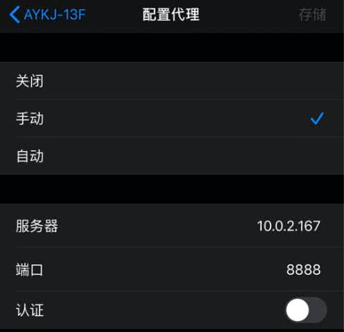
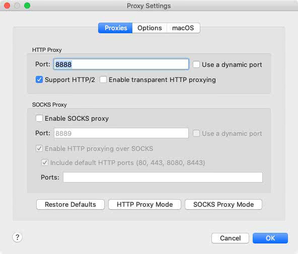
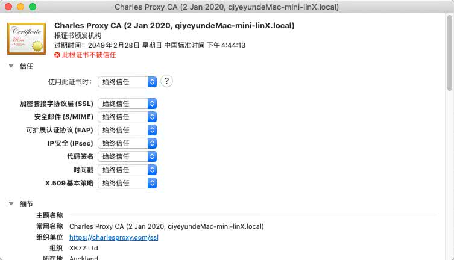
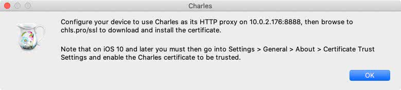
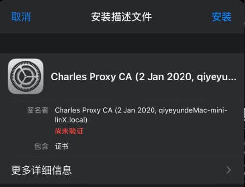
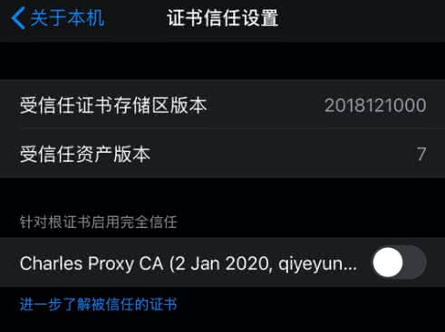
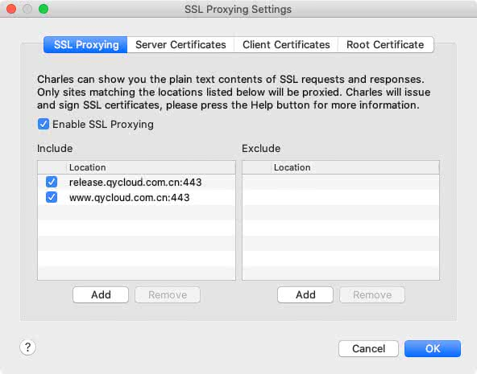

## 一、Charles

[charles 官网](https://www.charlesproxy.com/)

https://zhuanlan.zhihu.com/p/26182135

https://juejin.im/post/5b4f005ae51d45191c7e534a

## 二、iOS模拟器抓包

## 三、iPhone真机抓HTTP

### 前提：Mac 与 iPhone在同一局域网！！！

例如：Mac连接Wifi13，iPhone连接WiFi13。

### 3.1、获取Mac IP地址

方法一：**系统偏好设置 -> 网络**

方法二：**Charles -> Help -> Local Ip Address**

方法三：**终端：$ ifconfig**

### 3.2、设置iPhone网络代理

在iPhone的`设置 -> 无线局域网 -> 局域网信息(i) -> 配置代理 -> 手动`中配置代理，服务器输入框中填写PC的IP地址，端口输入框中填写Charles的代理端口`Charles -> Proxy -> Proxy Settings `（一般是8888）。图示如下：

### 3.3、完成

Charles点击Allow，iPhone上进行网络请求，即可被Charles抓包！！！

## 四、iPhone真机抓HTTPS

### 4.1、Mac安装证书

在Charles `菜单栏 -> Help -> SSL Proxying -> Install Charles Root Certificate` 中可以为Mac安装证书，证书可以在Mac的钥匙串中查看，并添加信任。如下图：

### 4.2、iPhone安装证书

在Charles `菜单栏 -> Help -> SSL Proxying -> Install Charles Root Certificate on a Mobile Device or Remote Browser` 中查看最新的官方证书下载地址（网址：chls.pro/ssl）。图示如下：

在iPhone浏览器输入 `chls.pro/ssl` 网址，`下载证书 -> 按照证书 -> 信任证书` ，如下图：

基于iOS的证书信任机制，在安装完成并信任证书后，需要到iPhone `设置 -> 关于本机 -> 证书信任设置` 中启用根证书。图示如下：

### 4.3、开启SSL权限

在Charles`菜单栏 -> Proxy -> SSL Proxying Settings`中勾选`Enable SSL Proxying`，然后在`Locations`中添加需要抓包的Host和Port即可。图示如下：

### 4.4、完成

可以在Charles拦截到HTTPS包，并可以看到具体的请求内容。

