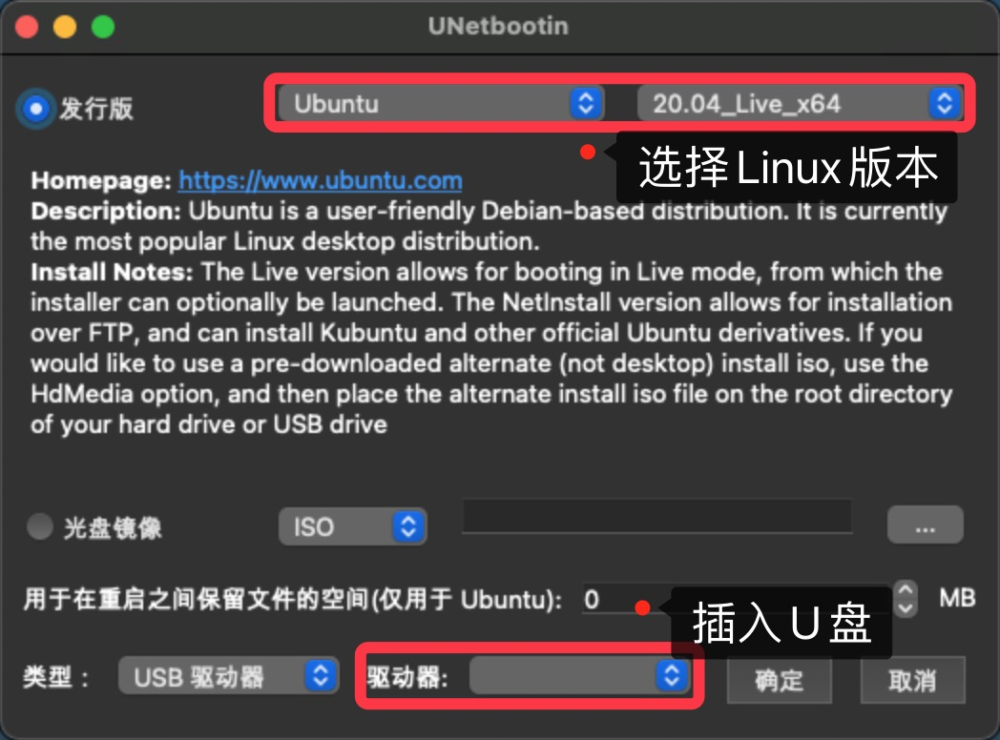
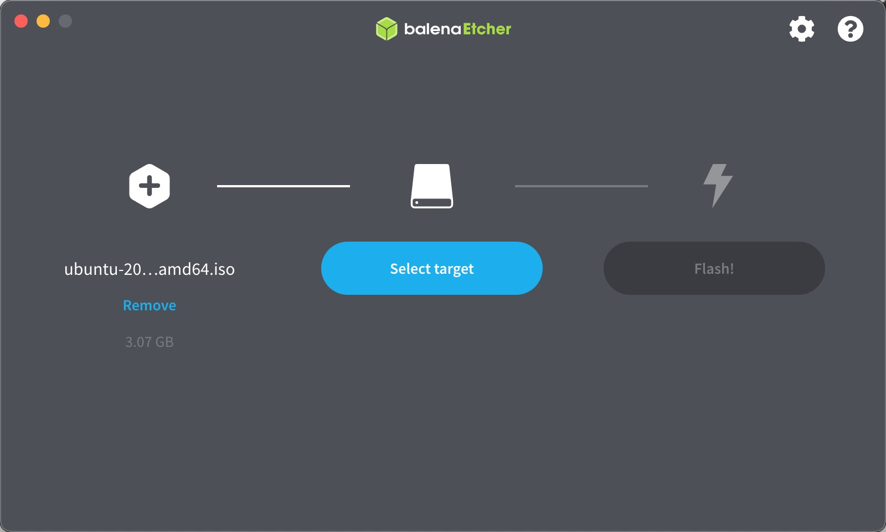
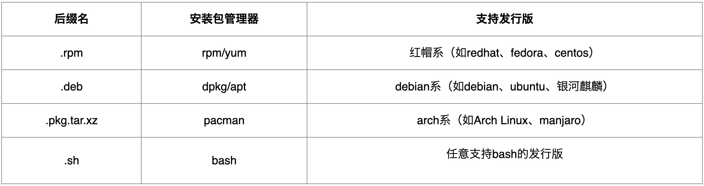
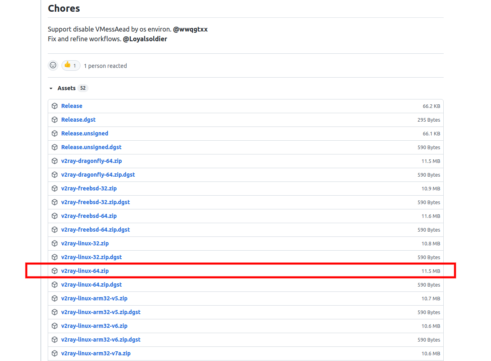
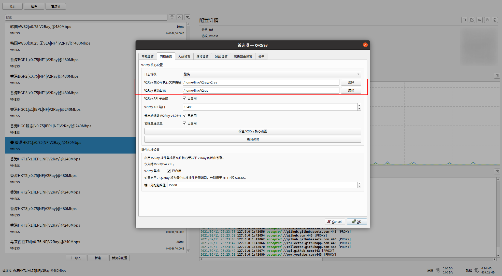

# 重装Ubuntu系统


## 下载Ubuntu镜像

* Ubuntu官网 https://ubuntu.com/download
* Ubuntu Release发行版官网 http://releases.ubuntu.com/20.04/
* 推荐：UNetbootin https://unetbootin.github.io/
  * UNetbootin工具管理多种Linux系统以及多个版本！！


### 推荐：UNetbootin

* 可直接插入U盘下载，制作启动盘！！

* 或者先现在镜像，获取下载地址后，使用迅雷下载更快！！！再用balenaEtcher制作启动盘！！！




## 制作启动盘

### 推荐：balenaEtcher

* https://www.balena.io/etcher/
* 选择刚刚下载的镜像，再选择刚刚的U盘作为目标，制作启动盘！！




## 安装Ubuntu

* 设置U盘为第一启动项，F2进入Bios
* 重启，一步步安装即可！！


# =======================

# [Ubuntu实用工具推荐](https://zhuanlan.zhihu.com/p/71833109)


# 安装包后缀

* apt：Advanced Packaging Tool（apt）是[Linux](https://baike.baidu.com/item/Linux/27050)下的一款安装包[管理工具](https://baike.baidu.com/item/管理工具/9143974)，是一个客户/[服务器系统](https://baike.baidu.com/item/服务器系统/2997788)。

* [Linux apt基本知识](https://www.runoob.com/linux/linux-comm-apt.html)

* 软件后缀分类

  


# 翻墙 - V2ray

[Youtube 教程](https://www.youtube.com/watch?v=fwvUjQJHmgk)

* 先下载 [v2ray-linux-64](https://github.com/v2ray/v2ray-core/tags)
  * 

* 再下载[Qv2ray](https://github.com/Qv2ray/Qv2ray/tags)
  *  属性 -> 权限 -> 可执行文件
* 运行Qv2ray，设置首选项
  * 

* 使用VMess


# 搜狗输入法

[搜狗 for linux](https://pinyin.sogou.com/linux/?r=pinyin)

[搜狗Linux安装指南](https://pinyin.sogou.com/linux/help.php)


# Github

* 先安装git
  * `$ sudo apt install git`
* 创建ssh，clone项目
  * [Github - Checking for existing SSH keys](https://docs.github.com/en/github/authenticating-to-github/connecting-to-github-with-ssh/checking-for-existing-ssh-keys)
  * [Github - Generating a new SSH key and adding it to the ssh-agent](https://docs.github.com/en/github/authenticating-to-github/connecting-to-github-with-ssh/generating-a-new-ssh-key-and-adding-it-to-the-ssh-agent)
  * [Github - Adding a new SSH key to your GitHub account](https://docs.github.com/en/github/authenticating-to-github/connecting-to-github-with-ssh/adding-a-new-ssh-key-to-your-github-account)


# Typora

[Typora for Linux](https://typora.io/#linux)

[参考文档 - 在Ubuntu上安装Typora](https://k0tk0t.github.io/2021/03/31/%E5%9C%A8Ubuntu%E4%B8%8A%E5%AE%89%E8%A3%85Typora/)

* 方式一：通过官方给的软件源安装

  * ```shell
    # or run:
    # sudo apt-key adv --keyserver keyserver.ubuntu.com --recv-keys BA300B7755AFCFAE
    wget -qO - https://typora.io/linux/public-key.asc | sudo apt-key add -
    # add Typora's repository
    sudo add-apt-repository 'deb https://typora.io/linux ./'
    sudo apt-get update
    # install typora
    sudo apt-get install typora
    ```

* 方式二：通过官方 Binary file 进行安装

* 方式三：通过deb包安装


# VLC

```shell
$ sudo add-apt-repository ppa:videolan/master-daily
$ sudo apt update
$ sudo apt-get install vlc qtwayland5
```


# Steam

[How to Install Steam in Ubuntu 20.04](https://linuxhint.com/install-steamos-on-ubuntu/)


