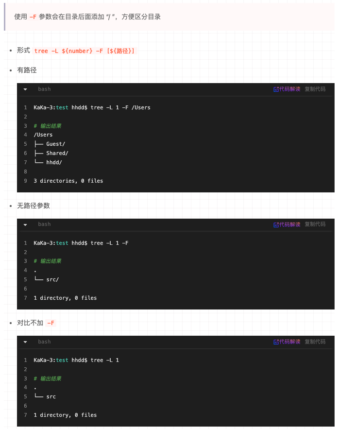

[Mac 环境快速生成目录结构树](https://juejin.cn/post/6980215157213364237)


## 1. 安装 tree

```sh
$ brew install tree
```


## 2. 参数介绍

```sh
参数选项
-a # 显示所有文件，包括隐藏文件（以  “.” 点开头的文件 ）
-d # 只显示目录
-f # 只显示每个文件的全路径
-i # 不显示树枝，常与-f参数配合使用
-L # level 遍历目录的最大层数，level 为大于0的正整数
-F # 在执行文件、目录、Socket符号链接、管道名称等不同类型文件的结尾，各自加上“*”、 "/"、"="、"@"、"|"号、类似ls命令的-F选项
```


## 3. 生成指定文件

> <font color='red' size=5> 进入到要生成 tree 目录: `tree [-d] -L ${number} > ${文件名[.后缀]}`</font>


## 4. 举个栗子


### a. 不带任何参数，直接调用 tree

```sh
$ tree
```


### b. 生成指定文件

```sh
$ tree -L 3 > test1.md
```


### c. 只列出目录下第一层目录的结构（-L 功能）


### d. 显示所有目录（但不显示文件）


### e. `-f`选项和`-i`选项的使用


### f. 使用 tree 命令 区分 `目录`和`文件`的方法（常用）




