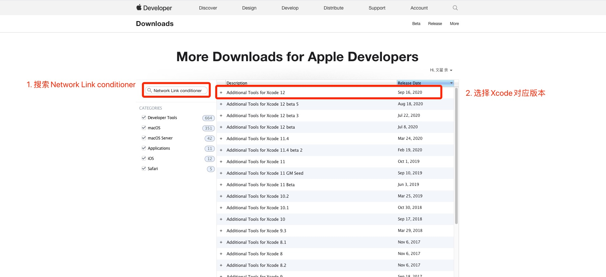
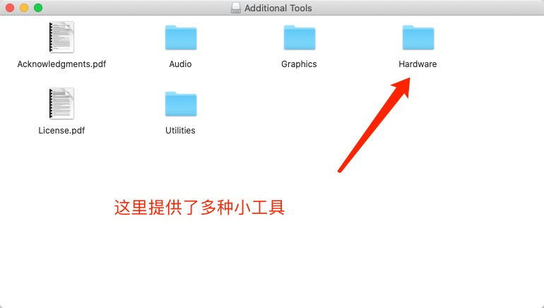
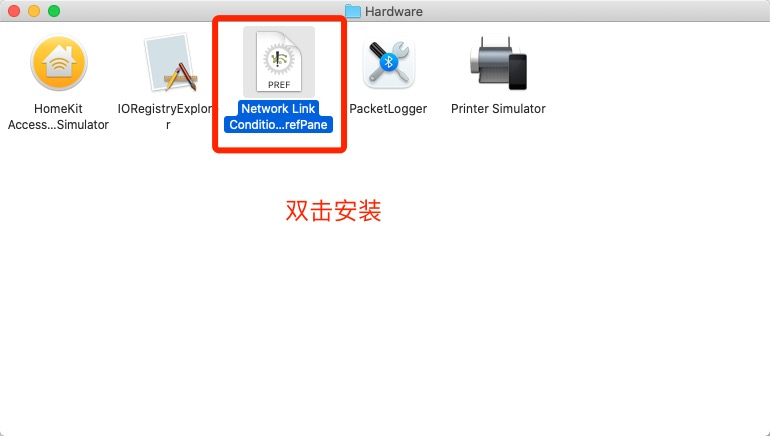
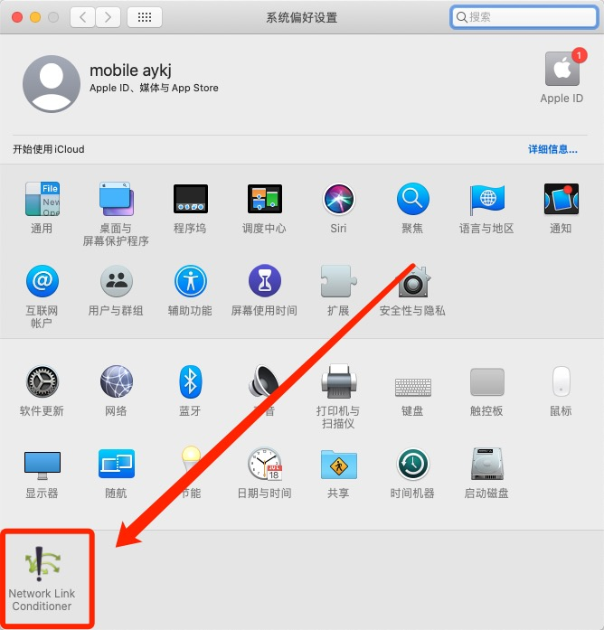
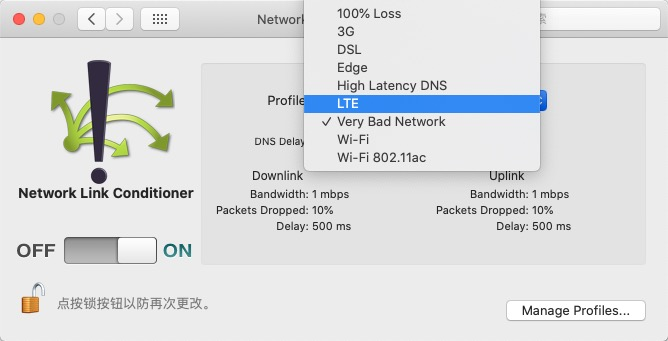

# 一、Network Link Conditioner模拟弱网

在 Mac 机器上可以利用 **Network Link Conditioner** 模拟一个弱网络环境。

### 1. 前往下载 Additional_Tools_for_Xcode_12.dmg

* [Apple Developer - More Downloads for Apple Developers](https://developer.apple.com/download/more/)

### 2. 安装 Network Link Conditioner

打开 Additional_Tools_for_Xcode_12.dmg，这里给我们提供了许多小工具，我们需要的 Network Link Conditioner 在 Hardware 下

# 二、Charles模拟弱网

1、点击Proxy->Throttling Settings

2、☑️勾选［Enable Throttling］使的限制网速可用，相当于开启了限制网速的功能

3、关于网速的选择

概念介绍：Bandwidth（带宽）、Utilistation（利用百分比）、Round-trip（往返延迟）、MTU（最大传输单元）

3G：300k-2Mbps左右

2.5G(GPRS)一般在100kbps

2G（GSM）一般在5-9kbps

