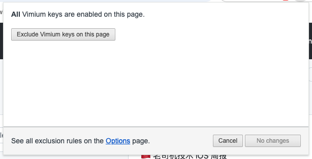
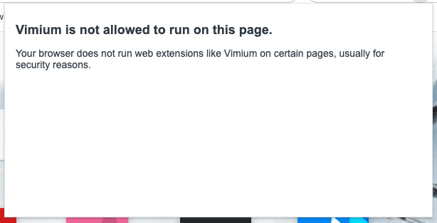
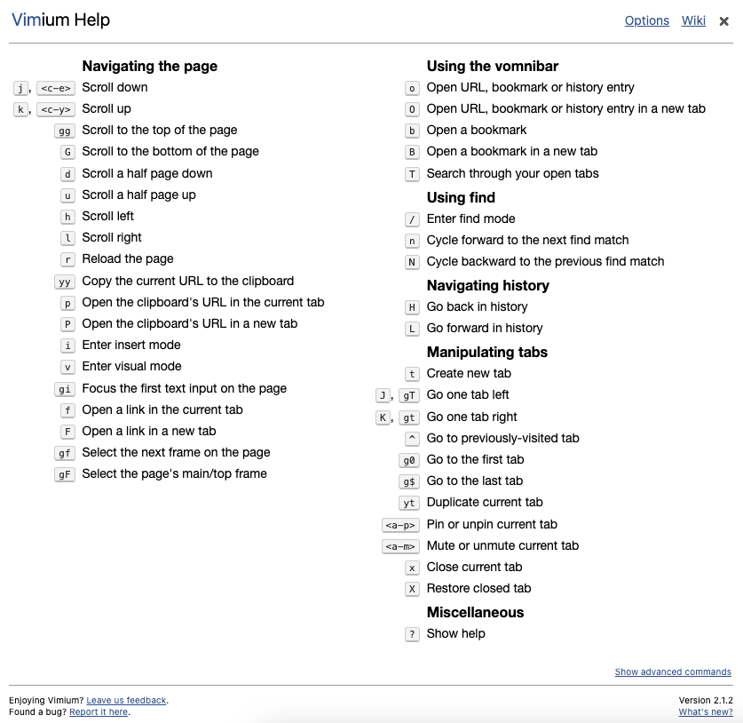

[vimium - github](https://github.com/philc/vimium)

[vimium - gitcode](https://gitcode.com/gh_mirrors/vi/vimium/overview?utm_source=csdn_github_accelerator)

[Chrome插件Vimium使用教程](https://zhuanlan.zhihu.com/p/113316942)


# 一、两种状态

* 可用

    

* 不可用

    

    


# 二、三种模式

* 普通模式：`ESC`
* 插入模式：`i`
* 可视模式（选择模式）：`v`

**Normal 模式**：用于网页导航和操作。

**Insert 模式**：用于文本输入时，禁用快捷键。

**Visual 模式**：用于选择和复制网页上的文本。


# 三、帮助 ?




# 四、快捷键

## 导航历史

> H 回到历史
> L 在历史中前进


## 导航页面

> j, <c-e> 向下滚动
> k, <c-y> 向上滚动
> gg 滚动到页面顶部
> G 滚动到页面底部
> d 向下滚动半页
> u 向上滚动半页
> h 向左滚动
> l 向右滚动
> r 重新加载页面
> yy 将当前 URL 复制到剪贴板
> p 在当前选项卡中打开剪贴板的 URL
> P 在新标签页中打开剪贴板的 URL
> i 进入插入模式
> v 进入可视模式
> gi 聚焦页面上的第一个文本输入
> f 在当前选项卡中打开一个链接
> F 在新标签页中打开链接
> gf 选择页面上的下一帧
> gF 选择页面的主框架/顶框架


## 操作标签

> t 创建新标签
> J, gT 左移一标签
> K, gt 右移一个标签
> ^ 转到以前访问过的标签
> g0 转到第一个选项卡
> g$ 转到最后一个选项卡
> yt 复制当前标签
> <a-p> 固定或取消固定当前选项卡
> <a-m> 静音或取消静音当前选项卡
> x 关闭当前选项卡
> X 恢复关闭的标签


## 使用 vomnibar
> o 打开 URL、书签或历史条目
> O 在新选项卡中打开 URL、书签或历史记录条目
> b 打开书签
> B 在新标签页中打开书签
> T 在打开的标签页中搜索


## 使用查找

> / 进入查找模式
> n 向前循环到下一个查找匹配
> N 循环回到上一个查找匹配


## **最常用的快捷键**

```text
向下/上/左/右移动  j/k/h/l
向下/上跳动  d/u
回到顶/尾部  gg/G
窗口打开模式 本窗口/新窗口 f/F
查找历史记录+书签   o/O
关闭/恢复标签 x/X
查找书签  b/B（当前/新窗口打开）
选择左/右标签 J/K
搜索剪贴板关键字 在当前/新窗口  p/P
跳转到当前url上一级/最高级 gu/gU
创建/查看标签页  t/T
将焦点聚集在第一个输入框  gi  (2gi就是第二个输入框)
刷新 r
新标签中打开多个链接   <a-f> 即：alt+f
开/关静音  <a-m>即：alt+m
固定标签栏 <a-p>即 alt+p
上一个标签  ^
```

## **其他不常用快捷键**

```text
查找（不支持中文）  /
    向下/上查找结果  n/N  (回车后直接打开链接，不用再使用f/F定位)
复制当前链接 yy
新模式 i
查看源码 gs
查看所以快捷键 ?
编辑当前地址栏 g+e/E   并在当前/新窗口中打开
复制当前标签页  yt
移动当前标签到左/右侧边  <</>>
滚动到页面最左/右边（在有滚动条下才有效果） zH/zL
插入模式  i（可以屏蔽掉vimium快捷键，使其不和网页默认快捷键冲突）
将标签页移动到新窗口  W
创建新标记（可创建多个   m 使用方法
      设置当前/全局滚动条位置   m+小/大写字母
      跳转到设置的滚动位置   ~+字母
切换到复制模式 v
```

## **其他技巧**

```text
焦点切换
    从地址栏切换回页面  tab
翻页
    下/上一页  ]]  [[  部分网站不支持  可以使用 Shortcut Manager 插件代替
    下一页代码：
        function next(){
            var a=$(".cur").next().find("a").attr("href");
             window.location.assign(a);
        }
        next();
    上一页代码：
        function after(){
            var a=$(".cur").prev().find("a").attr("href");
             window.location.assign(a);
        }
        after();
自定义搜索引擎
    设置：
        请查看选项：Custom search engines
    使用：
        按b/B打开搜索框，输入搜索引擎关键字+空格
    扩展：
        计算功能
            g (1+2)*3-4=     进入google搜索模式直接输入公式后面加"="号
打开chrome系统页面
    chrome设置页面
        about:setting
    扩展程序
        about:extensions
    历史(history)，下载(downloads)，书签(bookmarks),建议使用chrome默认快捷键代替
        ctrl+h,ctrl+j,ctrl+shift+o
关于<a-p>,<c-e>
    是emacs中的表示方法，分别指alt+p,ctrl+e
快速定位+复制文本：alt+f,v,hjkl,y四步曲
    alt+f 搜索指定关键字，并定位到起始点
    再按v切换到复制模式
    再使用hjkl控制方向选择范围
    最后y复制
删除/修改命令
    删除指定命令
        unmap j   删除命令j
        unmapAll  删除所有命令
    修改命令（后面的命令参数可以在选择里面打开 show available commands找到）
        map a LinkHints.activateMode  把a定义原来f的功能
        map f scrollPageDown   把f定义成原来d的功能
本地文件中使用vimium
    打开chrome插件设置页面，勾选"允许访问文件网址"
```


