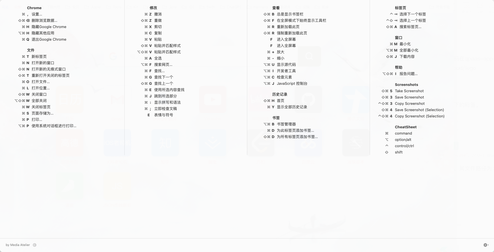

[Chrome官网 - 快捷键](https://developer.chrome.com/docs/devtools/shortcuts?hl=zh-cn)

[菜鸟教程 - 快捷键](https://www.runoob.com/w3cnote/google-chrome-shortcuts.html)

切换浏览器标签

* `CMD + 1到8`切换到对应序号的浏览器标签

* `Ctrl + PgUp/PgDn`标签页左右切换

显示源代码

* 鼠标右击 -》 显示网页源代码

* 查看 -》 开发者 -》 显示源代码

| 操作                 | Mac                                         |
| :------------------- | :------------------------------------------ |
| 打开您上次使用的面板 | Command+Option+I                            |
| 打开**控制台**面板   | Command+Option+J                            |
| 打开**Elements**面板 | Command + Shift + C 或 Command + Option + C |

