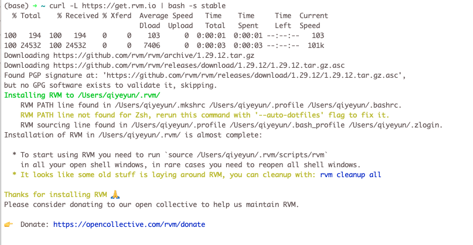

**基本概念**

- [rvm](https://link.zhihu.com/?target=https%3A//rvm.io/)：ruby 版本管理工具，可以设置当前版本/安装/卸载
    - [rvm官网](https://rvm.io/)

- [gem](https://link.zhihu.com/?target=https%3A//rubygems.org/): 全称 RubyGems，是 ruby 的软件包管理工具
    - [rubygems官网](https://rubygems.org/)

- [brew](https://link.zhihu.com/?target=https%3A//brew.sh/): 全称 Homebrew，macos 的软件包管理工具
- [rbenv](https://github.com/rbenv/rbenv): 也是一个ruby版本管理工具
    - [github](https://github.com/rbenv/rbenv)
    - [guide](https://ruby-china.org/wiki/rbenv-guide)


# 一、HomeBrew安装Ruby

```shell
# 查看当前 brew 安装的所有库：
$ brew list

# 查看 brew 安装的库用树状图来输出：
$ brew deps --tree --installed

# 列出 ruby 在 brew 当中的下载文件：
$ brew list ruby

# 强制卸载 ruby 使用如下命令：
$ brew uninstall --force ruby

# 清除 ruby 依赖文件使用如下命令:
$ brew autoremove
```


# 二、RVM

## 1、RVM是什么？

> Ruby Version Manager（RVM）,是一款非常好用的ruby版本管理以及安装工具。
>
> 
>
> RVM is a command-line tool which allows you to easily install, manage, and work with multiple ruby environments from interpreters to sets of gems.
>
> RVM是一个命令行工具，它允许您轻松地安装、管理和使用多个ruby环境，从解释器到gems集。


## 2、安装RVM

```shell
$ curl -L https://get.rvm.io | bash -s stable
```

期间可能会问你sudo管理员密码，以及自动通过homebrew安装依赖包，等待一段时间后就可以成功安装好 RVM。

然后，载入 RVM 环境（新开 Termal 就不用这么做了，会自动重新载入的）

```shell
$ source ~/.rvm/scripts/rvm
```

检查一下是否安装正确：

```shell
$ rvm -v
rvm 1.29.12 (latest) by Michal Papis, Piotr Kuczynski, Wayne E. Seguin [https://rvm.io]
```

操作图：




RVM安装路径

```shell
$ where rvm
/Users/qiyeyun/.rvm/bin/rvm
```


## 3、使用RVM安装Ruby环境

列出已知的ruby版本

```shell
$ rvm list known
```

可以选择现有的rvm版本来进行安装（下面以rvm 2.4版本的安装为例）

```shell
$ rvm install 2.4
```

同样继续等待漫长的下载，编译过程，完成以后，Ruby, Ruby Gems 就安装好了。

**如果Honebrew没有安装，则在此过程中会进行自动安装。**

- 查看是否安装成功

  ```shell
  $ ruby -v
  ```

- 查询已经安装的ruby

  ```shell
  $ rvm list
  ```

- 卸载一个已安装版本 

  ```shell
  $ rvm remove 1.9.2
  ```


## 4、设置 Ruby 版本

RVM 装好以后，需要执行下面的命令将指定版本的 Ruby 设置为系统默认版本

```shell
$ rvm 2.4.1 --default
```

同样，也可以用其他版本号，前提是你有用 rvm install 安装过那个版本

这个时候你可以测试是否正确

```shell
$ ruby -v

ruby 2.4.1p111 (2017-03-22 revision 58053) [x86_64-darwin17]
```


## 5、替换Ruby源为taobao.org (过时，最新看1.7)

> 因为Ruby的默认源使用的是cocoapods.org，国内访问这个网址有时候会有问题，一种解决方案是将远替换成淘宝的，替换方式如下：

```shell
$ gem source -r https://rubygems.org/
$ gem source -a https://ruby.taobao.org
```

要想验证是否替换成功了，可以执行：

```shell
$ gem sources -l
```

正常的输出结果：

```
*** CURRENT SOURCES ***

https://ruby.taobao.org
```

到这里就已经把Ruby环境成功的安装到了Mac OS X上，接下来就可以进行相应的开发使用了。


## 6、替换Ruby源为ruby-china（最新）

可以查看[公告 Ruby China 的 RubyGems 镜像上线](https://ruby-china.org/topics/29250)

[新的使用方法](https://gems.ruby-china.com/)

请尽可能用比较新的 RubyGems 版本，建议 2.6.x 以上。

```shell
$ gem update --system # 这里请翻墙一下
$ gem -v
2.6.3
```

```shell
$ gem sources --add https://gems.ruby-china.com/ --remove https://rubygems.org/
$ gem sources -l
https://gems.ruby-china.com
# 确保只有 gems.ruby-china.com
```


# 二、rbenv

https://ruby-china.org/wiki/rbenv-guide

https://github.com/rbenv/rbenv