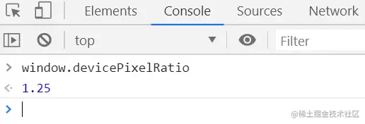
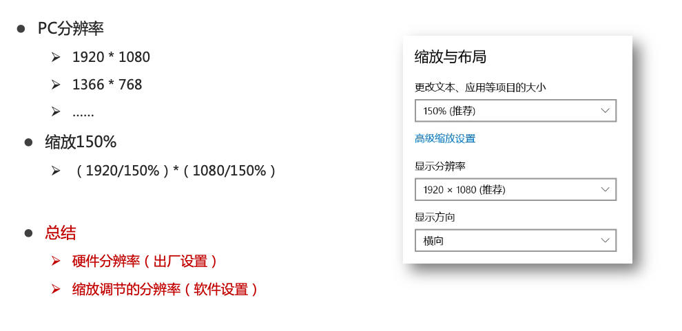

[Designer's guide to DPI](https://www.sebastien-gabriel.com/designers-guide-to-dpi/)

[屏幕尺寸大全](https://www.woshipm.com/screen/index.html)

当前页面信息：https://www.mydevice.io/

# 一、参数一览

## 手机

## 电脑

## 显示器

# 二、屏幕尺寸

- 含义：显示屏对角线的物理尺寸
- 单位：英寸（inch），1英寸=2.54cm
    - 例如：iPhone6的屏幕尺寸为4.7英寸。[屏幕尺寸参考大全](http://screensiz.es/)

# 三、分辨率

## 1. 物理像素（设备像素DP）

**物理像素（Physical Pixel）**又称  **设备像素 （device pixels = DP）** 是显示器或设备屏幕的最小单位。屏幕的每一个小方格可以显示不同颜色的像素，物理像素是硬件层面的实际像素点。

- **特点**：每个设备的物理像素点是固定的，单位pt。设备的物理分辨率即为屏幕的物理像素宽高数量。
- **举例**：一个 1920 × 1080 的显示器有 1920 个横向物理像素和 1080 个纵向物理像素。

## 2. 逻辑像素（设备独立像素DIP）

`设备独立像素(device independent pixels)`，简称 `dip` 。

逻辑像素也称作设备独立像素，是一个抽象概念，可以理解为屏幕中的一个点（point），这个点代表一个可以由屏幕使用的虚拟像素，用来表示屏幕展示物体的视觉尺寸是多少。

> **CSS像素 = 设备独立像素 = 逻辑像素**

### a. 为什么要有逻辑像素呢？

因为物理像素仅代表像素点的个数，并没有有规定一个点实际的尺寸是多少。假设有一个按钮，宽度用100个物理像素表示，因屏幕物理像素排列方式和密度的差异，不同屏幕上实际的视觉宽度必然不一样。而逻辑像素相同就表示希望按钮在不同屏幕上看起来一样大。

## 3. 设备像素比 - DPR

**设备像素比（devicePixelRatio）**，简称 `dpr` ，运算公式为 `DPR = 设备像素 / 设备独立像素`。

可以通过`window.devicePixelRatio`获取 **移动设备的像素比**。

## 4. 逻辑分辨率、物理分辨率

* 物理分辨率：硬件所支持的

* 逻辑分辨率：软件可以达到的

imac的物理分辨率已经达到了5120 x 2880，但是告诉软件的时候还是说我的分辨率是1280*720，相当在看来的一个逻辑像素点，背后实际上已经有16个物理像素点为其工作了！

# 四、iPhone分辨率

文章：https://www.zhihu.com/question/25361043

https://github.com/Qingquan-Li/blog/issues/58

https://www.cnblogs.com/JuFoFu/p/7719823.html

http://www.5imoban.net/jiaocheng/div+css/201609091912.html

> 屏幕分辨率是指纵横向上的像素点数，单位是px。
>
> 就相同大小的屏幕而言，当屏幕分辨率低时（例如 640 x 480），在屏幕上显示的像素少，单个像素尺寸比较大。屏幕分辨率高时（例如 1600 x 1200），在屏幕上显示的像素多，单个像素尺寸比较小。
>
> 
>
> 分辨率 = 水平像素数 x 垂直像素数，举例：iPhone 12 mini，分辨率为：1080 x 2340 描述分辨率的单位有：dpi（点每英寸）、lpi（线每英寸）、ppi（像素每英寸）和PPD（Pixels Per Degree 角分辨率，像素每度）。

px：pixel———————————— 【 像素】  电子屏幕上组成一幅图画或照片的最基本单元

pt: point—————————————【 点】印刷行业常用单位，等于1/72英寸

ppi: pixel per inch————————【每英寸像素数】  该值越高，则屏幕越细腻

dpi: dot per inch—————————【每英寸多少点】，该值越高，则图片越细腻

dp: dip，Density-independent pixel, 【安卓开发用的长度单位】

## 1. 渲染分辨率

5.4 寸 iPhone 12 mini 的屏幕分辨率为 1080px × 2340px，PPI 为 476，清晰度位列 iPhone 12 系列第一名。由 iPhone 12 mini 的屏幕分辨率除以比例因子 @3x 得到逻辑分辨率 360pt × 780pt，很多人自然而然地就会以为这就是 iPhone 12 mini 的逻辑分辨率。然而通过已经发布的 Xcode 12.1 GM 版本的模拟器可以查到 iPhone 12 mini 的渲染分辨率（截图的大小）实际为「1125px × 2436px」，比物理分辨率（屏幕的物理参数）放大了 1.04 倍。同当年的 iPhone 6 Plus 一样，Apple 再次使用了一样的变化手法。1125px × 2436px 的渲染分辨率对应的逻辑分辨率为 375pt × 812pt@3x，正是之前 5.8 寸 iPhone 11 Pro 的逻辑分辨率，这样 app 想完美运行在 iPhone 12 mini 上就无需再进行额外的适配工作。但由于像素不是点对点显示的，显示图像可能会有不锐利的问题，但由于其高 PPI 的存在，这个感知不会明显。

# 三、1080P、2K、4K、8K

> 问：如果4K是1080p的四倍，那是否意味着4K就等于4320p？
>
> 不是

## 1. P

720P，1080P等，表示的是 **<u>“视频像素的总行数”</u>**，比如，720P表示视频有720行的像素，而1080P则表示视频总共有1080行像素数，1080P分辨率的摄像机通常像素数是1920*1080。“P”本身表示的是“逐行扫描”，是Progressive的缩写，相对于隔行扫描（Interlaced）。

## 2. K

2K，4K等，表示的是 **<u>“视频像素的总列数”</u>**，如4K, 表示的是视频有4000列像素数，具体是3840或4096列。4K分辨率的摄像机通常像素数是3840 * 2160或4096 * 2160。

## 3. MP

MP是像素总数，即像素的行数P及列数K相乘后的结果（百万像素）。比如，1080P摄像机是1920像素与1080像素相乘，得到2MP（百万像素）的像素总数。

## 4. 1080P

过去曾使用 ***垂直分辨率*** 来描述分辨率。因此1080p代表的是垂直分辨率。而几乎所有的高清显示屏的纵横比都是1.78：1（即16×9，又名“宽屏”），这意味着其水平分辨率为1920像素（即1920×1080）。

## 5. 2K

2K表示：**水平分辨率为2048像素**，虽然1920×1080很接近2K的标准，但往往不把1080p叫做2K，他们称之为1080p或全高清。

## 6. 4K

4K意味着 **水平分辨率为4096像素**。这是数字电影倡导联盟（Digital Cinema Initiatives）所提出的分辨率。由于电影的纵横比不同，矩形屏幕的确切形状决定了电影的纵横比，所以其垂直分辨率并没有具体指定。

严格从技术上来说，“4K”不是超高清，超高清的分辨率为3840×2160。两者之间的像素区别仅13%，基本上看不到多大差异。绝大多数人都更喜欢“4K”这一名称表示超高清。

# 四、PPI（像素密度 / 每英寸像素）

PPI是英文 **Pixels Per Inch** 的缩写，所代表的含义是 **显示器屏幕每英寸所拥有的像素数量** 。

这里的英寸（Inch）并非面积单位，它是一个**长度单位**，**1英寸=2.54厘米**。也就是说，**PPI是计算的显示器<u>对角线上每英寸直线穿过的像素数</u>，而不是每平方英寸的面积中拥有的像素数**。

## 1. PPI如何计算

or

### a. 计算iPhone4 PPI 

我们以 iPhone4 为例，它的大小为 3.5 英寸，分辨率为 960x640，通过上述公式计算得出它的每英寸像素数为 326。

### b. 计算1080p显示器PPI

27英寸1080p分辨率显示器的PPI为82英寸

