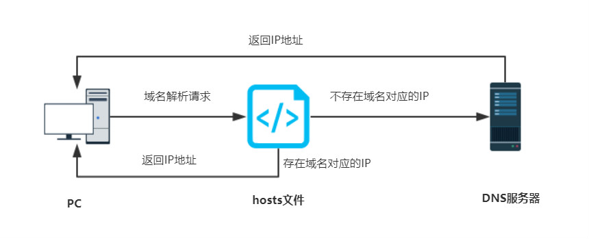

# 软件

[iHosts - Mac](https://apps.apple.com/us/app/ihosts-etc-hosts-editor/id1102004240?mt=12)

[SwitchHosts](https://github.com/oldj/SwitchHosts)


# hosts文件

在Mac操作系统中，hosts 文件是一个文本文件，**是个本地域名解析文件**，用于将主机名与 IP 地址进行映射。

> windows一般在：`C:/Windows/System32/drivers/etc/hosts`
>
> Linux / MacOS的hosts文件路径一般：`/etc/hosts`

<font color='red' size=5>注意：hosts文件只能配置ip和域名的映射关系，但是不能配置端口号，默认访问80端口</font>


​		当你在浏览器或其他应用程序中输入一个域名时，操作系统会首先检查 hosts 文件，看是否有对应的 IP 地址映射。如果有，系统会直接使用该 IP 地址，而不需要进行 DNS 解析。

​		通过编辑 hosts 文件，你可以手动指定域名与对应的 IP 地址的关系，从而实现一些特定的网络配置。例如，你可以将某个域名映射到本地的 127.0.0.1 地址，以便进行本地开发和测试；也可以将某个域名映射到特定的 IP 地址，以阻止访问该域名或将流量转发到其他服务器等。

​		总的来说，hosts 文件可以用于管理域名解析的过程，帮助你实现一些定制化的网络配置。但需要注意的是，修改 hosts 文件可能会影响系统的网络行为，因此在编辑 hosts 文件之前，最好做好备份并确保你知道自己在做什么。


# hosts规则

Mac hosts 文件中每一行都表示一个域名解析的规则，格式如下：

[IP 地址] [域名]

例如：

```
127.0.0.1 	localhost 
::1 	   	localhost
```

其中，127.0.0.1 表示本地回环地址，::1 表示 IPv6 的本地回环地址，而 localhost 则表示域名。


# 0.0.0.0 和 127.0.0.1

0.0.0.0 和 127.0.0.1 是两个常见的 IP 地址，它们之间有以下区别：

1. 0.0.0.0 是一个特殊的 IP 地址，表示本机上所有的 IP 地址，也称为通配符地址。当一个网络服务绑定在 0.0.0.0 上时，它会监听所有本机上的网络接口，包括本地网卡和外部网卡，可以接收来自所有地址的网络连接请求。
2. 127.0.0.1 是一个**本地回环地址**，也称为**环回地址**。它只能用于本机内部通信，可以访问本机上运行的网络服务。当一个网络服务绑定在 127.0.0.1 上时，它只能监听本机上的网络接口，不能接收来自外部网络的连接请求。

总的来说，0.0.0.0 表示所有地址，可以用于网络服务在本机上监听所有网络接口；而 127.0.0.1 只能用于本机内部通信，不能用于外部网络访问。


127.0.0.1 是一个环回地址。并不表示“本机”。0.0.0.0才是真正表示“本网络中的本机”。

**在实际应用中：** 一般我们在服务端绑定端口的时候可以选择绑定到0.0.0.0，这样我的服务访问方就可以通过我的多个ip地址访问我的服务。

**比如：** 我有一台服务器，一个外网地址A,一个内网地址B，如果我绑定的端口指定了0.0.0.0，那么通过内网地址或外网地址都可以访问我的应用。但是如果我只绑定了内网地址，那么通过外网地址就不能访问。所以如果绑定0.0.0.0，也有一定安全隐患，对于只需要内网访问的服务，可以只绑定内网地址。


# hosts应用

在Mac系统中，hosts 文件可以用于以下几个方面：

1. 域名解析：hosts 文件可以手动指定域名和对应的 IP 地址的映射关系，从而绕过 DNS 解析，加快域名解析的速度。
2. 屏蔽网站：通过将某些网站的域名映射到无效的 IP 地址，可以实现屏蔽这些网站的访问，比如屏蔽广告网站或成人网站。
3. 网络调试：在开发和调试过程中，可以将域名映射到本地的 IP 地址，方便本地测试和调试。
4. 网络代理：可以将某个域名的流量转发到指定的本地代理服务器，实现网络代理功能。
5. 防止DNS劫持：通过在hosts文件中手动添加域名和IP地址的映射，可以防止DNS劫持攻击。

总的来说，hosts 文件可以用于管理域名解析和网络配置，帮助实现一些特定的网络需求和安全防护措施。但需要注意的是，修改hosts文件可能会影响系统的网络行为，因此在编辑hosts文件时，建议谨慎操作并备份原文件。




# 刷新DNS缓存

1. 刷新 DNS 缓存。在终端中输入以下命令：

    ```sh
    $ sudo killall -HUP mDNSResponder
    ```

2. 重启网络服务。在终端中输入以下命令：

    ```sh
    $ sudo launchctl stop com.apple.mDNSResponder sudo launchctl start com.apple.mDNSResponder
    ```

    或者重启电脑也可以生效。

