# 第一部分、Mac安装CocoaPods详解

### 目录

- Ruby环境的安装
  - 安装系统需要的包
  - Homebrew安装
  - 安装RVM
  - 使用RVM安装Ruby环境
  - 设置 Ruby 版本
  - 替换Ruby源为taobao.org 
- 安装CocoaPods
  - CocoaPods是什么？
  - 直接安装CocoaPods
  - 更新repos文件
- CocoaPods使用原理
- 后期使用出现的问题
  - 问题一：”setting up cocoapods master repo”卡着不动
  - 问题二：`pod search`异常


## 一、Ruby环境的安装

### 1.1、安装系统需要的包

> 先安装 [Xcode](http://developer.apple.com/xcode/) 开发工具，它将帮你安装好 Unix 环境需要的开发包

### 1.2、Homebrew安装

#### 1.2.1、HOMEBREW是神马

> linux系统有个让人蛋疼的通病，软件包依赖，好在当前主流的两大发行版本都自带了解决方案，Red hat有yum，Ubuntu有apt-get神马，你用mac os，不好意Mac os木有类似的东东，泪奔中几经折腾总算找到了第三方支持：Homebrew，Homebrew简称brew，是Mac OSX上的软件包管理工具，能在Mac中方便的安装软件或者卸载软件，可以说Homebrew就是mac下的apt-get、yum神器

#### 1.2.2、是否已安装HOMEBREW

**brew search rabbitmq**，能搜索到则证明已安装。

```
LionsomMBP:~ lionsom$ brew search rabbitmq
==> Searching local taps...
rabbitmq                                 rabbitmq-c
==> Searching taps on GitHub...
caskroom/cask/rabbitmq-app
==> Searching blacklisted, migrated and deleted formulae...
```

#### 1.2.3、安装HOMEBREW

安装 Homebrew

```
/usr/bin/ruby -e "$(curl -fsSL https://raw.githubusercontent.com/Homebrew/install/master/install)"
```

将以上命令粘贴至终端。

#### 1.2.4、更多详情，请前往[HOMEBREW官网](https://brew.sh/)查看


### 1.3、安装RVM

#### 1.3.1、RVM是什么？

> Ruby Version Manager简称RVM,是一款非常好用的ruby版本管理以及安装工具。

#### 1.3.2、具体安装步骤

```
$ curl -L https://get.rvm.io | bash -s stable
```

期间可能会问你sudo管理员密码，以及自动通过homebrew安装依赖包，等待一段时间后就可以成功安装好 RVM。

然后，载入 RVM 环境（新开 Termal 就不用这么做了，会自动重新载入的）

```
$ source ~/.rvm/scripts/rvm
```

检查一下是否安装正确

```
$ rvm -v
rvm 1.29.3 (latest) by Michal Papis, Piotr Kuczynski, Wayne E. Seguin [https://rvm.io]
```

### 1.4、使用RVM安装Ruby环境

列出已知的ruby版本

```
$ rvm list known
```

可以选择现有的rvm版本来进行安装（下面以rvm 2.4版本的安装为例）

```
$ rvm install 2.4
```

同样继续等待漫长的下载，编译过程，完成以后，Ruby, Ruby Gems 就安装好了。

**如果Honebrew没有安装，则在此过程中会进行自动安装。**

- 查看是否安装成功

  ```
  $ ruby -v
  ```

- 查询已经安装的ruby

  ```
  $ rvm list
  ```

- 卸载一个已安装版本 

  ```
  $ rvm remove 1.9.2
  ```


### 1.5、设置 Ruby 版本

RVM 装好以后，需要执行下面的命令将指定版本的 Ruby 设置为系统默认版本

```
$ rvm 2.4.1 --default
```

同样，也可以用其他版本号，前提是你有用 rvm install 安装过那个版本

这个时候你可以测试是否正确

```
$ ruby -v

ruby 2.4.1p111 (2017-03-22 revision 58053) [x86_64-darwin17]
```

### 1.6、替换Ruby源为taobao.org (过时，最新看1.7)

> 因为Ruby的默认源使用的是cocoapods.org，国内访问这个网址有时候会有问题，一种解决方案是将远替换成淘宝的，替换方式如下：

```
$ gem source -r https://rubygems.org/
$ gem source -a https://ruby.taobao.org
```

要想验证是否替换成功了，可以执行：

```
$ gem sources -l
```

正常的输出结果：

```
*** CURRENT SOURCES ***

https://ruby.taobao.org
```

到这里就已经把Ruby环境成功的安装到了Mac OS X上，接下来就可以进行相应的开发使用了。

### 1.7、替换Ruby源为ruby-china（最新）

可以查看[公告 Ruby China 的 RubyGems 镜像上线](https://ruby-china.org/topics/29250)

[新的使用方法](https://gems.ruby-china.com/)

请尽可能用比较新的 RubyGems 版本，建议 2.6.x 以上。

```
$ gem update --system # 这里请翻墙一下
$ gem -v
2.6.3
```

```
$ gem sources --add https://gems.ruby-china.com/ --remove https://rubygems.org/
$ gem sources -l
https://gems.ruby-china.com
# 确保只有 gems.ruby-china.com
```


## 二、安装CocoaPods

### 2.1、CocoaPods是什么？

- CocoaPods官方指南地址 [https://guides.cocoapods.org](https://guides.cocoapods.org/)
- CocoaPods项目的地址 https://github.com/CocoaPods/CocoaPods

> 当你开发iOS应用时，会经常使用到很多第三方开源类库，比如JSONKit，AFNetWorking等等。可能某个类库又用到其他类库，所以要使用它，必须得另外下载其他类库，而其他类库又用到其他类库，“子子孙孙无穷尽也”，这也许是比较特殊的情况。总之小编的意思就是，手动一个个去下载所需类库十分麻烦。另外一种常见情况是，你项目中用到的类库有更新，你必须得重新下载新版本，重新加入到项目中，十分麻烦。如果能有什么工具能解决这些恼人的问题，那将“善莫大焉”。所以，你需要 CocoaPods。
>
> CocoaPods应该是iOS最常用最有名的类库管理工具了，上述两个烦人的问题，通过cocoaPods，只需要一行命令就可以完全解决，当然前提是你必须正确设置它。重要的是，绝大部分有名的开源类库，都支持CocoaPods。所以，作为iOS程序员的我们，掌握CocoaPods的使用是必不可少的基本技能了。

### 2.2、直接安装CocoaPods

直接在终端输入

```
$ sudo gem install cocoapods
```

等待一小段时间，安装完成！！

验证是否安装成功：

```
$ pod --version
```

或者

```
$ pod search AFNetworking
```

### 2.3、在使用Pod进行操作之前最好手动更新repos文件（解决详情见4.1）

> 为什么最好手动导入呢？
>
> 如果不手动导入也没有问题，再使用`pod search AFNetworking`的时候pod会自动进行`setting up cocoapods master repo`的更新，由于文件过大，需要下载好一会儿。所以此时使用手动添加`repos`的文件比较方便。

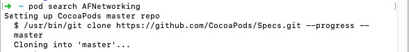

### 2.4、如何前往`.COCOAPODS`文件

- 显示隐藏文件`Command + shift + .`
- 也可在`Finder -> 前往 -> 前往文件夹 -> ~/.cocoapods`

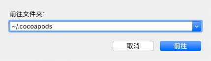

- 具体路径如下


## 三、CocoaPods使用原理

- pod setup
  - 将**远程索引库**下载到本地，**本地索引库**路径：`~/.cocoapods/repos`
  - 同时生成**检索文件（Key-Value格式，便于检索）**，检索文件路径：`~/Library/Caches/CocoaPods/search_index.json`
- pod search AFN
  - 前往**检索文件**检索 
  - 然后根据检索到的Value找到**本地索引库**中`.spec`查看框架的具体信息
- pod install
  - 得到AFN框架远程地址下载到我们项目中


## 四、后期使用出现的问题

### 4.1、问题一：”setting up cocoapods master repo”卡着不动

> 概述
>
> CocoaPods首次安装使用时均需要强制拉取repos，因为repos是在GitHub托管的，导致容易出现拉取缓慢超时和异常中断等问题，以往大家为解决这一问题一般会采用替换国内镜像的方式来解决，可惜国内镜像更新不及时的问题也是没有办法解决。实际上我们都知道CocoaPods拉取repos就是将托管服务器中的Specs项目克隆至本地的过程，所以解决办法就出现啦，见『解决二』。


* 解决一：替换国内镜像

  > 那个淘宝镜像（https://ruby.ta obao.org）不可用了，所以需要使用最新的ruby镜像（https://gems.ruby-china.com）
  >
  > **具体操作 可查看1.7章节**

* 解决二：前往GitHub上手动下载[CocoaPods/Specs](https://github.com/CocoaPods/Specs)项目

  下载到本地的文件，需要与远程仓库进行关联，所以此处也有两种方案：
  
  * 方案一：[解决首次CocoaPods拉取repos过慢问题](https://www.jianshu.com/p/c8116c167ce5)
  
    * 验证是否关联成功：
  
    * ```
      ➜  ~ pod repo
      
      master
      - Type: git (unknown)
      - URL:  https://github.com/CocoaPods/Specs.git
      - Path: /Users/qiyeyun/.cocoapods/repos/master
      ```
  
    * 最后再对repo进行更新
  
      ```
      ➜  pod repo update
      Updating spec repo `master`
        $ /usr/bin/git -C /Users/qiyeyun/.cocoapods/repos/master fetch origin
        --progress
        remote: Enumerating objects: 396, done.        
        remote: Counting objects: 100% (396/396), done.        
        remote: Compressing objects: 100% (372/372), done.        
        Receiving objects:   0% (7714/3265890), 1.54 MiB | 12.00 KiB/s    
      ```
  
  * 方案二：[首次 pod setup 慢的取巧方法](https://www.jianshu.com/p/40fd4384447e)
  
    * 1、到 https://github.com/CocoaPods/Specs.git网址 把文件clone下来，默认文件夹名字为Specs-master
    * 2、前往文件夹 ~/.cocoapods/repos
    * 3、终端cd到你的工程目录中执行 pod setup，等待一会，等到开始下载的时候，会发现在~/.cocoapods/repos 下面多一个master文件，这时，需要复制master下面的.git 文件夹到Specs-master下面，同时停止pod setup
    * 4、Specs-master文件夹名字修改为master，并替换~/.cocoapods/repos 下的master文件夹
    * 5、直接可以正常执行pod install 等命令
  
* **解决三（推荐）**：从同事电脑上拷贝一份`~/.cocoaPods/repos/master`文件，直接放到我们的目录下即可！

  

### 4.2、问题二：`pod search`异常

**4.2.1、执行pod setup**

- 终端输入：`pod search AFNetworking`
- 输出：`Unable to find a pod with name, author, summary, or descriptionmatching 'AFNetworking'` 这时就需要继续下面的步骤了。
- 原因：**检索文件（Key-Value格式，便于检索）**太老，需要重新生成。

**4.2.2、删除~/Library/Caches/CocoaPods目录下的search_index.json文件**

- `pod setup`成功后，依然不能`pod search`，是因为之前你执行`pod search`生成了`search_index.json`，此时需要删掉。
- 终端输入：`rm ~/Library/Caches/CocoaPods/search_index.json`
- 删除成功后，再执行`pod search`。

**4.2.3、执行pod search**

- 终端输入：`pod search afnetworking(不区分大小写)`
- 输出：`Creating search index for spec repo 'master'.. Done!`，稍等片刻······就会出现所有带有afnetworking字段的类库。


## 五、奇淫巧技

### 1、pod install提速

每次执行`pod install`和`pod update`的时候，cocoapods都会默认更新一次spec仓库。这是一个比较耗时的操作。在确认spec版本库不需要更新时，给这两个命令加一个参数跳过spec版本库更新,可以明显提高这两个命令的执行速度。

```
pod install --verbose --no-repo-update
pod update --verbose --no-repo-update
```

### 2、关于Podfile文件编辑时，第三方库版本号的各种写法

```
#pod 'AFNetworking' //不显式指定依赖库版本，表示每次都获取最新版本
#pod 'AFNetworking', '2.0' //只使用2.0版本
#pod 'AFNetworking', '>2.0′ //使用高于2.0的版本
#pod 'AFNetworking', '>=2.0′ //使用大于或等于2.0的版本
#pod 'AFNetworking', '<2.0′ //使用小于2.0的版本
#pod 'AFNetworking', '<=2.0′ //使用小于或等于2.0的版本
#pod 'AFNetworking', '~>0.1.2′ //使用大于等于0.1.2但小于0.2的版本，相当于>=0.1.2并且<0.2.0
#pod 'AFNetworking', '~>0.1′ //使用大于等于0.1但小于1.0的版本
#pod 'AFNetworking', '~>0′ //高于0的版本，写这个限制和什么都不写是一个效果，都表示使用最新版本
```


# 第二部分、Cocopods各种问题汇总

> 推荐文档
>
> [iOS之CocoaPods常见问题汇总](https://blog.csdn.net/lvxiangan/article/details/73503690)


### 一、`GCC_PRECOMPILE_PREFIX_HEADER `重写
当导入 `pod 'Texture'` 时，遇到如下问题， ***图1.1***
提示`GCC_PRECOMPILE_PREFIX_HEADER`重写，我们进入提示的文件查看，***图1.2***
发现：我们项目本身使用PCH，所以对`GCC_PRECOMPILE_PREFIX_HEADER`进行了设置，***图1.3***
而pod的库 Texture 也对其进行了设置，***图1.4***
从而导致改警告的发生，重写。

最终修改：在building setting中搜索 `GCC_PRECOMPILE_PREFIX_HEADER ` ,然后在 `Other` 中添加上`$(inherited)`。***图1.5***，再次`pod install`，警告也就没有了。

[重要参考](https://www.jianshu.com/p/dd6fa8531d0c)
[辅助参考- stackoverflow](https://stackoverflow.com/questions/18376416/the-target-overrides-the-other-ldflags-build-setting-defined-in-pods-pods#)

**图1.1**

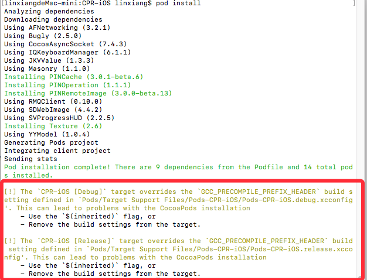

**图1.2**

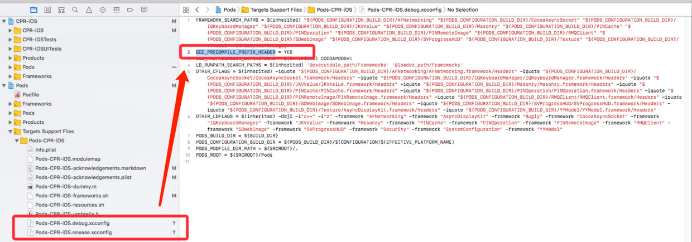

**图1.3**

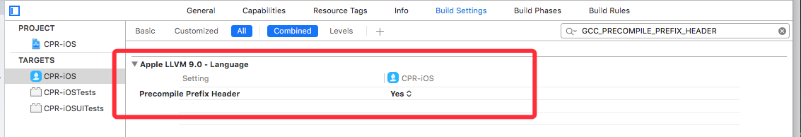

**图1.4**

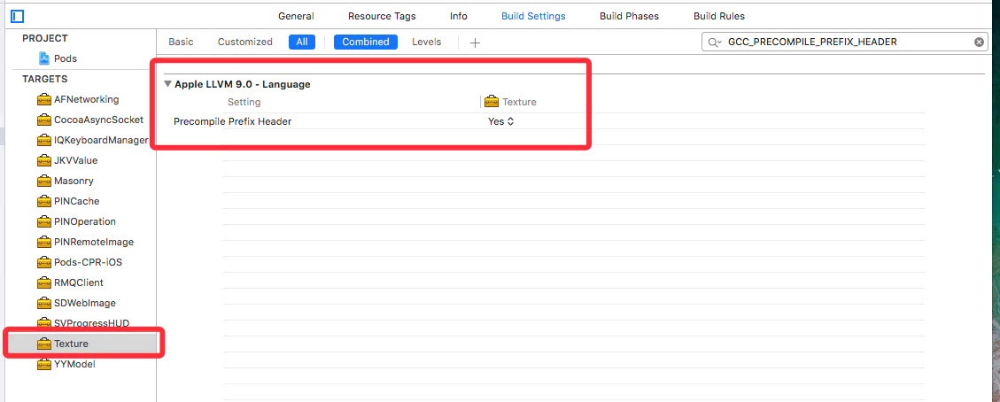

**图1.5**

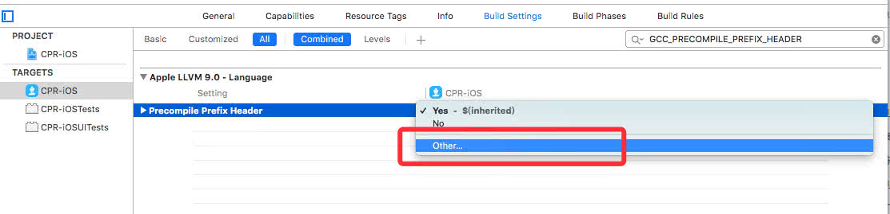


### 二、- Use the `$(inherited)` flag, or - Remove the build settings from the target.

**[stackoverflow同文](https://stackoverflow.com/questions/18376416/the-target-overrides-the-other-ldflags-build-setting-defined-in-pods-pods)**

**问题截图**

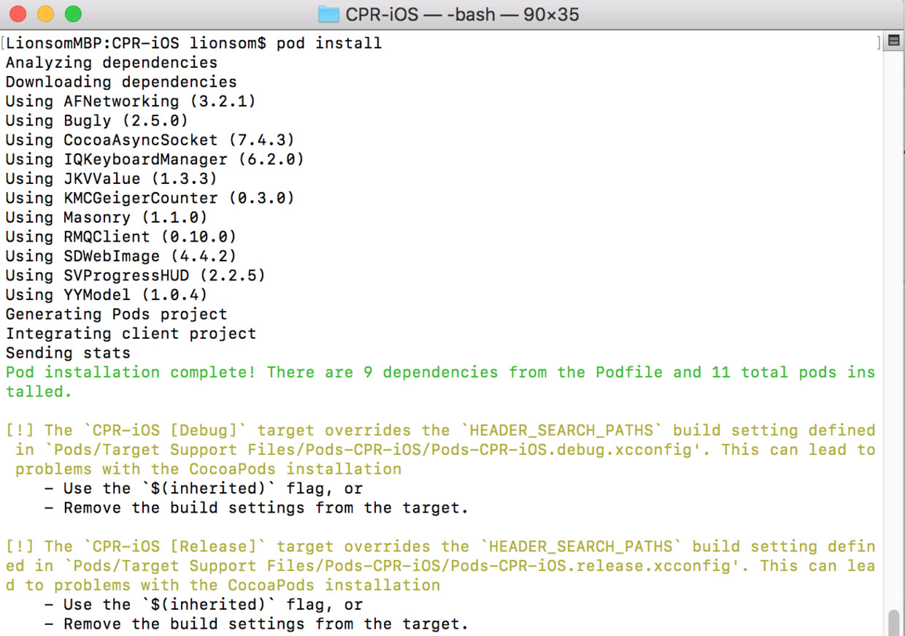


**解决方案**

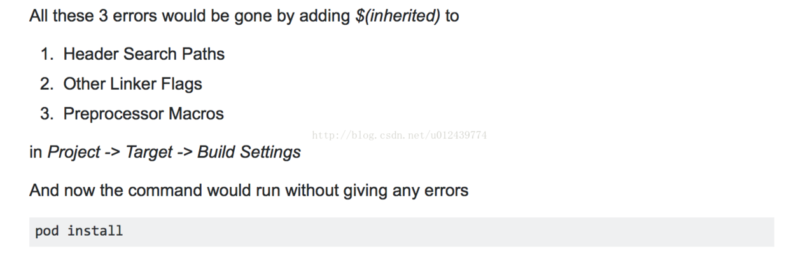


### 三、不要使用TextEdit编辑PodFile文件

```
[!] Smart quotes were detected and ignored in your Podfile. To avoid issues in the future, you should not use TextEdit for editing it. If you are not using TextEdit, you should turn off smart quotes in your editor of choice.
```


> ##### 解决方案：用Xcode打开Podfile 看看里面的pod类库是不是像中文引号 编辑改下就行了 在外面打开编辑就会产生这样的问题


### 四、overrides the `ENABLE_BITCODE` ......

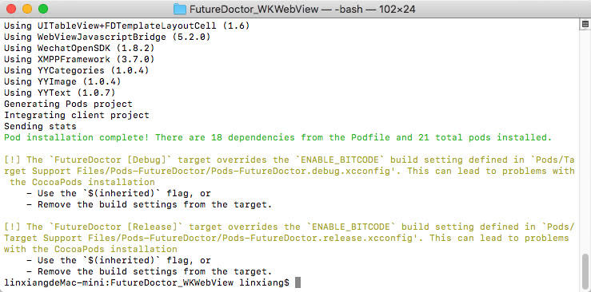

> ##### 解决方案：`pod update` 将库更新一下，然后再`pod install` 就没有警告了。


### 五、[!] ERROR: Parsing unable to continue due to merge conflicts present in:

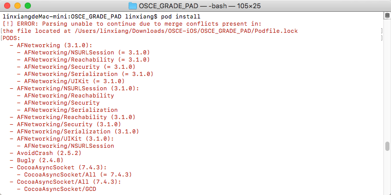

> ##### 解决方案：在`Podfile.lock` 和 `Manifest.lock` 中有冲突，解决下冲突即可。

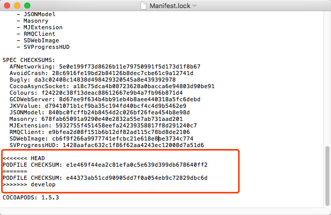


### 六、Cocoapod版本过低警告


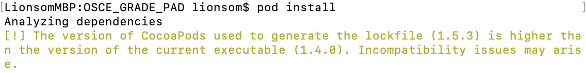


> ##### 解决方案：`pod repo update` 命令更新资源库即可。

